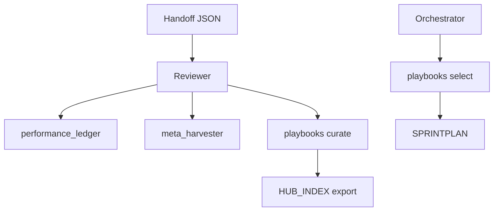

# Architecture

## Loop Overview

```
Orchestrator → Coder → Tester → Debugger → Reviewer
     ↑ (if NOT DONE) ─────────────────────────────┘
     DONE → lessons crystallized → memory + ledger
```

Each role: **PLAN → ACT (≤3 tool calls) → REFLECT → handoff JSON**.

## Core Components

| Layer | Location | Purpose |
|-------|----------|---------|
| Roles & prompts | `AGENT_ROLES.md`, `prompts/` | Per-role discipline |
| Handoffs | `HANDOFF_SCHEMA.md` | State transfer contract |
| Memory | `memory/` | questions_collector, meta_harvester, playbooks, performance_ledger |
| Planning | `.agent/PLAN.md`, `.agent/TODO.md` | Iteration continuity |
| Playbooks | `.agent/PLAYBOOKS.json` | Structured knowledge bullets (ACE scoring) |
| Hub | `.agent/HUB_INDEX.json` | Exportable discovery index |

## Self-Improvement Stack

1. **Performance Ledger** — cycle metrics (elapsed, confidence, meta impact)
2. **Meta Harvester** — trajectory capture, proposals, safe auto-apply
3. **Playbooks** — select at PLAN, curate at REFLECT
4. **Questions Pool** — batched clarification for product owner

## Data Flow



See [Metrics & ROI](metrics-roi.md) for measured gains and [Hub](hub/README.md) for marketplace foundation.