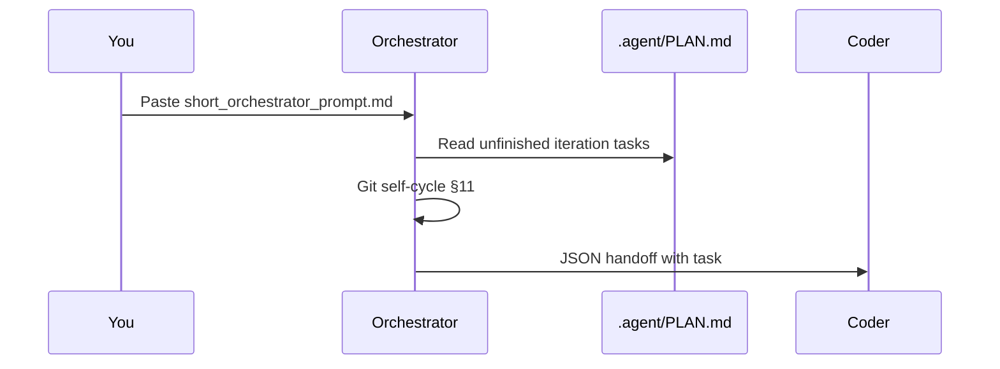

# Начало работы

**Language:** [English](../getting-started.md) · [Русский](getting-started.md)

[](../../README.ru.md)

Полный агентный цикл разработки — меньше чем за пять минут.

---

## Требования

| Инструмент | Требование |
|------------|------------|
| Python | 3.10+ |
| Git | свежая версия |
| Agent UI | Grok CLI (по умолчанию), Cursor, Claude Code, Blackbox |

---

## Шаг 1 — Клонировать и инициализировать

### Windows

```powershell
git clone https://github.com/unhexx/agentic_loop_template.git
cd agentic_loop_template
.\Agent-Init.ps1
```

### Linux / macOS

```bash
git clone https://github.com/unhexx/agentic_loop_template.git
cd agentic_loop_template
bash Agent-Init.sh --wizard
source .venv/bin/activate
```

Мастер создаёт `TASK_SPECIFICATION.md` и `PROJECT_CONTEXT.md` из шаблонов, если их ещё нет. Фронтенд по умолчанию на Linux — **Grok**.

Init ставит обвязку через `pip install -e ".[dev]"`. После `source .venv/bin/activate` команды `python -m memory` / `agentix` работают **без** `PYTHONPATH`. Init по-прежнему экспортирует `PYTHONPATH`, только если `import memory` падает (запасной путь для неустановленного клона).

Живые вызовы Grok CLI идут через **шлюз Agentix** (`http://127.0.0.1:8110/v1`), который стоит перед host pxpipe (`:8100`). `Agent-Init.sh` прописывает `GROK_CLI_CHAT_PROXY_BASE_URL` в `.venv/bin/activate`. Mock/CI не требуют pxpipe. Отключить: `export AGENTIX_PROXY=0`. Юниты: [`scripts/systemd/pxpipe.service.example`](../../scripts/systemd/pxpipe.service.example), [`scripts/systemd/agentix-gateway.service.example`](../../scripts/systemd/agentix-gateway.service.example). Проверка: `python -m memory.proxy health`. Запуск шлюза: `bash scripts/agentix-proxy.sh start`.

Продуктовые репозитории: лучше [consumer-starter](../../examples/consumer-starter/README.md) (English) **lite** `AGENTS.md` или `Agent-Init.consumer.sh` (симлинк на SSOT + editable-установка). Не копируйте всё дерево шаблона.

---

## Шаг 2 — Дымовой тест

```bash
bash scripts/demo-loop.sh
```

Должно появиться:

```
=== Agentix Demo Loop ===
PLAN + SPEC: OK
=== Demo complete. Start agent with prompts/short_orchestrator_prompt.md ===
```

---

## Шаг 3 — Запустить цикл

Скопируйте [`prompts/short_orchestrator_prompt.md`](../../prompts/short_orchestrator_prompt.md) в агент как **первое сообщение**.



---

## Пример сессии

### Вывод Orchestrator (концептуально)

```
Reading .agent/PLAN.md + .agent/TODO.md ...
Git sync verified across clones.
Selected task: P3-HUB-01 — Hub export CLI.
Handing off to Coder.
```

### Handoff JSON (конец хода Orchestrator)

```json
{
  "handoff_to": "Coder",
  "role": "Orchestrator",
  "summary": "Запланировал реализацию Hub export. Git sync OK.",
  "next_input_files": [".agent/TODO.md", "memory/playbooks.py"],
  "confidence": 0.9,
  "status": "IN_PROGRESS"
}
```

### Вывод Coder (концептуально)

```
Implementing playbooks export ...
Running: python -m memory.playbooks export --format hub
Commit: Добавил export hub index в playbooks
Handing off to Tester.
```

---

## Чеклист первого цикла

| Шаг | Роль | Действие |
|-----|------|----------|
| 1 | Orchestrator | Прочитать `TASK_SPECIFICATION.md`, `.agent/PLAN.md`, git §11 sync |
| 2 | Orchestrator | Спланировать INVEST-задачу, передать Coder |
| 3 | Coder | Реализовать, закоммитить (сообщение по-русски), передать Tester |
| 4 | Tester | Прогнать тесты, отчитаться по покрытию, передать Debugger или Reviewer |
| 5 | Debugger | Устранить корневые причины, если тесты упали |
| 6 | Reviewer | Сверка со спецификацией, обновление ledger, `DONE` или возврат в цикл |

---

## Продуктовые проекты

1. Скопируйте [`examples/consumer-starter/`](../../examples/consumer-starter/) (English) в свой репозиторий.
2. Добавьте `agentic_loop_template/` в `.gitignore` (см. `.gitignore.agentic`).
3. Заполните плейсхолдеры в `SYSTEM_PROMPT.md`.
4. Запустите bootstrap на своей платформе.

---

## Дальше

| Тема | Ссылка |
|------|--------|
| Настройка Cursor / Claude | [multi-frontend.md](../multi-frontend.md) (English) |
| Отличия платформ | [cross-platform.md](../cross-platform.md) (English) |
| Полная архитектура | [architecture.md](../architecture.md) (English) |
| Справка CLI | [../../README.ru.md#инструменты-cli](../../README.ru.md#инструменты-cli) |
