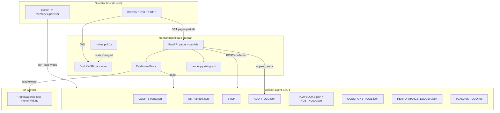
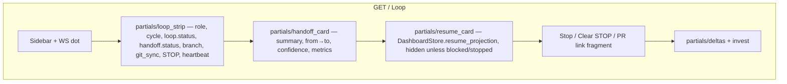

# Agents Dashboard — Operator Control Plane for the Agentix Loop

> **Shipped:** VERSION **3.8.0**, default bind `127.0.0.1:8112` (gateway owns `:8110`; pxpipe owns `:8100`). Spec body still uses the original design port 8110.

**Title:** Agents Dashboard (Control Plane UI for Agentix / operator loop)  
**Author:** design agent / unhex placeholder  
**Date:** 2026-08-21  
**Status:** Draft  
**Repo / home:** `agentic_loop_template` (Agentix harness), package `memory.dashboard`  
**Baseline:** Supervisor 3.5.0 (`memory.supervisor`, LOOP_STATE 3.4.1 SSOT)  
**Target version:** 3.6.0 (Control Plane). Leaves 3.5.1 for deferred parallel multi-stream orchestration.  
**Architectural copy:** eegent/gateway HTMX control plane, as realized locally by Telegrator (`/home/unhex/_PROJECT/telegrator/`) and contrasted with pxpipe Node dashboard. Not a React/Vue SPA.

---

## Overview

Agentix Supervisor 3.5.0 already drives unattended role-turns (Orchestrator → Coder → Tester → Debugger|Reviewer → `PR_READY`) by reading and writing a bounded on-disk working set under `workdir/.agent/`. The 3.5.0 implementation plan omitted a Control Plane as YAGNI: the operator’s interface is `python -m memory.supervisor {run|status|resume|stop}`. That is enough to run the loop and not enough to watch it.

This document specifies the deferred operator Control Plane: a **loopback-only, server-rendered HTMX dashboard** that **observes** the existing `.agent/*` SSOT and, under explicit confirmation, **signals** the already-running supervisor (cooperative `.agent/STOP`, question resolution, clear-stop). It must not become the runner, must not auto-merge to `main`, and must not invent a parallel store.

The implementation lives **inside** `agentic_loop_template` as `memory.dashboard`, attaches as a sidecar process (`python -m memory.dashboard serve --workdir PATH`), and copies the Telegrator/eegent control-plane shell: pages + HTMX partials + Tailwind CDN + Alpine.js hints + no-Jinja string substitution + `/ws/ui` control broadcaster with labeled polling fallback.

---

## Background & Motivation

### Current state (verified)

| Layer | What exists | Operator surface |
|-------|-------------|------------------|
| Role FSM + adapters | `memory/supervisor.py` (`run_loop`, `next_role`, `Terminal`, `maybe_create_pr`) | CLI only |
| Bounded state | `memory/state.py` → `.agent/LOOP_STATE.json` (≤ 8 KiB) + `.agent/LOOP_STATE.md` + `.agent/history/loop_state-YYYYMM.jsonl` | `python -m memory.supervisor status` prints `state.snapshot()` + last handoff summary/status/role |
| Handoff SSOT | `workdir/.agent/last_handoff.json`; schema `schemas/handoff.schema.json` (`status` ∈ {`IN_PROGRESS`,`BLOCKED`,`DONE`}) | file + `memory.resume.build_resume_context()` |
| Ledger | `memory/performance_ledger.py` → last 50 cycles in `.agent/PERFORMANCE_LEDGER.json` | CLI `report` |
| Playbooks / Hub | `memory/playbooks.py` → `.agent/PLAYBOOKS.json`, `.agent/PLAYBOOKS/`, export `.agent/HUB_INDEX.json` | CLI `list` / `export` / `discover` |
| Audit | `memory/audit_log.py` → `.agent/AUDIT_LOG.json` + 20-entry `.md` | CLI `list` |
| Stop | `run_loop` checks `(workdir / ".agent" / "STOP").exists()` each turn; CLI `stop` writes `"1"` | file flag |
| Questions | `memory/questions_collector.py` → `.agent/QUESTIONS_POOL.json` | CLI `list` / `resolve` |
| Institutional memory | `memory/workspace.py` → `~/.grok/agentic-loop-memory/<workspace_id>.md` | `python -m memory info` |

3.5.0 **locked** non-goals: Control Plane UI, eeagent as primary runner, auto-merge to `main`, Firecracker, default multi-repo `gh` ritual, parallel multi-stream (3.5.1+). This dashboard is the Control Plane on top of that supervisor. It does not reopen those decisions.

### Pain points

1. `supervisor status` is a point-in-time JSON dump. Role turns last up to `role_timeout_s` (default 900 s). The operator cannot see role/cycle/git_sync/block reason change without re-running the CLI.
2. Stop is a file write with no confirmation UI and no audit by default (`memory.supervisor:stop` does not call `audit_log.append_entry`).
3. Questions, ledger, playbooks, and audit each have their own CLI. There is no single pane for “what is the loop doing, why is it blocked, what should I approve.”
4. `maybe_create_pr` returns `PR_READY` / `PR_READY_LOCAL` but **does not persist the PR URL** into `LOOP_STATE`. The operator has to run `gh pr view` by hand.
5. Sibling operator UIs (Telegrator HTMX, pxpipe HTMX fragments) already prove the shell; Agentix has none. Grep for `agents-dashboard` under `/home/unhex/_PROJECT` and `/home/unhex/work` is empty (research SSOT).

### Why now

The 3.5.0 plan explicitly deferred this UI. The supervisor is the runner; the operator still needs a control plane that does not replace it. eeagent/gateway is **not** cloned at `/home/unhex/ghq/github.com/unhexx/eegent/gateway`; May 2026 eeagent Web UI folders were empty. Design from Telegrator (closest live copy) + Telegrator `design.md` (eegent string-substitution render, `/ws/ui` broadcaster) + pxpipe loopback threat model + the `.agent/*` files the supervisor already owns.

---

## Goals & Non-Goals

### Goals

| ID | Goal |
|----|------|
| G1 | One operator-facing Control Plane for **one Agentix workdir**, live at sub-minute cadence. |
| G2 | Read-only projection of the existing SSOT: `LOOP_STATE`, `last_handoff`, history tail, ledger, playbooks/hub, audit, stop/block reasons. |
| G3 | HTMX control-plane shell: server-rendered pages, partials, Tailwind CDN, Alpine hints, **no-Jinja string substitution**, `/ws/ui` + polling fallback. Not a React/Vue SPA. |
| G4 | Sidecar process: `python -m memory.dashboard serve --workdir PATH`. Does not import or call `run_loop()`. Does not start adapters. |
| G5 | Gated writes only: cooperative stop, clear-stop, resolve questions, best-effort PR link (read `gh pr view`, never merge). Every write is confirmed + audited. |
| G6 | Loopback-only bind, Host check, same-origin mutation guard, optional token. Fail closed on non-loopback bind. |
| G7 | Reuse `memory.*` loaders; no second database, no parallel LOOP_STATE. |

### Non-goals

| ID | Non-goal | Rationale |
|----|----------|-----------|
| NG1 | React / Vue / SPA (AQ.classifier, outline-gate patterns) | Architectural target is eegent/gateway HTMX. |
| NG2 | Auto-merge to `main` / `gh pr merge` | Locked 3.5.0. Human merge remains the only product gate. |
| NG3 | Replacing supervisor CLI as the runner | Dashboard must not call `run_loop` or spawn adapters. Spawn-supervisor is P2+ and still optional. |
| NG4 | Firecracker / heavy isolation | 3.5.0 non-goal. |
| NG5 | Making eeagent the primary runner, or requiring a public eegent clone | Gateway is absent on this host. |
| NG6 | Combined dashboard mandate for pxpipe / Telegrator / classifier | Product-specific UIs stay where they are. |
| NG7 | Multi-stream orchestration UI | 3.5.1+. Dashboard is single-loop. |
| NG8 | Editing PLAN.md, TODO.md, playbook bullets, institutional memory, or LOOP_STATE from the UI | Observation + stop/questions only. |
| NG9 | Pretending TeleGrok 0.1.0 already enforces allowlist / Tailscale / structured logging | Those are P1+ on TeleGrok. Dashboard ships its own loopback controls. |
| NG10 | Binding `0.0.0.0` on a public NIC, or treating `http://127.0.0.1:8100` (pxpipe host convention) as this service’s port | Port **8110**. 8100 is pxpipe. |
| NG11 | Jinja2 for HTML (Telegrator live drift) | Copy eegent/gateway **string substitution** as specified in Telegrator `design.md`, not the later Jinja `app/ui/render.py`. |
| NG12 | Meta-harvester / trajectories / eval harness as first-class screens | Future. Files may exist; they are not Control Plane v1. |

### Artifact membership (research gap — decided here)

architecture.md lists layers whose dashboard membership was unspecified. Explicit include / non-goal:

| Artifact | Path | Dashboard v1 | Rationale |
|----------|------|--------------|-----------|
| LOOP_STATE | `workdir/.agent/LOOP_STATE.json` (+ `.md`) | **Include** (live strip) | Primary SSOT. |
| History | `.agent/history/loop_state-YYYYMM.jsonl` | **Include** (tail last 20 lines only) | Append-only; never load full archives (DEVELOPMENT_STANDARDS §5.1). |
| last_handoff | `workdir/.agent/last_handoff.json` | **Include** | Separate from LOOP_STATE.status. |
| Performance ledger | `.agent/PERFORMANCE_LEDGER.json` (+ `.md`) | **Include** | Last 50 cycles already compacted. |
| Playbooks + Hub | `.agent/PLAYBOOKS.json`, `.agent/PLAYBOOKS/`, `.agent/HUB_INDEX.json` | **Include** (catalog, not editor) | Operator needs to see what the Orchestrator selected. |
| Audit | `.agent/AUDIT_LOG.json` (+ 20-entry `.md`) | **Include** | Enterprise trail + dashboard’s own writes. |
| Stop | `.agent/STOP` | **Include** (badge + gated write) | Existing cooperative flag. |
| PLAN.md / TODO.md | `.agent/PLAN.md`, `.agent/TODO.md` | **Include, read-only** | Planning layer in architecture.md; INVEST queue the Orchestrator actually uses (`next_input_files` often points here). Not a second SSOT — escaped `<pre>` of the files if present. |
| questions_collector | `.agent/QUESTIONS_POOL.json` (+ `.md`) | **Include** + gated resolve | Design mandate: “approve question”. Maps 1:1 to `mark_reviewed()`. |
| `memory/resume.py` | derived, not a file | **Include as projection** | `DashboardStore.resume_projection()` — same fields as `build_resume_context()`, read via explicit Paths. Do not call `resume.py` (hard-coded `.agent/…`). Shown on Loop when status ∈ {BLOCKED, STOPPED, STOPPED_LIMIT}. No extra store. |
| Institutional pattern memory | `~/.grok/agentic-loop-memory/<workspace_id>.md` via `get_workspace_id` | **Include, read-only excerpt** | Not under `.agent/`; shared across worktrees. Show `workspace_id` + first 80 lines. Never write. **Do not call `memory_paths()`** (it mkdir's). Off-workdir warning in the chrome. |
| Meta / trajectories | `.agent/TRAJECTORIES.json`, `.agent/META_PROPOSALS.md` | **Non-goal v1** | Self-improvement of the harness, not operator control. |
| Supervisor heartbeat | `.agent/supervisor.heartbeat` | **Optional additive** (see §Read model) | Not SSOT. Liveness only. Dashboard works without it. |

Handoff `status` (`IN_PROGRESS` \| `BLOCKED` \| `DONE`) and `LOOP_STATE.status` (READY, IN_PROGRESS, plus terminal `PR_READY`, `PR_READY_LOCAL`, `BLOCKED`, `STOPPED_LIMIT`, `STOPPED`, also `DONE`) are **two fields**. The UI labels them `handoff.status` and `loop.status` and never collapses them.

---

## Proposed Design

### 1. Home and stack

**Home: `agentic_loop_template/memory/dashboard/`.** Not a new top-level product, not under `telegrok/`, not under `telegrator/`.

| Option | Verdict | Why |
|--------|---------|-----|
| New top-level `/home/unhex/_PROJECT/agents-dashboard` | Rejected | Would duplicate path-binding and schema knowledge; would drift from 3.5.0 SSOT. Telegrator/pxpipe are separate *products*. This UI is a sidecar of one harness. |
| Under `telegrok/` | Rejected | TeleGrok is a two-host Telegram↔Grok bridge, 0.1.0 scaffolding, no dashboard requirement. Wrong bounded context. |
| Under `telegrator/` | Rejected | TG→Confluence microservice with its own SQLite. No `.agent/` SSOT. |
| **`agentic_loop_template/memory/dashboard/`** | **Chosen** | Same package as `memory.supervisor`, `memory.state`, audit, playbooks, questions. `python -m memory.dashboard` sits next to `python -m memory.supervisor`. Template 3.6.0. |

**Runtime:** Python 3.10+ (supervisor baseline). FastAPI + Uvicorn for HTTP/WebSocket only in this sidecar. Supervisor CLI remains stdlib.

Dashboard dependencies are **opt-in** so `python -m memory.supervisor` does not grow a FastAPI import:

```
# agentic_loop_template/requirements-dashboard.txt
fastapi>=0.115
uvicorn[standard]>=0.32
python-multipart>=0.0.9
```

No Jinja2. No SQLModel. No Redis. Optional later: `watchdog` (not required; poll is default).

**Attach to supervisor without becoming the runner:**

```
[operator browser] --loopback--> memory.dashboard (uvicorn :8110)
                                      │  read  .agent/*
                                      │  write .agent/STOP, QUESTIONS_POOL, AUDIT_LOG
                                      ▼
[operator terminal] python -m memory.supervisor run --workdir PATH
                                      │  read/write .agent/*  (the runner)
                                      ▼
                               adapters (mock|grok|…)
```

- Dashboard process: `python -m memory.dashboard serve --workdir PATH --port 8110`
- Shim: `scripts/agentix-dashboard` (copy `scripts/agentix-supervisor`: `PYTHONPATH=ROOT` then `exec python3 -m memory.dashboard "$@"`)
- Early dispatch in `memory/__main__.py`: `python -m memory dashboard serve …` (mirror `supervisor`)
- Dashboard **must not** import `memory.supervisor.run_loop` or `memory.adapters.get_adapter`.
- Dashboard **must not** spawn the supervisor in v1. “Resume” = unlink `.agent/STOP` and tell the operator to run `python -m memory.supervisor resume`. If the supervisor is not running, the Loop page says so.

**Process model:** one dashboard process = one workdir (matches supervisor). Multi-workdir is multiple processes on multiple ports, or a later switcher (non-goal v1).

`server.py` entry **must** call `uvicorn.run(..., host=bind, port=port, workers=1, reload=False)`. Multi-worker and `--reload` are unsupported: they fork extra processes that would each `chdir` (if used) and split the WS client set. README / shim must not suggest `uvicorn memory.dashboard.server:app --workers 4`.

**Path binding (load-bearing = explicit Paths, not `chdir`):** `_bind_state_paths` in `memory/supervisor.py` only rebinds `state.py` (`AGENT_DIR`, `STATE_JSON`, `STATE_MD`, `HISTORY_DIR`, `METRICS_JSONL`). It does **not** cover:

| Module | Actual globals (verified) |
|--------|---------------------------|
| `state.py` | `AGENT_DIR`, `STATE_JSON`, `STATE_MD`, `HISTORY_DIR`, `METRICS_JSONL` |
| `performance_ledger.py` | `AGENT_DIR`, `LEDGER_JSON`, `LEDGER_MD` |
| `audit_log.py` | `AUDIT_JSON`, `AUDIT_MD` — **no** `AGENT_DIR` |
| `playbooks.py` | `PLAYBOOKS_INDEX`, `PLAYBOOKS_DIR`, `PROJECT_CONFIG` |
| `questions_collector.py` | `POOL_JSON`, `POOL_MD`, `PROJECT_CONFIG` |
| `resume.py` | `LAST_HANDOFF`, `LOOP_STATE` (hard-coded `.agent/…`) |

v1 therefore:

1. `DashboardStore` / `actions.py` read and write via **explicit** `workdir / ".agent" / …` Paths. Do not call `playbooks.list_playbooks()`, `performance_ledger.get_recent()`, `audit_log.list_entries()`, or `resume.build_resume_context()` without an `agent_dir` — those follow cwd-relative module globals.
2. Additive, small API on writers used by POST: `mark_reviewed(..., agent_dir: Path | None = None)` and `append_entry(..., agent_dir: Path | None = None)`. When `agent_dir` is set, use `agent_dir / "QUESTIONS_POOL.json"` (etc.) instead of the module-level Path. Default `None` keeps CLI behavior (cwd-relative) unchanged.
3. Lifespan **may** `os.chdir(workdir)` as belt-and-suspenders for leftover helpers. If it does, it **must** save `prev_cwd` and restore it (and any rebound Path constants) on shutdown. This is **not** the correctness mechanism; TestClient runs lifespan in-process and a leaked `chdir` would break sibling `memory/test_supervisor_*.py` in the same pytest process.
4. Test fixture restores `os.getcwd()` in a `try/finally` even on failure, whether or not lifespan chdirs.

### 2. Package layout

```
agentic_loop_template/
  memory/
    dashboard/
      __init__.py
      __main__.py              # python -m memory.dashboard
      server.py                # FastAPI app, lifespan, uvicorn entry
      config.py                # workdir, bind, port, token, cadences
      security.py              # loopback, Host, same-origin, optional token, CSRF cookie
      render.py                # no-Jinja _read + html.escape + .replace
      routes.py                # GET pages + GET /partials/*
      actions.py               # POST /actions/* (stop, clear-stop, resolve)
      read_model.py            # DashboardStore — explicit Path reads (not memory/store.py)
      watcher.py               # 1 s mtime poll → broadcaster
      broadcaster.py           # copy of telegrator WSBroadcaster *logic*
      redact.py                # env-token scrub for logs/HTML
      templates/
        base.html
        pages/{loop,handoff,ledger,playbooks,audit,questions,plan,memory}.html
        partials/{loop_strip,handoff_card,deltas,invest,audit_rows,ledger_rows,questions_table,playbooks_list,stop_banner,pr_link}.html
    test_dashboard_security.py
    test_dashboard_read_model.py
    test_dashboard_routes.py
    test_dashboard_ws.py
    conftest.py                # stdlib-only: dashboard_client fixture (lazy FastAPI import)
  scripts/agentix-dashboard
  requirements-dashboard.txt
  docs/superpowers/specs/2026-08-21-agents-dashboard-design.md   # this spec, once merged
```

`read_model.py` holds class `DashboardStore`. Do not `from .store import *` and do not name the module `store.py` — `memory/store.py` already exists (institutional memory).

**Tests vs stdlib pytest:** `python -m pytest -q memory/` (Tester’s documented command, `tools/blocks/common/pytest.md`) must stay green **without** FastAPI installed.

- Every `memory/test_dashboard_*.py` starts with `pytest.importorskip("fastapi")` so those modules skip when extras are absent.
- `memory/conftest.py` is **stdlib only** at module level (`os`, `Path`, `pytest`). It **must not** `import fastapi`, `import starlette`, or `pytest.importorskip("fastapi")` at top level. Pytest always loads `memory/conftest.py` when collecting anything under `memory/` (including `test_supervisor_*.py`). A module-level `importorskip("fastapi")` would **skip the entire `memory/` suite**; a module-level Starlette import would fail collection.
- Lazy-import FastAPI/Starlette/`create_app` **inside** the `dashboard_client` fixture (with `importorskip` there so a stray use skips that test, not the directory).
- PR1 **must** assert: `python -m pytest --collect-only -q memory/test_supervisor_fsm.py` exits 0 and lists tests with **no extras installed**.
- PR1 names `pip install -r requirements-dashboard.txt`. Do not add `pytest-asyncio`. Sample Host/health tests live in `test_dashboard_security.py`, not in `conftest.py` (pytest does not collect tests from conftest).

**Language:** Python comments, docstrings, and commit messages follow `DEVELOPMENT_STANDARDS.md` §1 (natural Russian). **UI chrome (HTML labels, buttons, `#conn-dot` text) is English** as a **product** decision: LOOP_STATE / handoff enums and this spec are English; mixing Russian chrome with `PR_READY` is worse. §1 does **not** govern UI chrome (live Telegrator is Russian because *that* product chose Russian). No `lang` toggle in v1.

Shared TestClient fixture (PR1, required so Host checks do not 403 happy-path tests). Starlette/FastAPI `TestClient` defaults to `base_url="http://testserver"`, which `is_loopback_host` must reject:

```python
# memory/conftest.py — stdlib only at module level (loaded for ALL of memory/).
import os
from pathlib import Path

import pytest


@pytest.fixture
def dashboard_client(tmp_path: Path):
    pytest.importorskip("fastapi")
    from starlette.testclient import TestClient
    from memory.dashboard.server import create_app

    prev = os.getcwd()
    app = create_app(workdir=tmp_path)

    async def asgi(scope, receive, send):
        if scope["type"] in ("http", "websocket"):
            scope = dict(scope)
            scope["client"] = ("127.0.0.1", 9)
        await app(scope, receive, send)

    try:
        with TestClient(asgi, base_url="http://127.0.0.1:8110") as client:
            yield client
    finally:
        os.chdir(prev)
```

Sample tests in `memory/test_dashboard_security.py` (not conftest):

```python
pytest.importorskip("fastapi")


def test_health_ok(dashboard_client):
    r = dashboard_client.get("/health")
    assert r.status_code == 200
    assert r.json()["ok"] is True


def test_host_evil_dot_com_403(dashboard_client):
    r = dashboard_client.get("/health", headers={"Host": "evil.com"})
    assert r.status_code == 403


def test_host_nip_io_rebinding_403(dashboard_client):
    r = dashboard_client.get("/health", headers={"Host": "127.0.0.1.nip.io"})
    assert r.status_code == 403
```

Peer injection lives **only in the test ASGI wrapper**, not in production middleware. Production always uses the real `request.client.host`.

### 3. High-level architecture



### 4. Information architecture / screens

Sidebar + top status (Telegrator `base.html` chrome, English labels):

```
Agentix Control          Loop
workdir: …               Handoff
WS: live | polling       Ledger
                         Playbooks
                         Audit
                         Questions
                         Plan
                         Memory
```

Default bind URL: `http://127.0.0.1:8110/` (Loop).

#### 4.1 Loop — `GET /`  (live)

Primary operator surface. Everything a `supervisor status` dump plus stop/block/PR.

```
┌──────────────────────────────────────────────────────────────────┐
│ Agentix  ·  <workdir name>  ·  WS: live  ·  3.6.0                │
│ Loop  Handoff  Ledger  Playbooks  Audit  Questions  Plan  Memory │
├──────────────────────────────────────────────────────────────────┤
│ #loop-strip  hx-get=/partials/loop-strip  hx-trigger=load, every 5s, ws-refresh
│ ┌──────────┐ ┌──────────┐ ┌──────────┐ ┌──────────┐ ┌─────────┐ │
│ │loop      │ │role      │ │cycle     │ │branch    │ │git_sync │ │
│ │IN_PROGRESS│ │Coder     │ │12        │ │feat-x    │ │verified │ │
│ └──────────┘ └──────────┘ └──────────┘ └──────────┘ └─────────┘ │
│ handoff.status: IN_PROGRESS   supervisor: heartbeat 4s ago | unknown
│ STOP: absent | present     updated_at: 2026-08-21T12:00:01Z
├──────────────────────────────────────────────────────────────────┤
│ Last handoff (role Coder → Tester)   conf 0.86                   │
│ “Implemented parser. Tests pending.”                             │
│ git_sync_status.verified=true   tests 12/0                       │
│ #handoff-card  every 5s + ws-refresh                             │
├──────────────────────────────────────────────────────────────────┤
│ Resume projection (only if loop.status ∈ BLOCKED|STOPPED*)       │
│ resumable=true  recommended_next_role=Tester  issues_found=…     │
├──────────────────────────────────────────────────────────────────┤
│ Reason / notes: LOOP_STATE.notes  |  BLOCKED reason from notes   │
│ Actions (hx-confirm + CSRF header from base.html + optional token cookie):
│  [Stop after current turn]  [Clear STOP]
│  #pr-link-slot  hx-get=/actions/pr-link hx-trigger="click from:#btn-pr"
│    → fragment <a href="…">Open PR</a>  or amber “no PR / gh missing”
├──────────────────────────────────────────────────────────────────┤
│ Recent deltas (max 5)              Open INVEST (max 20)          │
│ · [ts] Coder: …                    · T-12 parser                 │
└──────────────────────────────────────────────────────────────────┘
```

Wireframe (structure, not pixels):



Status colors (Tailwind, zinc/emerald/amber/red like Telegrator):

| loop.status | Badge |
|-------------|--------|
| READY / IN_PROGRESS | zinc / emerald |
| PR_READY | emerald + PR link |
| PR_READY_LOCAL | amber “local only — gh missing or failed” |
| BLOCKED | red + notes |
| STOPPED / STOPPED_LIMIT | amber |
| DONE | zinc (legacy; treat like terminal success) |

`handoff.status` is a second pill on the same strip. Do not reuse the loop.status color for it.

#### 4.2 Handoff — `GET /handoff`

Full `last_handoff.json` as escaped definition list (not raw JSON dump as the default view; “View JSON” `<details>`). Fields from `schemas/handoff.schema.json`: `role`, `handoff_to`, `current_phase`, `cycle_number`, `summary`, `context_delta`, `status`, `confidence`, `git_sync_status`, `metrics`, `issues_found`, `process_tags`, `clarification_questions`, `artifacts`, `next_input_files`.

Below: history tail — last 20 lines of `.agent/history/loop_state-YYYYMM.jsonl` (current month, then previous if short). Cap 64 KiB read from EOF. Never `read_text()` the whole file.

#### 4.3 Ledger — `GET /ledger`

Table from `DashboardStore.ledger_cycles()` — read `.agent/PERFORMANCE_LEDGER.json` via explicit Path, last 50 (the file is already compacted there). Do **not** call `performance_ledger.get_recent()` (cwd-relative `LEDGER_JSON`). Columns: cycle, timestamp, outcome, elapsed_min, tool_calls, tokens_est, confidence, tests_total/failed, violations, meta_applied.

Summary strip: **dashboard-local formatter** over that list (avg elapsed, avg confidence, total meta_applied). Do not call `performance_ledger.generate_report()` — it returns the string `"No cycles recorded yet."` when empty and a `dict` otherwise. Branching on `isinstance(report, dict)` is easy to miss; format in `read_model.py`.

Poll 20 s (aggregates; Telegrator jobs are 12 s, pxpipe aggregates 5 s — ledger changes once per cycle).

#### 4.4 Playbooks / Hub — `GET /playbooks`

Catalog from `DashboardStore.playbooks()` — read `.agent/PLAYBOOKS.json` via explicit Path; item shape matches `playbooks.list_playbooks()` (id, scope, name, bullet_count, avg_effectiveness, last_curated, install_path). Do not call `list_playbooks()` (cwd-relative `PLAYBOOKS_INDEX`). If `.agent/HUB_INDEX.json` exists, show `version`, `generated_at`, `item_count` as a header (read file; do not re-export on page load). Expand-one-playbook is a partial `GET /partials/playbook/{id}` listing bullets (content escaped). No curate / seed from the UI (NG8).

#### 4.5 Audit — `GET /audit`

`DashboardStore.audit_entries(limit=50)` — read `.agent/AUDIT_LOG.json` via explicit Path (JSON is the source; the 20-entry `.md` is a projection, not the UI cap). Columns: id, ts, action, role, cycle, approval_required, approved, signature[:12]. Operator actions from this dashboard use `role="operator"` and `action` in {`dashboard.stop`, `dashboard.clear_stop`, `dashboard.question_resolve`}.

#### 4.6 Questions — `GET /questions`

Open pool via `DashboardStore.open_questions()` (read `.agent/QUESTIONS_POOL.json`). Table: id, priority, question, context, source_role, created_cycle, suggested_recipient. Row action: resolve form (`notes` + `reviewed_by`, default `operator`). POST `/actions/questions/{id}/resolve` → `mark_reviewed([id], notes, reviewed_by, agent_dir=store.agent)`.

Cadence banner: read `question_pool` from `.agent/project_config.json` via explicit Path (same defaults as `questions_collector.load_config`) and apply the `should_escalate` rule in the store, or call `should_escalate` only after `agent_dir` is wired. Do not depend on cwd.

#### 4.7 Plan — `GET /plan`

Read-only. If `.agent/PLAN.md` / `.agent/TODO.md` exist, show each in `<pre class="whitespace-pre-wrap">` after `html.escape`. If missing, “not present in this workdir.” No save button.

#### 4.8 Memory — `GET /memory`

**Do not call `memory.workspace.memory_paths()`** — that helper does `mem_dir.mkdir(parents=True, exist_ok=True)` and would create `~/.grok/agentic-loop-memory/` as a side effect of a read-only screen.

Compute the path without mkdir:

```python
wid = get_workspace_id(cwd=workdir)
mem_file = Path.home() / ".grok" / "agentic-loop-memory" / f"{wid}.md"
```

If `mem_file` is missing, show “no institutional memory file yet” — do not create it. Excerpt first 80 lines / 8 KiB, escaped. Banner: “Institutional memory is off-workdir and shared across worktrees. Dashboard will not write this file.” Never list the parent directory (other workspaces).

### 5. Live updates

Copy Telegrator, not Vue/SSE-first.

| Channel | Mechanism | Cadence |
|---------|-----------|---------|
| Push | WebSocket `/ws/ui` | on mtime change (≤ 1 s after write) + heartbeat 25 s |
| Fallback poll | HTMX `hx-trigger="load, every Ns, ws-refresh"` | Loop/handoff **5 s**; audit/questions **15 s**; ledger/playbooks/plan **20 s** |
| Watcher | in-process mtime poll | **1.0 s** |

5 s live is between pxpipe’s 2 s (high-rate proxy telemetry) and Telegrator’s 20 s (forward counters). Role turns last minutes; 5 s is sub-minute and cheap (`LOOP_STATE` ≤ 8 KiB).

**Not used:** SSE (`EventSource`), Vue poll/JSON, outline-gate static `/ui/`.

#### Event types (JSON over WS)

```json
{"type": "connected", "clients": 1, "workdir": "agentic_loop_template", "ts": "…"}
{"type": "heartbeat", "ts": "…", "clients": 1}
{"type": "state:changed", "path": "LOOP_STATE.json", "loop_status": "IN_PROGRESS", "role": "Coder", "cycle": 12}
{"type": "handoff:changed", "path": "last_handoff.json", "handoff_status": "IN_PROGRESS", "role": "Coder"}
{"type": "stop:set"}
{"type": "stop:cleared"}
{"type": "audit:appended", "id": "A-0042"}
{"type": "question:resolved", "id": "Q-007"}
{"type": "ledger:changed"}
{"type": "playbooks:changed"}
```

Payloads are **signals**, not HTML and not full state. **One trigger path:** `htmx.trigger(document.body, 'ws-refresh')`. Every live partial lists `ws-refresh` in `hx-trigger` (e.g. `hx-trigger="load, every 5s, ws-refresh"`). Do not also `htmx.trigger('#loop-strip', 'ws-refresh')`. Mapping `d.type` → extra ids is allowed only to skip expensive partials (ledger/playbooks); the default is body-wide refresh.

This is cleaner than Telegrator’s dashboard.html DOM prepend for forwards, and matches “HTMX partials are the render path.”

#### Reconnect

Inline JS in `base.html` (no bundler). **Telegrator live JS** (`templates/pages/dashboard.html`) opens one WebSocket and on close sets the conn-dot to “отключен (polling)” with **no reconnect loop**. We copy that conn-dot + polling fallback, **plus** a jittered reconnect we are adding (not Telegrator’s pattern; `wsReconnectDelay: 'full-jitter'` is pxpipe’s vendored HTMX default, not Telegrator).

1. `new WebSocket((tls ? 'wss' : 'ws') + '://' + location.host + '/ws/ui')` — cookie `agentix_token` (if set) is sent automatically on same-origin upgrade. `?token=` on WS is allowed only as a first-connect fallback before the cookie exists.
2. On open: set `#conn-dot` to `WS: live` (emerald).
3. On message: `htmx.trigger(document.body, 'ws-refresh')`.
4. On close/error: `WS: polling` (amber). Reconnect with full jitter: 1 s, 2 s, 4 s, 8 s, cap 15 s. 5 s `hx-trigger` polling continues the whole time.
5. Token extract order (every HTTP and WS): `X-API-Token` → `Authorization: Bearer` → cookie `agentix_token` → `?token=`. See §7 / Security.

Heartbeat: server `asyncio.sleep(25)` then `{"type":"heartbeat"}` exactly as `telegrator/app/main.py` `/ws/ui`.

Expected load: 1–3 browser tabs, ≤ 10 WS clients. Telegrator designed for 20–50; we are well under.

```mermaid
sequenceDiagram
    participant B as Browser
    participant H as FastAPI
    participant W as Watcher 1s
    participant D as .agent/*
    participant S as supervisor CLI

    B->>H: GET /
    H-->>B: base.html + loop strip
    B->>H: WS /ws/ui
    H-->>B: connected
    S->>D: save_state (atomic tmp+replace); save_handoff (plain write_text, may tear)
    W->>D: stat mtime_ns
    W->>H: broadcast state:changed
    H-->>B: state:changed
    B->>H: GET /partials/loop-strip (hx ws-refresh)
    H-->>B: HTML fragment
    Note over B: if WS down: hx-trigger every 5s still runs
```

### 6. Read model

**No push from supervisor. No second store.** The HTTP process reads the same files `run_loop` writes.

**Watcher:** `asyncio` task, 1.0 s interval, `Path.stat().st_mtime_ns` + `st_size` per watched file. Debounce 150 ms to **coalesce bursts of `.agent` writes** (e.g. STOP + audit JSON+MD in one action; JSON then MD from `save_state`). `LOOP_STATE.md` is **not** in the watched set (JSON is SSOT); do not justify debounce by the MD projection. On change, classify by filename and `broadcast`.

Watched set:

```
LOOP_STATE.json  last_handoff.json  STOP
AUDIT_LOG.json   PERFORMANCE_LEDGER.json
PLAYBOOKS.json   HUB_INDEX.json     QUESTIONS_POOL.json
PLAN.md          TODO.md            supervisor.heartbeat   (optional)
```

Not watched continuously: history jsonl (tailed on partial request), institutional memory (read on `/memory` and every 30 s if that page is open).

**inotify:** not in v1. Python has no stdlib inotify; `watchdog` is an extra; NFS/overlay miss events. 1 s poll of ~10 small files is < 1 ms and matches “sub-minute UI.” A later extra may swap the backend behind the same `Watcher` ABC.

**Torn reads:** `memory.state.save_state` already does `tmp.replace(path)` (atomic on POSIX). `memory.supervisor.save_handoff` is a plain `p.write_text(...)` — **not** atomic. Torn `last_handoff.json` is the more likely torn read. Catch `json.JSONDecodeError` / empty file on **every** JSON (especially last_handoff), retry 3 × 20 ms, then serve last-good cache held in `DashboardStore._cache`. Never 500 the partial for a torn read; show the last-good strip plus `stale=true`. Optional supervisor fix (same tmp+replace as `save_state`) may land with PR6; do not treat it as existing behavior.

**Do not mutate module Path globals per request.** v1 correctness is explicit Paths on `DashboardStore` / `actions.py` (see §1). Resume projection is implemented on the store (same fields as `build_resume_context()`: `resumable`, `last_handoff_to`, `last_role`, `last_status`, `cycle_number`, `summary`, `next_input_files`, `issues_found`, `loop_state_excerpt`, `recommended_next_role`) by reading `last_handoff.json` + `LOOP_STATE.md` excerpt via explicit Paths — do not call `resume.build_resume_context()`.

`DashboardStore` (in `read_model.py`):

```python
class DashboardStore:
    def __init__(self, workdir: Path) -> None:
        self.workdir = workdir.resolve()
        self.agent = self.workdir / ".agent"
        self._cache: dict[str, Any] = {}

    def loop_state(self) -> dict[str, Any]:
        return self._read_json(self.agent / "LOOP_STATE.json", default={"status": "missing"})

    def last_handoff(self) -> dict[str, Any] | None:
        p = self.agent / "last_handoff.json"
        if not p.is_file():
            return None
        return self._read_json(p)

    def stop_present(self) -> bool:
        return (self.agent / "STOP").is_file()

    def snapshot(self) -> dict[str, Any]:
        """Loop-strip projection + the three CLI last_handoff_* keys.

        Not a superset of ``memory.state.snapshot()``. That helper also
        returns workspace_hint, template_version, working_bytes, history_dir,
        rule; caps open_invest at 10 and recent_deltas at window=3; and omits
        notes. Do not test ``dashboard.keys() >= cli_status.keys()``.
        """
        st = self.loop_state()
        ho = self.last_handoff() or {}
        return {
            "state": {
                "cycle_number": st.get("cycle_number"),
                "active_role": st.get("active_role"),
                "status": st.get("status"),
                "branch": st.get("branch"),
                "last_commit": st.get("last_commit"),
                "git_sync": st.get("git_sync") or {},
                "open_invest": (st.get("open_invest") or [])[:20],
                "recent_deltas": (st.get("recent_deltas") or [])[-5:],
                "updated_at": st.get("updated_at"),
                "notes": st.get("notes"),
            },
            "last_handoff_summary": ho.get("summary"),
            "last_handoff_status": ho.get("status"),
            "last_handoff_role": ho.get("role"),
            "last_handoff_to": ho.get("handoff_to"),
            "stop": self.stop_present(),
            "heartbeat": self._heartbeat(),
        }
```

Tests assert the Loop strip can render from this dict (role, cycle, `state.status`, the three `last_handoff_*` keys, `stop`). Do **not** call `state.snapshot()` for the strip (cwd-relative, different caps). CLI `status` remains a separate contract.

**Supervisor liveness (optional file, not SSOT):**

3.5.0 `run_loop` only writes LOOP_STATE on role transitions. A 15-minute Coder turn looks idle. v1 dashboard **does not require** a supervisor patch: show `updated_at` and “liveness unknown.”

Recommended independent PR (can land before or after UI): in `run_loop`, write `.agent/supervisor.heartbeat` as:

```json
{"pid": 1234, "role": "Coder", "status": "IN_PROGRESS", "ts": "2026-08-21T12:00:00Z"}
```

`adapter.run_role_turn` is a **blocking** call (default `role_timeout_s=900`). A write only at turn start goes stale after 45 s of a 15-minute Coder turn — the idle look this file exists to fix. Implement:

- Start a **daemon `threading.Thread`** (or `threading.Timer` loop) immediately before `adapter.run_role_turn`, writing the heartbeat JSON every **20 s** (pid, current role, LOOP_STATE-ish status, `ts=now`). Daemon so a hung adapter cannot block process exit.
- Also write once at the start of each role turn (covers the gap before the first tick).
- In the `finally` of `run_loop` (and of the inner turn `try`): **signal the thread to stop, join with a short timeout, then unlink** the heartbeat file.
- Do not use `asyncio.create_task` for this — `run_role_turn` blocks the event loop if any; supervisor today is sync.
- Dashboard freshness: `now - ts ≤ 45 s` → “Supervisor running (pid, role)”; else “not running / stale.” 45 s is `2 × 20 s tick + 5 s slack`. **Do not ship “45 s window + write once per turn.”**
- Must not be used as loop status. LOOP_STATE remains SSOT.

Alternative (weaker, no threads): skip the ticker and set freshness to `role_timeout_s + 45 s`. Rejected for PR6; the daemon thread is the point of the file. Dashboard v1 still degrades to “liveness unknown” if the file is absent.

### 7. Write model / actions

All mutations are POST, confirmed, same-origin, CSRF-header-from-HTML, optionally token-gated, audited. GET must not mutate disk. `GET /actions/pr-link` may spawn read-only `gh pr view` (see UI contract below); it does not write `.agent/*`.

| Action | Route | Maps to | Confirm |
|--------|-------|---------|---------|
| Cooperative stop | `POST /actions/stop` | `DashboardStore` writes `workdir/.agent/STOP` with `"1"` — **same bytes** as `memory.supervisor:main` `stop` | `hx-confirm="Stop the loop after the current role turn?"` |
| Clear stop | `POST /actions/clear-stop` | `STOP.unlink()` if present via explicit Path. **Does not start supervisor.** | `hx-confirm="Clear STOP so the next supervisor run may continue?"` |
| Resolve question | `POST /actions/questions/{id}/resolve` | `mark_reviewed([id], notes, reviewed_by, agent_dir=store.agent)` | submit button; notes required |
| PR link (read) | `GET /actions/pr-link` | HTML **fragment**, not JSON. Best-effort `gh pr view --json url -q .url` (timeout 2 s, cwd=workdir). Never `gh pr merge`. | none (read) |

After each successful write: `append_entry(..., agent_dir=store.agent, action=…, role="operator", cycle=loop.cycle_number, details={…}, approval_required=True, approved=True)` then `broadcast`.

**Not implemented:** spawn `run_loop`, edit LOOP_STATE, edit PLAN/TODO, curate playbooks, merge PR, delete history, write institutional memory.

**PR link UI contract:** Loop button `#btn-pr` does **not** `window.open` and does not consume JSON. It triggers HTMX:

```html
<button id="btn-pr" type="button"
        class="bg-zinc-800 hover:bg-zinc-700 px-2.5 py-1 rounded border border-zinc-700 text-xs">Open PR</button>
<div id="pr-link-slot"
     hx-get="/actions/pr-link"
     hx-trigger="click from:#btn-pr"
     hx-swap="innerHTML"></div>
```

Server returns `partials/pr_link.html`:

- success: `<a href="https://github.com/…/pull/N" target="_blank" rel="noopener" class="text-emerald-400 underline">Open PR #N</a>`
- miss: `<span class="text-amber-400 text-xs">no PR / gh missing</span>` (or the `reason` text, escaped)

Follow-up that removes the shell-out: OQ5 (`pr_url` on LOOP_STATE). v1 does not POST-for-fetch; `gh pr view` is read-only and already gated by loopback + Host + optional token. CSRF is not required on this GET.

**Host / peer (port pxpipe literally, not `startswith("127.")`):**

pxpipe `isLoopbackHostname`: Host must be exactly `localhost` / `::1` / `[::1]`, **or** an IPv4 address in `127.0.0.0/8` (`isIP(host) === 4 && first octet 127`). `Host: 127.0.0.1.nip.io` must **403**. Combined with empty `DASHBOARD_TOKEN`, a prefix check would leak LOOP_STATE to a drive-by rebinding page.

```python
import ipaddress
from urllib.parse import urlparse

def _host_no_port(host: str) -> str:
    h = (host or "").strip().lower()
    if h.startswith("[") and "]" in h:
        return h[1:h.index("]")]
    if h.count(":") == 1 and not h.startswith("["):
        return h.split(":")[0]
    return h

def is_loopback_address(address: str | None) -> bool:
    if not address:
        return False
    a = address.strip().lower()
    if a.startswith("::ffff:"):
        a = a[7:]
    try:
        ip = ipaddress.ip_address(a)
    except ValueError:
        return False
    return ip.is_loopback  # 127.0.0.0/8 and ::1

def is_loopback_host(host: str) -> bool:
    h = _host_no_port(host)
    if h in {"localhost", "::1"}:
        return True
    try:
        ip = ipaddress.ip_address(h)
    except ValueError:
        return False  # 127.0.0.1.nip.io, evil.com, etc.
    return ip.is_loopback

def _origin_tuple(url: str) -> tuple[str, str, int] | None:
    try:
        p = urlparse(url)
    except Exception:
        return None
    if not p.scheme or not p.hostname:
        return None
    port = p.port or (443 if p.scheme == "https" else 80)
    return (p.scheme.lower(), p.hostname.lower(), port)

def is_same_origin(request) -> bool:
    if request.headers.get("sec-fetch-site") == "cross-site":
        return False
    origin = request.headers.get("origin")
    if origin is None:
        return True  # curl / CLI
    got = _origin_tuple(origin)
    if got is None:
        return False  # fail closed on garbage Origin
    url = str(request.base_url)
    exp = _origin_tuple(url)
    if exp is None:
        return False
    return got == exp
```

**CSRF — synchronizer token in HTML, cookie may stay HttpOnly.** Telegrator has no CSRF. pxpipe uses loopback + Origin, not a cookie. A browser script **cannot** read an HttpOnly cookie, so “HTMX copies the cookie into `X-CSRF-Token`” is unimplementable.

Chosen: option (a). Server generates a 32-byte urlsafe token, sets cookie `agentix_csrf` (`HttpOnly; SameSite=Strict; Path=/`; no `Secure` required on `http://127.0.0.1`), **and** renders it into `base.html`:

```html
<body class="bg-zinc-950 text-zinc-100"
      hx-headers='{"X-CSRF-Token": "{{csrf}}"}'>
```

`{{csrf}}` is substituted from the server (escaped). POST must send `X-CSRF-Token` equal to the cookie (`hmac.compare_digest`). Keep Origin / `Sec-Fetch-Site` checks either way. Do **not** use a non-HttpOnly cookie that JS reads.

**Optional `DASHBOARD_TOKEN` — session cookie so HTMX partials work.** There is no way for `hx-get="/partials/loop-strip"` to keep `?token=` (Telegrator has this gap). Specify:

1. Extract order: `X-API-Token` → `Authorization: Bearer` → cookie `agentix_token` → `?token=`.
2. On any **successful** presentation (including `GET /?token=`), `Set-Cookie: agentix_token=…; HttpOnly; SameSite=Strict; Path=/`. Subsequent HTMX partials and POSTs authenticate via that cookie. WS upgrade sends the cookie too.
3. Empty `DASHBOARD_TOKEN` disables the check (including `/ws/ui`), same as Telegrator empty `UI_API_TOKEN`.
4. Compare with `hmac.compare_digest`. Wrong/missing token → 401 (HTTP) or WS close `4401`.
5. Tunneling without a working cookie/token is a security violation. Document: open `http://127.0.0.1:8110/?token=…` once after SSH `-L`, then browse normally.

Idempotency: stop is create-or-overwrite; clear-stop is unlink-if-exists; resolve is already no-op if status != open (`mark_reviewed` skips resolved).

Request body cap: **64 KiB**, read before parse. Tighter than pxpipe’s dashboard cap of **1 MiB** (`pxpipe/src/node.ts` `readRequestBody` `MAX = 1024 * 1024`); 64 KiB is enough for STOP/notes. Do not cite it as “the same.”

### 8. Render (no-Jinja)

Copy the eegent/gateway contract documented in `telegrator/design.md` (string `.replace`, not the live Telegrator Jinja `app/ui/render.py`).

`html.escape` does **not** escape `{` / `}`. Sequential `.replace("{{title}}", …)` will mutate agent text that contains `{{title}}` (or `{{body}}`, `{{rows_html}}`). One-pass replace from a dict; delimiter that cannot appear in escaped text:

```python
# memory/dashboard/render.py
from html import escape
from pathlib import Path
import re

TEMPLATES = Path(__file__).parent / "templates"
_PLACEHOLDER = re.compile(r"\{\{([A-Za-z0-9_]+)\}\}")

def _sub(raw: str, ctx: dict[str, object]) -> str:
    def repl(m: re.Match[str]) -> str:
        k = m.group(1)
        if k not in ctx:
            return m.group(0)
        v = ctx[k]
        if k.endswith("_html"):
            return str(v if v is not None else "")
        return escape(str(v if v is not None else ""), quote=True)
    return _PLACEHOLDER.sub(repl, raw)

_CHROME_KEYS = ("body_html", "title", "csrf", "year", "conn_dot")

def render_partial(name: str, **ctx: object) -> str:
    raw = (TEMPLATES / "partials" / name).read_text(encoding="utf-8")
    return _sub(raw, ctx)

def render_page(name: str, **ctx: object) -> str:
    base = (TEMPLATES / "base.html").read_text(encoding="utf-8")
    page = (TEMPLATES / "pages" / name).read_text(encoding="utf-8")
    body = _sub(page, ctx)  # agent fields (summary, …) only this pass
    chrome = {k: ctx[k] for k in _CHROME_KEYS if k in ctx}
    chrome["body_html"] = body
    chrome.setdefault("title", ctx.get("title") or "Agentix")
    return _sub(base, chrome)  # NEVER {**ctx} — agent keys must not reach base
```

`base.html` uses `{{body_html}}` for the page slot (trusted, already escaped by `_sub` of the page). `_html` suffix = already escaped at construction (row builders).

The second `_sub` must receive **only chrome keys** (`body_html`, `title`, `csrf`, …). `{**ctx}` would put `summary` / `title` into the chrome dict; even if `re.sub` does not rescan replacement text today, a sequential `.replace` or a later `_sub(full_html, ctx)` would rewrite `{{title}}` inside the summary. Do not pass agent fields into the base pass.

Required tests (PR2, `test_dashboard_routes.py` or render unit):

1. Chrome title is not overwritten when `summary == "see {{title}}"`.
2. The Loop/handoff **body** still contains the literal `{{title}}` in the summary (escaped braces are still `{{title}}` because `html.escape` does not escape `{` / `}`). Assert `"see {{title}}"` in the HTML and that it appears in the handoff/summary region, not only that `<title>` stayed `Agentix`.

XSS tests with `<script>` remain required; they do not catch this class of bug.

CDNs in `base.html` (Telegrator versions as a starting pin):

- Tailwind `https://cdn.tailwindcss.com`
- HTMX `https://unpkg.com/htmx.org@1.9.12`
- Alpine `https://unpkg.com/alpinejs@3.14.3` (hints: `x-data` toasts, `hx-confirm` is enough for v1; Alpine toast on `htmx:afterRequest` for 4xx)

Offline/airgap: v1 accepts CDN. P2 can vendor like pxpipe `dashboard/vendor.ts`. Document the CDN dependency.

### 9. Multi-workspace

Supervisor is per-workdir (`--workdir PATH`, default cwd). Dashboard v1 is the same:

| Mode | Support |
|------|---------|
| One workdir / process | **v1.** `--workdir` / env `AGENTIX_DASHBOARD_WORKDIR` (default cwd). |
| Many workdirs in one UI | **Non-goal v1.** Would require a process that never `chdir`s and never touches module Path globals (already the DashboardStore rule; still not in v1). |
| Many workdirs, many processes | Supported operationally: `--port 8110 --workdir A` and `--port 8111 --workdir B`. |

Title bar shows `workdir.name` + resolved path (truncated). No workspace registry file.

Institutional memory is already cross-worktree (`get_workspace_id` from git remote). The Memory page makes that visible so operators do not think `/memory` is per-workdir `.agent/` state.

---

## API / Interface Changes

No change to the supervisor CLI contract (`run|status|resume|stop`) except the **optional** heartbeat file. New HTTP surface is dashboard-only.

### Pages (HTMLResponse)

| Method | Path | Partial / page |
|--------|------|----------------|
| GET | `/` | Loop page |
| GET | `/handoff` | Handoff + history tail |
| GET | `/ledger` | Performance ledger |
| GET | `/playbooks` | Playbook catalog |
| GET | `/audit` | Audit log |
| GET | `/questions` | Questions pool |
| GET | `/plan` | PLAN.md + TODO.md |
| GET | `/memory` | Institutional excerpt |
| GET | `/health` | JSON liveness |
| GET | `/partials/loop-strip` | HTMX |
| GET | `/partials/handoff-card` | HTMX |
| GET | `/partials/deltas` | HTMX |
| GET | `/partials/audit-rows` | HTMX |
| GET | `/partials/ledger-rows` | HTMX |
| GET | `/partials/questions-table` | HTMX |
| GET | `/partials/playbooks-list` | HTMX |
| GET | `/partials/stop-banner` | HTMX |
| GET | `/partials/playbook/{id}` | HTMX expand |

### Actions

| Method | Path | Result |
|--------|------|--------|
| POST | `/actions/stop` | 204 + refresh strip (or 403) |
| POST | `/actions/clear-stop` | 204 |
| POST | `/actions/questions/{id}/resolve` | 200 fragment questions-table |
| GET | `/actions/pr-link` | HTML fragment: `<a>` or amber “no PR / gh missing” |

### WebSocket

`GET /ws/ui` (upgrade). Token via extract order in §7 (cookie after first page load). Heartbeat 25 s. Close `4401` on bad token (Telegrator).

**Origin on upgrade:** every request including `/ws/ui` is still loopback peer + Host. Browsers send `Origin` on WS. If `Origin` is **present** and not same-origin loopback (`is_same_origin` / `_origin_tuple`), reject the upgrade (HTTP 403 before accept, or close `4403`). If `Origin` is absent (curl), allow — peer loopback still required. pxpipe has no WS; Telegrator does not check Origin on `/ws/ui`; this spec is stricter and **does** check. `/health` stays loopback-only as specified.

### Health

```json
{
  "ok": true,
  "workdir": "/home/unhex/_PROJECT/agentic_loop_template",
  "loop_status": "IN_PROGRESS",
  "role": "Coder",
  "stop": false,
  "ws_clients": 1,
  "watcher": "poll-1s",
  "bind": "127.0.0.1:8110"
}
```

`/health` is still loopback-only (entire process is dashboard; unlike pxpipe there is no public API beside it).

### Supervisor CLI (optional additive)

If heartbeat PR lands:

- `run_loop` writes/unlinks `.agent/supervisor.heartbeat` as specified.
- `status` JSON may add `"heartbeat": {…}` — optional, backward compatible.

No new subcommand. Dashboard is `python -m memory.dashboard`, not `python -m memory.supervisor ui`.

### Config

Env (never commit real values):

| Variable | Default | Meaning |
|----------|---------|---------|
| `AGENTIX_DASHBOARD_WORKDIR` | cwd | Workdir whose `.agent/` is SSOT |
| `AGENTIX_DASHBOARD_HOST` | `127.0.0.1` | Bind. Non-loopback → **refuse to start** |
| `AGENTIX_DASHBOARD_PORT` | `8110` | Port. Not 8100 (pxpipe), not 8000 (Telegrator) |
| `DASHBOARD_TOKEN` | empty | Optional. Empty disables token check (loopback-trust). Extract: `X-API-Token` → Bearer → cookie `agentix_token` → `?token=`. Successful presentation sets `agentix_token` HttpOnly cookie. |
| `DASHBOARD_ALLOW_SPAWN` | unset | Reserved; v1 ignores. Do not spawn supervisor |

`.agent/project_config.json` may grow a `dashboard: {port, token_env}` later; v1 is env-only so secrets stay out of git (TeleGrok SR-02/SR-03 pattern).

---

## Data Model Changes

**No new database.** No schema migration. Dashboard is stateless aside from:

- in-memory WS client set
- in-memory last-good JSON cache
- process CSRF token (also rendered into `base.html` `hx-headers`; cookie `agentix_csrf` HttpOnly)
- optional `DASHBOARD_TOKEN` from env (mirrored to cookie `agentix_token` after successful presentation)

On-disk writes use **existing** files:

| File | Writer today | Dashboard write? |
|------|----------------|------------------|
| `LOOP_STATE.json` | `memory.state.save_state` (supervisor) | **Never** |
| `last_handoff.json` | `save_handoff` / adapters | **Never** |
| `STOP` | `supervisor` CLI `stop` | Yes — same content `"1"` |
| `QUESTIONS_POOL.json` | `questions_collector` | Yes — only via `mark_reviewed` |
| `AUDIT_LOG.json` | `audit_log.append_entry` | Yes — operator actions |
| `supervisor.heartbeat` | (new, optional supervisor) | **Never** (supervisor owns it) |

History jsonl, ledger, playbooks, PLAN/TODO, institutional memory: read-only from dashboard.

Storage estimates: LOOP_STATE ≤ 8 KiB; ledger ~50 × ~0.5 KiB ≈ 25 KiB; audit grows unbounded but typical dozens of entries; questions dozens. Dashboard adds nothing persistent of its own. Operator machine disk impact ≈ 0.

---

## Alternatives Considered

### A1. Vue/React SPA (AQ.classifier pattern)

SSE-first + WS fallback + JSON poll 10 s/30 s, client-side charts.

- **Pros:** richer charts for ledger trends; independent deploy.
- **Cons:** violates architectural target; new Node toolchain in a Python stdlib harness; two sources of truth if the SPA caches JSON; Telegrator/pxpipe already showed HTMX is enough for operator tools.
- **Rejected.**

### A2. New top-level Python service (clone Telegrator)

`/home/unhex/_PROJECT/agents-dashboard` with its own FastAPI, Docker, SQLite.

- **Pros:** independent versioning, Docker-first like Telegrator.
- **Cons:** must re-implement path rebinding and every `.agent` schema; Docker is unnecessary for a loopback sidecar on the operator host; splits the 3.5.0 package.
- **Rejected** for v1. Could extract later if the Control Plane grows multi-tenant.

### A3. Embed UI inside `memory.supervisor status --watch` (TUI)

Rich/textual TUI in the same process as the runner.

- **Pros:** zero extra port, no HTTP threat model.
- **Cons:** cannot open PR links, cannot sit in a browser next to gh/GitKraken, no HTMX copy of the mandated shell, couples UI crashes to the runner.
- **Rejected** as the Control Plane. A `--watch` flag remains a nice CLI extra, out of scope.

### A4. Supervisor pushes events to the dashboard (bus)

`run_loop` publishes to a Unix socket / Redis / WS.

- **Pros:** instant events, no poll.
- **Cons:** supervisor must know the UI exists — 3.5.0 explicitly kept Control Plane out of the runner. Adds a bus dependency. Disk SSOT is already the integration point (`LOOP_STATE` writes are atomic; `last_handoff` is not — store retries).
- **Rejected.** Sidecar reads disk. Optional heartbeat file is the only runner concession.

### A5. Loopback-trust-only with no token (pure pxpipe)

pxpipe dashboard is unauthenticated; loopback + Host + same-origin is the whole model.

- **Pros:** simpler; matches “trusted operator machine.”
- **Cons:** STOP is a write that halts unattended autonomy; Telegrator already has optional `UI_API_TOKEN` because UI mutations exist; operators will SSH-tunnel / Tailscale-funnel 127.0.0.1:8110.
- **Rejected as the only control.** Adopt pxpipe loopback **plus** optional token (Telegrator). Empty token = pxpipe-like local trust. Document that a tunnel without a token is a security violation.

### A6. Jinja2 like live Telegrator `app/ui/render.py`

- **Pros:** loops/conditions in templates; already in Telegrator.
- **Cons:** architectural target is eegent/gateway **no-Jinja** string substitution (Telegrator `design.md` Key Decision 3). Extra dep. Agent-written fields in templates increase XSS footguns if autoescape is ever turned off.
- **Rejected.** Build row HTML in Python with `html.escape`.

---

## Security & Privacy Considerations

### Threat model

Dashboard is an **operator control plane on the agent host**. Assets: LOOP_STATE (branch names, notes), last_handoff (summaries, artifacts, issues), questions, audit, institutional memory (failure patterns), STOP (availability), optional `DASHBOARD_TOKEN`, and whatever secrets an agent may have accidentally written into `.agent/*`.

Trust boundaries:

```
untrusted LAN / internet
        │
        ✗  MUST NOT reach :8110
        ▼
┌─────────────────────────────┐
│ Operator host               │
│ 127.0.0.1:8110 dashboard    │  loopback source + Host
│ python -m memory.supervisor │  writes .agent/
│ .agent/* on disk            │  readable by local users
└──────────────┬──────────────┘
               │ optional: SSH -L / Tailscale Serve
               │ (requires DASHBOARD_TOKEN)
               ▼
        operator laptop browser
```

This is the TeleGrok agent-host rule applied to a UI that TeleGrok 0.1.0 does not yet ship: **agent host must not bind `0.0.0.0` on a public NIC.** Public-IP exposure without Tailscale, mTLS, or a reverse tunnel is a **security violation**, not a config style (`telegrok/SECURITY.md` §3). TeleGrok runtime enforcement of that rule is still P1 — the dashboard must enforce it itself.

pxpipe: “Dashboard routes remain loopback-only even if some APIs bind non-loopback.” Here **the entire process is dashboard**, so the **process** binds loopback only. There is no companion public API.

### Controls

| Control | Implementation |
|---------|----------------|
| Bind | Default `127.0.0.1`. `AGENTIX_DASHBOARD_HOST` not in `{127.0.0.1, localhost, ::1}` → **exit 2** at startup with a message citing TeleGrok SR-04. No “but dashboard routes remain loopback-only” split. |
| Source + Host | Every request (including `/health` and `/ws/ui`): `is_loopback_address(client)` and `is_loopback_host(Host)`. Else 403 `dashboard is loopback-only`. Host parse is `ipaddress` 127/8, `::1`, or exact `localhost` — **not** `startswith("127.")`. Test `Host: 127.0.0.1.nip.io` → 403. |
| Cross-site writes | POST rejected if `Sec-Fetch-Site: cross-site` or Origin mismatch (`urlparse` scheme/host/port; fail closed on garbage Origin). |
| WS Origin | If Origin present and not same-origin loopback, reject upgrade (403 / close 4403). Absent Origin + loopback peer allowed. |
| CSRF | Synchronizer token: HttpOnly cookie `agentix_csrf` **and** `hx-headers='{"X-CSRF-Token": "{{csrf}}"}'` rendered on `<body>` of `base.html`. POST compares header to cookie. JS never reads the cookie. |
| Optional token | `DASHBOARD_TOKEN`. Empty = disabled (including `/ws/ui`). Extract: `X-API-Token` → Bearer → cookie `agentix_token` → `?token=`. Successful presentation `Set-Cookie: agentix_token` (HttpOnly, SameSite=Strict, Path=/). HTMX partials auth via that cookie. `hmac.compare_digest`. |
| Tailscale / mesh | v1 does **not** listen on a tailnet IP. Remote access = `ssh -L 8110:127.0.0.1:8110` (or Tailscale SSH). If token is empty, the tunnel is still loopback-trust on the far side — document “set DASHBOARD_TOKEN before tunneling.” P2 may add `DASHBOARD_ALLOW_TAILNET=1` **only** when token is non-empty; not in v1. |
| Secrets | Env-only. Never commit `.env`, tokens, private keys, real user IDs. Logs must not echo `DASHBOARD_TOKEN`, allowlists, or `Authorization` headers (`telegrok/SECURITY.md` §4.5; `redact_tokens` analogue in `memory/dashboard/redact.py`). |
| XSS | All agent-written fields escaped. PLAN.md / memory excerpt in `<pre>`, not unsanitized Markdown HTML. |
| Path traversal | `playbook/{id}` must match `^[A-Za-z0-9._:-]+$` and resolve under `workdir/.agent/PLAYBOOKS`. Workdir is fixed at startup. |
| Body cap | 64 KiB (tighter than pxpipe’s 1 MiB dashboard cap). |
| SSRF | No operator-supplied URLs fetched except `gh pr view` locally. No webhook outbound. |
| Local users | Anyone who can reach 127.0.0.1 and read `.agent/` can see the same data in the filesystem. Dashboard does not claim otherwise (pxpipe residual risk). Token raises the bar for tunneled browsers, not for `cat .agent/LOOP_STATE.json`. |

### Auth decision (research gap)

**Loopback-trust + optional token.** Not token-mandatory (breaks `curl` smoke and local dogfood). Not token-absent (STOP is more sensitive than pxpipe telemetry). Justification: Telegrator already uses this hybrid for a mutating UI; pxpipe uses loopback-only because its dashboard mutations are compression toggles, not a process kill-switch. We have a kill-switch (`STOP`).

TeleGrok 0.1.0 does not provide allowlist middleware or Tailscale enforcement we can “just enable.” Do not document “protected by Tailscale” as a shipped control.

### Host-local pxpipe URL

`http://127.0.0.1:8100` in `~/.grok/rules/00-host-defaults.md` is an **operator convention for pxpipe**, not a port claim. This dashboard uses **8110**.

---

## Observability

| Signal | How |
|--------|-----|
| Logs | stdlib logging, JSON-optional. Fields: ts, level, path, status_code, duration_ms, ws_clients. **Redact** tokens. Russian or English messages OK; no secrets. |
| `/health` | workdir, loop_status, stop, ws_clients, watcher. |
| Metrics (in-process, exposed on `/health` extras later) | `dashboard_ws_clients`, `dashboard_watcher_lag_ms` (mtime→broadcast), `dashboard_partial_ms`, `dashboard_actions_total{action,result}`. No Prometheus dep in v1; counters in memory printed in health. |
| UI | `#conn-dot` live/polling/error (Telegrator). Stale last-good cache banner if JSON retry failed. |
| Alerting | Out of scope. Operator is the alerting system. BLOCKED is a red badge, not a PagerDuty hook. |

Latency targets (local disk, 1 client):

| Path | Target |
|------|--------|
| `GET /partials/loop-strip` | p95 < 20 ms |
| `GET /` full page | p95 < 50 ms |
| WS push after mtime | p95 < 1.2 s (poll interval + debounce) |
| `POST /actions/stop` | p95 < 30 ms + audit write |

---

## Rollout Plan

Feature flag: none in the runner. The dashboard is a separate process; absence = today’s CLI-only world. Rollback = stop uvicorn; `.agent/STOP` left on disk is operator-visible and can be unlinked.

Staged:

1. Skeleton page + health on 127.0.0.1:8110 (no secrets, no writes).
2. LOOP_STATE + last_handoff partials (read-only). Dogfood next to a mock `run_loop`.
3. Watcher + `/ws/ui` + polling fallback. Verify WS disconnect still updates via 5 s poll.
4. Ledger / playbooks / audit / questions / plan / memory read-only.
5. Gated writes (stop / clear-stop / resolve) + CSRF + audit + security tests.
6. Docs, shim, VERSION 3.6.0, CHANGELOG. Optional supervisor heartbeat.

Each PR independently reviewable (see **PR Plan**). Tests: `python -m pytest -q memory/` must still pass **without** FastAPI installed. **PR1 gate:** `python -m pytest --collect-only -q memory/test_supervisor_fsm.py` collects with extras absent (`memory/conftest.py` has no module-level FastAPI). `importorskip("fastapi")` only at the top of each `test_dashboard_*.py` and inside the `dashboard_client` fixture. With extras: `pip install -r requirements-dashboard.txt` then the same command runs dashboard tests. Fixture: lazy `TestClient(..., base_url="http://127.0.0.1:8110")` + ASGI peer `127.0.0.1` + cwd restore. Security tests: non-loopback 403, `Host: evil.com` 403, `Host: 127.0.0.1.nip.io` 403, cross-site POST 403, bad token 401/4401, XSS of `summary` containing `<script>`, `summary == "see {{title}}"` still appears literally in the Loop/handoff body (chrome `<title>` unchanged), WS Origin mismatch rejected.

---

## Open Questions

1. **Supervisor heartbeat file** — **Closed (user 2026-08-21).** Independent PR6 (Recommended). Daemon thread writes `.agent/supervisor.heartbeat` every 20 s around blocking `run_role_turn`. Dashboard degrades without it: missing or stale file → unknown liveness, not a crash.
2. **UI language** — **Closed.** English chrome is a product decision (enums + this spec). `DEVELOPMENT_STANDARDS.md` §1 still applies to Python comments/commits only. No `lang` toggle in v1. Live Telegrator is Russian because that product chose Russian, not because §1 requires it.
3. **CDN vs vendored HTMX/Tailwind/Alpine** — **Closed (user 2026-08-21).** CDN for v1 (Recommended; matches Telegrator). Airgap operators wait for a P2 vendor PR. Do not vendor in this stack.
4. **`DASHBOARD_ALLOW_SPAWN`** — reserved, ignored in v1. Not re-asked: v1 still ignores the flag. If ever enabled, must still not auto-merge and must exec `python -m memory.supervisor resume --workdir` as a child with the same adapter config, logs piped to a partial. Needs a design addendum.
5. **PR URL persistence** — **Closed (user 2026-08-21).** v1 shells out to `gh pr view` (Recommended). `GET /actions/pr-link` returns an HTML fragment. Later, `maybe_create_pr` may write `pr_url` onto LOOP_STATE. **Do not patch `maybe_create_pr` in this stack.**
6. **3.5.1 collision** — not re-asked: v1 already decided. Parallel streams may add `handoff.stream` / worktree (schema already has `stream`, `worktree`, `owned_paths`). Dashboard v1 shows them if present, does not switch streams.

OQ1 / OQ3 / OQ5 are user-locked. None of the remaining items (OQ4 reserved, OQ6 show-if-present) block v1 implementation of read path + stop + questions.

---

## Risks

| Risk | Sev | Mitigation |
|------|-----|------------|
| XSS via `last_handoff.summary` / PLAN.md | **High** | One-pass `_PLACEHOLDER.sub` + `html.escape`; `_html` suffix only for pre-escaped row builders; test `<script>` / `" onmouseover=` **and** `{{title}}` in summary. |
| Public bind / Host header bypass | **High** | Fail closed on non-loopback bind; peer + Host on every route; Host is 127/8 via `ipaddress`, not prefix; tests for `Host: evil.com`, `Host: 127.0.0.1.nip.io`, `remote 10.0.0.2`. |
| STOP write without confirm / CSRF | **High** | `hx-confirm` + CSRF token rendered into `hx-headers` + HttpOnly cookie + Origin; audit entry. |
| Dashboard accidentally becomes runner | **Med** | Import lint / test: `run_loop` not imported from dashboard package. No spawn in v1. |
| Torn JSON during supervisor write | **Med** | Atomic replace in `save_state` only; `save_handoff` is `write_text`; retry + last-good cache on every JSON. |
| STOP race: flag set mid-turn, supervisor already past the check | **Med** | Document “cooperative, after current turn” — this is existing `run_loop` semantics (`if STOP.exists()` at top of while). Not a dashboard bug. |
| Token in query string leaks to logs | **Low** | Prefer header/cookie; `?token=` only to *set* the cookie on first GET /; redact `token=` in access logs. |
| CDN outage blanks UI | **Low** | Document; vendor P2. |
| Global Path-constant footgun / TestClient `chdir` leak | **Med** | Explicit Paths on DashboardStore; `agent_dir=` on writers; `uvicorn workers=1`; tests restore cwd. Do not pretend `_bind_state_paths` covers audit/questions. |
| Institutional memory leak of other projects | **Low** | `get_workspace_id(cwd=workdir)` only; never list the whole `~/.grok/agentic-loop-memory/` directory. |

---

## References

- Research SSOT: `/tmp/grok-1000/agents-dashboard-research.md`
- Agentix Supervisor 3.5 design: `/home/unhex/_PROJECT/agentic_loop_template/docs/superpowers/specs/2026-07-29-agentix-supervisor-3.5-design.md`
- Agentix Supervisor 3.5 plan: `/home/unhex/_PROJECT/agentic_loop_template/docs/superpowers/plans/2026-07-29-agentix-supervisor-3.5.md`
- Architecture: `/home/unhex/_PROJECT/agentic_loop_template/docs/architecture.md`
- Supervisor: `/home/unhex/_PROJECT/agentic_loop_template/memory/supervisor.py` (`run_loop`, `next_role`, `Terminal`, `load_last_handoff`, `maybe_create_pr`, `main`)
- State: `/home/unhex/_PROJECT/agentic_loop_template/memory/state.py` (`default_state`, `snapshot`, `save_state` atomic, `MAX_WORKING_JSON_BYTES = 8*1024`)
- Handoff schema: `/home/unhex/_PROJECT/agentic_loop_template/schemas/handoff.schema.json` and `HANDOFF_SCHEMA.md`
- Audit / ledger / playbooks / questions / resume / workspace: `memory/audit_log.py`, `performance_ledger.py`, `playbooks.py`, `questions_collector.py` (`mark_reviewed` + v1 `agent_dir=`), `resume.py` (field list only — dashboard does not call it), `workspace.py` (`get_workspace_id`; do **not** call `memory_paths()` from the Memory page — it mkdir's)
- Telegrator UI: `telegrator/app/api/ui_routes.py`, `templates/pages/dashboard.html`, `templates/base.html`, `app/managers/broadcaster.py`, `app/main.py` `/ws/ui` (heartbeat 25 s), `app/core/security.py` (`extract_ui_token`, `check_ui_token`)
- Telegrator design (eegent render + broadcaster): `/home/unhex/_PROJECT/telegrator/design.md`
- pxpipe dashboard + loopback: `pxpipe/src/dashboard.ts`, `pxpipe/src/node.ts` (`isLoopbackAddress`, `isSameOriginDashboardRequest`), `pxpipe/docs/SECURITY_MODEL.md`
- TeleGrok threat model: `/home/unhex/_PROJECT/telegrok/SECURITY.md`, `ARCHITECTURE.md` (0.1.0 scaffolding; runtime P1+)
- Host convention (pxpipe port, not this service): `~/.grok/rules/00-host-defaults.md` (`http://127.0.0.1:8100`)
- DEVELOPMENT_STANDARDS.md §1 (Russian comments/commits), §5.1 (bounded `.agent` state)

Contrast, do not copy: AQ.classifier Vue SPA (`ticket_classifier/gateway/static/index.html`, SSE `/api/events/stream`); outline-gate static `/ui/` + SSE.

---

## Key Decisions

1. **Home = `agentic_loop_template/memory/dashboard/` (template 3.6.0), not a new top-level repo and not TeleGrok/Telegrator.** The Control Plane is a sidecar of the 3.5.0 supervisor SSOT. A separate product would duplicate schemas and drift. 3.6.0 avoids colliding with deferred 3.5.1 parallel streams.

2. **Sidecar process, never the runner.** `python -m memory.dashboard serve`. No `run_loop` import, no adapter spawn, no `gh pr merge`. Stop/clear-stop/questions only. Resume = unlink STOP + operator runs supervisor CLI.

3. **HTMX control plane copied from eegent/gateway via Telegrator, including no-Jinja string substitution.** Pages + partials + Tailwind CDN + Alpine hints + `/ws/ui` broadcaster. Do **not** copy live Telegrator Jinja `render.py`, Vue classifier, or outline-gate SSE.

4. **Disk is the integration bus.** 1 s mtime poll + last-good JSON cache. Supervisor does not push. Optional `.agent/supervisor.heartbeat` is liveness only, not SSOT.

5. **Handoff status and LOOP_STATE.status stay distinct** in the UI (`handoff.status` vs `loop.status`).

6. **Membership:** PLAN.md/TODO.md, questions, resume projection, and institutional memory excerpt are in; meta/trajectories are out; heartbeat is optional.

7. **One process = one workdir.** Matches supervisor. Many workdirs = many ports. `uvicorn.run(..., workers=1, reload=False)`. Correctness is explicit Paths + optional `agent_dir=` on writers, not lifespan `chdir` / `_bind_state_paths`.

8. **Security: bind 127.0.0.1 only (fail closed); Host is 127/8 via `ipaddress` (not prefix); peer loopback; Origin urlparse fail-closed; CSRF synchronizer token in `base.html` `hx-headers` + HttpOnly cookie; optional `DASHBOARD_TOKEN` mirrored to `agentix_token` cookie so HTMX partials auth.** Port **8110**. WS Origin checked. Do not claim TeleGrok Tailscale runtime exists. Do not use pxpipe’s :8100.

9. **Writes go through existing helpers with `agent_dir=`** (`STOP` via DashboardStore explicit Path, `mark_reviewed`, `append_entry`). Dashboard never rewrites LOOP_STATE.

10. **English UI chrome is a product decision** (handoff/LOOP_STATE enums and this spec are English). `DEVELOPMENT_STANDARDS.md` §1 still requires Russian for Python comments/docstrings/commits — it does not govern HTML labels.

11. **Live cadence:** WS heartbeat 25 s; watcher 1 s; HTMX fallback 5 s (loop/handoff), 15 s (audit/questions), 20 s (ledger/playbooks). Family: Telegrator WS+poll (conn-dot + polling fallback), plus a jittered reconnect we add. Not SSE-first.

12. **FastAPI is an opt-in extra** (`requirements-dashboard.txt`) so the supervisor CLI stays stdlib. `importorskip("fastapi")` only in `test_dashboard_*.py` and inside the `dashboard_client` fixture — **never** at module level in `memory/conftest.py`. PR1 proves `pytest --collect-only memory/test_supervisor_fsm.py` works without extras.

User-locked 2026-08-21 (do not reopen): **OQ1** heartbeat = independent PR6; **OQ3** CDN in v1 (vendor P2); **OQ5** PR link = `gh pr view` HTML fragment, no `maybe_create_pr` patch in this stack.

---

## PR Plan

Incremental, each PR independently reviewable and mergeable. Supervisor heartbeat is optional and not a blocker for PR1–PR3.

### PR 1: Dashboard skeleton — loopback FastAPI, base chrome, /health

- **Title:** Agents Dashboard skeleton: loopback FastAPI + HTMX chrome + /health
- **Files:** `memory/dashboard/{__init__,__main__,server,config,security,render}.py`, `memory/dashboard/templates/base.html`, `memory/dashboard/templates/pages/loop.html` (placeholder body), `requirements-dashboard.txt`, `scripts/agentix-dashboard`, `memory/__main__.py` (dispatch `dashboard`), `memory/conftest.py`, `memory/test_dashboard_security.py` (bind/host tests that do not need SSOT)
- **Dependencies:** none
- **Changes:** `pip install -r requirements-dashboard.txt` named in the PR body. `uvicorn.run(..., workers=1, reload=False)` on `127.0.0.1:8110`. Non-loopback host refuses to start. Every route 403s if peer/Host is not loopback (`ipaddress` 127/8; `Host: 127.0.0.1.nip.io` 403). `GET /` renders base+empty Loop via one-pass string substitution. `GET /health` JSON. No disk writes. No WS yet. Tests: `memory/conftest.py` stdlib-only (lazy FastAPI import in `dashboard_client`); `importorskip` only at top of `test_dashboard_security.py`; `test_health_ok` + `test_host_evil_dot_com_403` + nip.io 403. **Must collect:** `python -m pytest --collect-only -q memory/test_supervisor_fsm.py` with extras **not** installed.

### PR 2: Read model — DashboardStore + LOOP_STATE / last_handoff partials

- **Title:** Dashboard read model: LOOP_STATE strip + last_handoff card
- **Files:** `memory/dashboard/read_model.py`, `routes.py`, `templates/partials/{loop_strip,handoff_card,deltas}.html`, `templates/pages/loop.html` (real layout), `memory/test_dashboard_read_model.py`, `memory/test_dashboard_routes.py`
- **Dependencies:** PR 1
- **Changes:** `DashboardStore(workdir)` reads `LOOP_STATE.json` + `last_handoff.json` + `STOP` with torn-read retry + last-good cache (handoff writes are **not** atomic). Loop page shows **both** `loop.status` and `handoff.status`, role, cycle, branch, `git_sync.verified`, notes, recent_deltas, open_invest. HTMX `hx-get` + `every 5s` (poll only). Tests assert Loop-strip fields + the three `last_handoff_*` keys — **not** a key-superset of `state.snapshot()`. `tmp_path` fixtures; cwd restored.

### PR 3: Watcher + `/ws/ui` broadcaster + polling fallback

- **Title:** Dashboard live updates: mtime watcher, /ws/ui, HTMX ws-refresh
- **Files:** `memory/dashboard/{watcher,broadcaster}.py`, `server.py` (lifespan task + WS endpoint), `templates/base.html` (WS client JS + conn-dot), partials (`hx-trigger` add `ws-refresh` on each; body-wide trigger), `memory/test_dashboard_ws.py`
- **Dependencies:** PR 2
- **Changes:** 1 s mtime poll broadcasts `state:changed` / `handoff:changed` / `stop:*`. WS heartbeat 25 s. Origin on upgrade checked. Client: Telegrator conn-dot + polling fallback **plus** jittered reconnect cap 15 s. Token cookie / 4401 on bad token. **Sync** `TestClient.websocket_connect` tests (connect, heartbeat JSON, 4401, Origin reject). Copy broadcaster *logic*, not `telegrator/tests/test_broadcaster.py` (no pytest-asyncio).

### PR 4a: Handoff history + ledger (read-only)

- **Title:** Dashboard screens: handoff history tail + performance ledger
- **Files:** `templates/pages/{handoff,ledger}.html`, `partials/{ledger_rows}.html`, `read_model.py` methods, routes, tests
- **Dependencies:** PR 2 (PR 3 optional; wire `ledger:changed` if present)
- **Changes:** History tail last 20 jsonl lines / 64 KiB. Ledger table from explicit `PERFORMANCE_LEDGER.json`; dashboard-local summary formatter (do not call `generate_report`). Escaping tests: `summary == "see {{title}}"` remains literal in the handoff/Loop HTML; chrome title unchanged. `render_page` second `_sub` chrome keys only.

### PR 4b: Playbooks, audit, plan, memory (read-only)

- **Title:** Dashboard screens: playbooks, audit, plan, memory excerpt
- **Files:** `templates/pages/{playbooks,audit,plan,memory}.html`, matching partials, `read_model.py`, routes, tests
- **Dependencies:** PR 2 (PR 3 optional)
- **Changes:** Playbooks/audit via explicit Paths. Playbook expand partial with id allowlist. PLAN/TODO escaped `<pre>`. Memory excerpt via `get_workspace_id` + `Path.home()/...` **without** `memory_paths()` mkdir. Do not list other workspace files.

### PR 5: Questions + gated writes (stop, clear-stop, resolve) + CSRF + audit

- **Title:** Dashboard operator actions: STOP, clear-stop, question resolve
- **Files:** `memory/dashboard/actions.py`, `security.py` (CSRF + token cookie), `templates/base.html` (`hx-headers` csrf), `templates/pages/questions.html`, `partials/{questions_table,stop_banner,pr_link}.html`, `questions_collector.py` / `audit_log.py` (`agent_dir=` param), tests for CSRF, same-origin, confirm-path, XSS, “does not import run_loop”
- **Dependencies:** PR 2; questions page chrome ships here (not 4a/4b)
- **Changes:** POST handlers write STOP via DashboardStore explicit Path; `mark_reviewed(..., agent_dir=)` and `append_entry(..., agent_dir=)` with `role="operator"`. `hx-confirm` on stop/clear. Body cap 64 KiB. Broadcast after write. **No** supervisor spawn. `GET /actions/pr-link` returns the HTML fragment specified in §7. Import-lint: dashboard package must not import `run_loop`.

### PR 6 (optional, unblocks liveness): Supervisor heartbeat file

- **Title:** Supervisor heartbeat for Control Plane liveness
- **Files:** `memory/supervisor.py` (`run_loop`: daemon thread writing `.agent/supervisor.heartbeat` every 20 s around `run_role_turn`, unlink+join in `finally`; optional atomic `save_handoff` tmp+replace), `memory/test_supervisor_fsm.py` or mock-cycle test, dashboard `_heartbeat()` already in PR 2 can light up
- **Dependencies:** none (can merge before PR 1). Dashboard PR 2 must tolerate missing file.
- **Changes:** Additive file, not SSOT. Daemon thread so a 15-minute blocking `run_role_turn` still refreshes `ts` inside the 45 s window. Unlink in `finally`. `status` CLI may include heartbeat JSON. Optional: make `save_handoff` atomic like `save_state`.

### PR 7: Redaction, token docs, security test matrix, health counters

- **Title:** Dashboard security polish: redaction, token matrix, health counters
- **Files:** `memory/dashboard/redact.py`, `security.py`, `server.py`, `test_dashboard_security.py` expansion, `.env.example` placeholder `DASHBOARD_TOKEN=` empty (if the template has an env example), README security paragraph
- **Dependencies:** PR 1, PR 5
- **Changes:** Redact token in logs. Tests: empty token allows; set token rejects missing/wrong; query token works for WS; header preferred. `/health` includes `ws_clients` + `watcher`. Document Tailscale/SSH tunnel + “token required before funnel.” Document TeleGrok P1 gap (do not claim runtime Tailscale).

### PR 8: Docs, VERSION 3.6.0, CHANGELOG, architecture.md pointer

- **Title:** 3.6.0 Agents Dashboard — docs and version bump
- **Files:** `VERSION`, `CHANGELOG.md`, `README.md` (CLI table), `docs/architecture.md` (Control Plane row), copy of this spec to `docs/superpowers/specs/2026-08-21-agents-dashboard-design.md`, `memory/README.md` pointer, `scripts/agentix-dashboard` already from PR 1
- **Dependencies:** PR 1–5 (PR 6–7 if landed)
- **Changes:** Version 3.6.0. Architecture table adds “Control Plane | `memory/dashboard` | operator HTMX UI, not the runner.” Smoke: `python -m memory.dashboard serve --workdir $PWD` + `python -m memory.supervisor run --adapter mock --max-cycles 1 --no-pr` in another terminal; browser on `/` shows role moving. No Docker requirement.

**Topo:** PR1 → PR2 → (PR3 ∥ PR4a ∥ PR4b) → PR5 → PR7 → PR8. PR6 independent.

---

## Revision Summary

Initial creation — no prior `review_file`. Spec fills research gaps: home (`memory/dashboard` in the harness), concrete screens from LOOP_STATE/supervisor/sibling UIs (not Bytebot lore), single-product dashboard (not a three-product mandate), TeleGrok 0.1.0 not pretended to enforce mesh/allowlist, pxpipe `:8100` not used. Read/write models reuse 3.5.0 files. HTMX + WS + poll copied from Telegrator; loopback+token hybrid from pxpipe+Telegrator. Non-goals of 3.5.0 remain closed.

**2026-08-21 review pass:** Host check ported from pxpipe (`ipaddress`, nip.io 403); CSRF is a synchronizer token rendered into `base.html` `hx-headers` (HttpOnly cookie stays); `DASHBOARD_TOKEN` sets `agentix_token` cookie so HTMX partials auth; tests `importorskip("fastapi")` + `TestClient(base_url=http://127.0.0.1:8110)` fixture; path correctness is explicit Paths + `agent_dir=` (not `_bind_state_paths` / load-bearing `chdir`); `uvicorn workers=1`; heartbeat is a daemon thread every 20 s; snapshot test is Loop-strip fields not a CLI key-superset; `save_handoff` torn reads documented; Origin urlparse; PR4 split 4a/4b; PR link is an HTMX fragment; Memory page does not `mkdir`; one-pass placeholder replace; WS Origin checked; no pytest-asyncio; 64 KiB cited as tighter than pxpipe 1 MiB; reconnect described as Telegrator conn-dot plus added jitter; ledger formatter local; module `read_model.py`; debounce = coalesce `.agent` bursts; `ws-refresh` always on `document.body`. KD10 is a product decision, not STANDARDS §1.

**2026-08-21 review pass 2:** `memory/conftest.py` is stdlib-only at module level; FastAPI/Starlette/`importorskip` live inside the `dashboard_client` fixture; `importorskip` remains at top of each `test_dashboard_*.py` only. PR1 gate: `pytest --collect-only memory/test_supervisor_fsm.py` without extras. `render_page` second `_sub` receives only chrome keys (`body_html`, `title`, `csrf`, …), never `{**ctx}`. Test: Loop/handoff HTML still contains literal `{{title}}` in the summary.

**2026-08-21 user lock:** heartbeat = independent PR6 (daemon 20 s, dashboard degrades to unknown liveness); CDN = v1 (vendor later, airgap waits for P2); PR-link = `GET /actions/pr-link` HTML fragment via `gh pr view` (do not patch `maybe_create_pr` in this stack). OQ1/OQ3/OQ5 closed; PR Plan topology unchanged.
