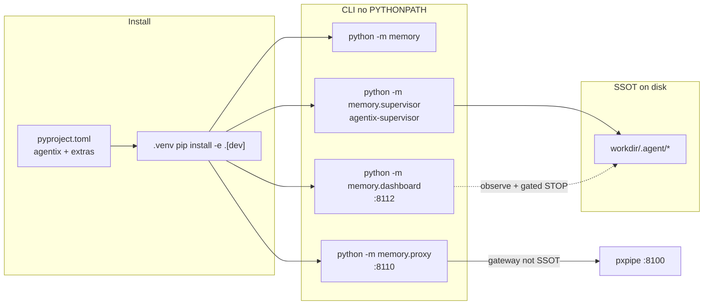
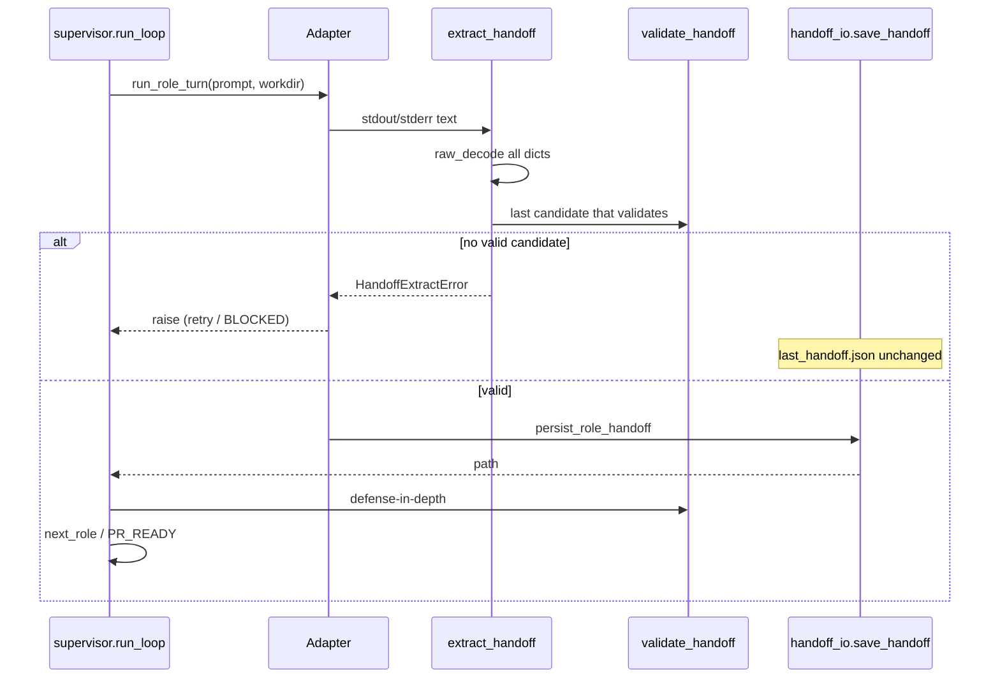
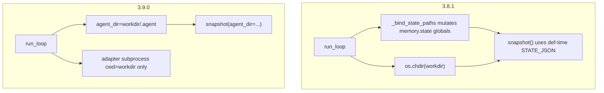
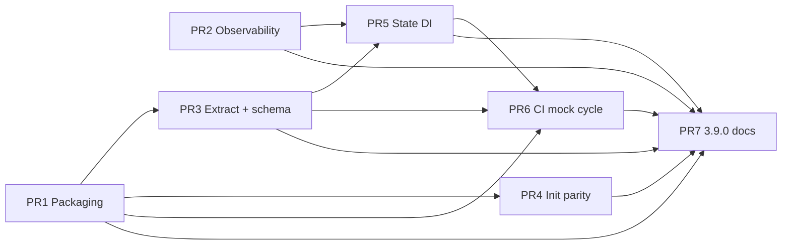

# P8 Harness Hardening — Packaging, Observability, Extraction, Init Parity

**Title:** P8 Harness Hardening (Agentix v3.9.0)  
**Author:** design agent / unhex placeholder  
**Date:** 2026-08-24  
**Status:** Draft  
**Repo / home:** `agentic_loop_template` (Agentix harness), package `memory`  
**Baseline:** VERSION **3.8.1** (Control Plane 3.8.0; serial `run-parallel` 3.8.1). Business Efficiency P0–P7 complete.  
**Target version:** **3.9.0**  
**Authoritative backlog:** [ROADMAP.md](../../ROADMAP.md) P8 High + P8-05 (Medium).  
**House style:** match [2026-08-21-agents-dashboard-design.md](2026-08-21-agents-dashboard-design.md) structure/quality, not its product.

A 2026-08-24 research pass concluded that the next substantial improvement is **harness hardening**, not a new product. Hosted Hub SaaS, full Linear/Jira/Slack MCP, and true concurrent fan-out stay **Future after P8**.

---

## Overview

Agentix 3.8.1 already runs an unattended role loop (`memory.supervisor`), an operator Control Plane (`memory.dashboard` on loopback `:8112`), a request gateway (`:8110` → host pxpipe `:8100`), and serial disjoint `run-parallel` streams. Consumers still cannot `pip`/`uv` install the harness: there is **no `pyproject.toml`**, Init scripts ad-hoc `pip install pyyaml pytest jsonschema` (neither `yaml` nor `jsonschema` is imported anywhere), and every entry shim exports `PYTHONPATH` to the repo root.

This document specifies the smallest change that meets the ROADMAP P8 done criteria: installable packaging, no silent swallow on critical supervisor/adapter/proxy paths, schema-backed handoff extraction in every adapter, equivalent Unix/Windows cold-start, explicit state paths (no `_bind_state_paths` + `os.chdir`), and CI that actually runs the existing mock O→C→T→R cycle.

Implementation stays inside `agentic_loop_template`. It does not spawn a Hub SaaS, does not add MCP integrations, does not make streams concurrent, and does not reopen the Control Plane spec.

---

## Background & Motivation

### Current state (verified 2026-08-24)

| Layer | What exists | Gap vs P8 |
|-------|-------------|-----------|
| Package layout | Top-level `memory/` + root `__init__.py` (`__version__ = "3.3.0"`, stale). `python -m memory` / `python -m memory.supervisor` work only when repo root is on `PYTHONPATH`. | No `pyproject.toml`, no `setup.cfg`, no entry points. |
| Init (Unix) | `Agent-Init.sh` (143 lines): venv, ad-hoc pip, `export PYTHONPATH`, `memory.proxy install-venv`, `state init`, `knowledge ingest-if-empty`, `context_budget cold-start`, optional `--wizard` (default frontend **grok**). | No `playbooks seed`. PYTHONPATH required. |
| Init (Windows) | `Agent-Init.ps1` (874 lines): venv repair, UTF-8, prompt generation. Looks for `pyproject.toml` (missing) then `requirements.txt`. `$initFe = "blackbox"`. `$ProjectRoot = Split-Path -Parent $PSScriptRoot`. Has ingest-if-empty + proxy health. **No `-Wizard`.** | Nested-layout root detection; no `state init`; no playbooks seed; default frontend ≠ Unix. |
| Consumer | `examples/consumer-starter/Agent-Init.consumer.sh` symlink + PYTHONPATH marker in `.venv/bin/activate`. | Same ad-hoc pip; cannot `pip install -e` the SSOT. |
| Shims | `scripts/agentix-supervisor`, `scripts/agentix-dashboard`, `scripts/agentix-proxy.sh` all `export PYTHONPATH=$ROOT`. | Harmless after install, but documents the hack. |
| Supervisor | `memory/supervisor.py` (`run_loop`, `next_role`, `Terminal`, `save_handoff` already tmp+replace). | `_bind_state_paths` + `os.chdir(workdir)` for the whole run. Silent `except Exception` on config, knowledge, compress, snapshot, harvest. |
| State | `memory/state.py` module-level `AGENT_DIR = Path(".agent")` and **def-time** defaults (`load_state(path: Path = STATE_JSON)`). | Callers that omit `path` follow **cwd**, which is why `run_loop` chdirs. Dashboard already refused this pattern. |
| Handoff schema | `schemas/handoff.schema.json` + `memory/validate_handoff.py`. Supervisor calls `validate_handoff` **after** the adapter returns. | `_load_schema()` is only used for CLI `"schema_present"`. Enums/required fields are **duplicated** in Python. `jsonschema` is pip-installed and **never imported**. |
| Adapters | `RoleAdapter` protocol in `memory/adapters/base.py`. `GrokAdapter` / `CursorAdapter` / `BlackboxAdapter` call `extract_json_object` then `Path.write_text` on `.agent/last_handoff.json`. `MockAdapter` writes a fixed valid sequence. | No `validate_handoff` in adapters. Bypass `save_handoff`. Invalid JSON overwrites the previous handoff. |
| JSON extract | `extract_json_object` in `memory/adapters/grok.py`: walk `{` + `json.JSONDecoder.raw_decode`; greedy `r"\{[\s\S]*\}"` runs only when **no dict** was decoded (`last is None`). Tests in `memory/test_adapters.py`. | Last **any** dict wins (not last **valid handoff**). Greedy can still run after raw_decode skipped non-dict JSON (arrays). Uncaught `JSONDecodeError` from `json.loads` on the greedy match. |
| Observability | Dashboard uses `logging.getLogger("memory.dashboard")`. Supervisor/adapters/proxy have **no** `getLogger`. | ~80 `except Exception` sites (not a done-criterion). Critical paths listed below swallow without log. |
| CI | `.github/workflows/agentix-loop.yml`: `workflow_dispatch` + weekly cron. `python -m memory.test_*` for a **subset** of modules. | Does **not** run `pytest`. Does **not** run `memory/test_supervisor_mock_cycle.py` (the full mock cycle **already exists**). No `pull_request` trigger. |
| Control Plane | Shipped 3.8.0, bind `127.0.0.1:8112`. Spec: `docs/superpowers/specs/2026-08-21-agents-dashboard-design.md`. | **Do not redesign.** |
| Parallel | `run-parallel` is **serial** disjoint `owned_paths` (3.8.1). | True concurrency is P8-11 / Future. State DI is the prerequisite, not the concurrency story. |

### Pain points

1. **Install is a folklore ritual.** `Agent-Init.sh:36` `pip install -q pyyaml pytest jsonschema`. `PYTHONPATH` is still set in `Agent-Init.sh:38`, `Agent-Init.ps1:759`, `scripts/agentix-{supervisor,dashboard}` and `scripts/agentix-proxy.sh`, `examples/consumer-starter/Agent-Init.consumer.sh`, `PARALLEL_PROTOCOL.md`, `SYSTEM_PROMPT.md`, and experience-harvester anti-patterns. README Quick Start does **not** mention PYTHONPATH (PR7 is badges/version/consumer wording, not a PYTHONPATH delete). `Agent-Init.md` already claims “Install all dependencies from `pyproject.toml`” — the file does not exist. `Agent-Init.ps1:734` branches on it, but `$ProjectRoot = Split-Path -Parent $PSScriptRoot` (line 28) is the parent of the clone for the README layout, and the extras string is `"$ProjectRoot.[dev]"` (a dot pip will not parse as extras).

2. **Silent failure looks like empty knowledge / empty snapshot / uncompressed prompt.** `_knowledge_block`, `_maybe_compress_prompt`, `_state_snapshot_for_workdir` (`memory/supervisor.py`) each `except Exception: return "" / "{}" / text`. `load_config` / `load_last_handoff` / `memory.proxy.config.load_project_config` swallow JSON errors. `run_loop` harvest `maybe_cycle_on_done` is `except Exception: pass`. Gateway `process_request` (`memory/proxy/gateway.py:197`) swallows middleware failures and continues upstream.

3. **Adapters persist unvalidated JSON.** Grok/Cursor/Blackbox write whatever `extract_json_object` returned. Supervisor then validates and retries the **role**, but the bad object is already `last_handoff.json`. Dashboard torn-read comments assumed `write_text`; `save_handoff` is atomic, adapters do not use it.

4. **Unix vs Windows cold-start is not equivalent.** Remaining drift is wizard, default frontend, script shape, and ritual completeness — not a missing script. P8 done criteria require proxy + knowledge + **playbooks** on both.

5. **CI does not prove the loop.** `test_supervisor_mock_cycle.test_mock_full_cycle_pr_ready` already drives mock O→C→T→R to `PR_READY` with `create_pr=False`. GitHub Actions never calls it.

### Why now

P0–P7 productized the loop. 3.8.0 added the Control Plane; 3.8.1 added serial streams. The 2026-08-24 research pass (and ROADMAP “Next: P8 Harness Hardening”) is explicit: **do not start Hub SaaS / MCP / concurrent fan-out**. Close packaging, observability, extraction/validation, init parity, state DI, and the mock-cycle CI hole. Target **v3.9.0**.

---

## Goals & Non-Goals

### Goals

| ID | Goal | P8 ID |
|----|------|-------|
| G1 | Consumers can `pip install -e .` / `uv pip install -e .` (and `.[dev]`, `.[dashboard]`) and run `python -m memory` / `agentix` **without** a PYTHONPATH hack. | P8-01 |
| G2 | Critical supervisor / adapter persist / proxy config+gateway paths log at WARNING+ with the exception; no `except Exception: pass` on those paths. Heartbeat unlink stays best-effort silent. | P8-02 |
| G3 | Every adapter persist goes through `validate_handoff` + atomic `save_handoff`. `extract_json_object` keeps raw_decode; adds multi-candidate handoff selection; greedy regex is not the only (nor the silent) fallback. | P8-03 |
| G4 | `Agent-Init.sh` and `Agent-Init.ps1` perform the same cold-start ritual: venv, editable install, `state init`, knowledge ingest-if-empty, playbooks seed, proxy install-venv + health, starter prompt. Wizard flag exists on both; wizard/live default frontend is **grok** (fail-closed). **Non-wizard Init stays best-effort** proxy health so CI and `demo-loop.sh` do not require pxpipe. | P8-04 |
| G5 | Supervisor does not mutate `memory.state` module globals and does not `chdir` for correctness. State helpers take `agent_dir=` (same pattern as `audit_log` / `questions_collector`). | P8-05 |
| G6 | `validate_handoff` structural checks come from `schemas/handoff.schema.json` via `jsonschema`; DONE semantic extras stay in Python and are tested against the schema file. | P8-06 |
| G7 | GitHub Actions runs `pytest memory/` including the full mock supervisor cycle; dashboard tests run when extras are installed (`importorskip` remains). | P8-07 |

### Non-goals

| ID | Non-goal | Rationale |
|----|----------|-----------|
| NG1 | Hosted Agentix Hub SaaS | ROADMAP Future after P8. |
| NG2 | Full Linear / Jira / Slack MCP | ROADMAP Future. |
| NG3 | True concurrent fan-out / shared `.agent/` locking story | P8-11. `run-parallel` stays serial disjoint streams. State DI is the only concurrency-related change. |
| NG4 | Redesign Control Plane, spawn-supervisor, Tailscale, bind `:8110`/`:8100` | Dashboard shipped 3.8.0. Gateway `:8110`, pxpipe `:8100`, dashboard `:8112` stay. |
| NG5 | Token-estimate upgrade (tiktoken default, per-model) | P8-08. `context_budget.estimate_tokens` already tries tiktoken and falls back to chars/4 — leave it. |
| NG6 | Docs i18n / dual-language public guides | P8-09. Spec and product chrome stay English. Implementation comments/commits stay Russian per DEVELOPMENT_STANDARDS §1. |
| NG7 | Playbook embeddings ranking | P8-10. |
| NG8 | Split `meta_harvester` / `experience_harvester` / rewrite ps1 as generated-from-sh | P8-12. Parity checklist, not a 874-line rewrite. |
| NG9 | Use or extract `MultiLLM*` dataclasses | P8-13. |
| NG10 | Make `_PROMPT_BODY_CAP` / `_KNOWLEDGE_BUDGET` fully configurable | P8-14. |
| NG11 | Publish to public PyPI as a required P8 step | Local/editable install is the done criterion. Distribution **name** is decided; upload is not. |
| NG12 | src-layout move, rename import package `memory` → `agentix` | Would break every `python -m memory.*` doc and test. Import stays `memory`. |
| NG13 | JSON5 / trailing-comma repairer, or deleting raw_decode | Verify-then-narrow: raw_decode already works; do not replace it with regex. |
| NG14 | Log every `except Exception` site (~80 today) | Allowlist of **critical** paths (G2). Cleanup/unlink/torn-retry stays quiet. The census is not a done-criterion. |

### Artifact membership (what P8 touches)

| Artifact | P8 | Notes |
|----------|----|-------|
| `pyproject.toml` (new) | **Add** | SSOT for deps + extras + scripts. |
| `memory/` import package | **Keep** | Wheel includes `memory*` + dashboard templates + schema copy. |
| `schemas/handoff.schema.json` | **Keep SSOT** | Packaged copy at `memory/data/handoff.schema.json`; identity test. |
| `Agent-Init.sh` / `.ps1` / consumer | **Edit** | Editable install; shared ritual; wizard parity. |
| `memory/supervisor.py` | **Edit** | Logging (PR2); drop bind+chdir (PR5). |
| `memory/state.py` | **Edit** | PR3: `log_metrics(..., *, agent_dir=)` only. PR5: full `agent_dir=` on every path helper, `_read_template_version` via `importlib.metadata`, corrupt-JSON ERROR log. **Not** in PR1/PR2 (level-0 file split). |
| `memory/adapters/*` | **Edit** | Extract candidates + persist helper. |
| `memory/validate_handoff.py` | **Edit** | jsonschema + DONE extras. |
| `.github/workflows/agentix-loop.yml` | **Edit** | pytest + mock cycle; `pull_request`. |
| `memory/dashboard/**` | **Do not redesign** | Only package-data so templates ship in the wheel. |
| `PARALLEL_PROTOCOL.md` / streams | **Docs only** | PYTHONPATH mentions; no concurrency change. |

---

## Proposed Design

### 1. Packaging (P8-01)

**Distribution name:** `agentix`. **Import package:** `memory` (unchanged). **Console script:** `agentix` → `memory.__main__:_cli`. Optional scripts: `agentix-supervisor`, `agentix-dashboard`, `agentix-proxy`.

Do not invent a second import path. Root `__init__.py` (`python -m agentic_loop_template.memory`) is a nested-layout leftover; it is **not** added to `packages.find`. Nested consumers `pip install -e ../agentic_loop_template` and import `memory`.

```toml
# pyproject.toml (repo root) — canonical shape
[build-system]
requires = ["setuptools>=68", "wheel"]
build-backend = "setuptools.build_meta"

[project]
name = "agentix"
dynamic = ["version"]
description = "Agentix harness: supervisor, memory, proxy, control plane sidecar"
readme = "README.md"
requires-python = ">=3.10"
license = { text = "MIT" }
authors = [{ name = "exception.expert" }]
dependencies = [
  "jsonschema>=4.18,<5",
]
# pyyaml is currently pip-installed by Init and never imported — do not add it.

[project.optional-dependencies]
dev = ["pytest>=8.0,<9"]
dashboard = [
  "fastapi>=0.115",
  "uvicorn[standard]>=0.32",
  "python-multipart>=0.0.9",
  "httpx>=0.27",
]

[project.scripts]
agentix = "memory.__main__:_cli"
agentix-supervisor = "memory.supervisor:main"
agentix-dashboard = "memory.dashboard.__main__:main"
agentix-proxy = "memory.proxy.__main__:cli"

[tool.setuptools.dynamic]
version = { file = "VERSION" }

[tool.setuptools.packages.find]
include = ["memory*"]

[tool.setuptools.package-data]
memory = [
  "dashboard/templates/**/*.html",
  "data/*.json",
]
```

**Version (distribution):** `VERSION` is the setuptools dynamic version (`3.8.1` today; bump to `3.9.0` only in PR7). G1 proof is `importlib.metadata.version("agentix")` from a directory that is **not** the repo (CI `/tmp` step). `memory/state.py` `_read_template_version` (LOOP_STATE `template_version` field) still reads files today; **do not edit `state.py` in PR1**. The importlib.metadata fallback for that helper lands in **PR5** with the `agent_dir=` rewrite (same file).

**Schema in the wheel:** repo SSOT remains `schemas/handoff.schema.json`. Commit `memory/data/handoff.schema.json` as an identical copy listed in `package-data` of package `memory` (`data/*.json`). There is **no** `memory/data/__init__.py` and **no** `memory.data` import package.

`validate_handoff._load_schema()` search order:

1. `importlib.resources.files("memory").joinpath("data/handoff.schema.json")` (wheel / editable)
2. `Path(__file__).resolve().parents[1] / "schemas" / "handoff.schema.json"` (source tree)
3. `Path("schemas/handoff.schema.json")` (cwd)

Do **not** call `files("memory.data")` — setuptools `include = ["memory*"]` is not namespace-aware; without `__init__.py` that import raises `ModuleNotFoundError` in a wheel. `test_packaged_schema_matches_ssot` asserts the two in-tree files are byte-identical and **fails** (does not skip) if `memory/data/handoff.schema.json` is missing after PR1. Do not add a generate step.

**Dep pin policy:** ranges, not hashes (`jsonschema>=4.18,<5`, `pytest>=8.0,<9`, FastAPI lower bounds as today). ROADMAP P8-01 “pinned зависимости” is satisfied by upper-bounded ranges, not `uv.lock` / `==` (no lockfile in P8). `requirements-dashboard.txt` must stay **byte-identical** to the `dashboard` extra (including `httpx>=0.27`); identity asserted in `test_packaging.py`.

**Init install (replaces ad-hoc pip):**

```bash
# Agent-Init.sh — after venv activate
python -m pip install -U pip -q
python -m pip install -e ".[dev]" \
  || python -m pip install 'jsonschema>=4.18,<5' 'pytest>=8.0,<9'
# PYTHONPATH export becomes optional fallback, not the install mechanism:
if ! python -c "import memory, memory.supervisor" >/dev/null 2>&1; then
  export PYTHONPATH="${ROOT}${PYTHONPATH:+:$PYTHONPATH}"
fi
```

The `|| pip install jsonschema pytest` line is required: after PR3, `validate_handoff` prefers `jsonschema` but PYTHONPATH-only clones (shims, failed editable) can still `import memory` and then crash on persist if the extra was never installed. `validate_handoff` also try/excepts `jsonschema` and falls back to today’s Python checks (same as missing schema file).

**Windows install belongs in PR1** (G1 is otherwise false on the README layout). Do **not** treat `Agent-Init.ps1:734-735` as a working prototype:

1. Detect template root in PR1 (same predicate PR4 used to specify):

```powershell
if (Test-Path (Join-Path $PSScriptRoot "memory\supervisor.py")) {
    $ProjectRoot = $PSScriptRoot          # template-as-cwd (README)
} else {
    $ProjectRoot = Split-Path -Parent $PSScriptRoot  # nested (Agent-Init.md)
}
```

2. Pip extras on a path have **no dot**: `Invoke-VenvPip @('install','-e',"$ProjectRoot[dev]")` or `Set-Location $ProjectRoot; Invoke-VenvPip @('install','-e','.[dev]')`. `"$ProjectRoot.[dev]"` expands to `C:\parent.[dev]` and never selects extras.

3. Same `|| pip install jsonschema pytest` fallback as Unix.

Consumer-starter:

```bash
uv pip install -e "${TEMPLATE}[dev]" \
  || uv pip install 'jsonschema>=4.18,<5' 'pytest>=8.0,<9'
# stop appending PYTHONPATH to .venv/bin/activate as the primary mechanism
# keep the agentic_loop_template symlink for prompts/scripts/docs file access
```

**Shims** (`scripts/agentix-supervisor`, `scripts/agentix-dashboard`) may keep `PYTHONPATH=$ROOT` as belt-and-suspenders for an uninstalled git clone; after `pip install -e .` it is redundant. `scripts/agentix-proxy.sh` is the same pattern — leave the PYTHONPATH line for **PR7** (docs/shim sweep), not PR1. Done criterion is “can install without PYTHONPATH”, not “delete every PYTHONPATH string in PR1”.

**Pytest:** tests stay under `memory/test_*.py` and keep running as `python -m pytest -q memory/` (Tester block `tools/blocks/common/pytest.md`). That command does **not** prove G1: pytest puts the repo root on `sys.path`. G1 proof is the `/tmp` import step in PR1 and PR6. CI still switches to pytest so collection includes `test_supervisor_mock_cycle.py`.

**Dashboard extra:** `requirements-dashboard.txt` stays a duplicate of `[project.optional-dependencies] dashboard` (FastAPI pins **plus `httpx>=0.27`**). `memory/conftest.py` / `test_dashboard_{security,ws}.py` `importorskip("httpx")` before Starlette `TestClient`; FastAPI does not depend on httpx. Without it, G7 “dashboard tests run” is a skip. Do not make FastAPI a hard dependency (3.8.0 KD12).

### 2. Observability (P8-02)

Follow the dashboard pattern: `logging.getLogger("memory.<module>")`. Library code **does not** call `basicConfig`. CLI `main()` functions call a tiny helper once:

```python
# memory/logutil.py (new, ~40 lines)
def configure_logging() -> None:
    level = os.environ.get("AGENTIX_LOG_LEVEL", "INFO").upper()
    root = logging.getLogger("memory")
    if root.handlers:
        return
    handler = logging.StreamHandler()
    handler.setFormatter(logging.Formatter("%(asctime)s %(levelname)s %(name)s: %(message)s"))
    from memory.dashboard.redact import RedactFilter  # stdlib; no FastAPI import
    # On the logger, not the handler — matches install_log_redaction; caplog is covered.
    root.addFilter(RedactFilter())
    root.addHandler(handler)
    root.setLevel(getattr(logging, level, logging.INFO))
    root.propagate = False
```

Call from `memory.supervisor:main`, `memory.__main__._cli`, `memory.proxy.__main__:cli`. Default INFO. `AGENTIX_LOG_LEVEL=DEBUG` for extract candidate dumps (truncate; **never** log full role prompts or proxy bodies). `RedactFilter` on logger `memory` (same as `install_log_redaction`, not handler-only) so `GROK_*` / `DASHBOARD_TOKEN` cannot leak through caplog or a later handler. Tests: `caplog.at_level(logging.WARNING, logger="memory")`; a `GROK_*`-shaped string in `logging.getLogger("memory.supervisor").warning(...)` is **redacted** in `caplog.text`. With `propagate=False`, attaching caplog to root sees nothing.

**Critical-path allowlist (must log, must not `pass`):**

| Site | Today | P8 |
|------|-------|----|
| `supervisor.load_config` | `except Exception: pass` then `{}` | `except (OSError, UnicodeError, json.JSONDecodeError) as exc:` log WARNING, return `{}`. Unexpected exceptions **raise**. |
| `supervisor.load_last_handoff` | `except Exception: return None` | Same split: decode/OSError → WARNING + None; other → raise. |
| `_state_snapshot_for_workdir` | `except Exception: return "{}"` | Log WARNING; return `"{}"`. |
| `_knowledge_block` | `except Exception: return ""` | Log WARNING; return `""`. |
| `_maybe_compress_prompt` | `except Exception: return text` | Log WARNING; return uncompressed `text`. |
| role prompt `read_text` | `except Exception: body = ""` | Log WARNING. |
| `maybe_cycle_on_done` | `except Exception: pass` | Log WARNING. |
| `proxy.config.load_project_config` | `except Exception: pass` | Same as `load_config`. |
| `proxy.gateway` `process_request` | `except Exception: pass` then continue upstream | Log WARNING with path; continue (fail-open on distill is existing behavior — make it visible). |
| `playbooks._load_index` bak-rename | silent | Log WARNING before bak. |
| `memory/__init__.py` guarded imports | silent fallbacks | `logging.getLogger("memory").warning` once. |

**PR2 does not edit `memory/state.py`.** `state.load_state` corrupt JSON (`except Exception: return default_state()`) logs ERROR in **PR5** with the `agent_dir=` rewrite (same file as path DI; avoids a PR1∥PR2∥PR5 three-way merge).

**Adapter persist logging is PR3**, not PR2: `WARNING memory.adapters: extract_handoff rejected N candidates` and persist `HandoffExtractError`. Optional `state.log_metrics({"event": "handoff_invalid", "role": role, "errors": n})` is also PR3 (after persist fails, before raise). PR2 allowlist is supervisor / proxy / playbooks / `__init__` only.

**Leave silent (not critical):** heartbeat tmp/unlink (`_write_heartbeat` / `_stop_heartbeat_thread`), torn-read retries in dashboard/questions/audit, `chdir` restore until PR5 deletes it.

### 3. JSON extraction + adapter persist (P8-03)

**Verified:** `extract_json_object` is **not** “greedy regex only”. Primary path is `JSONDecoder.raw_decode` from every `{`. Greedy `r"\{[\s\S]*\}"` runs only when **no** dict was decoded. What is still wrong:

1. Last decoded **dict** wins, even if it is `{"ok": true}` after a valid handoff.
2. Adapters persist without `validate_handoff`.
3. Adapters `write_text` instead of `save_handoff` (atomic tmp+replace in `supervisor.py:108-117`).
4. Greedy fallback can raise `json.JSONDecodeError` instead of `ValueError`.

**Do not replace raw_decode.** Narrow the change:

```python
class HandoffExtractError(ValueError):
    """Нет JSON или ни один кандидат не проходит validate_handoff."""


def extract_json_candidates(text: str) -> List[Dict[str, Any]]:
    """Все dict, которые raw_decode принял, в порядке появления.
    Greedy regex — только если ни один dict не декодирован (`last is None`).
    """
    ...


def extract_json_object(text: str) -> Dict[str, Any]:
    """Последний dict (обратная совместимость тестов picks_last)."""
    ...


def _strict_done_for(candidate: Dict[str, Any]) -> bool:
    return (candidate.get("status") or "").upper() == "DONE"


def extract_handoff(text: str) -> Dict[str, Any]:
    """Последний кандидат, который persist примет: validate_handoff
    с strict_done=(status==DONE) на **каждом** кандидате.
    Нет параметра strict_done — одно правило с persist_role_handoff.
    Если валидных нет — HandoffExtractError с errors последнего кандидата.
    """
```

Selection rule: **last persistable handoff**, not last dict, not “non-strict then persist-strict”. A valid Orchestrator `IN_PROGRESS` followed by a structurally valid `DONE` missing `git_sync_status.verified` / `sync_waived` must yield the **IN_PROGRESS** object. If the model prints a valid Orchestrator object then a trailing `{"note": "done"}`, we keep the Orchestrator object.

Greedy regex remains a last-resort **candidate source** when **no dict** was decoded, wrapped so `JSONDecodeError` becomes `HandoffExtractError`. It is not used when raw_decode already found dicts.

**Move `save_handoff`** from `memory/supervisor.py` to `memory/handoff_io.py` (same 10-line tmp+replace, no loop logic). Supervisor and adapters import it from there. Adapters must **not** `from memory.supervisor import save_handoff` (cycle: `run_loop` lazy-imports adapters).

```python
# memory/adapters/persist.py (or base.py)
def persist_role_handoff(workdir: Path, data: Dict[str, Any]) -> Path:
    strict = _strict_done_for(data)
    ok, errors = validate_handoff(data, strict_done=strict)
    if not ok:
        log = logging.getLogger("memory.adapters")
        log.warning("persist_role_handoff rejected: %s", "; ".join(errors))
        from memory.state import log_metrics
        log_metrics(
            {"event": "handoff_invalid", "errors": len(errors)},
            agent_dir=Path(workdir) / ".agent",
        )
        raise HandoffExtractError("; ".join(errors))
    from memory.handoff_io import save_handoff
    return save_handoff(Path(workdir), data)
```

`extract_handoff` logs `WARNING memory.adapters: extract_handoff rejected N candidates` when it walks past invalid dicts and still finds a later valid one, or when it raises. `handoff_invalid` metrics stay in P8: persist **must** pass `agent_dir=Path(workdir) / ".agent"` in PR3 so the row lands in `workdir/.agent/metrics.jsonl` after PR5 deletes `chdir`. Do not call cwd-relative `log_metrics()`. PR3 also adds the optional `agent_dir=` parameter to `log_metrics` only (not the rest of state DI) so that call does not TypeError before PR5. PR5 does **not** edit `persist.py`.

All four adapters (`grok`, `cursor`, `blackbox`, `mock`) call `persist_role_handoff`. Mock still **builds** the dict in-process (no extract); it still **must** validate+atomic write so the contract is one place.

Supervisor keeps post-adapter `validate_handoff` as defense in depth (retry loop) and **keeps** a second `save_handoff` of the already-valid object (idempotent tmp+replace). Invalid JSON no longer clobbers `last_handoff.json` on the first failure.

Tests (`memory/test_adapters.py`): keep existing three extract tests; add:

- nested braces still parse (raw_decode)
- valid handoff then `{"ok": true}` → `extract_handoff` returns the handoff
- valid `IN_PROGRESS` then invalid `DONE` (missing `sync_waived` / verified) → `extract_handoff` returns the IN_PROGRESS object; `persist_role_handoff` accepts it
- `extract_json_object` still returns last dict (`picks_last` unchanged)
- persist of invalid raises and **does not** write the file
- greedy-only garbage raises `HandoffExtractError` / `ValueError`, not raw `JSONDecodeError`

### 4. Validator ↔ schema (P8-06, folded into the extract PR)

Today `validate_handoff` hardcodes `ROLES`, `STATUSES`, `PHASES`, required keys, summary length, confidence range, and DONE extras (`git_sync_status.verified` or `sync_waived`, `lessons_learned` or `distillation_performed`, `metrics` object). The JSON schema has the structural enums/required/`maxLength`/`minimum` but **not** the DONE implications. `_load_schema()` does not validate.

**Hybrid (smallest that stops drift):**

1. Load schema (search order in §1). Missing schema is an error in tests and in adapter persist; CLI still useful.
2. `jsonschema.Draft202012Validator(schema).iter_errors(data)` → structural errors.
3. Keep the Python DONE extras **and** summary compress hint if not already covered (`summary maxLength: 800` is in the schema — drop the duplicate Python check once jsonschema is on).
4. Enums come from the schema file, not a second Python set, unless the schema failed to load (then keep the current constants as fallback so `python -m memory.validate_handoff` still works from a naked file copy).

Do not try to encode “DONE ⇒ handoff_to None ∧ (verified ∨ waived) ∧ …” as JSON Schema `if/then` in this stack unless it is a 10-line additive patch to `schemas/handoff.schema.json` with tests. Prefer Python extras — they already match `HANDOFF_SCHEMA.md` and `test_handoff_done_rules`.

`jsonschema` becomes a **runtime** dependency (it is already in the ad-hoc pip line but unused). Import is guarded:

```python
try:
    import jsonschema
except ImportError:
    jsonschema = None  # PYTHONPATH-only clone; Python extras/enums still run
```

Missing `jsonschema` logs WARNING once and uses today’s Python structural checks. Missing schema file is the same fallback. Tests after `pip install -e ".[dev]"` require jsonschema to be used (assert the validator path ran).

### 5. Platform drift (P8-04)

**Not** “generate ps1 from sh”. The 874-line Windows script owns venv repair, CP1251 UTF-8, prompt templates, and Blackbox non-interactive PowerShell. Killing that for a 143-line bash port would regress Windows agents.

**Parity checklist (SSOT in `docs/cross-platform.md`, enforced by a grep test):** both scripts must invoke:

| Step | Unix today | Windows today | P8 |
|------|------------|---------------|----|
| venv | yes | yes (repair) | keep |
| install | ad-hoc pip | pyproject if present else skip | `pip install -e ".[dev]"` (PR1) |
| `memory state init` | yes | **no** | **add to ps1** |
| `experience_harvester seed-defaults --apply` | yes | no | add to ps1 |
| `knowledge ingest-if-empty --root docs --budget 800` | yes | yes | keep |
| `context_budget cold-start --budget 16000 --compress` | yes | yes | keep |
| `playbooks seed --from-standards` | **no** (demo-loop/CI only) | **no** | **add to both** (P8 done: playbooks) |
| `proxy install-venv` | yes | yes | keep |
| `proxy health --init --frontend` | wizard grok fail-closed; else best-effort (`\|\| true`) | fail-closed only if `initFe==grok` | **(A) non-wizard stays best-effort**; wizard (and ps1 `-Wizard` / explicit `-Frontend` grok\|cursor\|blackbox) is fail-closed. Mock never fail-closes. `AGENTIX_PROXY=0` still opts out. |
| starter prompt | always `.agent/starter_prompt_grok.txt` | only if task auto-detected | Unix keep; ps1 also write a short file so cold-start is file-based |
| wizard | `--wizard` | **missing** | add `-Wizard` with the same four prompts (name, platform, frontend, spec). Copy consumer-starter templates if missing. |

**Default frontend:** **grok** on both for **wizard / live** (product default, pxpipe-required live path). ps1 today hardcodes `$initFe = "blackbox"` then overrides from `project_config.supervisor.adapter`. After P8: wizard default `grok`; `-Frontend blackbox` and config `supervisor.adapter` still win. Document in `docs/onboarding-wizard.md` (it currently lists “blackbox/cursor/claude” and omits grok — stale vs `Agent-Init.sh`).

**Non-wizard Init is not fail-closed grok.** Today `Agent-Init.sh` only fail-closes when `--wizard` set `INIT_FE`. `bash Agent-Init.sh` (CI Bootstrap, `scripts/demo-loop.sh`, existing clones) is `proxy health --init >/dev/null 2>&1 || true`. If non-wizard defaulted `INIT_FE=grok`, GHA and demo-loop would exit 1 without pxpipe. Choice **(A)** (KD6): keep that best-effort path. Do **not** require `AGENTIX_PROXY=0` in CI. ps1 non-wizard: default frontend grok only for the **health probe label** if config says grok, else keep today’s config-driven `$initFe`; fail-closed remains “grok and health failed”, not “every Init”.

**Root detection (ps1 bug vs README) — lands in PR1**, not only PR4. Without it, `Test-Path (Join-Path $ProjectRoot "pyproject.toml")` never sees the new file on the README layout, so G1 is false on Windows after packaging:

- README Quick Start: `cd agentic_loop_template; .\Agent-Init.ps1` → `$PSScriptRoot` **is** the template root; `Split-Path -Parent $PSScriptRoot` is the **parent of the clone**.
- `Agent-Init.md`: `.\agentic_loop_template\Agent-Init.ps1` from a **product** root → parent-of-script is correct.

```powershell
if (Test-Path (Join-Path $PSScriptRoot "memory\supervisor.py")) {
    $ProjectRoot = $PSScriptRoot          # template-as-cwd (README)
} else {
    $ProjectRoot = Split-Path -Parent $PSScriptRoot  # nested (Agent-Init.md)
}
```

Unix `ROOT="$(cd "$(dirname "${BASH_SOURCE[0]}")" && pwd)"` is already template-as-cwd. Consumer script stays product-cwd + sibling/template symlink.

**Test:** `memory/test_init_parity.py` reads both scripts as text. Shared ritual substrings: `memory state init`, `knowledge ingest-if-empty`, `playbooks seed`, `proxy install-venv`. **Install lines are platform-specific — do not assert `"pip install -e"` in the ps1** (`Agent-Init.ps1:505` help text already contains that phrase and would pass before PR1):

- Unix (`Agent-Init.sh`): `pip install -e ".[dev]"` (and the `|| pip install jsonschema` fallback).
- Windows (`Agent-Init.ps1`): `"$ProjectRoot[dev]"` **and** the tokens `'install','-e'` (or equivalent array form). Not `"$ProjectRoot.[dev]"`.

Not a Windows runner — string contract only.

### 6. State path DI (P8-05)

Dashboard KD7 already locked this for the Control Plane: *“Correctness is explicit Paths + optional `agent_dir=` on writers, not lifespan `chdir` / `_bind_state_paths`.”* `questions_collector` and `audit_log` already take `agent_dir=`. `state.py` does not.

**Why bind+chdir exists:** `load_state(path: Path = STATE_JSON)` bakes `Path(".agent/LOOP_STATE.json")` at **import time**. `snapshot()`, `append_delta()`, `log_metrics()`, `_write_md_projection()`, `_ensure_dirs()` use module globals `AGENT_DIR` / `STATE_MD` / `HISTORY_DIR` / `METRICS_JSONL`. `run_loop` therefore (1) rebinds the five globals and (2) `chdir`s so def-time relative paths resolve. `status` CLI does the same. Comment in `run_loop` documents this.

`_bind_state_paths` does **not** cover playbooks, audit, questions, knowledge DB, resume — those stay cwd-relative unless they already have `agent_dir=` / `cwd=`. P8-05 is **state.py + supervisor only**, not a campaign to DI every module (NG8 / P8-12).

**Every `AGENT_DIR` / `STATE_JSON` / `STATE_MD` / `HISTORY_DIR` / `METRICS_JSONL` reader/writer takes `agent_dir=` and threads it.** After deleting `os.chdir(workdir)`, any helper that still uses the module globals writes into the **process cwd**.

| Function | Globals it touches | P8 |
|----------|-------------------|----|
| `_ensure_dirs` | `AGENT_DIR`, `HISTORY_DIR` | `agent_dir=` |
| `load_state` | `STATE_JSON`, `STATE_MD` (migrate) | `path=` or `agent_dir=` |
| `save_state` | path + `_write_md_projection` + `_append_history` (overflow) | thread `agent_dir` |
| `_write_md_projection` | `STATE_MD` | `agent_dir=` (not the module `STATE_MD`) |
| `_append_history` | `HISTORY_DIR` | `agent_dir=` — called from `save_state`, `append_delta`, `compact`, `_migrate_from_md` |
| `_migrate_from_md` | `HISTORY_DIR`, then `save_state` | `agent_dir=` |
| `snapshot` | `load_state`, reports `HISTORY_DIR` | `agent_dir=`; `history_dir` in the payload is `agent / "history"` |
| `append_delta` | `load_state` / `save_state` / `_append_history` | pass `agent_dir` through all three |
| `compact` | `_ensure_dirs`, `load_state`, `save_state`, `AGENT_DIR` / `HISTORY_DIR` / `STATE_JSON` / `STATE_MD` | `agent_dir=` |
| `log_metrics` | `METRICS_JSONL` | `agent_dir=` |
| `tail_history` | `HISTORY_DIR` | `agent_dir=` (CLI `state tail`) |
| `_read_template_version` | `Path("VERSION")` | try `importlib.metadata.version("agentix")` then repo `VERSION` (this is the PR1 leftover, landed here) |
| `load_state` corrupt JSON | silent `default_state()` | log ERROR (PR2 leftover, landed here) |

```python
def _agent_dir(agent_dir: Optional[Path] = None) -> Path:
    return Path(agent_dir) if agent_dir is not None else AGENT_DIR

def load_state(path: Optional[Path] = None, *, agent_dir: Optional[Path] = None) -> Dict[str, Any]:
    agent = _agent_dir(agent_dir)
    path = path or (agent / "LOOP_STATE.json")
    ...

def save_state(state, path: Optional[Path] = None, *, agent_dir: Optional[Path] = None) -> None:
    agent = _agent_dir(agent_dir)
    path = path or (agent / "LOOP_STATE.json")
    # projection, history derived from agent, not module globals
    ...

def snapshot(window: int = 3, *, agent_dir: Optional[Path] = None) -> Dict[str, Any]: ...
def append_delta(text, role="", *, agent_dir: Optional[Path] = None) -> Dict[str, Any]: ...
def log_metrics(metrics, *, agent_dir: Optional[Path] = None) -> None: ...
def compact(..., *, agent_dir: Optional[Path] = None) -> Dict[str, Any]: ...
def tail_history(n: int = 5, *, agent_dir: Optional[Path] = None) -> List[Dict[str, Any]]: ...
def _append_history(record, *, agent_dir: Optional[Path] = None) -> None: ...
def _migrate_from_md(md_path, *, agent_dir: Optional[Path] = None) -> Dict[str, Any]: ...
```

Module-level `AGENT_DIR = Path(".agent")` remains the **CLI default** (`python -m memory state snapshot` from a workdir). Tests that `monkeypatch.setattr(state_mod, "AGENT_DIR", ...)` keep working if omitted `path` uses `_agent_dir()` at **call** time (fix the def-time footgun even when `agent_dir` is omitted).

**Supervisor `run_loop` (inner helpers):**

```python
agent = workdir / ".agent"

def _load() -> Dict[str, Any]:
    return state_mod.load_state(agent_dir=agent)

def _save(patch: Dict[str, Any]) -> None:
    cur = _load()
    cur.update(patch)
    state_mod.save_state(cur, agent_dir=agent)

# each successful turn:
state_mod.append_delta(f"{role}: {handoff.get('summary', '')}", role=role, agent_dir=agent)
state_mod.log_metrics({"role": role, "status": handoff.get("status"), "adapter": adapter_name}, agent_dir=agent)
```

- Delete `_bind_state_paths` / `_restore_state_paths`.
- `status` / `_state_snapshot_for_workdir` pass `agent_dir=workdir / ".agent"`.
- **Do not `os.chdir(workdir)`** for state correctness. Adapter `subprocess.run(..., cwd=str(workdir))` already sets the child cwd (`GrokAdapter.run_role_turn`). Prompt files are `workdir / rel`. STOP is `workdir / ".agent" / "STOP"`.
- Keep `cwd=workdir` on `gh pr create` (already).

**Tests:** `memory/test_state_and_handoff.py` fixture can keep monkeypatch + chdir for CLI-default coverage; add `test_snapshot_agent_dir_without_chdir` that never chdirs; add `test_append_delta_agent_dir_writes_history_under_tmp` (`append_delta(..., agent_dir=tmp)` writes `tmp/history/loop_state-*.jsonl` while cwd is elsewhere). `test_supervisor_mock_cycle` should pass with `run_loop(workdir=tmp_path)` from a **different** process cwd.

This is what makes serial `run-parallel` (already shipping) and future concurrency (NG3) not corrupt each other’s `STATE_JSON` globals.

### 7. CI mock cycle (P8-07)

`.github/workflows/agentix-loop.yml` today is a weekly prep job, not a PR gate, and never runs the mock cycle. `python -m pytest -q memory/` after an editable install still puts the **repo root** on `sys.path` and does **not** prove G1.

**Decision:** two jobs. Keep Agent-Init + Hub export + audit (P5 leftover is still a product ritual; dropping it would lose `test -f .agent/PLAN.md` / playbooks export). Non-wizard Init is best-effort (KD6 / choice A) so **do not** export `AGENTIX_PROXY=0`. Init may `pip install -e ".[dev]"`; the harness job also installs `.[dev,dashboard]` — double install is idempotent, acceptable.

```yaml
on:
  pull_request:
  push:
    branches: [main]
  workflow_dispatch:
  schedule:
    - cron: "0 8 * * 1"

jobs:
  harness:
    runs-on: ubuntu-latest
    steps:
      - uses: actions/checkout@v4
      - uses: actions/setup-python@v5
        with:
          python-version: "3.12"
      - name: Editable install with dashboard extra
        run: |
          python -m pip install -U pip
          python -m pip install -e ".[dev,dashboard]"
      - name: G1 import without repo on sys.path
        run: |
          cd /tmp
          env -u PYTHONPATH python -c "import memory, memory.supervisor, memory.validate_handoff; import importlib.metadata as m; print(m.version('agentix'))"
      - name: Full memory pytest (includes mock O→C→T→R + dashboard)
        run: python -m pytest -q memory/
      - name: Explicit mock cycle
        run: python -m pytest -q memory/test_supervisor_mock_cycle.py
      - name: Dashboard extras imported (httpx+fastapi; tests must not skip)
        run: |
          python -c "import httpx, fastapi"
          python -m pytest -q memory/test_dashboard_security.py memory/test_dashboard_ws.py
      - name: Agent-Init ritual (non-wizard, best-effort proxy)
        run: bash Agent-Init.sh
      - name: Seed / Hub export / audit
        run: |
          source .venv/bin/activate
          python -m memory.playbooks seed --from-standards
          test -f .agent/PLAN.md
          test -f TASK_SPECIFICATION.md
          python -m memory.playbooks export --format hub
          python -m memory.audit_log append --action "github_actions_loop_trigger" --role "ci" --cycle 0 --details "{}"

  stdlib-collect:
    runs-on: ubuntu-latest
    steps:
      - uses: actions/checkout@v4
      - uses: actions/setup-python@v5
        with:
          python-version: "3.12"
      - name: Dev extra only (no FastAPI)
        run: |
          python -m pip install -U pip
          python -m pip install -e ".[dev]"
      - name: Collect supervisor tests without dashboard extra
        run: python -m pytest --collect-only -q memory/test_supervisor_fsm.py
```

G1 proof is the `/tmp` + `env -u PYTHONPATH` step, **not** in-tree pytest. In-tree `test_packaging.py` still asserts the two schema files are byte-identical (fails if the copy is missing). Dashboard job must show `test_dashboard_*` **passed**, not skipped (`httpx` in the extra). `python -m memory.test_*` is superseded by pytest collection.

Not a second OS matrix. Windows Init is the string parity test, not `windows-latest`.

---

## Architecture diagrams

### Packaging and process map



### Handoff extract → persist → FSM



### State DI vs today’s bind+chdir



### PR DAG



Level-0 (parallel): **PR1 ∥ PR2** (share **no** files: `state.py` version + corrupt-JSON logging land in PR5). Level-1: **PR3 ∥ PR4**; **PR5** waits on PR2 (`supervisor.py` logging) **and PR3** (`handoff_io.save_handoff` consolidation). Not PR1. Level-2: **PR6**. Level-3: **PR7**.

---

## API / Interface Changes

### Before / after — install

```bash
# before (3.8.1)
python -m pip install -q pyyaml pytest jsonschema
export PYTHONPATH=.
python -m memory.supervisor run --adapter mock --max-cycles 1 --no-pr

# after (3.9.0)
python -m pip install -e ".[dev]"
python -m memory.supervisor run --adapter mock --max-cycles 1 --no-pr
# or: agentix supervisor run --adapter mock --max-cycles 1 --no-pr
```

`memory.__main__` already dispatches `sys.argv[1] == "supervisor"` to `memory.supervisor:main`. The `agentix` console script is the same `_cli`. Subcommand `agentix supervisor run ...` works today once argv is forwarded; do not add a parallel argparse tree.

### Adapter persist

```python
# before (grok.py:118-124)
data = extract_json_object(combined)
out = Path(workdir) / ".agent" / "last_handoff.json"
out.write_text(json.dumps(data, ...), encoding="utf-8")
return out

# after
data = extract_handoff(combined)  # per-candidate strict_done = status==DONE
return persist_role_handoff(workdir, data)  # same rule; save via memory.handoff_io
```

### State

```python
# before
orig = _bind_state_paths(state_mod, workdir)
os.chdir(workdir)
st = state_mod.load_state(state_mod.STATE_JSON)

# after
agent = workdir / ".agent"
st = state_mod.load_state(agent_dir=agent)
snap = state_mod.snapshot(window=3, agent_dir=agent)
state_mod.append_delta(text, role=role, agent_dir=agent)
state_mod.log_metrics({...}, agent_dir=agent)
```

Public CLI flags (`--workdir`, `--adapter`, `--no-pr`) do not change.

### Logging env

| Var | Default | Meaning |
|-----|---------|---------|
| `AGENTIX_LOG_LEVEL` | `INFO` | `DEBUG`/`INFO`/`WARNING`/`ERROR` for logger `memory` |
| `AGENTIX_PROXY` | (unchanged) | `0`/`off` still skips fail-closed proxy |

No new required env for packaging.

---

## Data Model Changes

**No LOOP_STATE schema bump.** Handoff JSON schema stays 3.8.1-compatible (`additionalProperties: true`, `stream` / `worktree` / `owned_paths` already present).

| File | Change |
|------|--------|
| `schemas/handoff.schema.json` | Optional `if/then` for DONE only if tests stay green; default is **no schema change**, Python extras remain. |
| `memory/data/handoff.schema.json` | New packaged copy, byte-identical. |
| `.agent/last_handoff.json` | Same format; writers switch to tmp+replace via `memory.handoff_io.save_handoff`. |
| `.agent/metrics.jsonl` | Optional `handoff_invalid` rows. |
| `VERSION` | `3.9.0` in PR7 only. |

**Migration:** none. Editable install is additive. Clones that keep exporting PYTHONPATH still work. Invalid on-disk handoffs are still rejected by supervisor on the next turn.

---

## Alternatives Considered

### A. Packaging layout

| Option | Verdict | Why |
|--------|---------|-----|
| **Keep `memory/` at repo root + setuptools `include = ["memory*"]`** | **Chosen** | Zero import churn. Matches every `python -m memory.*` doc. |
| src-layout `src/memory` | Rejected | Moves the entire test/import graph for no P8 gain. |
| Rename import to `agentix` | Rejected | Breaks CLI, prompts, experience seeds, dashboard, proxy. Console script `agentix` is enough. |
| Namespace `agentic_loop_template.memory` as the only entry | Rejected | Nested leftover; editable install of `memory` is the consumer path. |

### B. Observability

| Option | Verdict | Why |
|--------|---------|-----|
| **stdlib `logging` + `AGENTIX_LOG_LEVEL`** | **Chosen** | Dashboard already uses it. No new dep. |
| structured JSON logs / OpenTelemetry | Rejected | Kitchen-sink vs G2. |
| `print(..., file=sys.stderr)` | Rejected | Unlevelled, hard to silence in mock CI. |

### C. Extraction

| Option | Verdict | Why |
|--------|---------|-----|
| **raw_decode candidates + last valid handoff + greedy last-resort** | **Chosen** | Matches current primary path; fixes selection + persist. |
| Replace with balanced-brace scanner only | Rejected | raw_decode already handles nested braces; a second parser drifts. |
| json5 / trailing commas | Rejected | Encourages sloppy model output; schema is strict JSON. |
| Validate only in supervisor | Rejected | ROADMAP: “every adapter handoff goes through schema + validate_handoff”; also avoids clobbering last good file. |
| Adapters `from memory.supervisor import save_handoff` | Rejected | Cycle: `run_loop` lazy-imports adapters. **Chosen:** `memory/handoff_io.py` (the 10-line tmp+replace). Supervisor keeps a second idempotent write after defense-in-depth validate. **PR5 re-exports** `from memory.handoff_io import save_handoff` at **module** level in `supervisor.py` so `supervisor_parallel.py` and `test_supervisor_fsm.py` keep `from memory.supervisor import save_handoff`. |

### D. Validator

| Option | Verdict | Why |
|--------|---------|-----|
| **jsonschema structural + Python DONE extras** | **Chosen** | Schema file becomes SSOT for enums/required; DONE implications stay readable. |
| jsonschema only (encode DONE as `if/then`) | Deferred | Easy to get wrong; extras already tested. |
| Keep Python-only and “remember to sync” | Rejected | P8-06 exists because they already drifted (`_load_schema` unused). |

### E. Init parity

| Option | Verdict | Why |
|--------|---------|-----|
| **Explicit checklist + `-Wizard` + root detection + playbooks seed** | **Chosen** | Meets “equivalent cold-start” without a 874-line rewrite. |
| Generate ps1 from sh (or one Python wizard) | Rejected | P8-12. Windows venv-repair/UTF-8/prompt generation would regress. |
| Drop ps1; document WSL only | Rejected | Windows is a first-class bootstrap (`docs/cross-platform.md`). |

### F. State DI

| Option | Verdict | Why |
|--------|---------|-----|
| **`agent_dir=` on state.py, matching audit/questions** | **Chosen** | Existing house pattern. Smallest delete of bind+chdir. |
| `StatePaths` dataclass / context object threaded everywhere | Rejected for P8 | More API surface; can be P8-12 later. |
| Keep bind+chdir, document “one process one cwd” | Rejected | ROADMAP P8-05; dashboard already paid this tax; tests and serial worktrees leak globals. |

---

## Security & Privacy Considerations

| Topic | Handling |
|-------|----------|
| Threat model | Unchanged loopback proxy/dashboard story. Packaging does not bind new ports. |
| Logging | No full prompts, no `GROK_*` / `DASHBOARD_TOKEN` / `Authorization` values. `configure_logging` attaches `memory.dashboard.redact.RedactFilter` to logger `memory` (stdlib; `redact.py` does not import FastAPI). Extract DEBUG logs truncate to 200 chars of **keys**, not bodies. |
| Handoff persist | Fail closed: invalid extract does not overwrite `last_handoff.json`. |
| Install surface | `pip install -e .` from the template clone; no `download-and-exec` URL. Console scripts wrap existing modules. |
| Proxy | Gateway still fail-closed when `mode=required` and pxpipe is down (`GrokAdapter` → `assert_ready`). Middleware exceptions become **logged**, not a new fail-open. |
| Schema | `jsonschema` validates untrusted model JSON already on disk; no remote `$ref` fetch (local file only; Draft 2020-12 from disk). |

---

## Observability

| Signal | Where | Alert / use |
|--------|-------|-------------|
| `WARNING memory.supervisor: knowledge inject failed: …` | stderr | Operator sees empty knowledge was not “no DB” but an exception. |
| `WARNING memory.supervisor: compress skipped: …` | stderr | Prompt may exceed `_PROMPT_TOKEN_CAP` (8000). |
| `ERROR memory.state: LOOP_STATE JSON corrupt, resetting default` | stderr | **High** — working set rebuilt. |
| `WARNING memory.adapters: extract_handoff rejected N candidates` | stderr | Model emitted JSON that is not a handoff. |
| `WARNING memory.proxy.gateway: process_request failed path=…` | stderr | Distill/cache skipped; request still forwarded. |
| `metrics.jsonl` `handoff_invalid` | `workdir/.agent/metrics.jsonl` via `log_metrics(..., agent_dir=workdir/".agent")` in persist (PR3) | Ledger / dashboard already tail this file. Must not follow process cwd after PR5. |
| pytest mock cycle | GHA | PR gate. |

No new dashboard screens. Heartbeat (3.8.0) unchanged.

Latency/load: mock cycle is four in-process turns, milliseconds, no network. Logging a WARNING per failed extract is bounded by `max_role_retries` (default 2).

---

## Rollout Plan

No feature flag in the runner. Each PR is independently mergeable; 3.8.1 clones keep working with PYTHONPATH until they re-run Init.

| Stage | What | Rollback |
|-------|------|----------|
| 1 | PR1 pyproject + editable install in Init (Unix + Windows extras syntax + ps1 root detect). PYTHONPATH fallback remains. | Delete pyproject; Init keeps `pip install -e ".[dev]" \|\| pip install 'jsonschema>=4.18,<5' pytest`. |
| 2 | PR2 logging. Default INFO; mock CI not noisy if tests don’t trigger WARNING paths. | `AGENTIX_LOG_LEVEL=ERROR`. |
| 3 | PR3 persist+schema. Invalid live Grok output retries as today, but disk stays previous handoff. | Revert adapters; supervisor still validates. |
| 4 | PR4 Init parity. Windows operators who wanted Blackbox pass `-Frontend blackbox`. | Config `supervisor.adapter` overrides default grok. |
| 5 | PR5 no chdir. Highest behavioral risk for tests that leaked cwd. | Revert supervisor/state only. |
| 6 | PR6 CI gate. First red PR is a success if it catches a real break. | `continue-on-error` is **not** used. |
| 7 | PR7 VERSION 3.9.0, CHANGELOG, ROADMAP P8 → complete. | Version bump last. |

**Commit messages:** natural Russian, first person, no model mentions (DEVELOPMENT_STANDARDS §1). This spec stays English (product docs / enums).

**Dogfood:** after PR1, `pip install -e ".[dev]"` then `cd /tmp && env -u PYTHONPATH python -c "import memory, memory.supervisor; import importlib.metadata as m; print(m.version('agentix'))"`. Then `python -m memory.supervisor run --adapter mock --max-cycles 1 --no-pr` from a temp workdir **without** `PYTHONPATH`. After PR5, same from a cwd that is **not** the workdir (`--workdir`).

---

## Risks

| Risk | Sev | Mitigation |
|------|-----|------------|
| `pip install -e .` fails on older pip / Debian without `packaging` | Med | `pip install -U pip` already in Init; `requires-python >= 3.10`. |
| Dual schema files drift | Med | Identity test; PR3+PR7 Reviewer rejects copy-only edits. |
| `jsonschema` rejects handoffs that Python accepted | Med | Run `validate_handoff` over fixtures in `test_state_and_handoff` / mock adapter payloads **before** flipping adapters. Mock `_base()` must stay valid. |
| Wizard default grok fail-closes Windows Blackbox agents without pxpipe | Med | `-Frontend blackbox` / config adapter; `AGENTIX_PROXY=0`. **Non-wizard Unix Init stays best-effort** so CI / `demo-loop.sh` / `bash Agent-Init.sh` do not require pxpipe (choice A). |
| Dual `requirements-dashboard.txt` vs extra drift | Low | Byte-identical test in PR1; include `httpx>=0.27` in both. |
| PR5 breaks tests that depend on `run_loop` chdir side effect | High | Explicit test: `run_loop` from other cwd. Keep adapter `cwd=workdir`. |
| Logging leaks secrets | Med | Redact filter; no prompt bodies; code review on log format strings. |
| CI `pull_request` flakiness from dashboard extras / network | Low | Dashboard tests are local TestClient; mock adapter no network; proxy tests already fake TCP. |
| Console script name `agentix` collides if someone later publishes to PyPI | Low | NG11: no PyPI upload in P8. Rename distribution later if needed; import stays `memory`. |
| Consumer still vendors the tree | Low | Experience seed already describes this anti-pattern; README consumer path updates in PR7. |

---

## Open Questions

1. **Public PyPI upload** — **Closed here.** Not P8. Editable/local install only.
2. **Windows GHA runner** — **Closed here.** String parity test only. `windows-latest` is a follow-up, not a P8 done gate.
3. **DONE `if/then` in JSON Schema** — **Closed here (Recommended: Python extras).** Revisit only if a 10-line schema patch is proven by tests in PR3.
4. **`agentix` CLI nested parser vs `python -m memory supervisor`** — **Closed.** Keep existing `_cli` dispatch; console_scripts wrap it.
5. **Remove every PYTHONPATH mention in historical plans under `docs/superpowers/plans/`** — **Closed.** PR7 updates living docs (getting-started, consumer-starter, PARALLEL_PROTOCOL, `tools/blocks/windows/python_venv.md` if PR1 did not already, `scripts/agentix-proxy.sh`). README Quick Start already has no PYTHONPATH. Historical 3.5 plans stay.
6. **Non-wizard Init fail-closed grok?** — **Closed here (A).** Wizard/live is fail-closed; non-wizard (`bash Agent-Init.sh`, CI, `demo-loop.sh`) stays best-effort proxy health. Do not require `AGENTIX_PROXY=0` in GHA.

---

## Key Decisions

1. **Import package stays `memory`; distribution name is `agentix`; console script `agentix` wraps `memory.__main__._cli`.** Meets “`python -m memory` / `agentix` without PYTHONPATH” without a rename campaign.

2. **`jsonschema` is a runtime dep with ImportError fallback to today’s Python checks; `pyyaml` is not added.** Ranges, not hashes (`jsonschema>=4.18,<5`, `pytest>=8.0,<9`). Init is `pip install -e ".[dev]" || pip install jsonschema pytest` so PYTHONPATH-only clones still get the extra.

3. **Schema SSOT remains `schemas/handoff.schema.json`; wheel copy is `memory/data/handoff.schema.json` loaded as `importlib.resources.files("memory").joinpath("data/handoff.schema.json")`.** Not `files("memory.data")` (no `memory/data/__init__.py`). Identity test **fails** if the copy is missing. `requirements-dashboard.txt` must stay byte-identical to the `dashboard` extra (includes `httpx>=0.27`).

4. **Do not replace `JSONDecoder.raw_decode`.** Collect candidates; pick last persistable handoff with **per-candidate** `strict_done = (status == "DONE")` in both `extract_handoff` and `persist_role_handoff`. Greedy regex last-resort only when no dict was decoded. `save_handoff` lives in `memory/handoff_io.py`; adapters do not import supervisor. Supervisor keeps an idempotent second write after defense-in-depth validate. **PR5 module-level re-export:** `from memory.handoff_io import save_handoff` (public alias). Persist `log_metrics(..., agent_dir=Path(workdir)/".agent")` in PR3.

5. **Observability is stdlib logging on an allowlist of critical paths**, not a rewrite of ~80 handlers. `configure_logging` sets `propagate=False` and `root.addFilter(RedactFilter())` on logger `memory` (not the StreamHandler — caplog must be redacted). Tests use `caplog.at_level(..., logger="memory")` plus a `GROK_*` redaction assertion. Heartbeat unlink stays silent. Adapter extract/persist WARNING + `handoff_invalid` metrics (`log_metrics(..., agent_dir=workdir/".agent")`) are **PR3**. Corrupt-JSON ERROR on `state.load_state` is **PR5**.

6. **Init parity is a checklist + `-Wizard` + playbooks seed, not generating ps1 from sh.** Wizard/live default frontend **grok** (fail-closed). **Non-wizard stays best-effort** (choice A) so CI and `demo-loop.sh` do not need pxpipe or `AGENTIX_PROXY=0`. Windows pip extras are `"$ProjectRoot[dev]"` (no dot). **ps1 root detection lands in PR1** so G1 is true on the README layout.

7. **State DI copies `agent_dir=` from audit/questions; every helper that reads `AGENT_DIR` / `STATE_*` / `HISTORY_DIR` / `METRICS_JSONL` threads it (`_append_history`, `tail_history`, `_migrate_from_md` included).** Deletes `_bind_state_paths` and load-bearing `chdir`. `_read_template_version` metadata fallback lands here (not PR1) so PR1∥PR2 share no files.

8. **P8-06 folds into PR3; P8-07 is PR6.** PR1 and PR2 share **no** files; PR5 depends on PR2 (`supervisor.py` logging) and PR3 (`handoff_io` consolidation), not PR1. P8-08..14 are Non-Goals.

9. **CI is two jobs:** `harness` (`pip install -e ".[dev,dashboard]"`, **G1 import from `/tmp` with `PYTHONPATH` unset**, `pytest memory/`, explicit mock cycle, `import httpx, fastapi` so dashboard tests cannot skip, then Agent-Init + seed/export/audit) and `stdlib-collect` (`pip install -e ".[dev]"` only + collect-only `test_supervisor_fsm.py`). `pytest memory/` does not prove G1.

10. **VERSION 3.9.0 only in the final docs PR.** Implementation PRs land on 3.8.1 line without claiming the milestone early.

11. **Control Plane, gateway ports, pxpipe-default Grok, serial `run-parallel`, and no auto-merge to `main` are locked.** P8 does not reopen 3.8.x product decisions.

12. **Spec language English; implementation comments and commits Russian** (STANDARDS §1), same split as the dashboard spec KD10.

---

## References

- ROADMAP P8: `/home/unhex/.grok/worktrees/project-agentic-loop-template/dev/ROADMAP.md`
- Supervisor: `memory/supervisor.py` (`run_loop`, `_bind_state_paths`, `load_config`, `_knowledge_block`, `_maybe_compress_prompt`; `save_handoff` moves to `memory/handoff_io.py` in PR3)
- State: `memory/state.py` (`AGENT_DIR`, `load_state`, `snapshot`, def-time defaults)
- Adapters: `memory/adapters/{base,grok,cursor,blackbox,mock}.py`; tests `memory/test_adapters.py`
- Validator: `memory/validate_handoff.py`; schema `schemas/handoff.schema.json`; prose `HANDOFF_SCHEMA.md`
- Init: `Agent-Init.sh`, `Agent-Init.ps1` (874 lines), `Agent-Init.md`, `examples/consumer-starter/Agent-Init.consumer.sh`
- CI: `.github/workflows/agentix-loop.yml`; mock cycle `memory/test_supervisor_mock_cycle.py`
- Dashboard (do not redesign): `docs/superpowers/specs/2026-08-21-agents-dashboard-design.md`; `memory/dashboard/read_model.py` (explicit Paths)
- `agent_dir=` prior art: `memory/audit_log.py`, `memory/questions_collector.py`
- Proxy swallow: `memory/proxy/config.py` `load_project_config`; `memory/proxy/gateway.py` `process_request`
- Logging prior art: `memory/dashboard/server.py` `log = logging.getLogger("memory.dashboard")`
- Standards: `DEVELOPMENT_STANDARDS.md` §1 (RU comments/commits), §5.1 (bounded `.agent`)
- Architecture: `docs/architecture.md`; getting started `docs/getting-started.md`; cross-platform `docs/cross-platform.md`; wizard `docs/onboarding-wizard.md`
- 3.5 supervisor design: `docs/superpowers/specs/2026-07-29-agentix-supervisor-3.5-design.md`
- Repo: https://github.com/unhexx/agentic_loop_template

---

## PR Plan

Incremental, each PR independently reviewable and mergeable. Execute-plan DAG: **PR1 ∥ PR2** at level 0 (no shared files); PR3/PR4 depend on PR1; PR5 depends on PR2+PR3; PR6 after PR1+PR3+PR5; PR7 last.

### PR 1: Packaging — pyproject.toml, extras, entry points

- **Title:** Packaging: pyproject.toml, extras, agentix entry points, no PYTHONPATH required
- **Files/components affected:** `pyproject.toml` (new), `memory/data/handoff.schema.json` (copy of SSOT), `memory/validate_handoff.py` (load order via `files("memory").joinpath("data/handoff.schema.json")`; no `state.py`), `Agent-Init.sh` (`pip install -e ".[dev]" || pip install jsonschema pytest`), `Agent-Init.ps1` (**root detection** + `Invoke-VenvPip @('install','-e',"$ProjectRoot[dev]")` — no dot; same pip fallback), `examples/consumer-starter/Agent-Init.consumer.sh`, `scripts/agentix-supervisor`, `scripts/agentix-dashboard`, `requirements-dashboard.txt` (must match extra, add `httpx>=0.27`), `memory/test_packaging.py` (schema identity **fails** if copy missing; extra vs requirements-dashboard.txt identity), `tools/blocks/linux/python_venv.md`, `tools/blocks/windows/python_venv.md`
- **Dependencies:** none
- **Description:** Add setuptools pyproject with distribution name `agentix`, runtime dep `jsonschema>=4.18,<5` (range, not hash), extras `dev` (pytest) and `dashboard` (FastAPI pins + **httpx>=0.27**). Console scripts wrap existing mains. Do **not** edit `memory/state.py` (version helper is PR5). Do not bump VERSION. Do not add PyYAML. Windows G1 requires root detection **in this PR** (README layout) and extras syntax without a dot; line 735 `"$ProjectRoot.[dev]"` is not a prototype. Proof (also CI): `cd /tmp && env -u PYTHONPATH python -c "import memory, memory.supervisor, memory.validate_handoff; import importlib.metadata as m; print(m.version('agentix'))"` after `pip install -e ".[dev]"`. In-tree pytest does not prove G1.

### PR 2: Observability — log critical swallows

- **Title:** Observability: logging on supervisor/proxy critical paths
- **Files/components affected:** `memory/logutil.py` (new: `configure_logging`; `root.addFilter(RedactFilter())` on logger `memory`, not the StreamHandler; `propagate=False`), `memory/supervisor.py` (`load_config`, `load_last_handoff`, `_knowledge_block`, `_maybe_compress_prompt`, `_state_snapshot_for_workdir`, prompt read, `maybe_cycle_on_done`, `main` configure_logging), `memory/proxy/config.py`, `memory/proxy/gateway.py` (`process_request` except), `memory/playbooks.py` (`_load_index`), `memory/__init__.py` (warning on guarded import), `memory/test_observability.py` (new: `caplog.at_level(logging.WARNING, logger="memory")` on broken `project_config.json`, knowledge inject exception, gateway middleware exception; **`GROK_*` in `memory.supervisor` warning is redacted in `caplog.text`**)
- **Dependencies:** none
- **Description:** stdlib logging under `memory.*`. Allowlist is supervisor / proxy / playbooks / `__init__` only — **not** `state.py` (corrupt JSON is PR5) and **not** adapters (extract/persist WARNING is PR3). Specific exception types on config/handoff decode. Heartbeat unlink stays silent. No prompt-body logs. RedactFilter is logger-level so caplog cannot bypass it.

### PR 3: Handoff extract + schema-backed validate + adapter persist

- **Title:** Handoff extract candidates, jsonschema validate, atomic adapter persist
- **Files/components affected:** `memory/handoff_io.py` (new: copy of the 10-line `save_handoff`; **do not edit `supervisor.py` here** — avoids a PR2∥PR3 collision), `memory/adapters/grok.py` (`extract_json_candidates`, `extract_handoff` with per-candidate `strict_done`, `HandoffExtractError`; logging), `memory/adapters/persist.py` (`persist_role_handoff` same strict rule; WARNING; `log_metrics(..., agent_dir=Path(workdir)/".agent")` then raise), `memory/state.py` (**only** `log_metrics(..., *, agent_dir: Optional[Path] = None)` so persist can pass `agent_dir` without TypeError; no other DI), `memory/adapters/cursor.py`, `memory/adapters/blackbox.py`, `memory/adapters/mock.py`, `memory/validate_handoff.py` (jsonschema structural with ImportError fallback; Python DONE extras), `schemas/handoff.schema.json` (default no change), `memory/data/handoff.schema.json` (keep identical), `memory/test_adapters.py`, `memory/test_state_and_handoff.py`
- **Dependencies:** PR 1 (runtime jsonschema + packaged schema)
- **Description:** Keep raw_decode as primary. Greedy regex only when no dict was decoded. `extract_handoff` and persist share one rule: `strict_done = (status == "DONE")` per candidate so a valid IN_PROGRESS then invalid DONE persists the IN_PROGRESS object. Adapters import `save_handoff` from `memory.handoff_io`, not supervisor. Supervisor keeps its existing function + post-validate write until PR5 **re-exports** `from memory.handoff_io import save_handoff` at module level. Persist writes `handoff_invalid` via `log_metrics(..., agent_dir=Path(workdir)/".agent")` in this PR so PR5 need not touch persist. Tests: nested braces, last-valid vs last-dict, IN_PROGRESS-then-invalid-DONE, no file write on invalid, mock cycle payloads still validate.

### PR 4: Init.ps1 / Init.sh cold-start parity

- **Title:** Init parity: wizard, grok default, playbooks seed
- **Files/components affected:** `Agent-Init.sh` (add `playbooks seed --from-standards`; keep non-wizard best-effort proxy health), `Agent-Init.ps1` (`-Wizard`, `-Frontend`, `state init`, experience seed, playbooks seed, wizard default grok, always write starter prompt file; **root detection already in PR1**), `docs/cross-platform.md` (checklist table), `docs/onboarding-wizard.md` (frontend list includes grok; ps1 `-Wizard`), `memory/test_init_parity.py` (new: platform-specific install strings — see §5 Test)
- **Dependencies:** PR 1 (both PRs edit Init; this PR stacks on editable install + root detection)
- **Description:** Equivalent cold-start ritual (proxy, knowledge, playbooks, state). Do not rewrite ps1 into bash. Wizard/live default frontend grok (fail-closed); **non-wizard stays best-effort** so CI and `demo-loop.sh` keep working without pxpipe. Blackbox via `-Frontend blackbox` / `project_config`. Parity test asserts Unix `pip install -e ".[dev]"` and Windows `"$ProjectRoot[dev]"` + `'install','-e'` separately; **do not** assert substring `pip install -e` in the ps1 (line 505 help text is a false positive).

### PR 5: State path DI — remove bind + chdir

- **Title:** State path DI: agent_dir= on state.py, no supervisor chdir
- **Files/components affected:** `memory/state.py` (`load_state` / `save_state` / `snapshot` / `append_delta` / `log_metrics` / `compact` / `tail_history` / `_ensure_dirs` / `_write_md_projection` / `_append_history` / `_migrate_from_md` take `agent_dir=` and thread it; call-time defaults; `_read_template_version` via importlib.metadata; corrupt-JSON ERROR log), `memory/supervisor.py` (delete `_bind_state_paths` / `_restore_state_paths`; `_load`/`_save`/`append_delta`/`log_metrics` with `agent_dir=workdir/".agent"`; no `os.chdir` in `run_loop` / `status`; **module-level** `from memory.handoff_io import save_handoff` as public alias — do not delete the name), `memory/test_state_and_handoff.py`, `memory/test_supervisor_mock_cycle.py` (assert `run_loop` from a different cwd). `test_supervisor_fsm.py` / `supervisor_parallel.py` stay importers of `memory.supervisor.save_handoff`; no file-list add if the alias remains. Do **not** edit `memory/adapters/persist.py` (already passes `agent_dir=`).
- **Dependencies:** PR 2 (same `supervisor.py`; land logging first), PR 3 (`memory.handoff_io.save_handoff`). **Not PR1** (`state.py` is not in PR1).
- **Description:** Same `agent_dir=` pattern as `audit_log` / `questions_collector`. Every module-global path helper must take `agent_dir=` or serial worktrees leak history into process cwd. CLI `python -m memory state snapshot` still uses cwd-relative `.agent`. Adapter subprocess `cwd=workdir` unchanged. Test: `append_delta(..., agent_dir=tmp)` writes history under `tmp` while cwd is elsewhere. Do not DI playbooks/knowledge in this PR. Re-export: `from memory.handoff_io import save_handoff` at the **top** of `supervisor.py` (public alias for `supervisor_parallel` and `test_supervisor_fsm`).

### PR 6: CI — full mock supervisor cycle on pull_request

- **Title:** CI: pytest memory/ and mock O→C→T→R cycle on pull_request
- **Files/components affected:** `.github/workflows/agentix-loop.yml`
- **Dependencies:** PR 1, PR 3, PR 5
- **Description:** Two jobs, triggers `pull_request` + `push` to `main` + existing dispatch/cron. **harness:** (1) checkout + setup-python 3.12, (2) `pip install -e ".[dev,dashboard]"`, (3) G1 proof `cd /tmp && env -u PYTHONPATH python -c "import memory, memory.supervisor, memory.validate_handoff; import importlib.metadata as m; print(m.version('agentix'))"`, (4) `pytest -q memory/`, (5) explicit `test_supervisor_mock_cycle.py`, (6) `python -c "import httpx, fastapi"` then dashboard test files (must not skip), (7) **keep** `bash Agent-Init.sh` + playbooks seed + Hub export + audit (P5 ritual; non-wizard is best-effort, no `AGENTIX_PROXY=0`). **stdlib-collect:** `pip install -e ".[dev]"` only, then `pytest --collect-only -q memory/test_supervisor_fsm.py`. Do not add `windows-latest`. `pytest memory/` does not prove G1.

### PR 7: v3.9.0 docs, VERSION, ROADMAP

- **Title:** 3.9.0 P8 Harness Hardening — VERSION, CHANGELOG, living docs
- **Files/components affected:** `VERSION`, `CHANGELOG.md`, `ROADMAP.md` (P8 done, next = Future), `README.md` (badges 3.9.0; Quick Start already has no PYTHONPATH), `docs/getting-started.md`, `docs/architecture.md` (packaging row), `docs/cross-platform.md` (if any leftover), `examples/consumer-starter/README.md`, `PARALLEL_PROTOCOL.md` (PYTHONPATH notes), `scripts/agentix-proxy.sh` (PYTHONPATH fallback comment; parked from PR1), `memory/README.md`, `__init__.py` stale `__version__` (stop claiming 3.3.0; do not add a second SSOT — prefer deleting or reading VERSION), copy of this spec already at `docs/superpowers/specs/2026-08-24-p8-harness-hardening-design.md`
- **Dependencies:** PR 1–6
- **Description:** Claim 3.9.0 only when G1–G7 are in. ROADMAP P8 criteria checked off. Historical `docs/superpowers/plans/2026-07-29-*` left as-is.

**Topo:** PR1 ∥ PR2 → (PR3 ∥ PR4) → PR5 → PR6 → PR7. PR3 and PR4 wait on PR1. PR5 waits on PR2 and PR3.

---

## Revision Summary

Initial creation — no prior `review_file`. Spec is the execute-plan input for P8 → v3.9.0. Verified against 3.8.1 tree: no pyproject.toml; `extract_json_object` already raw_decodes before greedy regex; adapters write `last_handoff.json` without validation; `_bind_state_paths`+`chdir` still in `run_loop`; Init.sh 143 lines vs Init.ps1 874; jsonschema/pyyaml never imported; mock full cycle tests exist but are absent from GHA; dashboard 3.8.0 is not reopened.

**2026-08-24 review pass:** Closed implementation blockers: PR1∥PR2 file split (`state.py` only in PR5); Windows extras `"$ProjectRoot[dev]"` + root detection in PR1; per-candidate `strict_done` shared by extract and persist; schema load via `files("memory").joinpath("data/...")`; full `agent_dir=` helper list including `_append_history`; G1 `/tmp` import CI step; non-wizard Init stays best-effort (A); `httpx` in dashboard extra; PR6 two-job YAML with Init kept; adapter logging assigned to PR3; `save_handoff` → `memory/handoff_io.py`; `RedactFilter` + `caplog` logger=`memory`; jsonschema ImportError fallback; ranges-not-hashes KD; PYTHONPATH citations; ~80 not 82; windows venv block in PR1, proxy shim parked PR7; greedy wording.

**2026-08-24 review pass 2:** `RedactFilter` is `root.addFilter` (logger `memory`, not StreamHandler) + caplog `GROK_*` test; persist `log_metrics(..., agent_dir=Path(workdir)/".agent")` in PR3 (`log_metrics` grows optional `agent_dir=` there; PR5 does not edit persist); PR5 module-level `from memory.handoff_io import save_handoff` public alias; init parity asserts Unix `pip install -e ".[dev]"` vs Windows `"$ProjectRoot[dev]"` separately (not substring `pip install -e`).
