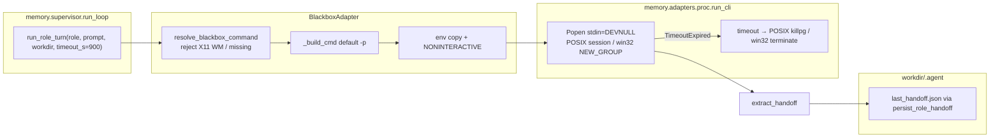
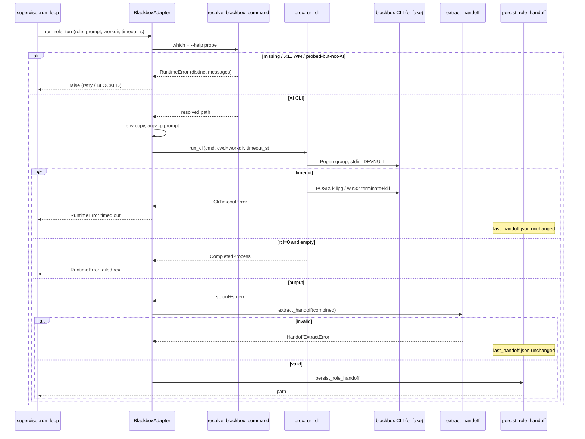
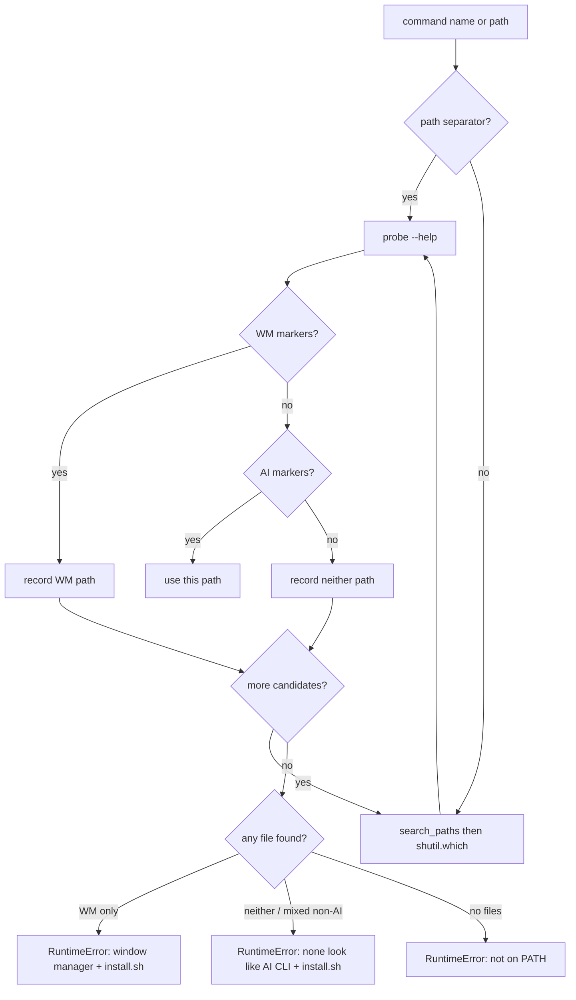
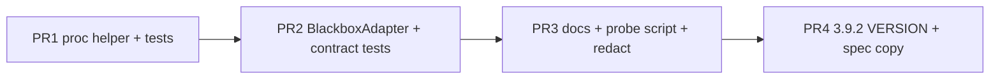

# Blackbox AI CLI Adapter — Copy Function, Hermetic Tests

**Title:** Blackbox AI CLI Adapter Hardening (Agentix v3.9.2)  
**Author:** design agent / unhex placeholder  
**Date:** 2026-08-25  
**Status:** Draft  
**Repo / home:** `agentic_loop_template` (Agentix harness), package `memory.adapters`  
**Baseline:** VERSION **3.9.1** (P8 Harness Hardening 3.9.0 complete; git-commit-to-jira-tasks 3.9.1). ROADMAP next = Future.  
**Target version:** **3.9.2** (patch: existing adapter hardening — not a product-facing 3.10.0)  
**House style:** match [2026-08-24-p8-harness-hardening-design.md](2026-08-24-p8-harness-hardening-design.md) structure/quality.  
**Canonical in-repo landing path (later docs PR):** `docs/superpowers/specs/2026-08-25-blackbox-cli-adapter-design.md`

This document is the execute-plan input for copying the **Blackbox AI CLI function** from sibling `agent-box` into this template and testing it hermetically. It does **not** vendor `agent-box/artifacts/` (tens of thousands of files). It does **not** reopen Control Plane, packaging, state DI, or git-commit-to-jira-tasks.

---

## Overview

Agentix already has a `BlackboxAdapter` (`memory/adapters/blackbox.py`) that is a thin `subprocess.run` wrapper: it requires `cfg.command`, invokes `[command, "-p", prompt]`, concatenates stdout+stderr, and persists via `extract_handoff` + `persist_role_handoff`. It has **one** unit test (`test_blackbox_not_configured_raises`). There is no PATH collision guard, no env copy, no process-group kill, no logging, and no fake-binary contract tests. Live dogfood (eegent, ANALYSIS_FROM_PROJECTS) produced `returncode: -1` / 255 from PATH/worktree fragility.

Sibling `agent-box` solved a **different** problem: offline USB packaging of a Node payload into `artifacts/blackbox-cli-stage/` plus a docker entrypoint that runs `blackbox "$PROMPT"` (positional, `|| true`). That packer's `scripts/fetch_blackbox_cli.sh` currently stages the **wrong npm package** (`blackbox-cli` 2.0.1 = Ellipse Technology IoT code generator, bin `bb` / `blackbox-cli`, not the Blackbox AI coding agent). The host's `/usr/bin/blackbox` is **Blackbox 0.77**, the X11 window manager (Sean 'Shaleh' Perry), not the AI CLI.

This spec copies the **function** of agent-box (PATH discovery, fail-hard on missing/placeholder payload, smoke/contract tests, invocation aligned with the Blackbox AI CLI, timeout/process-group hygiene, logging) and re-expresses it in Python inside `memory.adapters`, with hermetic fake-CLI tests that CI can run without a Blackbox account or network. The marketing page (2026) mentions **headless mode `-p`**; keep the template's `-p` default because it matches the current 49-line adapter and Grok/Claude shape — **not** because argv was executed against a real AI CLI on this host (there isn't one). `prompt_mode` is the escape hatch if dogfood shows `-p` is stdin-only or rejected. Do not switch to agent-box docker's positional prompt as the primary argv.

---

## Background & Motivation

### Current state (verified 2026-08-25)

#### Destination: `agentic_loop_template` (this repo, VERSION 3.9.1)

| Layer | What exists | Gap |
|-------|-------------|-----|
| Protocol | `RoleAdapter` in `memory/adapters/base.py`: `run_role_turn(role, prompt, handoff_in_path, workdir, timeout_s) -> Path` | Keep. |
| Blackbox adapter | `memory/adapters/blackbox.py` (49 lines). `self.command = self.cfg.get("command")` — **no default**. `shutil.which`. `[command, "-p", prompt]`. `subprocess.run(..., capture_output=True, text=True, timeout=timeout_s)` — **no `env=`**, **no `start_new_session`**, **no stdin=DEVNULL**. Raises only if `rc != 0` **and** combined output empty. Then `extract_handoff` + `persist_role_handoff`. | Missing: env copy, WM collision guard, process-group kill, logging, `AGENTIX_PROJECT_ROOT`, non-interactive env, default command. |
| Grok sibling | `memory/adapters/grok.py`: default `command="grok"`, `assert_ready`, `apply_proxy_env`, `AGENTIX_PROJECT_ROOT`, comment cites `grok --help: -p/--single`. Same `subprocess.run` timeout (no killpg). | Blackbox must **not** copy `assert_ready` (proxy-exempt). Helper for killpg is shared-optional. |
| Persist | `memory/adapters/persist.py` → `validate_handoff` + `memory/handoff_io.save_handoff` (tmp+replace). | Do not bypass. |
| Registry | `memory/adapters/__init__.py` `get_adapter("blackbox")` → `BlackboxAdapter(_adapter_section(...))`. | Keep. |
| Tests | `memory/test_adapters.py`: `test_blackbox_not_configured_raises` only. Grok has `@pytest.mark.skipif(not shutil.which("grok"))` smoke that **does not** invoke a role turn. No fake-binary, timeout, rc, or handoff tests for Blackbox. | Fill. |
| Proxy | `memory/proxy/policy.py` `PROXY_EXEMPT_ADAPTERS` includes `"blackbox"`. `adapter_requires_proxy("blackbox") is False` (asserted in `memory/test_proxy.py`). | Keep exempt. |
| Config | `.agent/project_config.example.json` `supervisor.adapters.blackbox.command: null`. Default adapter `mock`. Wizard/live default frontend **grok**. | Default command `"blackbox"` like grok; stay opt-in via `--adapter blackbox` / `-Frontend blackbox`. Do **not** change Init in 3.9.2; ps1 non-wizard `$initFe = "blackbox"` is proxy-health only (`PROXY_EXEMPT`) and stays. |
| Supervisor | `run_loop` `role_timeout_s` default **900**. Adapter subprocess `cwd=workdir`. No process chdir (P8). | Unchanged. |
| Docs | `docs/multi-frontend.md` treats Blackbox as VS Code + MiniMax paste-prompt, not a subprocess CLI. `docs/ANALYSIS_FROM_PROJECTS.md`: “PATH/blackbox/worktree fragility”; eegent `blackbox_wrapper` simulate/real. | Update CLI path. |

#### Source: `agent-box` (`/home/unhex/_PROJECT/agent-box/`)

What is worth **re-expressing** (function, not files):

| Artifact | Function | Copy into template? |
|----------|----------|---------------------|
| `scripts/fetch_blackbox_cli.sh` | Stages `~/.blackbox-cli-v2` or npm payload into `artifacts/blackbox-cli-stage/`; writes offline launcher `blackbox` that execs `node_modules/.bin/blackbox` or `node cli.js`; fail-hard unless `ALLOW_PLACEHOLDER=true`; writes `artifacts/blackbox-meta.json` (`name`, `version`, `sha256`, `requires: ["nodejs>=20"]`). | **No** as-is. npm fallback tried `blackbox-cli`, `@blackbox/cli`, `blackboxai-cli` and **installed the wrong package**. Optional thin **probe** script only (see §5). |
| `scripts/smoke_agents.sh` | Resolves `components/blackbox-cli/blackbox`, `components/blackbox/blackbox`, `blackbox-cli-stage/blackbox`. Rejects placeholders (`placeholder. Install`, tiny echo stubs). Smoke `--version`/`-h`. | **Yes** as Python: reject placeholders / WM / missing binary. |
| `scripts/install_offline.sh` | Copies stage to `$TARGET/usr/local/bin/blackbox` and `root/.blackbox-cli-v2`. | **No** (USB packer). |
| `scripts/validator.sh` | Copies wrapper into a testroot. | **No**. |
| `docker/entrypoint.sh` `blackbox\|Blackbox)` | `command -v blackbox` then `blackbox "$PROMPT"` (positional, **no `-p`**), tee to audit log, `\|\| true` (soft). Missing binary: exit 127. | Invocation **not** copied as default (keep template `-p`; Medium confidence). Fail-hard **is** copied (Agentix needs a handoff JSON; soft `\|\| true` would persist nothing). |
| `RELEASE.md` 1.0.2 | “blackbox fail-hard”. | Policy yes. |
| `artifacts/blackbox-cli-stage/` | Present on this host. Launcher is the WRAP heredoc. Nested `install/node_modules/blackbox-cli` is **ellipsistechnology/blackbox-cli 2.0.1** (IoT OpenAPI generator; bin `bb`). `blackbox-meta.json` reports version **5.6.2** (chalk's package.json — `find … package.json \| head -1` bug). | **Do not vendor.** Evidence the fetch script is unsafe to copy. |

#### Consumer: `eegent` (`/home/unhex/_PROJECT/eegent/skills/blackbox_wrapper.py`)

Verified invocation (lines 1079–1153):

```python
blackbox_exe = shutil.which("blackbox") or "blackbox"
cmd = [blackbox_exe, "run", str(instructions_file)]
if yolo:
    cmd.insert(1, "--yolo")
env.update({
    "BLACKBOX_NONINTERACTIVE": "1",
    "CI": "true",
    "TERM": "dumb",
    "NO_COLOR": "1",
    "PYTHONIOENCODING": "utf-8",
})
process = subprocess.Popen(..., stdin=subprocess.DEVNULL, cwd=cwd, env=env)
process.wait(timeout=180)  # then process.kill() — no process group
```

`--simulate` is eegent's own mock path. Agentix already has `MockAdapter`. **Do not** port simulate or worktree auto-commit. **Do** port: `shutil.which` before spawn, `stdin=DEVNULL`, non-interactive env, timeout+kill, log `exe_resolved=` (not the prompt). `blackbox run <file>` is a **supported official subcommand**; keep it as config `prompt_mode=run`, not the default.

#### Host probe (2026-08-25, this machine)

```
command -v blackbox  →  /usr/bin/blackbox
file                 →  ELF 64-bit LSB pie (not a Node launcher)
blackbox --help      →  "Blackbox 0.77" / Sean 'Shaleh' Perry / -display / -rc
command -v node      →  /usr/bin/node  v20.20.2
~/.blackbox, ~/.blackbox-cli-v2, ~/.local/bin/blackbox  →  absent
npm view @blackbox/cli  →  HTTP 404
npm view blackbox-cli   →  2.0.1 "Blackbox command line interface." bin bb, blackbox-cli
```

**Implication:** `shutil.which("blackbox")` on a typical Arch/Debian desktop **succeeds** and points at an X11 WM. Today's adapter would spawn it with `-p <huge prompt>` and either hang or return a useless WM error. This is the #1 production bug this spec exists to fix.

### Pain points

1. **Name collision.** `blackbox` is a 1990s window manager still packaged as `/usr/bin/blackbox`. Any PATH-only adapter is a footgun.
2. **Wrong npm identity.** agent-box `fetch_blackbox_cli.sh` treated `blackbox-cli` as the AI CLI. It is not. Copying that script would poison CI and USB packs.
3. **Hung children.** `subprocess.run(..., timeout=)` sends SIGKILL to the **direct** child. A Node CLI that forks `node` workers / MCP children survives. eegent dogfood `returncode: -1` matches this. Need `start_new_session` + `os.killpg`.
4. **No hermetic tests.** CI cannot prove argv, timeout, or handoff persist without a live account — and must not hit the network as a unit-test requirement.
5. **Flag folklore.** Three invocation styles exist in this org: template `-p`, agent-box positional, eegent `run <file>`. Official docs must pick the default; contract tests must cover the others cheaply.

### Why now

P8 (3.9.0) made every adapter persist through schema + atomic save. Blackbox still cannot be **run** safely. ROADMAP Future items (Hub SaaS, MCP, concurrent fan-out) stay Future. This is a patch on an existing adapter, not a new product.

---

## Goals & Non-Goals

### Goals

| ID | Goal |
|----|------|
| G1 | `BlackboxAdapter.run_role_turn` invokes the Blackbox AI CLI with `cwd=workdir`, env copy, stdin closed, timeout + process-group kill (Unix). Default argv is `-p` (current adapter + marketing page; **not** executed against a real AI CLI on this host). `prompt_mode` is the escape hatch. |
| G2 | Fail-hard when the CLI is missing, is a placeholder, is the X11 WM, or was probed and matches **neither** WM nor AI markers. Actionable error names the colliding path(s) and the official installer. Do not reuse grok’s `not on PATH` when `which` succeeded. |
| G3 | Hermetic contract tests in CI **without** a Blackbox account or network. Fake executable on PATH (tmp dir prepended). Optional `@pytest.mark.skipif` live smoke if a **real AI** CLI is on PATH — smoke must **not** invoke a role turn (same as grok). |
| G4 | Persist only through `extract_handoff` + `persist_role_handoff`. Invalid JSON does not clobber `last_handoff.json`. |
| G5 | Logging under `memory.adapters` (INFO: argv0, rc, elapsed, output bytes). **Never** log prompt bodies or `BLACKBOX_*` / token values. |
| G6 | Keep wizard/live default frontend **grok**. Blackbox remains opt-in (`--adapter blackbox` / `-Frontend blackbox` / `supervisor.adapter`). Do **not** change Init in 3.9.2; `Agent-Init.ps1` non-wizard `$initFe = "blackbox"` is proxy-health only (blackbox is `PROXY_EXEMPT`; non-wizard is best-effort) and stays. |
| G7 | Tiny shared subprocess helper so Blackbox does not copy-paste timeout/kill. **Unix:** process-group `killpg`. **Windows:** best-effort direct-child `terminate`/`kill` — not claimed to reap Node grandchildren. **Do not** drive-by rewrite `GrokAdapter`. |

### Non-goals

| ID | Non-goal | Rationale |
|----|----------|-----------|
| NG1 | Vendor `agent-box/artifacts/blackbox-cli-stage/` or any `node_modules` tree into the Python package | Tens of thousands of files; wrong package today; 12-factor PATH discovery. |
| NG2 | Fork agent-box or copy `install_offline.sh` / `pack.sh` / USB tarball | Different product (air-gap packer vs harness adapter). |
| NG3 | Make dashboard or supervisor the Blackbox runner | Adapter stays a subprocess called by `run_role_turn`. Dashboard 3.8.0 is not the runner. |
| NG4 | Change wizard default away from grok | Locked. |
| NG5 | Second mock / `--simulate` | `MockAdapter` already exists. |
| NG6 | Call `assert_ready` / pxpipe for Blackbox | `PROXY_EXEMPT_ADAPTERS`. Blackbox is not Grok. |
| NG7 | Default `--yolo` / auto-apply edits | Unsafe. Optional `extra_args` only. |
| NG8 | Reopen Control Plane, packaging, state DI, git-commit-to-jira-tasks | ROADMAP locked. |
| NG9 | VERSION 3.10.0 | Patch 3.9.2: adapter hardening, not a product milestone. |
| NG10 | `windows-latest` GHA runner | P8 closed this. The **helper itself** must still spawn on win32 without `AttributeError` (Issue 1). killpg + shebang-fake tests `skipif(win32)`. |
| NG11 | Live paid API in unit tests | Forbidden. |

### Artifact membership

| Artifact | This work | Notes |
|----------|-----------|-------|
| `memory/adapters/proc.py` | **Add** | Shared `run_cli` helper. POSIX killpg **and** an explicit win32 branch (no `os.killpg`). |
| `memory/test_proc.py` | **Add** | Helper tests. killpg/fork/shebang-PATH tests `skipif(win32)`. Direct-child timeout test is portable. |
| `memory/adapters/blackbox.py` | **Edit** | Resolve, probe, invoke, log via `memory.logutil.get_logger`. |
| `memory/test_blackbox_adapter.py` | **Add (PR2 only)** | Blackbox contract tests. PR3 must **not** edit this file. |
| `memory/test_adapters.py` | **Keep** | Leave `test_blackbox_not_configured_raises`. Do not rewrite grok tests. |
| `memory/adapters/grok.py` | **Do not edit** | Helper is ready; grok adoption is a follow-up. |
| `memory/proxy/policy.py` | **Do not edit** | Already exempt. |
| `memory/logutil.py` | **Edit (PR3)** | `_CHILD_LOGGERS += ("memory.adapters",)` so `configure_logging` attaches `RedactFilter` to adapter records (parent `memory` filters do not apply to children). |
| `memory/dashboard/redact.py` | **Edit (PR3)** | `BLACKBOX_[A-Z0-9_]+=` value pattern. Does **not** require `DASHBOARD_TOKEN`. |
| `memory/test_redact_blackbox.py` | **Add (PR3)** | `redact_tokens("BLACKBOX_API_KEY=sk-…")` masks without `DASHBOARD_TOKEN`. New file — no collision with PR2 tests or `test_observability.py`. |
| `.gitignore` | **Edit (PR2)** | Add `.agent/blackbox_prompt.txt`. Do **not** ignore all of `.agent/`. |
| `.agent/project_config.example.json` | **Edit (PR3)** | Default `command: "blackbox"`, add `prompt_mode`, `extra_args`. **Omit `search_paths`** (missing = defaults). Do not ship `[]`. |
| `scripts/probe_blackbox.sh` | **Add (PR3, optional)** | Unix helper. Windows operators: `blackbox --help` + PATH (document, do not add `.ps1`). |
| `docs/multi-frontend.md` | **Edit (PR3)** | Subprocess CLI path. |
| `VERSION` | **3.9.2 in final docs PR only** | Also `README.md` badge+footer, `docs/README.md`, `memory/README.md`, `ROADMAP.md` badge + Milestones. |

---

## Proposed Design

### 1. What is copied vs re-expressed

| agent-box / eegent behavior | Agentix Python |
|-----------------------------|----------------|
| `command -v blackbox` then fail 127 | `resolve_blackbox_command()` + `RuntimeError` |
| Placeholder detection (tiny echo stubs) | Probe `--help`/`--version`; reject WM markers and empty launchers |
| Fail-hard unless `ALLOW_PLACEHOLDER=true` | **Always fail-hard** in the adapter. No placeholder mode in production. Tests use a **fake AI CLI**, not a placeholder that claims to be missing. |
| Offline launcher WRAP (`exec node cli.js`) | Not copied. User installs official CLI onto PATH. |
| docker `blackbox "$PROMPT"` + `\|\| true` | Default `-p`; fail on empty rc; extract may still succeed on non-empty rc |
| eegent `blackbox run <file>` + non-interactive env + stdin=DEVNULL + 180s kill | `prompt_mode=run` optional; env + DEVNULL copied; timeout is supervisor `role_timeout_s` (900) via helper |
| eegent `--simulate` | Not copied (`MockAdapter`) |
| eegent `--yolo` | `extra_args` only |
| `blackbox-meta.json` | Not copied. Optional probe script prints version to stdout for operators. |

### 2. Official CLI surface (verified, not invented)

Sources: [docs.blackbox.ai commands-reference](https://docs.blackbox.ai/features/blackbox-cli/commands-reference), [docs.blackbox.ai getting-started](https://docs.blackbox.ai/features/blackbox-cli/getting-started), [blackbox.ai/cli](https://www.blackbox.ai/cli), [docs.blackbox.ai authentication](https://docs.blackbox.ai/api-reference/v1/authentication). Host probe and `npm view` on 2026-08-25.

| Item | Fact | Confidence |
|------|------|------------|
| Install (Unix) | `curl -fsSL https://blackbox.ai/install.sh \| bash` | High (official docs) |
| Install (Windows) | `iex (irm https://blackbox.ai/install.ps1)` | High |
| Marketing npm | `npm install -g @blackbox/cli` | **Package 404 on registry.npmjs.org as of 2026-08-25.** Do not tell implementers to npm-install this until it exists. Canonical install = curl installer. |
| Node | Product page: “any environment with Node 20+”. agent-box meta: `nodejs>=20`. Host has v20.20.2. | High |
| Interactive | `blackbox` or `blackbox session` (alias `s`) | High |
| Headless `-p` | Product page: “Headless mode (-p) runs agents inside scripts, CI pipelines, and automations without an interactive prompt.” **Not listed** on [commands-reference](https://docs.blackbox.ai/features/blackbox-cli/commands-reference); **no** example `blackbox -p "<prompt>"`. This host has **no** AI CLI binary, so argv was not executed. | **Medium** — marketing page only. **Keep as default** because it matches the current 49-line adapter and Grok/Claude shape. `prompt_mode` is the escape hatch; dogfood may flip the default to `run` **without a 3.10 bump** if `-p` is stdin-only or rejected. |
| File/stdin | `blackbox run` — “Execute commands from an instruction file or stdin.” “Commands” may mean shell/agent instructions, not a supervisor role prompt. eegent uses a file this way; that is **not** the same as documented official headless. | High that the subcommand exists; **Medium** that it is the right Agentix argv. Config `prompt_mode=run`. |
| Alias `p` | `blackbox project` aliases **`p`** (open last project dir). **Not** the same as flag `-p`. | High — never pass subcommand `p`. |
| Config | CLI getting-started: `blackbox configure` with an **interactive** API-key prompt. | High |
| Auth env | `BLACKBOX_API_KEY=sk-…` is documented on **Agent API** authentication, **not** on CLI getting-started. Exporting the key alone is **not** documented as sufficient for the CLI. | **Medium** for the CLI process; High for the HTTP API. Dogfood must include `blackbox configure` (or documented proof the CLI reads the env var). |
| Non-interactive env | `BLACKBOX_NONINTERACTIVE`, `CI`, `TERM=dumb`, `NO_COLOR` | **eegent folklore**, not in official CLI docs. Inherit/set anyway — **harmless if ignored.** |
| Config dirs | Product page: MCP `~/.blackbox/mcp.json`, skills `.blackbox/skills/`. agent-box also looked for `~/.blackbox-cli-v2` (Node **package root**, not a `blackbox` binary) and `~/.local/share/blackbox`. | Medium — search extra paths only if a launcher named `blackbox` exists; do not exec `node cli.js`. |
| Wrong npm | `blackbox-cli` 2.0.1 = [ellipsistechnology/blackbox-cli](https://github.com/ellipsistechnology/blackbox-cli) IoT generator (`bb`) | High (staged tree + npm view) |

Peer coding-agent CLIs (for adapter shape, not flags we invent for Blackbox):

| CLI | Non-interactive | Notes |
|-----|-----------------|-------|
| Grok | `grok -p/--single PROMPT` | Already in `GrokAdapter`; cwd via subprocess; pxpipe env. |
| Claude Code | `claude -p` / `claude --print [--output-format json] PROMPT` | [Claude Code programmatic](https://gist.github.com/JacobFV/2c4a75bc6a835d2c1f6c863cfcbdfa5a) |
| Gemini CLI | `gemini --prompt "…"` | [geminicli.com](https://lucaberton.com/blog/gemini-cli-complete-guide-commands-automation-2026/) |
| Codex | `codex exec [--json] "…"` | [learn.chatgpt.com non-interactive](https://learn.chatgpt.com/docs/non-interactive-mode) |
| Aider | `aider --message/--msg/-m` | [aider.chat/docs/scripting](https://aider.chat/docs/scripting.html) |
| agent-box docker | `blackbox "$PROMPT"` positional, `\|\| true` | Sandbox audit, not Agentix persist. |

**Default decision:** `[command, "-p", prompt]` plus optional `extra_args` inserted after `command` (`[command, *extra_args, "-p", prompt]`). Rationale: current template + Grok/Claude shape + marketing-page “Headless mode (-p)”. **Not** “verified official argv.” If dogfood against a real AI CLI shows `-p` is stdin-only or rejected, flip the code default to `prompt_mode=run` in a follow-up **without** a 3.10 bump (still 3.9.2 or 3.9.3 patch). Never emit subcommand `p`.

### 3. Shared subprocess helper

New module `memory/adapters/proc.py` (~80 lines). Blackbox is the only caller in this stack. Grok stays on `subprocess.run` until a later PR (file-split: this file is PR1-only).

```python
# memory/adapters/proc.py
"""Запуск CLI-адаптера: timeout + группа процессов, без логов тел промпта."""

from __future__ import annotations

import os
import signal
import subprocess
import sys
import time
from pathlib import Path
from typing import Dict, List, Mapping, Optional, Sequence, Union

# SIGTERM → wait this many seconds → SIGKILL. Bounded; role_timeout_s is the budget.
_KILL_GRACE_S = 2.0

Cmd = Sequence[str]


class CliTimeoutError(RuntimeError):
    """Подпроцесс (и группа) убиты по timeout_s."""


def run_cli(
    cmd: Cmd,
    *,
    cwd: Path,
    timeout_s: int,
    env: Optional[Mapping[str, str]] = None,
) -> subprocess.CompletedProcess:
    """Popen; stdin=DEVNULL; capture stdout/stderr as text.

    POSIX: start_new_session=True; on timeout os.killpg(SIGTERM) then SIGKILL.
    win32: CREATE_NEW_PROCESS_GROUP; on timeout proc.terminate() then proc.kill().
    Process-group kill is Unix-only. Windows is best-effort direct-child kill
    and is not claimed to reap Node grandchildren.
    """
```

**One-sentence contract:** process-group kill is Unix-only; Windows is best-effort direct-child kill and is **not** claimed to reap Node grandchildren. An implementer who only codes POSIX `start_new_session` / `os.killpg` will `AttributeError` on win32 **at spawn** (`start_new_session` is POSIX-only; `os.killpg` does not exist). There is no existing `start_new_session` / `killpg` usage in this tree to copy.

Implementation rules:

1. `timeout_s <= 0` → `ValueError` (supervisor never passes 0; tests may).
2. `env` default `os.environ.copy()` if caller passes `None`. Caller (Blackbox) always passes an explicit copy.
3. `stdin=subprocess.DEVNULL` — Node CLIs that prompt for API keys hang otherwise (eegent comment). Official CLI may still hang on `blackbox configure` if unconfigured; DEVNULL does not replace configure.
4. `stdout=PIPE, stderr=PIPE, text=True, encoding="utf-8", errors="replace"`.
5. **Branch on `sys.platform == "win32"` at Popen time** (not only at kill time):
   - **POSIX:** `start_new_session=True`. After `communicate(timeout=timeout_s)` raises `TimeoutExpired`: `os.killpg(os.getpgid(proc.pid), signal.SIGTERM)` inside `try/except (ProcessLookupError, PermissionError, OSError)` (child already exited → no crash). Poll `proc.poll()` up to `_KILL_GRACE_S`, then `os.killpg(..., SIGKILL)` in the same try/except. Fallback `proc.terminate()` / `proc.kill()` if `getpgid` fails. Reap with `communicate(timeout=5)`.
   - **win32:** `creationflags=subprocess.CREATE_NEW_PROCESS_GROUP`. **Never** call `os.killpg` or `os.getpgid`. On timeout: `proc.terminate()` then wait up to `_KILL_GRACE_S` then `proc.kill()`, each in `try/except ProcessLookupError`. This is best-effort **direct-child** kill only.
6. After the kill path, raise `CliTimeoutError(f"{cmd[0]} timed out after {timeout_s}s")` from the `TimeoutExpired`.
7. Do **not** put `prompt` or env values in the exception message — only `cmd[0]` and `timeout_s`.
8. Return `CompletedProcess` with streams left separate (`stdout`, `stderr`) so the adapter can concatenate as today.
9. Never `shell=True`.

Why not `subprocess.run(..., timeout=)`? CPython's `run` on timeout kills the Popen object (`proc.kill()`), **not** the process group. Node children survive on Unix. World practice: [kill process group on timeout](https://alexandra-zaharia.github.io/posts/kill-subprocess-and-its-children-on-timeout-python/). Google SWE book: hermetic tests isolate the SUT ([ch14 hermeticity](https://abseil.io/resources/swe-book/html/ch14.html), [ch23 hermetic testing](https://abseil.io/resources/swe-book/html/ch23.html)).

### 4. BlackboxAdapter

#### 4.1 Config keys (exact)

`.agent/project_config.json` → `supervisor.adapters.blackbox`:

| Key | Type | Default | Meaning |
|-----|------|---------|---------|
| `command` | `str \| null` | `"blackbox"` | Executable name or absolute path. JSON `null` = not configured (today's behavior, kept for opt-out). Missing key = default `"blackbox"`. |
| `prompt_mode` | `"p" \| "run" \| "positional"` | `"p"` | Headless flag / `run <file>` / positional argv. |
| `extra_args` | `list[str]` | `[]` | Inserted after `command`, before mode args. Example: `["--yolo"]`. Never defaulted. |
| `search_paths` | `list[str] \| null` | code defaults | Extra directories to search **before** `shutil.which`. **`null` / missing → defaults. `[]` → PATH only (disable extras). Non-empty list replaces defaults (does not append).** |

Code-default `search_paths` (expand `~` at runtime):

```text
~/.local/bin          # first — the WM-collision fix (AI CLI ahead of /usr/bin)
```

Optional extras, **only if an executable named `blackbox` exists there** (we do **not** exec `node cli.js` / walk `node_modules`):

```text
~/.blackbox/bin       # product page documents ~/.blackbox/mcp.json, not this bin dir
~/.blackbox-cli-v2    # agent-box treats this as a Node package root; no binary unless a launcher was copied in
```

**Windows:** `dir / "blackbox"` ignores PATHEXT. For each search-path directory, resolve with `shutil.which("blackbox", path=str(dir))` (honors `PATHEXT`: `.exe`, `.CMD`, `.bat`). Bare `Path(dir) / "blackbox"` is POSIX-only. If that is too fussy, Windows may rely on `shutil.which` on the process PATH plus an explicit `command` path in config — say so in the error string. Do not invent a `.ps1` fetch.

No other undocumented keys. Unknown keys ignored.

`get_adapter` already passes `_adapter_section(config, "blackbox")`. Constructor:

```python
class BlackboxAdapter:
    name = "blackbox"

    def __init__(self, cfg: dict | None = None) -> None:
        self.cfg = cfg or {}
        raw = self.cfg.get("command", "blackbox")  # missing → default
        self.command = raw  # may be None if JSON null
        self.prompt_mode = str(self.cfg.get("prompt_mode") or "p").strip().lower()
        extra = self.cfg.get("extra_args") or []
        self.extra_args = [str(x) for x in extra] if isinstance(extra, list) else []
        # search_paths: missing/None → defaults; [] → PATH only; list → replace
        self.search_paths = self.cfg.get("search_paths")  # None vs [] distinguished
```

If `self.command` is `None` or `""`: raise `RuntimeError("blackbox adapter not configured in project_config.supervisor.adapters.blackbox")` — **same message** as today so `test_blackbox_not_configured_raises` stays green.

#### 4.2 Binary resolution and WM rejection

```python
_WM_MARKERS = (
    "sean 'shaleh' perry",
    "bradley t hughes",
    "blackbox 0.77",
    "-display",
)
_AI_MARKERS = (
    "blackbox cli",
    "headless",
    "configure",
    "session",
    "blackbox run",
)

def _probe_help(path: str, timeout_s: float = 3.0) -> str:
    r = subprocess.run(
        [path, "--help"],
        capture_output=True, text=True, timeout=timeout_s,
        stdin=subprocess.DEVNULL,
        env={**os.environ, "TERM": "dumb", "NO_COLOR": "1", "CI": "true"},
    )
    return ((r.stdout or "") + "\n" + (r.stderr or "")).lower()

def looks_like_window_manager(help_text: str) -> bool:
    t = help_text.lower()
    return any(m in t for m in _WM_MARKERS)

def looks_like_ai_cli(help_text: str) -> bool:
    t = help_text.lower()
    if looks_like_window_manager(t):
        return False
    return any(m in t for m in _AI_MARKERS)
```

Resolution order for `command == "blackbox"` (bare name):

1. Each `search_paths` dir (see null vs `[]` above). POSIX: `dir / "blackbox"` if executable file. win32: `shutil.which("blackbox", path=str(dir))`.
2. `shutil.which("blackbox")` on the process PATH.
3. For each candidate: probe `--help`. Classify: WM / AI / neither. Skip WM. Skip neither (record the path). Accept first `looks_like_ai_cli`. If probe times out / OSError, treat as **neither** (record path), do not silently equal “missing.”
4. If any candidate was a WM and none were AI: raise the **WM** error (exact string below).
5. If any candidate was probed and **all** were rejected (neither and/or WM, but `which`/search found files): raise the **neither** error. **Do not** reuse grok’s `not on PATH` when a file existed. This is the IoT WRAP / ellipsistechnology `bb` case.
6. If nothing was found at all: raise `RuntimeError(f"{command} not on PATH")` — same shape as grok.

If `command` contains a path separator (`/` or `os.sep` or `os.altsep`): treat as explicit path; still reject if WM or neither; do not search.

Exact WM error (implementers must match; test asserts substring `window manager` and `install.sh`):

```
Found {path} but it is the X11 window manager (Blackbox 0.77), not Blackbox AI CLI. Install: curl -fsSL https://blackbox.ai/install.sh | bash  and put the AI CLI on PATH ahead of /usr/bin (e.g. ~/.local/bin).
```

Exact neither-WM-nor-AI error (test asserts substring `none look like` and `install.sh`; may list comma-separated paths, truncated to 4):

```
Found {paths} but none look like Blackbox AI CLI (not the X11 WM). Install: curl -fsSL https://blackbox.ai/install.sh | bash
```

Do **not** attempt `npm install -g blackbox-cli` or `@blackbox/cli` in the error string. Optional `--version` fallback probe is **not** required (OQ6 stays “help first”) now that the neither-path is explicit.

#### 4.3 Env for the child

```python
env = os.environ.copy()
env["AGENTIX_PROJECT_ROOT"] = str(Path(workdir).resolve())
env.setdefault("BLACKBOX_NONINTERACTIVE", "1")
env.setdefault("CI", "true")
env.setdefault("TERM", "dumb")
env.setdefault("NO_COLOR", "1")
env.setdefault("PYTHONIOENCODING", "utf-8")
# Inherit BLACKBOX_API_KEY if the operator exported it — do not log it.
# Do not claim export-alone is sufficient: CLI getting-started wants
# `blackbox configure` (interactive). BLACKBOX_NONINTERACTIVE is eegent
# folklore; harmless if the official CLI ignores it.
# Do not call assert_ready / apply_proxy_env.
```

#### 4.4 Argv builder

```python
def _build_cmd(self, resolved: str, prompt: str, workdir: Path) -> list[str]:
    mode = self.prompt_mode
    extra = list(self.extra_args)
    if mode in ("p", "-p", "headless"):
        return [resolved, *extra, "-p", prompt]
    if mode == "positional":
        return [resolved, *extra, prompt]
    if mode == "run":
        prompt_file = Path(workdir) / ".agent" / "blackbox_prompt.txt"
        prompt_file.parent.mkdir(parents=True, exist_ok=True)
        prompt_file.write_text(prompt, encoding="utf-8")
        try:
            prompt_file.chmod(0o600)
        except OSError:
            pass  # umask; gitignore is the leak control
        return [resolved, *extra, "run", str(prompt_file)]
    raise RuntimeError(f"unknown blackbox prompt_mode={mode!r}")
```

`blackbox_prompt.txt` is a scratch file (overwritten each turn). Do not log its contents.

**`.gitignore` (PR2 — the PR that introduces the write).** Template `.gitignore` today ignores *specific* `.agent/` paths (`history/`, `metrics.jsonl`, `LOOP_STATE.json`, …) — **not** the whole `.agent/` directory and **not** `blackbox_prompt.txt`. `last_handoff.json` remains tracked (pre-existing; out of scope). Add exactly:

```
.agent/blackbox_prompt.txt
```

Do **not** claim `.agent/` is gitignored. A tracked prompt file is a bigger leak than mode bits.

**ARG_MAX:** supervisor injects file bodies sliced to `_PROMPT_BODY_CAP = 8000` **characters** (`memory/supervisor.py:41,282`) and compresses the assembled prompt at `_PROMPT_TOKEN_CAP = 8000` **tokens** (`:44,258–260`). Do not call BODY_CAP a token cap. 8k chars on argv is fine on Linux. Default stays `-p`. If a future prompt exceeds OS `ARG_MAX`, operator sets `prompt_mode=run`. No auto-fallback in 3.9.2.

#### 4.5 `run_role_turn` body

```python
def run_role_turn(self, role, prompt, handoff_in_path, workdir, timeout_s) -> Path:
    log = get_logger("memory.adapters")  # memory.logutil — RedactFilter on the child logger
    if not self.command:
        raise RuntimeError(
            "blackbox adapter not configured in project_config.supervisor.adapters.blackbox"
        )
    resolved = resolve_blackbox_command(str(self.command), self.cfg)
    cmd = self._build_cmd(resolved, prompt, Path(workdir))
    # Log argv0 + mode + extra_args length — never prompt, never cmd[after -p]
    log.info(
        "blackbox spawn exe=%s mode=%s extra=%s timeout_s=%s",
        resolved, self.prompt_mode, len(self.extra_args), timeout_s,
    )
    t0 = time.monotonic()
    try:
        r = run_cli(cmd, cwd=Path(workdir), timeout_s=timeout_s, env=env)
    except CliTimeoutError:
        log.warning("blackbox timed out after %ss exe=%s", timeout_s, resolved)
        raise RuntimeError(f"blackbox timed out after {timeout_s}s") from None
    elapsed_ms = int((time.monotonic() - t0) * 1000)
    combined = (r.stdout or "") + "\n" + (r.stderr or "")
    log.info(
        "blackbox rc=%s bytes=%s elapsed_ms=%s exe=%s",
        r.returncode, len(combined), elapsed_ms, resolved,
    )
    if r.returncode != 0 and not combined.strip():
        raise RuntimeError(f"blackbox failed rc={r.returncode}")
    data = extract_handoff(combined)
    return persist_role_handoff(workdir, data)
```

Note: the empty-rc error **must not** include `stderr[:500]` if we cannot guarantee it lacks keys — today grok includes stderr. For Blackbox, omit stderr from the exception when empty anyway; when non-empty we go to extract. If extract fails, `HandoffExtractError` already avoids dumping secrets (errors are schema paths). Do **not** interpolate `combined` into logs.

`get_logger("memory.adapters")` attaches `RedactFilter` on the child logger (`memory/logutil.py` comment: parent `memory` filters do **not** apply to child records). Belt-and-suspenders with PR3 adding `"memory.adapters"` to `_CHILD_LOGGERS` so `configure_logging()` covers `logging.getLogger("memory.adapters")` as well.

### 5. Optional probe script (not a packer)

`scripts/probe_blackbox.sh` (PR3). ~40 lines. Does **not** fetch npm. Does **not** write artifacts.

```bash
#!/bin/bash
# probe_blackbox.sh — print resolved Blackbox AI CLI or fail-hard.
# Does not install packages. Does not vendor node_modules.
set -euo pipefail
# For each candidate in ~/.local/bin/blackbox, PATH which, ...
# Reject WM help text.
# Print: path, first help line, node version if node is required.
# Exit 0 only if looks_like_ai_cli.
# Hint: curl -fsSL https://blackbox.ai/install.sh | bash
```

Document in `docs/multi-frontend.md`: operators install the official CLI themselves; Agentix discovers it. **Do not** add `scripts/fetch_blackbox_cli.sh`. If a later packer is needed, it belongs in agent-box after they fix the npm package name — not here.

**Probe is a Unix helper.** Windows operators: put the AI CLI on PATH, run `blackbox --help` in PowerShell, confirm it is not the X11 WM / not `bb`. Do **not** add `scripts/probe_blackbox.ps1` in 3.9.2 (scope). Init scripts are not the probe.

### 6. Hermetic testing (world practice applied)

Pattern (pytest + fake binary on PATH):

1. Helper tests (`test_proc.py`) invoke `run_cli([sys.executable, str(script.py)], ...)` — no shebang, works on win32 except the fork/killpg case.
2. Adapter PATH tests (`test_blackbox_adapter.py`): `tmp_path / "bin" / "blackbox"` is an executable **Python** script with shebang `#!/usr/bin/env python3` + `chmod 0o755`. **`@pytest.mark.skipif(sys.platform == "win32")`** on shebang-PATH tests (CI is ubuntu-latest).
3. `monkeypatch.setenv("PATH", str(bin_dir) + os.pathsep + os.environ["PATH"])`.
4. Fake reads `FAKE_MODE` env (`ok` / `empty_fail` / `hang` / `wm` / `neither` / `handoff` / `invalid_json`) and writes argv as JSON to `FAKE_ARGV_PATH`. Hang/fork fake also writes `{"parent": pid, "child": grandchild_or_null}` to `FAKE_PID_PATH`.
5. Adapter uses `command="blackbox"` so `shutil.which` finds the fake first. WM test: fake prints Shaleh help. Neither test: fake `--help` is `bb command [type] [options]` (IoT) with no AI markers.
6. Timeout (helper): POSIX fake `os.fork()` grandchild `sleep 30`, parent `sleep 30`, `timeout_s=1`. **`skipif(win32)`**. After `CliTimeoutError`, `os.kill(pid, 0)` → `OSError` / `ProcessLookupError` for **both** pids from `FAKE_PID_PATH`. Do **not** `os.waitpid` on a pid the helper already reaped. Wall clock **< 10 s** (`_KILL_GRACE_S=2` + `communicate(timeout=5)` can exceed 5 s on a loaded runner).
7. Timeout (portable): `test_run_cli_timeout_kills_direct_child` — no fork; `sys.executable` + sleeper script; after timeout the **direct** pid from `FAKE_PID_PATH` is dead. Runs on win32 too (best-effort child kill).

This is the hermetic SUT: the adapter + helper + fake binary, no network ([SWE book hermetic tests](https://abseil.io/resources/swe-book/html/ch23.html)). pytest `tmp_path` is the isolation dir ([pytest tmp_path](https://docs.pytest.org/en/stable/how-to/tmp_path.html)). 12-factor / [clig.dev](https://clig.dev/): stdout is the machine-readable result, stderr is messaging, non-zero exit is failure — the fake CLI honors this; the adapter concatenates both because model JSON often leaks on stderr.

**Do not** `monkeypatch.setattr(subprocess, "run", fake)` as the **primary** contract. That cannot prove PATH discovery or killpg. Monkeypatch is acceptable only for `test_blackbox_does_not_call_assert_ready` (spy).

Live skipif (optional, in `test_blackbox_adapter.py`):

```python
def _live_ai_cli():
    p = shutil.which("blackbox")
    if not p:
        return False
    try:
        text = _probe_help(p)
    except Exception:
        return False
    return looks_like_ai_cli(text)

@pytest.mark.skipif(not _live_ai_cli(), reason="Blackbox AI CLI not installed")
def test_blackbox_live_binary_on_path_no_role_turn():
    ad = get_adapter("blackbox", {"supervisor": {"adapters": {"blackbox": {"command": "blackbox"}}}})
    assert ad.name == "blackbox"
    # Do not invoke run_role_turn — would hit the network / consume quota.
```

On this host the skipif is **skip** (`/usr/bin/blackbox` is WM). CI ubuntu-latest has no AI CLI → skip. That is success.

### 7. Exact test names and assertions

#### `memory/test_proc.py` (PR1)

| Test | Asserts |
|------|---------|
| `test_run_cli_ok_returns_completed_process` | Fake `sys.exit(0)` + stdout `hello`; `r.returncode == 0`, `r.stdout` contains `hello`. |
| `test_run_cli_nonzero_keeps_stdout` | Fake rc=2 + stdout `nope`; completed process returned, **no** exception from helper. |
| `test_run_cli_uses_cwd` | Fake prints `os.getcwd()`; equals `tmp_path`. |
| `test_run_cli_env_override` | Fake prints `os.environ["MARKER"]`; caller-passed env wins. |
| `test_run_cli_timeout_kills_process_group` | **`skipif(sys.platform == "win32")`.** Fake: `os.fork` grandchild `sleep 30`, parent `sleep 30`; write `{parent, child}` to `FAKE_PID_PATH`. `timeout_s=1`. Raises `CliTimeoutError`. After, `os.kill(pid, 0)` → `OSError`/`ProcessLookupError` for **both** pids. Wall clock **< 10 s**. Do not `os.waitpid` on a reaped pid. |
| `test_run_cli_timeout_kills_direct_child` | Portable (no fork). Sleeper via `sys.executable`; `FAKE_PID_PATH` parent only. `timeout_s=1` → `CliTimeoutError`; direct pid dead. Proves the win32 terminate/kill path. |
| `test_run_cli_stdin_closed` | Fake reads stdin; gets empty (DEVNULL), exits 0 — does not hang. Helper timeout 2 s. |
| `test_run_cli_rejects_nonpositive_timeout` | `timeout_s=0` → `ValueError`. |
| `test_run_cli_win32_does_not_call_killpg` | If easy: monkeypatch `sys.platform` is **not** required. Document as code review: `os.killpg` is behind `if sys.platform != "win32"`. |

#### `memory/test_blackbox_adapter.py` (PR2)

Use a fixture `_install_fake_cli(tmp_path, monkeypatch, mode, help_text=None, stdout=None, rc=0, sleep_s=0)` that writes the Python fake, `chmod 0o755`, prepends PATH, sets `FAKE_ARGV_PATH`.

Valid handoff JSON: reuse the same `_valid_in_progress()` shape as `test_adapters.py`.

| Test | Asserts |
|------|---------|
| `test_blackbox_default_command_is_blackbox` | `BlackboxAdapter({}).command == "blackbox"`; `BlackboxAdapter({"command": None}).command is None`. |
| `test_blackbox_explicit_null_command_raises_not_configured` | `run_role_turn` raises `RuntimeError` matching `not configured`. No spawn (argv file absent). |
| `test_blackbox_missing_binary_raises` | PATH without fake; `command="blackbox-not-a-real-bin"`; `RuntimeError` matching `not on PATH`. |
| `test_blackbox_rejects_x11_window_manager_on_path` | Fake `--help` prints Shaleh / `-display`; `run_role_turn` raises matching `window manager` and `install.sh`. No handoff file. Message is **not** `not on PATH`. |
| `test_blackbox_rejects_neither_wm_nor_ai` | Fake `--help` is IoT `bb command [type]` (no AI markers, no Shaleh). Raises matching `none look like` and `install.sh`. Not `not on PATH`. |
| `test_blackbox_empty_search_paths_skips_defaults` | `search_paths=[]`; only PATH is searched (WM on PATH, AI only in `~/.local/bin` not on PATH) → WM or missing, **not** the homedir AI binary. |
| `test_blackbox_prefers_search_path_ai_cli_over_usr_wm` | `search_paths=[tmp_ai]` with AI help text; PATH which() would hit WM fake first; resolved argv0 is the search_paths binary. |
| `test_blackbox_invokes_dash_p_by_default` | Fake AI + stdout valid handoff. Argv JSON == `["-p", prompt]` (after extra). Handoff file exists under `workdir/.agent/last_handoff.json`. |
| `test_blackbox_extra_args_inserted_before_flag` | `extra_args=["--yolo"]` → argv starts with `--yolo`, `-p`. |
| `test_blackbox_prompt_mode_run_writes_file_and_argv` | `prompt_mode=run`. Argv contains `run` and a path ending `blackbox_prompt.txt`. File contents == prompt. Persist succeeds. |
| `test_blackbox_prompt_mode_positional_argv` | argv == `[prompt]` (no `-p`, no `run`). |
| `test_blackbox_unknown_prompt_mode_raises` | `prompt_mode=nope` → `RuntimeError` matching `prompt_mode`. |
| `test_blackbox_nonzero_empty_output_raises` | Fake rc=1, empty stdout/stderr → `RuntimeError` matching `failed rc=1`. No handoff write. |
| `test_blackbox_nonzero_with_handoff_json_persists` | Fake rc=1, stdout = prose + valid JSON. Persist path exists; `status==IN_PROGRESS`. |
| `test_blackbox_timeout_raises_and_does_not_write_handoff` | Fake hangs; `timeout_s=1`. `RuntimeError` matching `timed out`. `last_handoff.json` absent. |
| `test_blackbox_invalid_json_does_not_clobber_last_handoff` | Pre-write `{"keep": true}`; fake stdout `{not json`; `HandoffExtractError`; file still `{"keep": true}`. |
| `test_blackbox_valid_handoff_in_prose_persists` | `Here you go:\n{valid}\nthanks` → extract role Orchestrator. |
| `test_blackbox_does_not_call_assert_ready` | Monkeypatch `memory.proxy.policy.assert_ready` to raise; turn still succeeds with fake. (Blackbox must not import/call it.) |
| `test_blackbox_sets_noninteractive_env` | Fake dumps selected env keys to a JSON file. Assert `BLACKBOX_NONINTERACTIVE==1`, `CI==true`, `TERM==dumb`, `NO_COLOR==1`, `AGENTIX_PROJECT_ROOT==str(workdir.resolve())`. |
| `test_blackbox_does_not_log_prompt_or_api_key` | **PR2 — adapter must not emit secrets.** `caplog` at INFO on `memory.adapters`. Prompt canary `CANARY_PROMPT_XYZ`. Env `BLACKBOX_API_KEY=sk-secret-canary-key`. Assert neither canary in `caplog.text`. This is **not** the redact-filter test (that is PR3 `memory/test_redact_blackbox.py`). |
| `test_blackbox_live_binary_on_path_no_role_turn` | skipif; `get_adapter`; `ad.name == "blackbox"`; no `run_role_turn`. |

Keep `memory/test_adapters.py::test_blackbox_not_configured_raises` unchanged (command `None` via `get_adapter`).

### Architecture diagrams

#### Process map



#### One role turn (sequence)



#### PATH resolution



#### PR DAG



Level-0: **PR1** alone (new files only). Level-1: **PR2** (blackbox.py + new test file). Level-2: **PR3** docs. Level-3: **PR4** version. **PR1 ∥ nothing** — no parallel sibling; PR3 docs could theoretically start after PR2 API is stable. Do **not** share files across PR1/PR2 (learn from P8).

---

## API / Interface Changes

### Adapter protocol

Unchanged:

```python
run_role_turn(role: str, prompt: str, handoff_in_path: Optional[Path], workdir: Path, timeout_s: int) -> Path
```

### Before / after — Blackbox spawn

```python
# before (3.9.1 memory/adapters/blackbox.py)
self.command = self.cfg.get("command")          # None unless configured
cmd = [str(self.command), "-p", prompt]
r = subprocess.run(cmd, cwd=str(workdir), capture_output=True, text=True, timeout=timeout_s)

# after
self.command = self.cfg.get("command", "blackbox")
resolved = resolve_blackbox_command(...)          # rejects WM
cmd = [resolved, *extra_args, "-p", prompt]       # or run/positional
r = run_cli(cmd, cwd=Path(workdir), timeout_s=timeout_s, env=env)
```

### CLI flags (supervisor)

No new supervisor flags. `--adapter blackbox` already works.

```bash
python -m memory.supervisor run --adapter blackbox --max-cycles 1 --no-pr
# Requires Blackbox AI CLI on PATH *ahead of* /usr/bin (WM collision),
# then `blackbox configure`. BLACKBOX_API_KEY is inherited if present;
# not documented as sufficient for the CLI (Agent API docs, not getting-started).
# CI continues to use --adapter mock
```

### Config example (after)

```json
"adapters": {
  "grok": { "command": "grok" },
  "cursor": { "command": null },
  "blackbox": {
    "command": "blackbox",
    "prompt_mode": "p",
    "extra_args": []
  }
}
```

**Omit `search_paths`** (missing = code defaults: `~/.local/bin` first). Do **not** ship `"search_paths": []` in the example — that means PATH-only and disables the WM-collision fix. `"search_paths": null` is equivalent to omitting. Use `[]` only in a labeled “PATH-only / disable extras” snippet (the `test_blackbox_empty_search_paths_skips_defaults` case). JSON `null` **command** remains the not-configured stub.

---

## Data Model Changes

**No LOOP_STATE schema bump. No handoff schema change.**

| File | Change |
|------|--------|
| `.agent/project_config.example.json` | `blackbox.command` default `"blackbox"`; add `prompt_mode`, `extra_args`. **Omit `search_paths`** (missing = defaults). Document in prose: `null`/missing = defaults vs `[]` = PATH only — do not put `[]` in the shipped example. |
| `.agent/blackbox_prompt.txt` | Scratch file when `prompt_mode=run`. Overwritten each turn. Not SSOT. **PR2 adds it to `.gitignore`.** `last_handoff.json` stays tracked (pre-existing). |
| `.gitignore` | Add `.agent/blackbox_prompt.txt` only. Do not ignore all of `.agent/`. |
| `.agent/last_handoff.json` | Same writer (`persist_role_handoff`). Still tracked. |
| `.agent/metrics.jsonl` | Existing `handoff_invalid` rows on bad extract. |
| `VERSION` | `3.9.2` in PR4 only. |

**Migration:** none. Existing configs with `"command": null` keep failing closed with `not configured`. Existing configs with `"command": "blackbox"` gain WM rejection (behavior change — **desired**; previously they would spawn `/usr/bin/blackbox` WM). Operators who installed the AI CLI into `~/.local/bin` are picked up via `search_paths` even when `/usr/bin/blackbox` is the WM.

---

## Alternatives Considered

### A. Invocation argv

| Option | Verdict | Why |
|--------|---------|-----|
| **`-p PROMPT` (marketing-page headless; Medium)** | **Chosen** | Product page 2026: “Headless mode (-p)”. **Not** in commands-reference; not executed against a real AI CLI. Matches current template and Grok/Claude. `prompt_mode` is the escape hatch; dogfood may flip to `run` without 3.10. |
| agent-box docker positional `blackbox "$PROMPT"` | Config `prompt_mode=positional` only | Undocumented as headless. Collides with subcommands (`session`, `run`, `configure`). Alias `p` is `project`, which makes a bare `p` even more dangerous. |
| eegent `blackbox run <file>` | Config `prompt_mode=run` | Official subcommand; avoids ARG_MAX; extra file I/O. Good for huge prompts; not the default (supervisor prompts are already capped). |
| Detect from `--help` at runtime | Rejected as default | Extra spawn every turn; help text varies by version; tests would need to fake help **and** argv. Probe is used only for WM/AI classification. |
| `claude --print` style long flag | Rejected | Official docs name `-p`, not `--print`. Do not invent `--print` for Blackbox. |

### B. Payload / install

| Option | Verdict | Why |
|--------|---------|-----|
| **PATH discovery + official curl installer (document only)** | **Chosen** | 12-factor config in env + operator-installed binary. No vendoring. |
| Copy `fetch_blackbox_cli.sh` into template | Rejected | Fetches **wrong** npm `blackbox-cli` (IoT). `@blackbox/cli` 404. Would vendor Node trees. |
| `npm install -g @blackbox/cli` from Init | Rejected | Registry 404 as of 2026-08-25; Init must not hit npm for a missing package. |
| Optional `scripts/probe_blackbox.sh` | **Chosen (PR3)** | Operator smoke; fail-hard; no install. |
| ALLOW_PLACEHOLDER in the adapter | Rejected | agent-box needs it for USB profiles that omit Blackbox. Agentix production adapter must not pretend the CLI exists. Tests use a **working fake**, not a placeholder. |

### C. Process timeout

| Option | Verdict | Why |
|--------|---------|-----|
| **Shared `run_cli` helper, Blackbox-only caller** | **Chosen** | Both Grok and Blackbox would copy-paste; extract helper; do not rewrite Grok in this stack. |
| `subprocess.run(..., timeout=)` as today | Rejected | Does not kill Node grandchildren; eegent `returncode: -1`. |
| Rewrite Grok onto the helper in the same PR | Rejected | Drive-by; file collision with any grok work; P8 lesson: no shared files across parallel PRs. Follow-up allowed. |
| eegent `process.kill()` only | Rejected | Kills parent, not group. |

### D. Testing

| Option | Verdict | Why |
|--------|---------|-----|
| **Fake executable on PATH + argv sidecar** | **Chosen** | Hermetic, proves which/argv/timeout. Google hermetic SUT. |
| Monkeypatch `subprocess.run` only | Rejected as primary | Does not prove PATH or killpg. Used only for assert_ready spy. |
| Live Blackbox account in CI | Rejected | Quota, secrets, flakiness. skipif smoke does not call `run_role_turn`. |
| Port eegent `--simulate` | Rejected | `MockAdapter` is the in-process mock. |

### E. Proxy

| Option | Verdict | Why |
|--------|---------|-----|
| **Stay proxy-exempt; inherit `os.environ` (incl. `HTTPS_PROXY` if operator set it)** | **Chosen** | Blackbox Node CLI is not Grok; pxpipe is Grok chat-proxy. |
| `assert_ready` like Grok | Rejected | Would fail-close Windows Blackbox agents without pxpipe; already tested `adapter_requires_proxy("blackbox") is False`. |
| Optional `apply_proxy_env` | Rejected | Sets `GROK_CLI_CHAT_PROXY_BASE_URL` — meaningless for Blackbox. |

---

## Security & Privacy Considerations

| Topic | Handling |
|-------|----------|
| Threat model | Untrusted model stdout already validated by `validate_handoff`. New threat: spawning `/usr/bin/blackbox` WM is a **wrong-binary** issue, not a privilege escalation; we reject it. New threat: prompt on argv visible in `ps` — same as Grok `-p`; `prompt_mode=run` is the operator opt-out. |
| Auth | Inherit `BLACKBOX_API_KEY` if present. Never log it. Never write it to handoff or metrics. **Do not tell operators that export-alone is sufficient** — CLI getting-started is `blackbox configure`. Agent API docs are a different surface. |
| Logging | INFO: exe path, mode, extra count, rc, bytes, elapsed. DEBUG may log candidate **paths**, not help text dumps of secrets. No prompt bodies. Adapter uses `memory.logutil.get_logger("memory.adapters")`. |
| Redaction | Two layers: (1) PR2 adapter must not emit secrets (`test_blackbox_does_not_log_prompt_or_api_key`). (2) PR3: regex `\bBLACKBOX_[A-Z0-9_]+=(\S+)` in `redact.py` **and** `_CHILD_LOGGERS += ("memory.adapters",)` in `logutil.py`. Parent logger `memory` filters **do not** apply to child records (P8 comment). Test in **new** `memory/test_redact_blackbox.py`: `redact_tokens("BLACKBOX_API_KEY=sk-secret-canary-key")` masks the value **without** setting `DASHBOARD_TOKEN`. P8’s grok-shaped test only works because it logs on `memory.supervisor` and copies the secret into `DASHBOARD_TOKEN` — there is **no** `GROK_*=` regex today. |
| Prompt file | `prompt_mode=run` writes `.agent/blackbox_prompt.txt`. **PR2 `.gitignore` entry is the leak control.** `chmod 0o600` best-effort. Not a secret store; same sensitivity as argv. Template does **not** gitignore all of `.agent/`. |
| Install surface | No `curl \| bash` from Init or adapter. Docs mention the official installer; operators run it themselves. |
| Placeholder | Production adapter never creates a stub that looks like success. |
| Process group | SIGKILL after grace — required so a hung Node cannot leak API calls after supervisor has moved on. |

---

## Observability

| Signal | Where | Use |
|--------|-------|-----|
| `INFO memory.adapters: blackbox spawn exe=… mode=p extra=0 timeout_s=900` | stderr | Operator sees which binary was chosen (WM vs `~/.local/bin`). |
| `INFO memory.adapters: blackbox rc=0 bytes=1234 elapsed_ms=45000 exe=…` | stderr | Latency; empty-byte + rc≠0 is the hard fail. |
| `WARNING memory.adapters: blackbox timed out after 900s exe=…` | stderr | Hung CLI; helper already killed the group. |
| `WARNING memory.adapters: extract_handoff rejected N candidates` | stderr | Existing P8. |
| `metrics.jsonl` `handoff_invalid` | `workdir/.agent/metrics.jsonl` | Existing persist. |
| pytest `memory/test_blackbox_adapter.py` | GHA `pytest memory/` | PR gate; no network. |

No new dashboard screens. No new ports. Latency target: helper overhead < 50 ms vs today's `subprocess.run`; role turn budget remains `role_timeout_s` (900 s default). Fake tests: timeout case **< 10 s** wall (`_KILL_GRACE_S=2` + `communicate(timeout=5)`); others milliseconds.

Load: one subprocess per role turn (same as grok). Probe `--help` is one extra 3 s-capped spawn **per resolve**, not per line of output. Cache resolve on the adapter instance for the process lifetime (`self._resolved`) so retries in `max_role_retries` (default 2) do not re-probe. Clear the cache only if `command` changes (it does not mid-run).

---

## Rollout Plan

No feature flag. Each PR mergeable. 3.9.1 clones keep working: `command: null` still “not configured”; `command: "blackbox"` gains WM rejection (the live behavior change).

| Stage | What | Rollback |
|-------|------|----------|
| 1 | PR1 helper. Dead code until PR2. | Delete `proc.py` + tests. |
| 2 | PR2 adapter. CI fake tests gate argv/timeout. | Revert `blackbox.py`; helper can stay. |
| 3 | PR3 docs + probe + redact. | Docs-only revert. |
| 4 | PR4 VERSION 3.9.2. | Version last. |

**Commit messages:** natural Russian, first person, no model mentions (DEVELOPMENT_STANDARDS §1). This spec stays English.

**Dogfood (human, not CI):** install official CLI via curl installer into `~/.local/bin`; run **`blackbox configure`** (CLI getting-started — interactive API-key prompt). Then `python -m memory.supervisor run --adapter blackbox --max-cycles 1 --no-pr --workdir /tmp/bb-dogfood`. Confirm logs show `exe=…/.local/bin/blackbox` not `/usr/bin/blackbox`. **Do not** tell operators that `export BLACKBOX_API_KEY` alone is sufficient; that env var is documented on the Agent API, not the CLI. If `-p` is rejected or waits on stdin, flip default `prompt_mode` to `run` in a patch (not 3.10). Do **not** run live dogfood as part of execute-plan unit work.

**CI:** existing `.github/workflows/agentix-loop.yml` `pytest -q memory/` collects new tests automatically. **Do not** add a live Blackbox service container.

---

## Risks

| Risk | Sev | Mitigation |
|------|-----|------------|
| PATH fragility: `/usr/bin/blackbox` is X11 WM | **High** | Probe + `~/.local/bin` first; exact WM error; test `test_blackbox_rejects_x11_window_manager_on_path`. |
| Probed binary is neither WM nor AI (IoT WRAP) | **High** | Distinct `none look like` error; test `test_blackbox_rejects_neither_wm_nor_ai`. Never `not on PATH` when `which` succeeded. |
| Hung Node grandchildren after timeout | **High (Unix)** | `start_new_session` + `killpg`; grandchild test. **Windows: not claimed** — direct-child terminate/kill only. |
| Flag mismatch (`-p` vs positional vs `run`) | Med | Default `-p` from **current adapter + marketing page** (not commands-reference; not executed). `prompt_mode` + three argv tests. Dogfood may flip default to `run` without 3.10. |
| Wrong npm payload if someone copies agent-box fetch | **High** | Do not copy fetch script. Document IoT package as forbidden. Probe script never calls npm. |
| Placeholder success in CI | Med | No ALLOW_PLACEHOLDER in adapter. Fakes implement `--help` AI markers + emit JSON. |
| Prompt on argv visible in `ps` / ARG_MAX | Low/Med | Same as Grok; `prompt_mode=run` opt-out; prompts already budgeted. |
| Secrets in logs | Med | Adapter must not emit (PR2). PR3: regex **plus** `_CHILD_LOGGERS` / `get_logger`. Filter on parent `memory` alone is a no-op for `memory.adapters`. |
| Prompt file tracked in git | Med | PR2 `.gitignore` `.agent/blackbox_prompt.txt`. Do not ignore all of `.agent/`. |
| `@blackbox/cli` 404 / installer script changes | Med | Docs point at `https://blackbox.ai/install.sh`; Open Question if npm name appears later. Adapter does not install. |
| `blackbox p` (project alias) vs `-p` confusion | Med | Never emit subcommand `p`; tests assert argv[0] is `-p` not `p`. |
| Helper unused by Grok diverges later | Low | Follow-up PR; helper is 80 lines, documented. |
| Windows `os.killpg` / `start_new_session` AttributeError at spawn | **High if unimplemented** | Explicit win32 Popen/kill branch in §3 (Issue 1). Helper must import and spawn on win32. Grandchildren not reaped — documented. |
| Live skipif accidentally calls the WM | Low | skipif uses `looks_like_ai_cli`, not bare `which`. |

---

## Open Questions

1. **Auto-fallback to `prompt_mode=run` when `len(prompt) > 100_000`?**  
   **Closed here (Recommended: no in 3.9.2).** Supervisor already caps prompt size. Revisit if ARG_MAX failures show up in dogfood.

2. **Default `extra_args=["--yolo"]`?**  
   **Closed here (no).** Unsafe auto-apply. eegent needed it for unattended desktop dogfood; Agentix persist contract is JSON handoff, not “edit the repo at all costs”. Operators can set `extra_args`.

3. **Adopt `run_cli` in `GrokAdapter` now?**  
   **Closed here (no).** File-split + no drive-by. Track as a follow-up after 3.9.2. Helper is designed for it (`env=` already used by grok).

4. **Is `@blackbox/cli` coming back on npm?**  
   **Open (external).** As of 2026-08-25, 404. Canonical install remains the curl installer. Do not block the adapter on npm.

5. **Should `command: null` in the example config stay as the shipped default?**  
   **Closed here (Recommended: change example to `"blackbox"`).** Matches grok. `null` remains valid for explicit opt-out. Wizard default frontend is still grok, so Init will not spawn Blackbox unless asked.

6. **Probe `--version` as well as `--help`?**  
   **Closed here (help first).** WM answers both; AI CLI may not implement `--version`. One 3 s spawn is enough **now that the neither-WM-nor-AI error is distinct** (Issue 5). No `--version` fallback required in 3.9.2.

7. **Does the official CLI read `BLACKBOX_API_KEY` without `blackbox configure`?**  
   **Open (external / dogfood).** Agent API docs say the env var; CLI getting-started says interactive configure. Adapter inherits the env var and does not invent a second auth path. Operators must `blackbox configure` until dogfood proves otherwise.

---

## Key Decisions

1. **Copy the function, not the USB packer or `node_modules`.** Destination is `memory.adapters` in this template. agent-box artifacts are out of bounds (wrong npm payload today).

2. **Default invocation is `-p` because that is the current 49-line adapter and matches Grok/Claude plus the marketing-page “Headless mode (-p)” — Medium confidence, not verified official argv.** commands-reference does **not** list `-p`; no AI CLI binary on this host. `prompt_mode` covers `run` / `positional`. Dogfood may flip the default to `run` without a 3.10 bump. Never pass subcommand `p` (`blackbox project`).

3. **Default `command` is `"blackbox"` (parity with grok); JSON `null` stays “not configured”.** Wizard/live frontend default remains grok. Blackbox is opt-in at the supervisor `--adapter` / config `supervisor.adapter` layer. Do not change Init; ps1 non-wizard `$initFe = "blackbox"` is proxy-health only.

4. **Fail-hard on missing CLI, placeholder, X11 window manager, and probed-but-not-AI binaries.** Distinct messages: WM vs `none look like` vs `not on PATH`. Never reuse grok’s `not on PATH` when `which` succeeded (IoT WRAP). No `ALLOW_PLACEHOLDER` in the adapter.

5. **Canonical install is `curl -fsSL https://blackbox.ai/install.sh | bash`, Node 20+.** Do not npm-install `blackbox-cli` (IoT) or `@blackbox/cli` (404 as of 2026-08-25). Optional `scripts/probe_blackbox.sh` is a **Unix** helper; Windows: `blackbox --help` + PATH. CLI auth: `blackbox configure`; `BLACKBOX_API_KEY` export-alone is **not** documented as sufficient.

6. **Shared `memory/adapters/proc.py`: POSIX process-group kill; win32 best-effort direct-child terminate/kill.** Explicit `sys.platform == "win32"` Popen flags (`CREATE_NEW_PROCESS_GROUP`, never `os.killpg` / `start_new_session`). Blackbox is the only caller in this stack. Grok is not rewritten here. stdin=DEVNULL. env copy. `CliTimeoutError`. Catch `ProcessLookupError` on both branches.

7. **Blackbox stays proxy-exempt.** Inherit `os.environ`. Set `AGENTIX_PROJECT_ROOT` + non-interactive env (`BLACKBOX_NONINTERACTIVE`, `CI`, `TERM=dumb`, `NO_COLOR`) — **eegent folklore; harmless if ignored.** Do not call `assert_ready`. Do not change Init; ps1 non-wizard `$initFe = "blackbox"` stays (proxy-health only).

8. **No second mock.** `MockAdapter` remains the in-process CI path. Live skipif must not call `run_role_turn`.

9. **Hermetic fake CLI on PATH is the CI contract.** Prove argv, timeout/killpg (POSIX), direct-child timeout (portable), rc empty vs non-empty, handoff persist, WM rejection, neither-WM-nor-AI, no secret logs. Shebang-PATH and fork tests `skipif(win32)`. Google hermetic SUT + pytest `tmp_path`.

10. **Persist through `extract_handoff` + `persist_role_handoff` only.** Do not bypass atomic save. Invalid JSON does not clobber `last_handoff.json`.

11. **VERSION 3.9.2 (patch) in the final docs PR, not 3.10.0.** This is adapter hardening of an existing frontend, not a product milestone. No VERSION bump in implementation PRs.

12. **File-split PRs with no shared files at the same level** (P8 lesson). Spec English; implementation comments/commits Russian (STANDARDS §1). No auto-merge to `main`.

13. **Do not log prompt bodies or `BLACKBOX_*` values.** Adapter uses `get_logger("memory.adapters")`. PR3 adds `"memory.adapters"` to `_CHILD_LOGGERS` **and** a `BLACKBOX_*=` regex; test lives in new `memory/test_redact_blackbox.py`. Filter on parent `memory` alone does not cover children. PR2 `.gitignore` `.agent/blackbox_prompt.txt`.

14. **Control Plane, packaging, state DI, git-commit-to-jira-tasks stay locked.** Dashboard is not the Blackbox runner.

---

## References

### Local (read in full for this spec)

- Template adapter: `/home/unhex/_PROJECT/agentic_loop_template/memory/adapters/blackbox.py`
- Grok sibling: `memory/adapters/grok.py` (`run_role_turn`, `apply_proxy_env`, `assert_ready`)
- Protocol: `memory/adapters/base.py`
- Persist: `memory/adapters/persist.py`, `memory/handoff_io.py`, `memory/validate_handoff.py`
- Tests: `memory/test_adapters.py`, `memory/test_proxy.py` (`adapter_requires_proxy("blackbox") is False`)
- Proxy policy: `memory/proxy/policy.py` `PROXY_EXEMPT_ADAPTERS`
- Config example: `.agent/project_config.example.json`
- P8 spec (house style): `docs/superpowers/specs/2026-08-24-p8-harness-hardening-design.md`
- 3.5 adapter contract: `docs/superpowers/specs/2026-07-29-agentix-supervisor-3.5-design.md`
- Dogfood notes: `docs/ANALYSIS_FROM_PROJECTS.md` (PATH/blackbox/worktree; eegent wrapper)
- Multi-frontend: `docs/multi-frontend.md`
- Standards: `DEVELOPMENT_STANDARDS.md` §1
- ROADMAP: `ROADMAP.md` (P8 complete; next Future)
- agent-box: `scripts/fetch_blackbox_cli.sh`, `scripts/smoke_agents.sh`, `scripts/install_offline.sh`, `scripts/validator.sh`, `docker/entrypoint.sh` (blackbox branch), `RELEASE.md` 1.0.2 fail-hard, `artifacts/blackbox-meta.json`, `artifacts/blackbox-cli-stage/blackbox`, staged `install/node_modules/blackbox-cli/package.json` (ellipsistechnology 2.0.1)
- eegent: `/home/unhex/_PROJECT/eegent/skills/blackbox_wrapper.py` (`run` + `--yolo` + non-interactive env + 180s kill)

### World (opened)

- BLACKBOX CLI commands: https://docs.blackbox.ai/features/blackbox-cli/commands-reference (`run`, `session`, `configure`; alias `p` = project)
- Getting started / install: https://docs.blackbox.ai/features/blackbox-cli/getting-started (`curl -fsSL https://blackbox.ai/install.sh | bash`)
- Introduction: https://docs.blackbox.ai/features/blackbox-cli/introduction
- Product page headless `-p`: https://www.blackbox.ai/cli (**marketing**; not in commands-reference; argv not executed here)
- Agent API env `BLACKBOX_API_KEY`: https://docs.blackbox.ai/api-reference/v1/authentication (**not** CLI getting-started; CLI wants `blackbox configure`)
- Wrong npm `blackbox-cli` 2.0.1: https://www.npmjs.com/package/blackbox-cli (Ellipse Technology; bin `bb`) — **do not install**
- `@blackbox/cli`: registry 404 as of 2026-08-25 (this host `npm view`)
- Claude Code `--print`: https://gist.github.com/JacobFV/2c4a75bc6a835d2c1f6c863cfcbdfa5a
- Codex `exec --json`: https://learn.chatgpt.com/docs/non-interactive-mode
- Aider `--message`: https://aider.chat/docs/scripting.html
- Gemini `--prompt`: https://lucaberton.com/blog/gemini-cli-complete-guide-commands-automation-2026/
- Process-group timeout: https://alexandra-zaharia.github.io/posts/kill-subprocess-and-its-children-on-timeout-python/
- pytest `tmp_path`: https://docs.pytest.org/en/stable/how-to/tmp_path.html
- Google SWE book hermetic tests: https://abseil.io/resources/swe-book/html/ch23.html and https://abseil.io/resources/swe-book/html/ch14.html
- 12-factor config: https://12factor.net/config
- CLI guidelines (stdout/stderr/exit): https://clig.dev/

### Host probe (2026-08-25)

- `/usr/bin/blackbox` = Blackbox WM 0.77 (ELF), not AI CLI
- `node` v20.20.2
- No `~/.blackbox`, `~/.blackbox-cli-v2`, `~/.local/bin/blackbox`

---

## PR Plan

Incremental, each PR independently reviewable and mergeable. Execute-plan DAG: **PR1 → PR2 → PR3 → PR4**. No same-level shared files.

### PR 1: Subprocess helper — timeout and process-group kill

- **Title:** Adapter subprocess helper: process-group timeout kill
- **Files/components affected:** `memory/adapters/proc.py` (**new**), `memory/test_proc.py` (**new**)
- **Dependencies:** none
- **Description:** Add `run_cli(cmd, *, cwd, timeout_s, env=None) -> CompletedProcess`. **POSIX:** `start_new_session` + `os.killpg` SIGTERM/`_KILL_GRACE_S=2`/SIGKILL, catch `ProcessLookupError`. **win32:** `CREATE_NEW_PROCESS_GROUP`; **never** `os.killpg` / `os.getpgid` / `start_new_session`; `proc.terminate()` then `proc.kill()`. stdin=DEVNULL, utf-8 replace, `CliTimeoutError`. Process-group kill is Unix-only; Windows is best-effort direct-child kill and is not claimed to reap Node grandchildren. No call sites yet (Blackbox lands in PR2). Tests: ok, nonzero stdout kept, cwd, env, `test_run_cli_timeout_kills_process_group` (`skipif(win32)`, `FAKE_PID_PATH`, wall **< 10 s**), `test_run_cli_timeout_kills_direct_child` (portable), stdin closed, `timeout_s=0` ValueError. Helper tests invoke `[sys.executable, script.py]` (no shebang). Do not edit `grok.py` or `blackbox.py`. Do not bump VERSION.

### PR 2: BlackboxAdapter — resolve, invoke, hermetic contracts

- **Title:** Blackbox adapter: PATH/WM guard, headless -p, hermetic fake-CLI tests
- **Files/components affected:** `memory/adapters/blackbox.py` (rewrite in place, keep class name / protocol), `memory/test_blackbox_adapter.py` (**new**, all §7 adapter tests — **PR3 must not edit this file**), `.gitignore` (add `.agent/blackbox_prompt.txt` only). Do **not** edit `memory/test_adapters.py` (keep `test_blackbox_not_configured_raises`). Do **not** edit `grok.py`, `policy.py`, `proc.py`, `logutil.py`, `Agent-Init.ps1`.
- **Dependencies:** PR 1 (`from memory.adapters.proc import run_cli, CliTimeoutError`)
- **Description:** Default `command="blackbox"`; JSON `null` still “not configured”. `resolve_blackbox_command` probes `--help`; rejects X11 WM with the WM string; rejects neither-WM-nor-AI with `none look like`; `not on PATH` only when no file was found. `search_paths`: `null`/missing = defaults (`~/.local/bin` first; optional `~/.blackbox/bin` / `~/.blackbox-cli-v2` **only if a launcher named `blackbox` exists** — we do not exec `node cli.js`); `[]` = PATH only. win32 search uses `shutil.which(..., path=dir)` (PATHEXT). `prompt_mode` `p` (default, Medium confidence) / `run` / `positional`; `extra_args`. Env copy + `AGENTIX_PROJECT_ROOT` + non-interactive keys (eegent folklore). No `assert_ready`. `from memory.logutil import get_logger` (do not edit logutil). Cache resolved path. `prompt_mode=run` writes `.agent/blackbox_prompt.txt` (gitignore + best-effort 0o600). Tests: Python fake on PATH (`skipif(win32)` for shebang); WM, neither, empty `search_paths`, `-p` argv (not subcommand `p`), run/positional, empty rc, persist, timeout, no clobber, no assert_ready, env, caplog canaries. Optional skipif live smoke does **not** call `run_role_turn`. Comments in Russian.

### PR 3: Docs, probe script, BLACKBOX_* redaction, example config

- **Title:** Blackbox CLI docs, probe script, secret redaction
- **Files/components affected:** `docs/multi-frontend.md` (subprocess CLI + installer + WM collision; **Unix probe** vs Windows `blackbox --help` + PATH), `docs/ANALYSIS_FROM_PROJECTS.md` (one paragraph: adapter now fail-hard + hermetic tests; do not claim eegent wrapper was ported), `.agent/project_config.example.json` (`command: "blackbox"`, `prompt_mode`, `extra_args`; **omit `search_paths`** — missing = defaults, `[]` = PATH-only and must **not** appear in the shipped example; document the distinction in `docs/multi-frontend.md` prose), `scripts/probe_blackbox.sh` (**new**, Unix-only, fail-hard, never npm), `memory/dashboard/redact.py` (`BLACKBOX_[A-Z0-9_]+=` value mask, **no** `DASHBOARD_TOKEN` required), `memory/logutil.py` (`_CHILD_LOGGERS += ("memory.adapters",)`), `memory/test_redact_blackbox.py` (**new** — `redact_tokens("BLACKBOX_API_KEY=sk-secret-canary-key")` masks). Do **not** edit `memory/test_blackbox_adapter.py` or `memory/test_observability.py`. `docs/onboarding-wizard.md` / `docs/cross-platform.md` only if they still imply Blackbox is Windows-paste-only (one sentence: CLI adapter is opt-in `--adapter blackbox`). Do **not** edit `Agent-Init.ps1`.
- **Dependencies:** PR 2 (adapter API must match documented keys)
- **Description:** Operators install via official curl installer then **`blackbox configure`**. Agentix discovers. Document forbidden npm `blackbox-cli` (IoT). Probe script is a Unix helper. Wire redaction to adapter logs via `_CHILD_LOGGERS` (parent `memory` filters do not apply to children). Keep PR2 canary test as “adapter must not emit secrets,” separate from “filter masks if they appear.” Do not bump VERSION. Do not change wizard default.

### PR 4: v3.9.2 docs, VERSION, spec copy

- **Title:** 3.9.2 Blackbox CLI adapter hardening — VERSION, CHANGELOG, spec
- **Files/components affected:** `VERSION`; `CHANGELOG.md`; `ROADMAP.md` (badge + Milestones row **v3.9.2**; Future list unchanged); `README.md` (**badge and footer** “Agentix 3.9.1” → 3.9.2); `docs/README.md` (badge + “Aligned with **Agentix 3.9.1**”); `memory/README.md` (badge); copy of this spec to `docs/superpowers/specs/2026-08-25-blackbox-cli-adapter-design.md`
- **Dependencies:** PR 1–3
- **Description:** Claim 3.9.2 only when G1–G7 are in. Name every live 3.9.1 string so badges do not mix. Argue patch not 3.10.0: no wizard default change, no new product surface, existing adapter hardened. No auto-merge to `main`.

**Topo:** PR1 → PR2 → PR3 → PR4.

---

## Canonical in-repo landing path

After PR4, the spec lives at:

`docs/superpowers/specs/2026-08-25-blackbox-cli-adapter-design.md`

This execute-plan input file is `/tmp/grok-unhex/grok-design-doc-2108a0e8.md`.

---

## Revision Summary

Initial creation — no prior `review_file`. Spec is the execute-plan input for Blackbox CLI adapter hardening → v3.9.2.

Verified 2026-08-25 against:

- Template 3.9.1: `BlackboxAdapter` is a 49-line `-p` wrapper; one unit test; no env/killpg/logging; persist already atomic (P8).
- agent-box: docker positional + fail-hard fetch; staged payload is **ellipsistechnology/blackbox-cli 2.0.1** (wrong product); meta version 5.6.2 is a nested `package.json` bug.
- eegent `blackbox_wrapper.py`: `blackbox run <file>` + `--yolo` + non-interactive env + 180s `kill` (no process group).
- Host: `/usr/bin/blackbox` is X11 WM 0.77; official AI CLI not installed; `npm view @blackbox/cli` 404.
- Official docs: marketing-page **`-p`** (not in commands-reference; not executed here); `blackbox run` file/stdin; install via `https://blackbox.ai/install.sh`; CLI configure is interactive; `BLACKBOX_API_KEY` is Agent API docs.

**2026-08-25 review pass:** Closed implementation blockers: win32 `run_cli` branch (no `killpg` at spawn); `.gitignore` `.agent/blackbox_prompt.txt` in PR2 (`.agent/` is not fully ignored); PR3 redaction wired via `_CHILD_LOGGERS` + `get_logger` + new `test_redact_blackbox.py`; `-p` / `BLACKBOX_API_KEY` downgraded to Medium / configure-required; neither-WM-nor-AI distinct error; `search_paths` null vs `[]` and no `node cli.js`; timeout test `FAKE_PID_PATH` + `< 10 s` + `skipif(win32)`; PR4 names every 3.9.1 badge (`README.md` footer, `docs/README.md`, `memory/README.md`); PR3 does not touch `test_blackbox_adapter.py`; `_PROMPT_BODY_CAP` vs `_PROMPT_TOKEN_CAP`; ps1 non-wizard `$initFe` parked.

**2026-08-25 re-review:** Shipped example **omits** `search_paths` (missing = defaults). Caption no longer says `[]` means defaults. Supervisor snippet requires `blackbox configure`, not export-alone. Observability timeout SLO is **< 10 s** everywhere.
