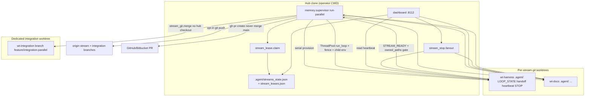
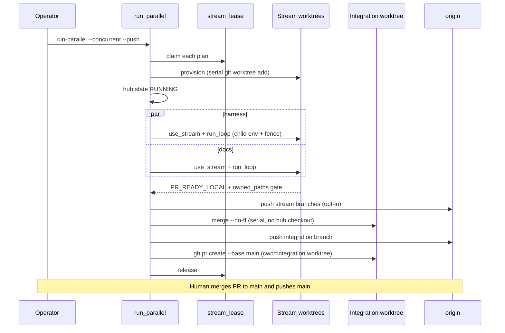
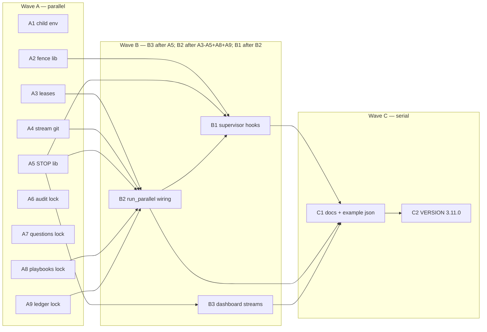

# Conflict-Free Parallel Sessions — Remaining Implementation DAG (Agentix v3.11.0)

**Title:** Conflict-free parallel sessions: live identity, leases, hub-safe git, dashboard streams, remaining `.agent/` isolation  
**Author:** design agent / unhex placeholder  
**Date:** 2026-08-26  
**Status:** Draft  
**Repo / home:** `agentic_loop_template` (Agentix harness), package `memory`  
**Baseline:** VERSION **3.10.1**, `main` `86d699b` (“Обновил версию до 3.10.1: настраиваемые лимиты контекста супервизора”). `main...origin/main` clean.  
**Target version:** **3.11.0** (new product surface: stream leases, `--push`, STOP fan-out, Control Plane Streams view, live CLI identity under `--concurrent`. Not a 3.10.2 patch.)  
**House style:** match [2026-08-26-p8-11-concurrent-fanout-design.md](docs/superpowers/specs/2026-08-26-p8-11-concurrent-fanout-design.md) structure.  
**Canonical landing path:** this document (operator `/design` fire). Implementer specs/plans may be copied under `docs/superpowers/specs/` in the docs PR, not in this fire.

This document is **not** a redo of 3.10.0 (P8-11 concurrent fan-out) or 3.10.1 (P8-14 supervisor caps). Those increments shipped and stay closed. It is the remaining DAG that makes **operator parallel agent sessions** and **supervisor `--concurrent`** actually conflict-free: locking leftovers, worktree isolation, `owned_paths` enforcement, merge/push protocol, dashboard/supervisor interaction, shared `.agent/` races, and tests.

Operator constraints (apply to every implementer session of this DAG):

- Orchestrate in parallel agent sessions without file conflicts (`owned_paths` disjoint per PR).
- Merge to `main` and push at the end of each PR (human gate; supervisor still never merges `main`).
- All agent instructions / prompts in English.
- Russian only for commits, comments, and human docs (`DEVELOPMENT_STANDARDS.md` §1).
- Never reveal AI/agent authorship.

---

## Overview

Agentix 3.10.1 already fans disjoint `owned_paths` into git worktrees and can overlap stream `run_loop` calls in one process (`ThreadPoolExecutor` + `contextvars`). That closed the 3.8.1 serial wall-clock gap. It did **not** close the gaps that still produce conflicts when two live agent sessions (or two live CLI children under `--concurrent`) actually edit the tree:

1. Live Grok/Blackbox/Cursor children never see `AGENTIX_STREAM` / `AGENTIX_OWNED_PATHS` / `AGENTIX_WORKTREE` on the concurrent path (P8-11 NG1 leftover). `persist_role_handoff` (`memory/adapters/persist.py:15-32`) does not fill `stream` / `owned_paths` / `worktree` from ContextVar. `build_role_prompt` does not mention the fence.
2. `owned_paths` is a **post-hoc** `git diff` gate. Nothing prevents the Coder from editing `DEVELOPMENT_STANDARDS.md` during the turn.
3. `merge_stream_branch` does `git checkout` of the integration branch **inside the hub clone**, mutating hub `HEAD`.
4. There is no push of stream or integration branches. `maybe_create_pr` never merges `main` (keep), but also never `git push`.
5. Control Plane (`:8112`) is hub-workdir-only: it does not read `.agent/streams_state.json`, does not watch it, does not show per-stream heartbeats, and `POST /actions/stop` writes only hub `.agent/STOP`.
6. `audit_log` / `playbooks` / `questions_collector` / `performance_ledger` still write without `agent_lock`. `playbooks.py` and `performance_ledger.py` still use module-level `Path(".agent/...")` (cwd), which under concurrent streams is the **hub** cwd (P8-05 removed `chdir`).
7. There is no lease registry for **operator** parallel sessions (two Grok worktrees claimed by humans/agents, not `run-parallel`).
8. Example config documents `serial: true` (unread) and omits `concurrent: false`. `require_owned_paths` is unread (gate always runs).

The upgrade is 3.11.0: small new modules with one purpose each, wired through existing `run_parallel` / dashboard / adapters, with a PR DAG whose `owned_paths` are disjoint so Wave A (nine PRs) can run as parallel agent sessions; Wave B is B2+B3 in parallel (after A2–A5 **and** A8+A9 for B2), then B1 after B2.

---

## Background & Motivation

### What already shipped (do not re-plan)

| Version | Commit / CI | What landed | Files |
|---------|-------------|-------------|-------|
| **3.8.1** | serial `run-parallel` | `StreamPlan`, `validate_stream_plans` overlap hard-fail, `provision_stream_worktrees`, serial `run_loop` per stream, integration merge, one PR, never `main` | `memory/streams.py`, `memory/supervisor_parallel.py` |
| **3.10.0** (P8-11) | operator-recorded CI `32998076467` (not re-verified from this clone) | Opt-in `--concurrent` / `supervisor.parallel.concurrent`; `memory/stream_context.py`; `memory/agent_lock.py` (`O_EXCL` + stale PID); mock contextvars-first; hub `streams_state.json` tmp+replace + `agent_lock(name="streams")`; `save_state` / `save_handoff` take the lock; wait-all + skip merge on any `BLOCKED`; provision + git merge stay serial | `memory/agent_lock.py`, `memory/stream_context.py`, `memory/supervisor_parallel.py`, `memory/state.py`, `memory/handoff_io.py`, `memory/adapters/mock.py` |
| **3.10.1** (P8-14) | `86d699b`; operator-recorded CI `33002603917` (not re-verified from this clone) | Configurable supervisor caps from `context_budget` / env | `memory/prompt_caps.py`, `memory/supervisor.py` |

Verified on disk 2026-08-26 (`VERSION` = `3.10.1`, HEAD `86d699b`):

- `run_parallel(..., concurrent: bool = False)` in `memory/supervisor_parallel.py`. Concurrent path calls `_run_one_stream(..., patch_environ=False)` inside `ThreadPoolExecutor`. Serial still patches `os.environ`.
- `use_stream(name=, owned_paths: str, worktree=)` — CSV string, not `Sequence[str]`.
- `_write_hub_streams_state` holds `_HUB_STATE_LOCK` **and** `agent_lock(name="streams")`. Concurrent path writes hub state **once after join** (not mid-flight).
- `merge_stream_branch` runs `git checkout -B integration main` then `git merge --no-ff` in `hub_workdir`. Comment: “Never merges to main.” True; it **does** move hub `HEAD`.
- `maybe_create_pr` (`memory/supervisor.py:329`): `gh pr create --base main`; comment “Never: gh pr merge”. No `git push`.
- `check_owned_paths_gate` runs **after** `run_loop` returns `PR_READY*`.
- `.agent/project_config.example.json` `supervisor.parallel`: `base`, `integration_branch`, `wt_base`, `require_owned_paths: true`, `serial: true`. **No `concurrent` key.** `run_parallel` already reads `par.get("concurrent")`.
- `PARALLEL_PROTOCOL.md` documents `--concurrent`. `docs/architecture.md` Core Components has **no** row for stream context / `.agent/` lock / streams.
- Dashboard `WATCHED_FILES` (`memory/dashboard/watcher.py:14-26`) omits `streams_state.json`. `DashboardStore` has no `streams_state()` helper. `write_stop` writes hub `.agent/STOP` only.

### Leftover worktrees (decision: **out**)

`git worktree list` on this clone (refreshed 2026-08-27, C1 docs PR):

| Worktree | Branch | vs 3.10.1 |
|----------|--------|-----------|
| hub `/home/unhex/_PROJECT/agentic_loop_template` | `main` @ `86d699b` | SSOT |
| `subagent-01a03730-190c-7660-b1cd-c43910760359` | `execute-plan/e7c34824-pr-1-messenger-…` @ `c7e8b8a` | Forked from `103976c` (pre-3.9.3). PR1 `VERSION` = **3.9.2**. Touches example json, `dashboard/redact.py`, `logutil.py`, `conftest.py` |
| `subagent-01a0377a-764d-7be3-b14d-abdb67f059de` | `execute-plan/e7c34824-pr-2-messenger-…` @ `141ec0d` | same family |
| `subagent-01a0377a-764d-7be3-b14d-abe07ed75ed9` | `execute-plan/e7c34824-pr-4-telegram-…` @ `c7ac511` | same family |
| `subagent-01a0377a-764e-7392-b058-9c7f5f20aa65` | `execute-plan/e7c34824-pr-5-max-…` @ `ae21836` | same family |
| `…/1` | `feature/pxpipe-agy-docs` @ `80a1528` | Unrelated docs leftover |
| `subagent-01a03f39-…` / `p8-11-agent-lock` / `feature/p8-11-concurrent-run-parallel` | already-merged P8-11 (`08d0b2d` / `da92625` / `f998ff5`) | Stale; operator prune |
| `subagent-01a03f67-…` / `p8-14-configurable-context-budgets` | already-merged P8-14 (`64a1562` / `3d5fc78`) | Stale; operator prune |
| `v394-token-estimate` | `feature/v3.9.4-token-estimate-20260825` @ `cdd6afa` | Shipped as 3.9.4; prune |
| two `subagent-01a03f1a-…` | detached `e24f4a7` / `d729b1a` | Not this DAG; operator prune |

In-flight **this DAG** (`execute-plan/c9685a39-pr-*`, not leftovers — do not prune until the PR lands on `main`):

| Worktree | Branch |
|----------|--------|
| `subagent-01a03fae-b45e-…` | `…-pr-1-inject-stream-contextvar-into-live-cli-child-env` @ `9e513fe` |
| `subagent-01a03fae-b45f-…` | `…-pr-2-add-english-stream-fence-helper` @ `7d9ac6f` |
| `subagent-01a03fae-b463-…` | `…-pr-3-exclusive-owned-paths-leases-for-operator-parallel` @ `bc19ce0` |
| `subagent-01a03fae-b466-…` | `…-pr-4-integration-worktree-merge-and-protected-branch-pus` @ `ea444c9` |
| `subagent-01a03fb8-d82b-…` | `…-pr-5-fan-out-cooperative-stop-to-stream-worktrees` @ `a90425f` |
| `subagent-01a03fb8-d82c-…` | `…-pr-6-take-agent-lock-on-audit-log-persist` @ `3fe73ef` |
| `subagent-01a03fb8-d830-…` | `…-pr-7-take-agent-lock-on-questions-pool-persist` @ `7d85040` |
| `subagent-01a03fb8-d834-…` | `…-pr-8-playbooks-workdir-di-and-agent-lock` @ `1aab511` |
| `subagent-01a03fc3-1f08-…` | `…-pr-9-performance-ledger-workdir-di-and-agent-lock` @ `688479e` |
| `subagent-01a03fd8-a031-…` | `…-pr-10-dashboard-streams-page-and-stop-fan-out` @ `0c41880` |
| `subagent-01a03fd8-a030-…` | `…-pr-11-wire-leases-hub-safe-merge-opt-in-push-and-live-hu` @ `e551bda` |
| `subagent-01a03ff5-9f4b-…` | `…-pr-12-wire-stream-fence-stop-fan-out-and-push-into-super` @ `8a6f635` |
| `subagent-01a04007-2bff-…` | `…-pr-13-document-conflict-free-parallel-sessions-and-exampl` (this PR) |

P8-11 and P8-14 specs both rejected merging messenger. This design **does not reopen them**. Telegram/MAX stay a future product on a rebase-from-3.10.1 branch of their own. They are not a workstream in this DAG.

### Pain

1. **`--concurrent` is honest only for mock.** `GrokAdapter.run_role_turn` (`memory/adapters/grok.py:159`) does `env = os.environ.copy()` then sets `AGENTIX_PROJECT_ROOT`. `BlackboxAdapter._child_env` (`memory/adapters/blackbox.py:184`) same. `CursorAdapter` (`memory/adapters/cursor.py:35`) calls `subprocess.run` **without** `env=`, inheriting process env. Concurrent path does not patch process env (G3, 3.10.0). Live children cannot stamp `stream` / `owned_paths` on handoffs and cannot even *know* the fence.
2. **Prompt is fence-blind.** `build_role_prompt` (`memory/supervisor.py:280-326`) concatenates role file + previous handoff delta + state snapshot + knowledge. No `stream_name()` / `owned_paths_csv()` block. Live agents will edit hot files; the gate fires after the damage.
3. **Hub checkout is a foot-gun.** Two operator sessions plus `run-parallel` integration merge will fight over hub `HEAD`. Uncommitted hub work is lost or blocks merge.
4. **No push protocol.** Operator constraint is “merge to `main` and push at the end of each cycle.” Today: stream branches exist only locally; `gh pr create` may fail with `PR_READY_LOCAL` if the branch was never pushed. Humans cannot review what is not on the remote.
5. **Dashboard cannot operate concurrent streams.** Operator on `:8112` sees hub `LOOP_STATE` (idle) while stream worktrees tick their own `supervisor.heartbeat`. STOP on the hub does nothing to `wt-a/.agent/STOP`.
6. **Cwd-relative writers punch through worktree isolation.** `PLAYBOOKS_INDEX = Path(".agent/PLAYBOOKS.json")` (`memory/playbooks.py:56`). `LEDGER_JSON = Path(".agent") / "PERFORMANCE_LEDGER.json"` (`memory/performance_ledger.py:25`). Concurrent `run_loop` does not `chdir` (P8-05). A Reviewer harvest in stream A writing playbooks hits **hub** `.agent/`, racing the other stream and the hub lock set (`state` / `handoff` / `streams` only).
7. **Operator parallel sessions have no claim object.** `validate_stream_plans` only runs inside `run_parallel`. Two human-driven Grok sessions in two worktrees can both edit `memory/` with no lease, no overlap check, no STOP coupling.

### Why this leftover, why now

P8-11 shipped overlapping *time*. The dogfood pain now is overlapping *sessions*: the operator wants a complete, ordered DAG of independently reviewable PRs, executed by parallel agent sessions, merged to `main` and pushed per PR, without `owned_paths` collisions. 3.10.1 left ROADMAP at “Next: Future.” Hub SaaS / MCP / i18n / embeddings / P8-12 splits / P8-13 MultiLLM / messenger are still the wrong next product. Conflict-free sessions are the closed-loop leftover of P8-11.

---

## Goals & Non-Goals

### Goals

| ID | Goal |
|----|------|
| G1 | Live CLI adapters inject stream identity into the **child env dict only** (`apply_stream_env`). `persist_role_handoff` fills missing `stream` / `owned_paths` / `worktree` from ContextVar (in-process, under `use_stream`). Concurrent path still must not patch process-global `os.environ`. Serial path unchanged. |
| G2 | Every supervisor role prompt under a live `use_stream` includes an English **stream fence** (name, worktree, owned_paths, hot-file ban, language/authorship rules). Compress path must keep the fence: append `fence_block()` **after** `_maybe_compress_prompt`. Fence may exceed `prompt_token_cap` by ≤512 chars. |
| G3 | `require_owned_paths` is honored: default / missing / `true` → post-loop `check_owned_paths_gate` as today; explicit `false` skips the gate (escape hatch, logged WARNING). Mid-loop prevention is the fence (G2), not a new in-process FS interceptor. |
| G4 | Integration merge runs in a **stable dedicated integration worktree** (`wt_base / <sanitized integration_branch>`). Steady-state: never `git checkout` of hub `HEAD`. One documented 3.10.1→3.11.0 recovery checkout of hub to `main` when hub still has `integration_branch` and is clean. Never merge `main`. Never push `main`. |
| G5 | Opt-in `run-parallel --push` (and `supervisor.parallel.push`) pushes stream branches after `STREAM_READY` and the integration branch after serial merges, remote default `origin`. Failure → `BLOCKED`, skip `gh pr create`. `maybe_create_integration_pr` runs with `cwd=integration_workdir` (so `gh` sees `integration_branch`); when `create_pr=True` and `push=True`, push is a hard precondition of `gh pr create`. |
| G6 | Cooperative STOP fans out from hub `.agent/STOP` to every worktree listed in `streams_state.json` (and active leases). Dashboard `write_stop` uses the same helper. |
| G7 | Control Plane reads / watches `.agent/streams_state.json`, shows a Streams page (per-stream status, worktree, heartbeat age, STOP). Hub heartbeat remains hub-only; stream heartbeats are read from `plan.worktree/.agent/supervisor.heartbeat`. |
| G8 | Remaining `.agent/` writers take `agent_lock` (`name="audit"` / `"playbooks"` / `"questions"` / `"ledger"`) on the **parent of the file being written**. `playbooks` and `performance_ledger` gain `agent_dir=` (same DI as `state.py` / `audit_log.py`); `agent_dir=None` keeps module globals. Do not hold locks across `run_loop` or `git merge`. |
| G9 | Operator **stream leases**: `python -m memory.stream_lease claim\|renew\|release\|status`. Exclusive `owned_paths` (same `owned_covers` rules). **Live PID is never stolen**; dead/unreadable PID recovered. TTL is display-only; `run_parallel` renews on G10 ticks. Hub file `.agent/stream_leases.json` under `agent_lock(name="leases")`. |
| G10 | Hub `streams_state.json` is written **mid-flight** on concurrent completions (`as_completed`) and after each serial stream, so the dashboard is not blind until join. |
| G11 | VERSION **3.11.0** only in the release commit. Wizard / proxy.mode=required / serial default / never-merge-`main` unchanged. |
| G12 | The implementer PR DAG itself is conflict-free: each PR lists `owned_paths`; Wave A PRs share no files; Wave B PRs share no files with each other (B2 waits on A8+A9 for *rollout safety*, not a file overlap). |

### Non-goals

| ID | Non-goal | Why |
|----|----------|-----|
| NG1 | `ProcessPoolExecutor` / one subprocess per stream | Same as P8-11 NG1. Threads + child env injection is the remaining slice. |
| NG2 | Auto-merge to `main` (`gh pr merge`, `git push main`) | Human gate. Operator merges+pushes `main` after review. |
| NG3 | Making `--concurrent` the default | Serial remains default; existing tests stay valid. |
| NG4 | Merging Operator Messenger (Telegram/MAX) or `feature/pxpipe-agy-docs` | Forked from 3.9.2; VERSION/docs/example-json conflict with 3.10.1. Out of this DAG. |
| NG5 | Hub SaaS, Linear/Jira/Slack MCP, P8-09 i18n, P8-10 embeddings, P8-12 module splits, P8-13 MultiLLM | ROADMAP Future. Different done-criteria. |
| NG6 | Replacing `memory/store.py` `_file_lock` (home `~/.grok/agentic-loop-memory`) | Private; workspace-keyed; not `.agent/`. Leave it. |
| NG7 | In-process FS interceptor / FUSE / git pre-commit hook that blocks writes outside `owned_paths` | Fence + post-loop gate + lease. A hook is a later optional. |
| NG8 | Shared `.agent/` across worktrees | Each worktree keeps its own `.agent/`. Hub file set is hub-only (`streams_state.json`, `stream_leases.json`). |
| NG9 | `filelock` extra, dashboard redesign, wizard default grok change | No new required dep. Control Plane stays sidecar on `:8112`. |
| NG10 | Changing overlap rules in `validate_stream_plans` | Already hard-fail. Leases reuse public `owned_covers`. |
| NG11 | `agent_dir=` / `agent_lock` on `meta_harvester.py`, `eval_harness.py`, `resume.py` cwd writers (`TRAJECTORIES.json`, `META_PROPOSALS.md`, `sft/train.jsonl`, `LOOP_PERFORMANCE.md`, `last_handoff.json` via resume) | Follow-up after 3.11.0. Reviewer DONE still calls `maybe_cycle_on_done(..., apply=False)` which does **not** write playbooks. Knowledge sqlite timeout stays the DB lock. |

---

## Proposed Design

### Architecture (target 3.11.0)



### Component map (one purpose, clear interface)

| Module | Purpose | Public interface |
|--------|---------|------------------|
| `memory/stream_context.py` *(extend)* | Identity: ContextVar then env | existing helpers + `apply_stream_env(env: dict[str, str]) -> dict[str, str]` |
| `memory/stream_fence.py` *(new)* | English prompt fence | `fence_block() -> str` (empty if no stream) |
| `memory/stream_lease.py` *(new)* | Exclusive owned_paths claim | `claim`, `renew`, `release`, `status`; CLI `__main__` |
| `memory/stream_git.py` *(new)* | Hub-safe merge + push | `IntegrationWorktreeError`, `ensure_integration_worktree(...) -> Path`, `merge_stream_branch` / `push_branch` → `dict` |
| `memory/stream_stop.py` *(new)* | STOP fan-out | `fanout_stop(hub) -> list[Path]`, `clear_fanout(hub) -> int` |
| `memory/supervisor_parallel.py` *(wire)* | Orchestrator | `run_parallel(..., push: bool = False)`; mid-flight hub state; leases; `stream_git` |
| `memory/supervisor.py` *(wire)* | Prompt + CLI | `build_role_prompt` appends fence; `stop` fans out; `--push` |
| `memory/adapters/{grok,blackbox,cursor,proc}.py` *(wire)* | Child env | call `apply_stream_env` |
| `memory/dashboard/*` *(wire)* | Streams view + STOP | `streams_state()`, watcher file, `/streams`, `write_stop` → fanout |
| `memory/{audit_log,playbooks,questions_collector,performance_ledger}.py` *(lock)* | Isolated writers | `agent_lock` + `agent_dir=` |

Do **not** grow `supervisor.py` / `supervisor_parallel.py` with the new logic inlined. Extraction is what keeps Wave A PRs disjoint (G12).

### 1. Live CLI identity (G1)

Add to `memory/stream_context.py`:

```python
def apply_stream_env(env: dict[str, str]) -> dict[str, str]:
    """Копирует env и подставляет AGENTIX_STREAM / OWNED_PATHS / WORKTREE.

    Источник: ContextVar, затем уже существующие ключи env, затем пропуск.
    Не трогает os.environ.
    """
    out = dict(env)
    name = stream_name()
    if name:
        out["AGENTIX_STREAM"] = name
    owned = owned_paths_csv()
    if owned:
        out["AGENTIX_OWNED_PATHS"] = owned
    wt = worktree_path()
    if wt:
        out["AGENTIX_WORKTREE"] = wt
    return out
```

Call sites (apply **once** per spawn, child dict only):

| Adapter | Today | After |
|---------|-------|-------|
| `GrokAdapter.run_role_turn` | `env = os.environ.copy(); env["AGENTIX_PROJECT_ROOT"]=...` | `env = apply_stream_env(env)` before `subprocess.run(..., env=env)` |
| `BlackboxAdapter._child_env` | copy + `AGENTIX_PROJECT_ROOT` + `TERM`/`CI`; already passed as `env=` into `run_cli` (`blackbox.py:255-258`) | `return apply_stream_env(env)` at end of `_child_env` **only**. Do not apply again in `run_cli` when `env` is provided. |
| `CursorAdapter.run_role_turn` | no `env=` | build `env = apply_stream_env(os.environ.copy())`, pass `env=env` |
| `proc.run_cli` | `os.environ.copy() if env is None else dict(env)` | If `env is None`: copy `os.environ` then `apply_stream_env`. If caller passed `env`: use it as-is (caller already applied). |

Serial path already patches `os.environ` **and** sets ContextVars, so `apply_stream_env` is idempotent (same values). Concurrent path: ContextVar inside the worker is the only source; process env stays clean.

**Handoff stamp (Pain #1 is not closed by env alone):** `persist_role_handoff` (`memory/adapters/persist.py`) runs **in-process** on the worker thread under `use_stream`. Before `validate_handoff`:

- If `stream_name()` is set, set `data["stream"]` to it (overwrite on mismatch; ContextVar is authority; log WARNING).
- If `owned_paths_csv()` is set, set `data["owned_paths"]` to the split list the same way mock does.
- If `worktree_path()` is set, set `data["worktree"]`.
- If no stream ContextVar/env, leave keys absent (single-stream `run` unchanged).

Env injection is so the **CLI process** can know the fence. Persist stamp is so the **JSON** actually carries `stream` / `owned_paths` / `worktree` (`schemas/handoff.schema.json:81-83`) without relying on the LLM. Mock already writes those keys; persist stamp is idempotent for mock.

Mock adapter: no change (already contextvars-first).

### 2. Stream fence (G2)

New `memory/stream_fence.py`. No import of `supervisor` (avoid cycle).

```python
def fence_block() -> str:
    name = stream_name()
    if not name:
        return ""
    owned = owned_paths_csv() or ""
    wt = worktree_path() or ""
    return (
        "\n## Stream fence (mandatory)\n"
        f"You are stream `{name}` in worktree `{wt}`.\n"
        f"You may create or edit ONLY these owned_paths: {owned}\n"
        "Edits outside owned_paths fail the merge gate and BLOCK the stream.\n"
        "Do not edit DEVELOPMENT_STANDARDS.md, VERSION, schemas/, "
        "package __init__, or another stream's paths.\n"
        "Agent instructions and prompts stay English. "
        "Commits, code comments, and human docs stay Russian. "
        "Never reveal AI or agent authorship.\n"
    )
```

`build_role_prompt` (`memory/supervisor.py:317-326`): assemble body+prev+snap+knowledge as today, **then** `_maybe_compress_prompt`, **then** append `fence_block()`. Fence after compress so the compressor cannot drop it.

Live cap is `resolve_prompt_caps().prompt_token_cap` (P8-14, `memory/prompt_caps.py`; defaults 8000; env / `context_budget` may lower it). Module aliases `_PROMPT_BODY_CAP` / `_PROMPT_TOKEN_CAP` in `supervisor.py:42-45` are leftover defaults, **not** the live cap — do not cite them as the budget. The fence is allowed to exceed `prompt_token_cap` by at most **512 characters** (`FENCE_OVERHEAD_CHARS = 512` in `stream_fence.py`). Do not reserve fence tokens inside the compressor (that would drop useful body). Empty fence when no stream is byte-stable.

If no ContextVar and no env (single-stream `run`), `fence_block()` is `""` — existing mock-cycle prompts unchanged.

### 3. `require_owned_paths` (G3)

In `_run_one_stream` after `PR_READY*`:

```python
require = True if par.get("require_owned_paths") is None else bool(par.get("require_owned_paths"))
if require:
    violations = streams_mod.check_owned_paths_gate(...)
else:
    log.warning("require_owned_paths disabled for stream %s", plan.name)
    violations = []
```

Pass `par` (or a bool) into `_run_one_stream`. Default remains enforce. Tests: existing ownership BLOCKED test still default-on; new test with monkeypatched config `require_owned_paths: false` plus a violating `list_changed_files` still returns `STREAM_READY`.

### 4. Hub-safe git (G4, G5)

New `memory/stream_git.py`. Move the body of `merge_stream_branch` here; `supervisor_parallel.merge_stream_branch` becomes a thin wrapper **in the wiring PR**, not in the library PR (keeps Wave A disjoint).

**Stable path, not per-cycle.** Stream worktrees stay `{cycle_id}-{name}`. The integration **branch** default is the unchanging `feature/integration-parallel`, so the worktree path is `wt_base / <sanitized integration_branch>` (replace `/` and other non-`[A-Za-z0-9._-]` with `-`, same idea as `agent_lock.lock_path`). Example: `../agentic-loop-worktrees/feature-integration-parallel`. `ensure_integration_worktree` does **not** take `cycle_id`. Data model must not invent `…/wt_base/<cycle>-integration`.

```python
class IntegrationWorktreeError(RuntimeError):
    """Provision/recovery failed. Same family as provision_stream_worktrees RuntimeError."""

def ensure_integration_worktree(
    repo_root: Path,
    *,
    integration_branch: str,
    main_branch: str = "main",
    wt_base: Optional[Path] = None,
) -> Path:
    """Stable worktree for integration_branch. Steady-state: never checkout hub HEAD.
    On failure **raises** IntegrationWorktreeError — never returns a dict, never a Terminal.
    """

def merge_stream_branch(
    *,
    integration_workdir: Path,
    stream_branch: str,
    integration_branch: str,
    main_branch: str = "main",
) -> dict:
    """Local merge --no-ff of stream_branch into integration.
    cwd=integration_workdir. On conflict **or timeout**, `git merge --abort`
    in the integration worktree. Never merge into main_branch.
    """

def push_branch(
    workdir: Path,
    *,
    branch: str,
    remote: str = "origin",
) -> dict:
    """git push -u remote branch. Refuse if branch in {main, master}."""
```

`ensure_integration_worktree` contract (error channel = **raise**, return type = **Path**):

1. `wt_base` default = `repo_root.parent / "agentic-loop-worktrees"` (same as `provision_stream_worktrees`).
2. Path = `wt_base / sanitize(integration_branch)`. If that path exists and `_is_git_checkout`, reuse it (idempotent) and return that `Path`.
3. **3.10.1 → 3.11.0 recovery (the one allowed hub checkout):** if hub `HEAD` is `integration_branch`:
   - if hub is dirty (`git status --porcelain` non-empty) → **raise** `IntegrationWorktreeError("hub dirty on {integration_branch}; commit or stash, then checkout {main_branch}")`. Do not destroy operator work; hub `HEAD` unchanged; no worktree created.
   - if hub is clean → `git checkout {main_branch}` in hub, then continue. This is the documented migration off leftover 3.10.1 hub state. Steady-state 3.11.0 never needs it again.
4. Then `git worktree add <path> <integration_branch>` (create branch from `main_branch` if missing, same fallback as stream provision). Success → return the `Path`.
5. If `git worktree add` fails because the branch is already checked out in another worktree (or still in hub) → **raise** `IntegrationWorktreeError("... already checked out at <other-path>")`. Do not force `git worktree add --force`. Hub `HEAD` unchanged; no new worktree created.

**B2 mapping (only place that turns this into `BLOCKED`):** `run_parallel` wraps `ensure_integration_worktree` in `try/except IntegrationWorktreeError as exc` and returns `_fail_blocked(str(exc))`. Do not catch `RuntimeError` broadly. `merge_stream_branch` / `push_branch` stay dict-returning git ops (`{"ok": bool, ...}`); B2 already maps `ok is False` to `BLOCKED`. A4 tests assert the exception type and that hub `HEAD` is unchanged; B2 tests assert the `BLOCKED` mapping.

`merge_stream_branch` timeout **120s**. On `TimeoutExpired`: kill the git process group, run `git merge --abort` in `integration_workdir`, return `{"ok": False, "error": "merge timeout"}`. On conflict: `git merge --abort` as today.

Refuse list for `push_branch`: `main`, `master`. Error `{"ok": False, "error": "refusing to push protected branch"}`.

`run_parallel(..., push: bool = False)`:

1. After all streams `STREAM_READY`, if `push`: `push_branch` each stream worktree / branch. Any fail → `BLOCKED`, skip integration merge **and** skip `gh`.
2. Serial merges in the integration worktree (G4).
3. If `push` **or** (`create_pr=True` and `push=True`): push integration branch. Fail → `BLOCKED`, skip PR. When `create_pr=True` and `push=True`, this push is a **hard precondition** of `gh pr create`.
4. **`maybe_create_integration_pr` must not use hub cwd.** After G4, hub `HEAD` is *not* `integration_branch`. Today `maybe_create_pr` (`memory/supervisor.py:329-368`) runs `gh pr create --base main` with **no `--head`** and `cwd=hub_workdir` — `gh` uses the current branch. B2 changes `maybe_create_integration_pr` to call `maybe_create_pr(integration_workdir, sup)` so `cwd` is the worktree that has `integration_branch` checked out. Hub `HEAD` stays put. When `create_pr=True` and `push=False`, still use integration cwd; `gh` may return non-zero → `PR_READY_LOCAL` as today (branch not on remote). Do **not** reverse the B1-after-B2 edge: `maybe_create_pr` signature stays `(workdir, sup)`; only the cwd changes. Optional later `--head` on `maybe_create_pr` is not required for 3.11.0.

CLI: `--push` `store_true` on `run-parallel`. Config `supervisor.parallel.push` when flag absent (same resolution as `concurrent`).

Quantify: N streams typical 2–4 (`validate_stream_plans` has no hard cap; ThreadPool `max_workers=len(plans)`). Merge is serial O(N) git merges. Push is N+1 `git push`. Timeout 120s on push/merge.

Test (A4): hub currently on `integration_branch`, clean → after `ensure_integration_worktree`, hub `HEAD` is `main` and the stable worktree holds the branch. Test (B2): spy `maybe_create_pr` / `gh` cwd is the integration worktree, not hub; hub `HEAD` unchanged.

### 5. STOP fan-out (G6)

New `memory/stream_stop.py`:

```python
def stream_worktrees_from_hub(hub: Path) -> list[Path]:
    """Paths from streams_state.json streams[*].worktree plus
    stream_leases.json leases[*].worktree. Missing files → []."""

def fanout_stop(hub: Path) -> list[Path]:
    """Write hub/.agent/STOP and each stream worktree/.agent/STOP ('1')."""

def clear_fanout(hub: Path) -> int:
    """Unlink STOP in hub + known worktrees. Returns count removed."""
```

`run_loop` already checks `(workdir / ".agent" / "STOP").exists()` each turn (`memory/supervisor.py:488`). Fan-out is sufficient; no ThreadPool cancel (P8-11 wait-all stays). A blocked stream still finishes the current adapter subprocess (up to `role_timeout_s`, default 900s) — documented. We do **not** `shutdown(cancel_futures=True)`.

`supervisor stop` CLI: call `fanout_stop(workdir)` instead of writing only hub STOP.

Dashboard `DashboardStore.write_stop` / `clear_stop`: same helpers.

### 6. Dashboard Streams (G7)

- `DashboardStore.streams_state() -> dict` reads `self.agent / "streams_state.json"` with the existing torn-JSON retry.
- `DashboardStore.stream_heartbeats() -> list[dict]` for each stream with a `worktree` key. Reuse `heartbeat()` (`read_model.py:119`) against `Path(worktree) / ".agent" / supervisor.heartbeat`.
- **Heartbeat allowlist:** resolve `Path(worktree).resolve()` and allow only if it is relative to **one of**:
  1. `self.workdir.parent / "agentic-loop-worktrees"` (default sibling dir),
  2. configured `wt_base` when it is a non-empty string,
  3. the hub itself (`self.workdir`).
  **Config loader:** `from memory.supervisor import load_config as load_project_config` — **not** `memory.dashboard.config.load_config` (that returns `DashboardConfig` host/port/token). Chain with `.get` so missing keys / `null` / `""` do not KeyError:

  ```python
  cfg = load_project_config(self.workdir)  # memory.supervisor.load_config
  par = (cfg.get("supervisor") or {}) if isinstance(cfg.get("supervisor"), dict) else {}
  par = (par.get("parallel") or {}) if isinstance(par.get("parallel"), dict) else {}
  raw_wt = par.get("wt_base")
  extra: list[Path] = []
  if isinstance(raw_wt, str) and raw_wt.strip():
      extra.append(Path(raw_wt).expanduser().resolve())
  # missing / null / empty → extra stays empty; default sibling dir still applies
  ```

  Refuse (skip, WARNING) unless `(wt / ".agent").is_dir()` **before** `stat` of `supervisor.heartbeat`. A poisoned `worktree: "/"` must not read outside the tmp/hub tree. Example json ships `"wt_base": null` — that must use the default sibling directory.
- `WATCHED_FILES` += `"streams_state.json"`.
- New page `memory/dashboard/templates/pages/streams.html` + partial. Route `GET /streams`.
- **Nav:** chrome lives in `memory/dashboard/templates/base.html` (`render.py:47-48` reads it). The `<nav>` currently hardcodes `nav-active` on Loop. Add `<a href="/streams">Streams</a>` there and set `nav-active` from the current page (pass `nav_active` into `render_page`). **Do not** edit `loop.html` for nav — it is the Loop body (STOP buttons), not chrome.
- Table columns: name, status (`PENDING|RUNNING|STREAM_READY|BLOCKED|MERGED`), worktree, branch, heartbeat age vs `HEARTBEAT_FRESH_S` (45s), STOP present.
- Read-only except existing STOP actions (now fan-out).

Do not spawn per-worktree dashboard servers. One Control Plane, multi-root **read**.

### 7. Remaining `.agent/` writers (G8)

**Lock root = parent of the file actually being written**, not a guessed `Path(".agent")`. Existing tests (`memory/test_p5_p7.py`, not in A6/A7 `owned_paths`) monkeypatch `AUDIT_JSON` / `AUDIT_MD` to a tempfile without chdir and call `append_entry(agent_dir=None)`, which uses those module globals. `agent_lock(_audit_json(agent_dir).parent, name="audit")` follows the real file. Two-thread `max_held==1` tests **must** pass explicit `agent_dir=` tmp so they never create hub `.agent/audit.lock`.

| Writer | Lock `name=` | DI |
|--------|--------------|----|
| `audit_log._save` / `_write_md` | `"audit"` on `_audit_json(agent_dir).parent` | already has `agent_dir=`; `None` → module globals (`AUDIT_JSON`) |
| `questions_collector._save_pool_raw` | `"questions"` on `_pool_json(agent_dir).parent` | `mark_reviewed` already has `agent_dir=`; **add `agent_dir=` to `append_question`** (`questions_collector.py:241`, currently none) and any other writer that still calls `_load_pool_raw()` / `_save_pool_raw()` without it. `None` → module globals (`POOL_JSON`). Do not edit `test_p5_p7.py`. |
| playbooks (see below) | `"playbooks"` on resolved index parent | thread `agent_dir=` through every public API |
| `performance_ledger` append/report | `"ledger"` on resolved json parent | keep module-level `AGENT_DIR` / `LEDGER_JSON` / `LEDGER_MD` as **defaults** for CLI and for `append_cycle()` with no kwargs (`meta_harvester.update_performance_ledger` calls `append_cycle` with no `agent_dir=` — **do not** edit `meta_harvester.py` this cycle, NG11). Additive `agent_dir=` for concurrent streams. |

tmp+replace where today is in-place `write_text` (`audit_log.py:77`, `questions_collector.py:167`, `playbooks.py:126`). Ledger already tmp+replace.

**Playbooks A8 (complete DI, not just `_save_index`):** module globals are `PLAYBOOKS_INDEX` (L56), `PLAYBOOKS_DIR` (L57), `PROJECT_CONFIG` (L58), `HUB_INDEX_PATH` (L324). Public APIs `select_bullets`, `curate_from_reflection`, `seed_initial_playbooks`, `export_hub_index` have **no** `agent_dir` today; `load_config()` always reads cwd `project_config.json`. Thread `agent_dir: Optional[Path] = None` through `load_config`, `_load_index`, `_save_index`, `_ensure_agent_dir`, `select_bullets`, `curate_from_reflection`, `seed_initial_playbooks`, `export_hub_index`, and `list_playbooks`. Resolve `HUB_INDEX` the same way (`agent_dir / "HUB_INDEX.json"`). Default remains cwd `.agent` so `test_playbooks_hub.py` (not in A8 `owned_paths`) stays green. Test `export_hub_index` with explicit `agent_dir=` after `chdir`.

**Q1 closed:** `experience_harvester.maybe_cycle_on_done` (`experience_harvester.py:637-663`) does **not** call playbooks (`apply=False` in `supervisor.py:598`). **Skip `experience_harvester.py`.** Do not add it to A8 `owned_paths`.

Do **not** lock `store.py`. Do **not** lock `knowledge.sqlite` (SQLite `timeout=10.0` is the DB lock; per-worktree DB). `meta_harvester` / `eval_harness` / `resume` cwd writers are **NG11**.

### 8. Stream leases (G9)

New `memory/stream_lease.py`. File: `hub/.agent/stream_leases.json`.

```json
{
  "leases": {
    "harness": {
      "owned_paths": ["memory/", "tools/"],
      "worktree": "/abs/path",
      "pid": 12345,
      "claimed_at": "2026-08-26T12:00:00Z",
      "expires_at": "2026-08-26T14:00:00Z",
      "branch": "feature/c1-harness"
    }
  }
}
```

Rules:

- `claim(hub, name, owned_paths, *, worktree=None, ttl_s=7200)` under `agent_lock(name="leases")`. Overlap with a **live PID** lease raises `ValueError` with the same message shape as `validate_stream_plans` (`overlap between streams ...`), **even if `expires_at` is in the past**. A live `run_loop` can last up to `max_turns * role_timeout_s` (default `max(20, max_cycles*8) * 900s` ≈ 5h). TTL is **not** a steal signal while the PID is alive.
- Steal (overwrite) **only** when the recorded PID is dead (`os.kill(pid, 0)` → `ProcessLookupError` / `ESRCH`) **or** the PID field is unreadable/empty. Same live-PID policy as `agent_lock` (`PermissionError` = live, do not steal). Expired TTL + live PID → **renew in place** on `claim` of the **same** name by the same PID; foreign overlap still raises.
- `renew` extends `expires_at` (same name + live PID). `run_parallel` renews on every hub `streams_state` write (G10 ticks) so `status` stays honest; renew is not what prevents steal — live PID is.
- `release` removes the name if PID matches or PID is dead.
- Import public `owned_covers` from `memory.streams` (A3 adds `owned_covers = _owned_covers` alias in `streams.py`; do not import the private name in new code).
- CLI: `python -m memory.stream_lease claim --stream harness:memory/,tools/ --workdir HUB --worktree PATH`.

`run_parallel` after `validate_stream_plans`, before provision: `claim` each plan (ttl 7200). `finally`: `release` each name. If operator already holds the lease with the same name, equal `owned_paths`, and live PID, treat as idempotent renew.

TTL default 7200s (2h) is a **display / stale-UI** hint, not a mutex timeout. Config `supervisor.parallel.lease_ttl_s`. Document in `PARALLEL_PROTOCOL.md`: live PID is never stolen.

### 9. Mid-flight hub state (G10)

Today concurrent writes hub state once after join (`_fail_blocked` or success payload). Serial writes only on fail-fast or success.

Change: after each `stream_results[plan.name] = rec` (serial loop **and** `as_completed` loop), call `_write_hub_streams_state` with `{"streams": stream_results, "terminal": "IN_PROGRESS"}`. Cost: N extra `O_EXCL` lock acquire on hub `.agent/streams.lock`, 30s timeout, payload < 64 KiB. Fine.

`plan.status = "RUNNING"` already happens at start of `_run_one_stream`; write hub state **before** submit (all `RUNNING`) so the dashboard shows the fan-out immediately.

### 10. Config (example json only)

`.agent/project_config.example.json` `supervisor.parallel`:

```json
"parallel": {
  "base": "main",
  "integration_branch": "feature/integration-parallel",
  "wt_base": null,
  "require_owned_paths": true,
  "serial": true,
  "concurrent": false,
  "push": false,
  "lease_ttl_s": 7200
}
```

Keep `serial: true` as documentation of the default even though the runtime key is `concurrent` (do not invert the API). Never edit live `.agent/project_config.json`.

### Sequence (concurrent success + push)



### Error handling

| Failure | Terminal | Side effects |
|---------|----------|--------------|
| `validate_stream_plans` overlap | raise `ValueError` (CLI → traceback as today; keep) | no leases |
| lease overlap with live foreign claim | `BLOCKED` reason=`lease overlap ...` | no provision |
| missing worktree after provision | `BLOCKED` (today) | release leases |
| any stream not `STREAM_READY` (concurrent wait-all) | `BLOCKED`, skip merge **and** skip push | hub state written; leases released |
| owned_paths violations | `BLOCKED` reason=`owned_paths` | skip merge/push |
| `push_branch` fail | `BLOCKED` | no `gh pr create` |
| merge conflict or merge timeout (120s) | `BLOCKED` + `git merge --abort` in **integration** worktree | hub HEAD untouched |
| `IntegrationWorktreeError` (dirty hub on `integration_branch`) | B2 maps to `BLOCKED` reason=exception message | hub HEAD unchanged; no worktree created |
| `IntegrationWorktreeError` (branch already checked out elsewhere) | B2 maps to `BLOCKED` reason=exception message | hub HEAD unchanged; no new worktree created |
| `agent_lock` timeout on hub streams/leases | propagate `TimeoutError` → stream/hub `BLOCKED` | do not swallow |
| STOP seen mid-turn | existing `STOPPED` exit 2 per worktree | siblings continue until they see their STOP (fan-out) |

---

## API / Interface Changes

**Python (additive):**

```python
# memory/stream_context.py
def apply_stream_env(env: dict[str, str]) -> dict[str, str]: ...

# memory/adapters/persist.py — stamp stream keys from ContextVar before validate

# memory/streams.py
def owned_covers(a: str, b: str) -> bool: ...  # public alias of _owned_covers

# memory/stream_git.py
class IntegrationWorktreeError(RuntimeError): ...
def ensure_integration_worktree(...) -> Path: ...  # raises IntegrationWorktreeError
def merge_stream_branch(...) -> dict: ...
def push_branch(...) -> dict: ...

# memory/supervisor_parallel.py
def run_parallel(..., *, concurrent: bool = False, push: bool = False) -> dict: ...
# return dict additive keys (optional): "push": bool, "integration_worktree": str
# catches IntegrationWorktreeError → BLOCKED

# maybe_create_pr(workdir, sup) signature unchanged.
# maybe_create_integration_pr passes workdir=integration_workdir.
```

**CLI:**

```
python -m memory.supervisor run-parallel --stream name:paths/ [--concurrent] [--push] ...
python -m memory.supervisor stop --workdir HUB   # now fans out
python -m memory.stream_lease claim --stream harness:memory/,tools/ --workdir HUB
python -m memory.stream_lease status --workdir HUB
python -m memory.stream_lease release --stream harness --workdir HUB
```

**HTTP (dashboard, loopback only):**

| Method | Path | Change |
|--------|------|--------|
| GET | `/streams` | new page |
| GET | `/partials/streams` | HTMX table |
| POST | `/actions/stop` | fan-out (same 204) |

**Handoff schema:** `stream` / `worktree` / `owned_paths` already in `schemas/handoff.schema.json:81-83`. No schema change.

**Return dict:** additive; existing tests that do not assert a closed key set stay green.

---

## Data Model Changes

| File | Change | Migration |
|------|--------|-----------|
| `.agent/streams_state.json` | `terminal` may be `IN_PROGRESS` mid-flight; per-stream `status=RUNNING` appears earlier | none (ephemeral, gitignored) |
| `.agent/stream_leases.json` | **new** | none; create on first claim |
| `.agent/{audit,playbooks,questions,ledger}.lock` | new lock files via `agent_lock` next to the file being written | none; unlinked on release |
| `.agent/project_config.example.json` | add `concurrent`, `push`, `lease_ttl_s` | example only |
| git worktrees | extra **stable** `wt_base / <sanitized integration_branch>` (e.g. `feature-integration-parallel`), **not** `{cycle}-integration` | reuse if `.git` exists; 3.10.1 recovery checkout of hub to `main` when hub still holds the branch and is clean |

No SQLite schema change. No handoff schema change. No VERSION in non-release PRs.

---

## Alternatives Considered

| Option | Verdict | Why |
|--------|---------|-----|
| **New modules (fence, lease, git, stop) + disjoint PR DAG; 3.11.0** | **Chosen** | Matches operator request for parallel sessions without conflicts; keeps `supervisor.py` diffs tiny; Wave A is 9 independent PRs. |
| Redo P8-11 / make concurrent default | Rejected | 3.10.0 shipped; serial default is the tested contract. |
| `ProcessPoolExecutor` per stream | Rejected | NG1. Pickle of `run_loop` / adapters is larger than child-env injection. |
| Auto-merge `main` at cycle end | Rejected | NG2. Operator merges `main` after review. Product push is stream+integration only. |
| Include messenger Telegram/MAX in this DAG | Rejected | NG4. `VERSION` 3.9.2 vs 3.10.1; conflicts on example json, `dashboard/redact.py`, `logutil.py`, `conftest.py`. |
| git `pre-commit` hook as the owned_paths enforcer | Rejected this cycle | NG7. Fence + post-loop gate + lease cover the dogfood path; hooks are repo-local and easy to `--no-verify`. |
| Shared hub `.agent/` bind-mounted into worktrees | Rejected | NG8. Isolation is the worktree. Hub only holds `streams_state` + `leases`. |
| `filelock` extra | Rejected | P8-11 already chose stdlib `O_EXCL`. |
| One mega-PR “3.11 parallel hardening” | Rejected | Cannot be implemented by parallel agent sessions; review surface too large. |
| 3.10.2 patch for G1-only (child env) then 3.11 later | Rejected as the *document* split | Child env is ~20 lines but leases/dashboard/push **are** new product surface; one 3.11.0 train, VERSION last. Implementers still land library PRs without bumping VERSION. |

---

## Security & Privacy Considerations

| Topic | Handling |
|-------|----------|
| Lock / lease files | PID + paths + timestamps only. No handoff bodies, no tokens, no prompts. |
| `os.kill(pid, 0)` | Existence probe; does not kill. `PermissionError` = live (do not steal). |
| Protected branches | `push_branch` refuses `main`/`master`. `merge_stream_branch` never merges into `main`. |
| Dashboard | Still loopback `:8112`, existing CSRF / token / Host checks. New `/streams` is GET/read. STOP fan-out is the same privileged POST as today. |
| Child env | `AGENTIX_OWNED_PATHS` is a path list, not a secret. Do not log prompt/fence at INFO. |
| Lease steal | Only dead or unreadable PID. Live PID is never stolen, even after TTL. |
| Messenger | Out. No new network listeners in this DAG. |
| Worktree paths | Absolute paths in `streams_state.json` / leases. Heartbeat allowlist is concrete (Proposed Design §6): `Path(worktree).resolve()` must be relative to `hub.parent / "agentic-loop-worktrees"` **or** a non-empty `supervisor.parallel.wt_base` from **`memory.supervisor.load_config`** (`.get` chain; `null`/missing → default sibling) **or** the hub itself; then require `(wt / ".agent").is_dir()` before `stat` of `supervisor.heartbeat`. Never `memory.dashboard.config.load_config` for this. |

Threat: a BLOCKED stream writes a `worktree` path of `/`. Mitigation: allowlist + `.agent` dir check; test payload `worktree: "/"` does not read outside tmp. No recursive read.

---

## Observability

| Signal | Where |
|--------|-------|
| `TimeoutError` on `agent_lock` | existing; do not swallow in new writers |
| `require_owned_paths` disabled | `log.warning` once per stream |
| lease overlap | `ValueError` / `BLOCKED` reason string (operator-visible) |
| push refused / failed | `BLOCKED` reason includes stderr[:500], no secrets |
| STOP fan-out | `log.info` count of STOP files written (paths only) |
| Dashboard | existing WS `ws-refresh` when `streams_state.json` mtime changes |
| Metrics | no new ledger columns this cycle; `process_tags: ["parallel_integration"]` already on hub handoff |

Do not log fence text, prompts, or handoff bodies. Lock files contain PID only.

Alerting: none hosted. Operator watches Control Plane Streams page + `stream_lease status`.

---

## Rollout Plan

1. **Wave A** (9 PRs, parallel sessions, disjoint `owned_paths`): libraries + adapter env + lock DI. VERSION stays **3.10.1**.
2. **Human:** merge each Wave A PR to `main` as it goes green; `git push` `main` (origin + github as today). Next session `git fetch` + rebase on `main`.
3. **Wave B:** B3 (dashboard) as soon as **A5** is on `main`. B2 (`run_parallel` wiring) after **A3, A4, A5, A8, A9** are on `main` (do not dogfood `--concurrent` on a 3.10.1+B2 tree while playbooks/ledger still write hub cwd). Then B1 (supervisor.py hooks) after B2 (`push=` kwarg).
4. **Wave C** (serial): example json + protocol docs, then VERSION **3.11.0** + CHANGELOG + ROADMAP + badges. C2 may edit README **badges only**; do not revert C1 CLI table.
5. **Feature flags:** `concurrent` default false; `push` default false; leases used by `run_parallel` but CLI claim is opt-in for human sessions. Wizard unchanged.
6. **Rollback:** revert the 3.11.0 release commit; library PRs are additive. `push=false` + no leases if `stream_lease` import fails? **No silent fallback.** If wiring PR is reverted, hub behavior returns to 3.10.1. Do not ship a compatibility shim.
7. **Stale worktrees:** operator `git worktree remove` on merged `p8-11-*` / `p8-14-*` / messenger execute-plan dirs. Not a product PR.
8. **Dual remotes:** `github` may use default proxy; `origin` (Bitbucket) `env -u http_proxy -u https_proxy -u ALL_PROXY` (same as P8-11). `--push` default remote `origin`.
9. **Consumer starter:** remains symlink to SSOT; no vendor.

CI: `pytest memory/` already on `pull_request`. Each PR must keep the suite green. Dashboard tests stay `importorskip("fastapi")`.

---

## Testing

Hermetic: no network, no real `gh`, no live `.agent/` of the clone. Git tests use tmp repos (`test_streams.py` already has `_init_git_repo`).

| Test | PR | Assert |
|------|----|--------|
| `test_apply_stream_env_from_contextvar` | A1 | inside `use_stream`, `apply_stream_env({})` has the three keys; `os.environ` unchanged |
| `test_grok_child_env_includes_stream` | A1 | monkeypatch `subprocess.run`, capture `env=` |
| `test_cursor_passes_env` | A1 | `subprocess.run` called with `env` containing `AGENTIX_STREAM` |
| `test_persist_stamps_stream_fields` | A1 | `use_stream` + `persist_role_handoff` writes `stream` / `owned_paths` / `worktree` on the JSON even when the adapter dict omitted them; `os.environ` unchanged |
| `test_fence_empty_without_stream` | A2 | `fence_block() == ""` |
| `test_fence_contains_owned_paths` | A2 | `use_stream` → fence mentions name and path |
| `test_claim_rejects_overlap` | A3 | `memory/` vs `memory/state.py` raises |
| `test_claim_steals_dead_pid` | A3 | PID `99999999` overwritten |
| `test_claim_does_not_steal_live` | A3 | second claim same overlap raises |
| `test_claim_does_not_steal_live_pid_after_ttl` | A3 | live PID + `expires_at` in the past → foreign overlap still raises |
| `test_merge_does_not_move_hub_head` | A4 | hub `rev-parse HEAD` unchanged; integration worktree has merge commit |
| `test_ensure_wt_recovers_hub_on_integration_branch` | A4 | hub clean on `integration_branch` → after ensure, hub `HEAD` is `main`, stable path holds the branch |
| `test_ensure_wt_dirty_hub_raises` | A4 | hub dirty on `integration_branch` → `IntegrationWorktreeError`; hub `HEAD` unchanged; no worktree dir created |
| `test_ensure_wt_add_collision_raises` | A4 | branch already checked out elsewhere → `IntegrationWorktreeError` mentioning the other path |
| `test_merge_timeout_aborts` | A4 | timeout path runs `merge --abort` in the integration worktree |
| `test_push_refuses_main` | A4 | `push_branch(..., branch="main")` ok=False |
| `test_fanout_writes_all_stop_files` | A5 | hub + two worktrees have `.agent/STOP` |
| `test_audit_write_under_lock` | A6 | explicit `agent_dir=` tmp; after write, `audit.lock` gone; two threads `max_held==1`; does **not** create hub `.agent/audit.lock` |
| `test_playbooks_agent_dir_not_cwd` | A8 | chdir to tmp2, save with `agent_dir=tmp1/.agent`, file lands in tmp1 |
| `test_export_hub_index_agent_dir` | A8 | `export_hub_index(..., agent_dir=tmp/.agent)` after chdir writes `HUB_INDEX.json` under tmp |
| `test_ledger_agent_dir` | A9 | pass `agent_dir=` rather than assigning `pl.AGENT_DIR`; `append_cycle()` with no kwargs still uses module defaults (meta_harvester) |
| `test_build_role_prompt_appends_fence` | B1 | `use_stream` + `build_role_prompt` contains `Stream fence` |
| `test_stop_cli_fanout` | B1 | `s.main(["stop", "--workdir", hub])` writes stream STOP |
| `test_cli_parses_push` | B1 | `run_parallel` kwargs `push is True` |
| `test_require_owned_paths_false_skips_gate` | B2 | violating files, config false → not BLOCKED |
| `test_concurrent_midflight_hub_state` | B2 | spy `_write_hub_streams_state` called ≥ N during overlap |
| `test_run_parallel_concurrent_blocks_skips_merge` | B2 *(fix)* | **also** assert both stream names in `result["streams"]` (today missing) |
| `test_maybe_create_pr_uses_integration_workdir` | B2 | spy `maybe_create_pr` cwd is the integration worktree, not hub; hub `HEAD` unchanged |
| `test_create_pr_push_precondition` | B2 | `create_pr=True, push=True`, fake push fail → `gh` / `maybe_create_pr` not called, `BLOCKED` |
| `test_ensure_wt_error_maps_to_blocked` | B2 | `ensure_integration_worktree` raises `IntegrationWorktreeError` → `run_parallel` `terminal=BLOCKED`, hub HEAD unchanged |
| `test_run_parallel_renews_leases` | B2 | spy `renew` called on hub state ticks |
| `test_config_concurrent_without_flag` | B2 | example-like config `concurrent: true`, CLI without flag → `concurrent True` (Python API still explicit; CLI path reads config as today) |
| `test_dashboard_streams_page` | B3 | `importorskip` fastapi; GET `/streams` 200, body contains stream name |
| `test_dashboard_nav_streams_href` | B3 | GET `/` and GET `/streams` both contain `href="/streams"` (from `base.html`) |
| `test_dashboard_heartbeat_rejects_root` | B3 | `worktree: "/"` does not `stat` `/supervisor.heartbeat` / `/etc`; skip + WARNING |
| `test_dashboard_heartbeat_null_wt_base_uses_default` | B3 | example json `"wt_base": null` still allows hub.parent/`agentic-loop-worktrees` and still rejects `"/"`; does not import `memory.dashboard.config.load_config` for the allowlist |
| `test_dashboard_stop_fanout` | B3 | POST `/actions/stop` writes worktree STOP |

Canonical command:

```bash
PYTHONPATH=. /home/unhex/_PROJECT/agentic_loop_template/.venv/bin/python -m pytest memory/ -q
```

Per-PR: only the new/affected test files, then full `memory/` before merge.

---

## Risks

| Risk | Severity | Mitigation |
|------|----------|------------|
| Hub `HEAD` mutation during merge (today) | **High** | G4 integration worktree; test hub HEAD unchanged |
| Live adapters ignore fence without child env | **High** | G1 env + persist stamp + G2 fence |
| `playbooks` / ledger write hub `.agent` under concurrent | **High** | G8 `agent_dir=`; **B2 depends on A8+A9** so `--concurrent` is not dogfooded first |
| STOP on dashboard does not halt streams | **Medium** | G6 fan-out; current-turn subprocess still runs to timeout |
| Dashboard blind until join | **Medium** | G10 mid-flight writes |
| PID reuse stealing a live lock/lease | **Low** | Live PID is never stolen (KD12). Lock still PID-based (same as 3.10.0). Document PID wrap as residual. |
| Dual-remote `--push` goes to the wrong remote | **Low** | **User-confirmed 2026-08-26 (Q2):** `--push` targets `origin` only. Operator pushes `github/main` after human merge, same as today. No `push_remote` key this cycle. |
| Messenger rebase temptation during Wave C example-json | **Medium** | NG4; example json owned by C1 only |
| `supervisor.py` becomes a hot file again | **Medium** | Logic lives in new modules; B1 is a thin hook (fence append, stop fan-out, `--push` kwarg) |
| Shared pxpipe `:8100` rate-limit under concurrent grok | **Low** | Accepted; serial default remains; not in scope to shard proxies |
| Wave A playbooks PR too large if DI chases every call site | **Medium** | Thread `agent_dir=` through the listed public APIs; CLI keeps cwd default; **skip** `experience_harvester.py` (Q1 closed). `test_playbooks_hub.py` not in A8 `owned_paths`. |
| `gh pr create` from hub-on-`main` after G4 | **High** | B2 `maybe_create_integration_pr` uses `cwd=integration_workdir`; test hub HEAD unchanged |
| Wrong-head integration worktree path / leftover hub on integration branch | **High** | Stable path + one recovery checkout of clean hub to `main`; dirty hub → `BLOCKED` |

---

## Key Decisions

1. **Target 3.11.0, not 3.10.2.** Leases, `--push`, STOP fan-out, and the Streams page are new product surface. Patch rule of 3.9.1–3.10.1 (no new CLI) does not apply. VERSION only in the last PR.
2. **Messenger / pxpipe-agy-docs / stale P8-11 worktrees are out.** Messenger `VERSION` is 3.9.2; merge-base `103976c`; conflicts on example json, `dashboard/redact.py`, `logutil.py`, `conftest.py`. Same rejection as P8-11 and P8-14 specs. Operator may prune merged worktrees; not a code PR.
3. **Extract new modules instead of growing `supervisor_parallel.py`.** Fence, lease, git, stop each get their own file so Wave A PRs have disjoint `owned_paths` and can run as parallel agent sessions (the actual operator request).
4. **Child env injection, not process env; persist stamps handoff keys.** Concurrent path must not patch `os.environ` (3.10.0 G3 stands). `apply_stream_env` writes the subprocess dict only (once per spawn). `persist_role_handoff` fills `stream` / `owned_paths` / `worktree` from ContextVar so Pain #1 is actually closed. Apply in adapter `_child_env` / grok / cursor; `run_cli` applies only when `env is None`.
5. **Fence after compress; allowed +512 chars over `prompt_token_cap`.** Live cap is `resolve_prompt_caps()`, not leftover `_PROMPT_*` aliases. Empty fence when no stream keeps the mock cycle byte-stable.
6. **Post-loop owned_paths gate stays; honor `require_owned_paths`.** No FUSE/pre-commit this cycle (NG7). No mid-cycle check after every Coder turn (Q4, **user-confirmed 2026-08-26**). Prevention = lease + fence + child env; detection = existing `check_owned_paths_gate`.
7. **Stable integration worktree; one recovery hub checkout; `gh` cwd = integration worktree.** Steady-state never moves hub `HEAD`. 3.10.1 leftover: if hub is clean on `integration_branch`, `git checkout main` once. `maybe_create_integration_pr` calls `maybe_create_pr(integration_workdir, sup)` so we do **not** reverse B1-after-B2. Dirty hub → `BLOCKED`.
8. **Opt-in `--push` of stream + integration branches; never `main`; remote is `origin` only (Q2, user-confirmed 2026-08-26).** When `create_pr=True` and `push=True`, push is a hard precondition of `gh pr create`. Human merges the PR to `main` and pushes `main`; operator pushes `github/main` after that merge, same as today. No `push_remote` config this cycle.
9. **STOP fan-out, no ThreadPool cancel.** Preserves 3.10.0 wait-all. `run_loop` already polls `.agent/STOP` per turn.
10. **Dashboard is one process, multi-root read.** Nav lives in `templates/base.html` (not `loop.html`). Watch `streams_state.json`; heartbeat allowlist is hub / `wt_base` / default `agentic-loop-worktrees`.
11. **Lock remaining writers with named `agent_lock`s on the parent of the file being written; DI `agent_dir=` on playbooks/ledger.** Keep module globals as `agent_dir=None` defaults so `test_p5_p7.py` / meta_harvester stay green without those files joining `owned_paths`. Do not reopen `store.py`. `meta_harvester` / `eval_harness` / `resume` are NG11.
12. **Leases: live PID is never stolen.** TTL is a display hint; `run_parallel` renews on G10 ticks. Dead/unreadable PID may steal. Two Grok sessions claim disjoint `owned_paths` via `stream_lease` before they start.
13. **Implementer DAG is itself the parallel-session plan.** Wave A = 9 disjoint PRs. B3 after A5; B2 after A3+A4+A5+**A8+A9**; B1 after B2. Wave C serial. After each PR: merge to `main` and push. PR **titles** in this plan are English; **commit messages** stay Russian (`DEVELOPMENT_STANDARDS.md` §1).
14. **Serial remains default; wizard/proxy unchanged; never merge `main` from code.**

---

## Open Questions

All five are closed. Q2 and Q4 are **user-confirmed 2026-08-26** (final; do not reopen this cycle). Q1 / Q3 / Q5 were closed in the design revision. None block Wave A. The DAG is unchanged.

| # | Question | Decision |
|---|----------|----------|
| Q1 | Should `experience_harvester.maybe_cycle_on_done` pass `agent_dir=` into playbooks? | **Closed: no.** Harvester does not call playbooks (`apply=False`). Skip `experience_harvester.py`. |
| Q2 | Dual-remote push (`origin` Bitbucket + `github`)? | **User-confirmed 2026-08-26: `origin` only.** Operator pushes `github/main` after human merge, same as today. No `supervisor.parallel.push_remote` this cycle. `--push` default remote remains `origin`. |
| Q3 | Lease steal when PID is live but TTL expired? | **Closed: never steal a live PID.** TTL is display-only; renew on G10 ticks; dead PID may steal. |
| Q4 | Mid-cycle owned_paths check after Coder (inside `run_loop`)? | **User-confirmed 2026-08-26: post-loop gate only.** No check after every Coder turn this cycle. Fence + lease prevent; `check_owned_paths_gate` detects after `run_loop`. |
| Q5 | Nav chrome for `/streams`? | **Closed:** edit `memory/dashboard/templates/base.html`; `nav-active` from current page. Do not edit `loop.html` for nav. |

---

## References

- `PARALLEL_PROTOCOL.md` — roles, handoff extensions, merge checklist, `--concurrent`
- `memory/supervisor_parallel.py` — `run_parallel`, `_run_one_stream`, `merge_stream_branch`, `_write_hub_streams_state`
- `memory/streams.py` — `StreamPlan`, `validate_stream_plans`, `_owned_covers` (A3 public alias `owned_covers`), `provision_stream_worktrees`, `check_owned_paths_gate`
- `memory/stream_context.py` — `use_stream`, `stream_name`, `owned_paths_csv`, `worktree_path`
- `memory/agent_lock.py` — `O_EXCL` + stale PID
- `memory/supervisor.py` — `build_role_prompt`, `run_loop` STOP poll, `maybe_create_pr` (no `--head`; B2 changes cwd), CLI `run-parallel` / `stop`
- `memory/adapters/grok.py`, `blackbox.py`, `cursor.py`, `proc.py`, `mock.py`, `persist.py`
- `memory/dashboard/read_model.py`, `watcher.py`, `actions.py`, `routes.py`, `templates/base.html`
- `memory/state.py`, `memory/handoff_io.py`
- `memory/playbooks.py`, `memory/performance_ledger.py`, `memory/audit_log.py`, `memory/questions_collector.py`
- `docs/superpowers/specs/2026-08-26-p8-11-concurrent-fanout-design.md` (implemented, 3.10.0)
- `docs/superpowers/plans/2026-08-26-p8-11-concurrent-fanout.md`
- `docs/superpowers/specs/2026-08-26-p8-14-context-budgets-design.md` (implemented, 3.10.1)
- `docs/superpowers/plans/2026-07-29-agentix-parallel-streams-3.5.1.md` (serial ancestor)
- `docs/architecture.md`, `ROADMAP.md`, `CHANGELOG.md`, `VERSION` (3.10.1)
- `DEVELOPMENT_STANDARDS.md` §1 language / authorship
- `.agent/project_config.example.json` `supervisor.parallel`
- Tests: `memory/test_supervisor_parallel.py`, `memory/test_streams.py`, `memory/test_agent_lock.py`

---

## PR Plan

Shipped work **not** in this DAG: 3.8.1 serial streams; 3.10.0 P8-11 concurrent fan-out + `agent_lock`; 3.10.1 P8-14 caps.

Each PR below is independently reviewable and mergeable. After merge: push `main`. Wave A PRs share **no** files and may run as parallel agent sessions (Wave A does not require leases to exist yet; A3 owns the `owned_covers` alias on `streams.py` — no other Wave A PR touches that file). Wave B: B3 after A5; B2 after A3+A4+A5+A8+A9; B1 after B2.



---

### PR A1 — Live CLI stream identity (`apply_stream_env`)

- **PR title:** Inject stream ContextVar into live CLI child env
- **Files/components:** `memory/stream_context.py`, `memory/adapters/grok.py`, `memory/adapters/blackbox.py`, `memory/adapters/cursor.py`, `memory/adapters/proc.py`, `memory/adapters/persist.py`, `memory/test_stream_context.py` *(new)*
- **owned_paths:** `memory/stream_context.py`, `memory/adapters/grok.py`, `memory/adapters/blackbox.py`, `memory/adapters/cursor.py`, `memory/adapters/proc.py`, `memory/adapters/persist.py`, `memory/test_stream_context.py`
- **Dependencies:** none (3.10.1)
- **Description:** Add `apply_stream_env`. Apply **once** per spawn: grok/cursor/`_child_env` always; `run_cli` only when `env is None` (blackbox already passes applied env). Do not mutate `os.environ`. `persist_role_handoff` fills missing/`mismatch` `stream` / `owned_paths` / `worktree` from ContextVar before validate. Mock untouched. Tests: ContextVar wins; `os.environ` unchanged; captured `subprocess.run(..., env=)` contains `AGENTIX_STREAM`; **persisted JSON** contains the three keys. Closes P8-11 NG1 **and** Pain #1.

---

### PR A2 — Stream fence library

- **PR title:** Add English stream fence helper
- **Files/components:** `memory/stream_fence.py` *(new)*, `memory/test_stream_fence.py` *(new)*
- **owned_paths:** `memory/stream_fence.py`, `memory/test_stream_fence.py`
- **Dependencies:** none (uses existing `stream_context`)
- **Description:** `fence_block() -> str`. Empty when no stream. Mentions name, worktree, owned_paths, hot-file ban, English prompts / Russian commits / no AI authorship. No `supervisor.py` import. Wiring is B1.

---

### PR A3 — Stream leases

- **PR title:** Exclusive owned_paths leases for operator parallel sessions
- **Files/components:** `memory/stream_lease.py` *(new)*, `memory/test_stream_lease.py` *(new)*, `memory/streams.py` (public alias only)
- **owned_paths:** `memory/stream_lease.py`, `memory/test_stream_lease.py`, `memory/streams.py`
- **Dependencies:** none (uses `agent_lock`)
- **Description:** Add `owned_covers = _owned_covers` in `streams.py` (no behavior change). `.agent/stream_leases.json` under `agent_lock(name="leases")`. `claim` / `renew` / `release` / `status` + `python -m memory.stream_lease`. Overlap hard-fail. **Live PID is never stolen** (even if TTL expired). Dead or unreadable PID may steal. Default TTL 7200s is display-only. Test live PID + past `expires_at` is not stolen. Wiring into `run_parallel` is B2. `streams.py` is otherwise untouched this wave.

---

### PR A4 — Hub-safe stream git

- **PR title:** Integration worktree merge and protected-branch push helpers
- **Files/components:** `memory/stream_git.py` *(new)*, `memory/test_stream_git.py` *(new)*
- **owned_paths:** `memory/stream_git.py`, `memory/test_stream_git.py`
- **Dependencies:** none
- **Description:** Stable path `wt_base / sanitize(integration_branch)` — **not** `{cycle}-integration`. `ensure_integration_worktree(...) -> Path` **raises** `IntegrationWorktreeError` (dirty hub; worktree-add collision); never returns a dict or a `Terminal`. Recovery: clean hub on `integration_branch` → `git checkout main`; dirty → raise (hub HEAD unchanged, no worktree created). Reuse existing worktree when `.git` exists. `merge_stream_branch` / `push_branch` stay dict-returning. Merge `--no-ff`, **`merge --abort` on conflict and on 120s timeout**. `push_branch` refuses `main`/`master`. Tests: raise on dirty hub and add-collision; recovery checkout; timeout abort; push main refused. Do **not** edit `supervisor_parallel.py` here — B2 is the only `BLOCKED` mapper.

---

### PR A5 — STOP fan-out library

- **PR title:** Fan-out cooperative STOP to stream worktrees
- **Files/components:** `memory/stream_stop.py` *(new)*, `memory/test_stream_stop.py` *(new)*
- **owned_paths:** `memory/stream_stop.py`, `memory/test_stream_stop.py`
- **Dependencies:** none
- **Description:** Read worktree paths from `streams_state.json` and `stream_leases.json`. Write/clear `.agent/STOP`. Missing JSON → hub-only. Tests with tmp hub + two fake worktrees.

---

### PR A6 — Lock audit log writes

- **PR title:** Take agent_lock on audit log persist
- **Files/components:** `memory/audit_log.py`, `memory/test_audit_lock.py` *(new)*
- **owned_paths:** `memory/audit_log.py`, `memory/test_audit_lock.py`
- **Dependencies:** none
- **Description:** `agent_lock(_audit_json(agent_dir).parent, name="audit")` around JSON+MD persist; tmp+replace for JSON. `agent_dir=None` keeps module globals (`AUDIT_JSON`) so `test_p5_p7.py` stays green without joining `owned_paths`. Two-thread `max_held == 1` uses explicit `agent_dir=` tmp — never hub `.agent/audit.lock`.

---

### PR A7 — Lock questions collector writes

- **PR title:** Take agent_lock on questions pool persist
- **Files/components:** `memory/questions_collector.py`, `memory/test_questions_lock.py` *(new)*
- **owned_paths:** `memory/questions_collector.py`, `memory/test_questions_lock.py`
- **Dependencies:** none
- **Description:** `agent_lock(_pool_json(agent_dir).parent, name="questions")` + tmp+replace. Add `agent_dir=` to `append_question` (today it has none). Keep `mark_reviewed(..., agent_dir=)` signature. `agent_dir=None` → module globals. Do not edit `test_p5_p7.py`. Two-thread test uses explicit tmp `agent_dir=`.

---

### PR A8 — Playbooks `agent_dir=` + lock

- **PR title:** Playbooks workdir DI and agent_lock
- **Files/components:** `memory/playbooks.py`, `memory/test_playbooks_lock.py` *(new)*
- **owned_paths:** `memory/playbooks.py`, `memory/test_playbooks_lock.py`
- **Dependencies:** none
- **Description:** Thread `agent_dir: Optional[Path] = None` through `load_config`, `_load_index`, `_save_index`, `_ensure_agent_dir`, `select_bullets`, `curate_from_reflection`, `seed_initial_playbooks`, `export_hub_index`, `list_playbooks`. Resolve `HUB_INDEX_PATH` the same way. Default cwd `.agent` so `test_playbooks_hub.py` (not in `owned_paths`) stays green. Lock on the resolved index parent, `name="playbooks"`. **Do not** edit `experience_harvester.py` (Q1 closed). Tests: chdir + explicit `agent_dir=`; `export_hub_index` lands `HUB_INDEX.json` under tmp.

---

### PR A9 — Performance ledger `agent_dir=` + lock

- **PR title:** Performance ledger workdir DI and agent_lock
- **Files/components:** `memory/performance_ledger.py`, `memory/test_performance_ledger.py`
- **owned_paths:** `memory/performance_ledger.py`, `memory/test_performance_ledger.py`
- **Dependencies:** none
- **Description:** Keep module-level `AGENT_DIR` / `LEDGER_JSON` / `LEDGER_MD` as defaults for CLI **and** for `append_cycle()` with no kwargs (`meta_harvester.update_performance_ledger` must keep working — do not edit `meta_harvester.py`, NG11). Additive `agent_dir=` + `agent_lock` on the resolved json parent (`name="ledger"`). Keep tmp+replace. **Rewrite** `memory/test_performance_ledger.py` to pass `agent_dir=` instead of assigning `pl.AGENT_DIR` (that file is in this PR’s `owned_paths`).

---

### PR B1 — Supervisor hooks (fence, stop CLI, `--push` flag)

- **PR title:** Wire stream fence, STOP fan-out, and --push into supervisor CLI
- **Files/components:** `memory/supervisor.py`, `memory/test_supervisor_stream_wire.py` *(new)*
- **owned_paths:** `memory/supervisor.py`, `memory/test_supervisor_stream_wire.py`
- **Dependencies:** **A2**, **A5**, **B2** (B2 must be on `main` first so `run_parallel(..., push=)` exists; `run_parallel` does not accept unknown kwargs today)
- **Description:** Thin hooks only — no new orchestration logic in this file. `build_role_prompt` compress-then-append `fence_block()` (allowed +512 chars over `prompt_token_cap`). `stop` CLI calls `fanout_stop`. Argparse `--push` (`store_true`) is passed through as `push=args.push`. Do **not** change `maybe_create_pr` signature (B2 already calls it with `integration_workdir`). Tests: fence appears under `use_stream`; mock cycle without stream has no fence substring; `stop --workdir hub` writes stream worktree STOP files; CLI parse sees `push is True`. Start B1 only after B2 is on `main`.

---

### PR B2 — `run_parallel` wiring (leases, stream_git, push, mid-flight state, require_owned_paths)

- **PR title:** Wire leases, hub-safe merge, opt-in push, and live hub stream state
- **Files/components:** `memory/supervisor_parallel.py`, `memory/test_supervisor_parallel.py`
- **owned_paths:** `memory/supervisor_parallel.py`, `memory/test_supervisor_parallel.py`
- **Dependencies:** **A3**, **A4**, **A5**, **A8**, **A9**
- **Description:** `run_parallel(..., push: bool = False)` — library kwarg only; CLI flag is B1. Claim leases after validate, **renew on every hub state write**, release in `finally`. Provision unchanged (serial). Write hub `streams_state` at RUNNING before start, on each `as_completed`/serial iteration, and at terminal. Honor `require_owned_paths`. Call `stream_git.ensure_integration_worktree` inside `try/except IntegrationWorktreeError` → `_fail_blocked(str(exc))` (do not catch bare `RuntimeError`). `merge_stream_branch` dict `ok is False` still maps to `BLOCKED` as today. If `push` or config `parallel.push`: push stream branches then integration; refuse main. When `create_pr=True` and `push=True`, push is a hard precondition of `gh`. **`maybe_create_integration_pr` calls `maybe_create_pr(integration_workdir, sup)`** so `gh` cwd is the worktree on `integration_branch` (do not reverse B1-after-B2; no `--head` required). Keep wait-all / skip merge on any `BLOCKED`. Fix `test_run_parallel_concurrent_blocks_skips_merge` to assert both names in `result["streams"]`. Tests: mid-flight writes; `require_owned_paths: false`; gh cwd; push-fail skips gh; dirty-hub / add-collision become `BLOCKED`. Leave `merge_stream_branch` as a wrapper so existing monkeypatches keep working. Do not dogfood `--concurrent` until A8+A9 are on `main`.

---

### PR B3 — Control Plane Streams view + STOP fan-out

- **PR title:** Dashboard Streams page and STOP fan-out
- **Files/components:** `memory/dashboard/read_model.py`, `memory/dashboard/watcher.py`, `memory/dashboard/routes.py`, `memory/dashboard/actions.py`, `memory/dashboard/render.py` (pass `nav_active`), `memory/dashboard/templates/base.html` (Streams nav + `nav-active`), `memory/dashboard/templates/pages/streams.html` *(new)*, `memory/dashboard/templates/partials/*` *(new stream table)*, `memory/test_dashboard_streams.py` *(new)*
- **owned_paths:** `memory/dashboard/`, `memory/test_dashboard_streams.py`
- **Dependencies:** **A5** only (can start as soon as A5 is on `main`; does not wait for A2–A4 or A8/A9)
- **Description:** `streams_state()` + per-worktree heartbeat reads with the §6 allowlist. Resolve `wt_base` via **`memory.supervisor.load_config(self.workdir)`** and a `.get` chain (`supervisor` → `parallel` → `wt_base`); missing/`null`/empty → default `hub.parent / "agentic-loop-worktrees"`. **Do not** import `memory.dashboard.config.load_config` for this. Require `.agent/` dir before `stat`. Watch `streams_state.json`. `GET /streams`. Add Streams link in **`templates/base.html`**, not `loop.html`. `write_stop` / `clear_stop` call `stream_stop`. Tests: GET `/` and GET `/streams` both contain `href="/streams"`; `worktree: "/"` does not read outside tmp; `"wt_base": null` still allows the default sibling dir. `importorskip("fastapi")`. Do not edit `redact.py`.

---

### PR C1 — Protocol, architecture, example config (no VERSION)

- **PR title:** Document conflict-free parallel sessions and example config keys
- **Files/components:** `PARALLEL_PROTOCOL.md`, `docs/architecture.md`, `README.md` (CLI table only, not badges), `.agent/project_config.example.json`, `docs/superpowers/specs/2026-08-26-conflict-free-parallel-sessions-design.md` *(copy of this design once accepted)*
- **owned_paths:** `PARALLEL_PROTOCOL.md`, `docs/architecture.md`, `README.md`, `.agent/project_config.example.json`, `docs/superpowers/specs/2026-08-26-conflict-free-parallel-sessions-design.md`
- **Dependencies:** B1, B2, B3 (on `main`) so the documented flags exist
- **Description:** Add `concurrent: false`, `push: false`, `lease_ttl_s: 7200` to example `supervisor.parallel`. Keep `serial: true` as documentation. Architecture Core Components: rows for stream context, `agent_lock`, leases, stream git, Streams page. `PARALLEL_PROTOCOL.md`: operator session recipe (claim → worktree → fence → persist stamp → gate → push → `gh` from integration worktree → human merge `main`); live PID never stolen; STOP fan-out; child env applied once; never merge `main` from supervisor; PR titles English / commits Russian. README CLI table: `--push`, `stream_lease` (C2 must not revert these rows). English. No VERSION bump. Refresh leftover-worktree table from `git worktree list` if C1 lands later.

---

### PR C2 — Release 3.11.0

- **PR title:** Agentix 3.11.0 conflict-free parallel sessions
- **Files/components:** `VERSION`, `CHANGELOG.md`, `ROADMAP.md`, `README.md` (badges), `docs/README.md` (badges/status line)
- **owned_paths:** `VERSION`, `CHANGELOG.md`, `ROADMAP.md`, `README.md` *(badge lines only — do not revert C1 CLI table for `--push` / `stream_lease`)*, `docs/README.md` *(status/badge line only)*
- **Dependencies:** C1
- **Description:** `VERSION` → `3.11.0`. CHANGELOG section Added: leases, `--push`, STOP fan-out, Streams page, live CLI identity + persist stamp, remaining `.agent/` locks, hub-safe merge + integration-cwd `gh`. ROADMAP: Next Future leftovers unchanged (Hub SaaS, MCP, i18n, embeddings, P8-12, P8-13, messenger, NG11 harvester DI). Milestone v3.11.0. Badges only in README files. Human merge to `main` and push both remotes.

---

### Parallel-session execution notes (operators / implementers)

Wave A — **nine** sessions at once, one PR each, `owned_paths` as listed. No two sessions touch the same path (A3’s `streams.py` alias is the only extra shared-looking file; no other Wave A PR owns it). Merge+push each PR to `main` when green; other Wave A sessions rebase if they have not finished (rebase is empty of content conflicts if they respected `owned_paths`).

**PR titles in this plan are English. Commit messages stay Russian** (`DEVELOPMENT_STANDARDS.md` §1). Never reveal AI/agent authorship.

Wave B — **B3** as soon as **A5** is on `main`. **B2** after **A3, A4, A5, A8, A9** (playbooks/ledger locks must land before `--concurrent` wiring). **B1 after B2** (`push=` kwarg). A6/A7 are not blockers for Wave B. Do not pass `--concurrent` on a 3.10.1+B2 tree until A8/A9 are on `main`.

Wave C — after B1+B2+B3 on `main`. C1 then C2.

Hot files **not** assigned to Wave A: `VERSION`, `CHANGELOG.md`, `DEVELOPMENT_STANDARDS.md`, `schemas/`, `memory/supervisor.py`, `memory/supervisor_parallel.py`, `memory/__init__.py`. Do not edit them outside the owning PR.

Messenger branches stay unmerged. Do not “fix VERSION while there.”
