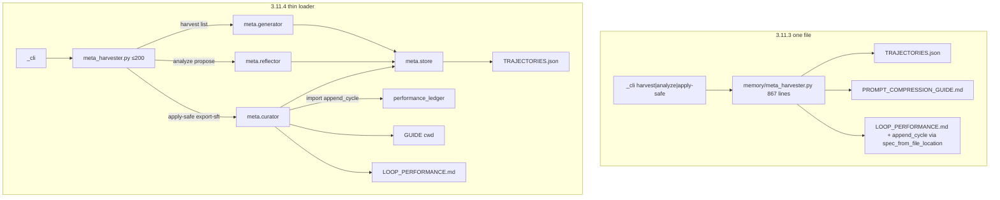
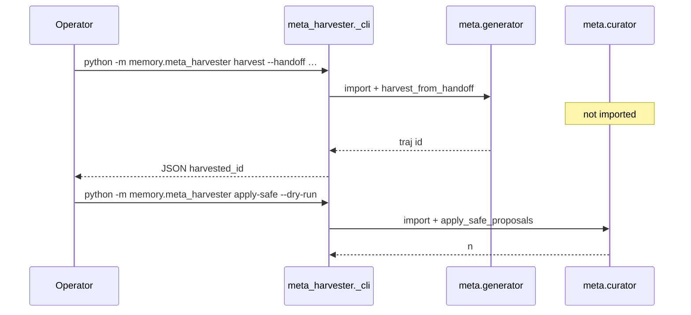
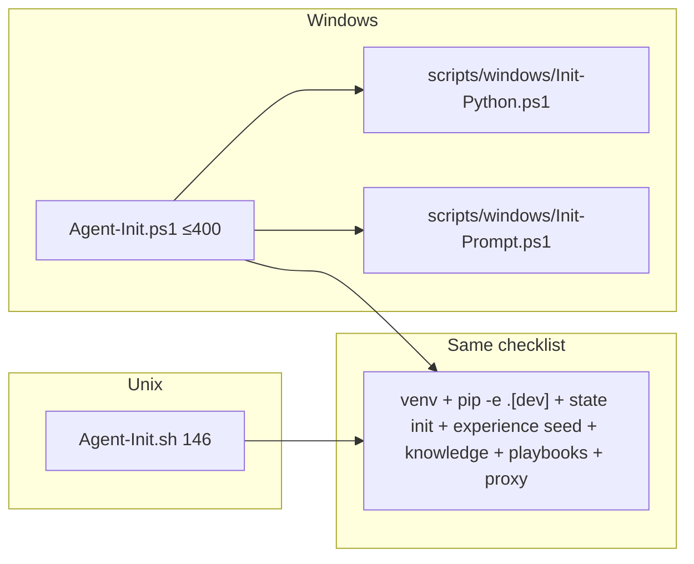
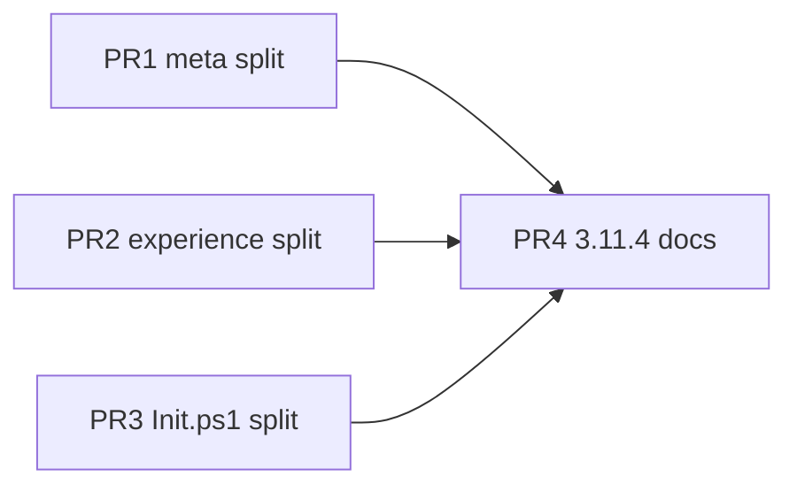

# P8-12 large-module split — Design (Agentix v3.11.4)

**Title:** Split `meta_harvester`, `experience_harvester`, and `Agent-Init.ps1` by mutually exclusive jobs (thin loader, body on trigger)  
**Author:** Agentix SSOT cycle fire  
**Date:** 2026-08-27  
**Status:** Draft  
**Repo / home:** `agentic_loop_template` (Agentix harness), package `memory`  
**Baseline:** VERSION **3.11.3**, `main` `dd50e8f` (llm_ontology quality: `7165f33`, `dd50e8f`). English specs; Russian comments/commits. Agent prompts English.  
**Target version:** **3.11.4** (patch: public `python -m memory.meta_harvester` / `python -m memory.experience_harvester` / `.\Agent-Init.ps1` unchanged. Not 3.12.0.)  
**House style:** match [2026-08-27-ng11-agent-dir-harvester-di-design.md](2026-08-27-ng11-agent-dir-harvester-di-design.md) and [2026-08-24-p8-harness-hardening-design.md](2026-08-24-p8-harness-hardening-design.md) (Decision table, G/NG ids, Key Decisions, PR Plan with disjoint `owned_paths`).  
**Canonical landing path:** `docs/superpowers/specs/2026-08-27-p8-12-module-split-design.md`

This document is the execute-plan input for **P8-12**, the ROADMAP Future leftover named in P8 Harness Hardening NG8: “Split `meta_harvester` / `experience_harvester` / rewrite ps1 as generated-from-sh. Parity checklist, not a 874-line rewrite.” It does **not** reopen Hub SaaS, MCP, embeddings (P8-10), messenger, MultiLLM product wiring, NG11 `agent_dir=` semantics, or sibling-classifier Init.

---

## Decision (this fire)

| Option | What | Verdict |
|--------|------|---------|
| A. Hub SaaS / MCP / messenger / embeddings / P8-10 | ROADMAP Future siblings | Rejected this cycle. Different done-criteria. |
| B. Generate `Agent-Init.ps1` from `Agent-Init.sh` (or one Python wizard) | “rewrite ps1 as generated-from-sh” | Rejected. P8-04 already closed this: Windows owns venv repair, CP1251 UTF-8, prompt here-strings. A 146-line bash port would regress Windows agents. Parity checklist stays. |
| C. Shared `memory/agent_paths.py` + migrate playbooks/audit/ledger/harvester | Dedup Path helpers | Rejected. NG11 Q4 / Decision table explicitly parked this. Two path styles for one cycle is worse than copies. Path helpers stay inside each split’s **store** module. |
| D. Convert `meta_harvester.py` into a package `memory/meta_harvester/` (delete the file) | `python -m` via `__main__.py` | Rejected. `test_meta_harvester.py` and `demo_meta.py` load `memory/meta_harvester.py` via `spec_from_file_location`. Deleting the file is a packaging story; that would be **3.12.0**. Keep the file as the public loader. |
| E. Sibling classifier Init / product trees | Patch `classifier/Agent-Init.ps1` | Rejected. P8-12 is the template. `experience_harvester` already *detects* classifier-style Windows-only Init as an audit issue; it does not edit that tree. |
| F. 3.12.0 with deprecations (`memory.meta.generator` as the only CLI) | New import path as product | Rejected. No new console script, no deprecation window needed. |
| **G. Thin public loaders + private job packages; ACE Generator/Reflector/Curator; Init.ps1 dotsource; patch 3.11.4** | Public CLI/import paths stay; bodies load on trigger; ps1 is a checklist split not a bash port | **Accepted.** Patch **3.11.4** |

P8 NG8’s “874-line rewrite” figure is stale. Verified 2026-08-27 on `dd50e8f`: `Agent-Init.ps1` is **998** lines (grew through P8-04 wizard/root-detect/ritual). The job is still “parity checklist, not a rewrite,” just against the real count.

---

## Overview

Three files still mix mutually exclusive jobs in one buffer. Reviewers of harvest cannot skip apply heuristics. Windows Init cannot be read without 200-line prompt here-strings. NG11 Decision B / NG1 parked this leftover explicitly: “P8-12 split `meta_harvester` / `experience_harvester` / Init.ps1 — Rejected. NG11 is path DI, not a file split” / “This fire only threads `agent_dir`.” The file is still **867** lines after that in-place DI. `experience_harvester.py` is **761** (DEFAULT_SEEDS + extract + audit + cycle). Skills were already split in 3.9.3 (`experience-accumulation` vs `loop-self-improve` vs `reflective-improvement`); the Python modules were not.

This fire splits by **progressive disclosure** (thin public loader, body imported on the command that needs it) and **ACE roles** (Generator collects, Reflector proposes, Curator applies). Public APIs stay:

```text
python -m memory.meta_harvester harvest|analyze|propose|apply-safe|export-sft|list
python -m memory.experience_harvester scan|audit|cycle|seed-defaults
python -m memory experience|harvest-experience|experience_harvester …   # __main__ aliases
.\Agent-Init.ps1 [-Wizard] [-Frontend …]   # same param block
from memory.meta_harvester import harvest_from_handoff, …
from memory.experience_harvester import maybe_cycle_on_done, DEFAULT_SEEDS, dedupe
```

No new CLI flags. No `--agent-dir`. No Hub/MCP/embeddings/messenger. No `agent_paths.py`. Supervisor still calls `maybe_cycle_on_done(workdir, apply=False)` (3.11 Q1). Patch **3.11.4**.

---

## Background and motivation

### Current state (verified 2026-08-27 on `dd50e8f`, VERSION 3.11.3)

| Artifact | Lines | Jobs jammed together | Gap vs P8-12 |
|----------|------:|----------------------|--------------|
| `memory/meta_harvester.py` | **867** | Path/lock/index store; harvest (Generator); analyze heuristics (Reflector); apply-safe + SFT + ledger (Curator); mock `basic_replay_harness`; `_cli` | NG11 added `agent_dir=` in place and parked the split (Decision B / NG1). Unused `_save_index` (no in-repo caller in this module; RMW uses `_load_index_unlocked` / `_write_index_unlocked`). `update_performance_ledger` loads `performance_ledger.py` via `importlib.util.spec_from_file_location` to dodge a `memory/__init__.py` cycle. |
| `memory/experience_harvester.py` | **761** | `DEFAULT_SEEDS` (~150 lines of data); markdown extractors; parent scan; adoption audit/tier; `maybe_cycle_on_done`; CLI | 3.9.3 split **skills** only. Later specs (NG11 NG2, 3.11 Q1) skipped editing this file. `apply=False` on the supervisor hook is locked. |
| `Agent-Init.ps1` | **998** | param/root/UTF-8; `Find-ReliablePython` + venv repair; prompt here-strings (~200 lines); cold-start ritual; wizard; env-report helpers | P8-04 added ritual parity + `-Wizard` + root detect. P8 NG8 forbade generating ps1 from sh. Script is **124 lines larger** than the 874-line figure in that spec. |
| `Agent-Init.sh` | **146** | Whole Unix ritual in one file | Not a split target. Parity **checklist** SSOT in `docs/cross-platform.md` + `memory/test_init_parity.py`. |
| Path helpers | dup | `_X(agent_dir) -> Path(agent_dir)/name if agent_dir is not None else MODULE_GLOBAL` copied in `playbooks.py`, `audit_log.py`, `performance_ledger.py`, `meta_harvester.py`, `questions_collector.py` | NG11 rejected `agent_paths.py`. Copies stay. |
| Skills / `tools/select.py` | 101 | `SKILL_INTENTS`: harvest → `experience-accumulation`; reflect → `loop-self-improve` | 3.9.3 done. Do not reopen routing. |
| CLI | — | `pyproject.toml` scripts: `agentix` → `memory.__main__:_cli`. No console script for meta/experience; they are `python -m memory.<module>`. `__main__.py` aliases `experience` / `harvest-experience` / `experience_harvester`. | Keep. |

Line-count census of the rest of `memory/` (context, not in scope): `supervisor.py` 801, `playbooks.py` 508, `state.py` 452, `questions_collector.py` 512. P8-12 names three leftovers only.

### Pain

1. **Next NG11-style touch cannot land.** Adding one helper to `meta_harvester.py` re-opens an 867-line review surface. NG11 parked the split (Decision B / NG1); the file is still 867 lines after in-place DI.
2. **Jobs are not exclusive.** `python -m memory.meta_harvester harvest` parses apply-safe GUIDE mutation and four analyze heuristics. `cycle` in experience loads seed data + audit even for a scan-only mental model. Init.ps1 always defines prompt templates before venv repair finishes.
3. **Dead / evasive code.** `_save_index` has zero callers after NG11 unlocked RMW. Ledger integration uses `spec_from_file_location("pl", …)` instead of `from memory.performance_ledger import append_cycle` because `memory/__init__.py` eagerly imports every harvest name (lines 70–79), which would re-enter the package while it is still loading.
4. **Init.ps1 is past the figure the leftover was named on.** 874 → 998. Without a split, P8-04 parity edits keep growing the same file. Windows-only Python discovery is a real job; it does not belong in the same buffer as the starter-prompt here-string.
5. **File-location tests lie about packaging.** `test_meta_harvester.py` and `demo_meta.py` still `spec_from_file_location` the `.py` file “to avoid missing workspace/store/schema.” 3.9.0 packaging made that obsolete. The split must not preserve that dodge as the contract.

### Why this leftover, why now

ROADMAP Future still lists “Modularize large modules (`meta_harvester`, `experience_harvester`, Init.ps1) (P8-12).” 3.11.3 closed P8-13 (extract MultiLLM to `llm_ontology.py` — the prior-art for “new module + re-export + patch”). 3.11.1 closed NG11 path DI and **explicitly** rejected splitting harvester that cycle. Skills routing is already correct (3.9.3). Remaining Future items need Hub, MCP, embeddings, or messenger. This fire is stdlib-only and one patch.

---

## Goals and non-goals

### Goals

| ID | Goal |
|----|------|
| G1 | `memory/meta_harvester.py` is a thin public loader (target **≤200 lines**, including `_cli` and `if __name__ == "__main__"`). Bodies live under `memory/meta/` as Generator / Reflector / Curator + store. `python -m memory.meta_harvester <cmd>` and `from memory.meta_harvester import harvest_from_handoff` keep working. |
| G2 | `memory/experience_harvester.py` is a thin public loader (target **≤200 lines** including `cli` and `if __name__ == "__main__"`). Bodies live under `memory/experience/` (seeds, extract, scan, audit). `python -m memory.experience_harvester` and `__main__.py` aliases stay. `maybe_cycle_on_done(..., apply=False)` semantics unchanged. `DEFAULT_SEEDS` and `dedupe` remain importable from the public module (`test_state_and_handoff.py`). |
| G3 | `Agent-Init.ps1` is the orchestrator (target **≤400 lines**) that dotsources Windows-only **function-library** helpers after UTF-8 setup. Prompt here-strings and Python-discovery/venv-repair move out. Public param block unchanged. UTF-8 BOM kept (Windows PowerShell 5.1). **Not** generated from `Agent-Init.sh`. |
| G4 | Progressive disclosure: importing the public loader does **not** import sibling job bodies. CLI dispatches `harvest` → Generator only, `analyze`/`propose` → Reflector, `apply-safe`/`export-sft` → Curator. `import memory` does not import meta bodies (lazy `__getattr__`, same pattern as `performance_ledger`). |
| G5 | Delete unused `meta_harvester._save_index`. Replace `spec_from_file_location` of `performance_ledger` with `from memory.performance_ledger import append_cycle` in Curator. Nested `"ledger"` lock rule from NG11 G5 stays (release md lock before `append_cycle`). |
| G6 | Size caps after the split, **whitelist only** (do not walk all of `memory/`): loaders ≤200; each `memory/meta/*.py` and `memory/experience/*.py` body **≤350** (`__init__.py` excluded from the 350 cap; they are docstring-only); `Agent-Init.ps1` **≤400**; each `scripts/windows/Init-*.ps1` **≤450**. `supervisor.py` / `playbooks.py` / `questions_collector.py` / `state.py` are NG8 and **out of the whitelist**. `wc -l` in the PR that owns those paths. |
| G7 | Tests: existing `test_meta_lock.py`, `test_meta_harvester.py`, `test_experience_harvester.py`, `test_init_parity.py` stay green after the import-path fixes below. New tests prove lazy import (harvest CLI does not import `memory.meta.curator`). |
| G8 | VERSION **3.11.4** only in the release commit. No new extra, console script, CLI flag, or wizard/proxy/`--concurrent` default change. |

### Non-goals

| ID | Non-goal | Why |
|----|----------|-----|
| NG1 | Hub SaaS, full MCP, messenger, playbook embeddings (P8-10) | ROADMAP Future. Different done-criteria. |
| NG2 | Shared `memory/agent_paths.py`; migrate playbooks/audit/ledger/questions | NG11 Q4. Copies of `_foo(agent_dir)` stay. |
| NG3 | Generate `Agent-Init.ps1` from `Agent-Init.sh` / one Python wizard | P8-04 / Decision B. Windows venv-repair would regress. |
| NG4 | Patch sibling classifier (or any consumer) Init | Template-only. Audit already flags Windows-only Init. |
| NG5 | Change `SKILL_INTENTS` / harvest vs reflect skill bodies | 3.9.3 done. `tools/select.py` is not in `owned_paths`. |
| NG6 | Edit `experience_harvester` **behavior**: `maybe_cycle_on_done(..., apply=False)`, seed text, audit tiers | 3.11 Q1. This fire moves code, does not retune harvest. |
| NG7 | New `--agent-dir` CLI; wire dashboard/supervisor into harvest | NG11 Decision C. Still closed. |
| NG8 | Split `supervisor.py` / `playbooks.py` / `questions_collector.py` | Not named in P8-12. |
| NG9 | Package rename `memory` → `agentix`; src-layout; PyPI upload | P8 NG12 / NG11. |
| NG10 | Make `-GeneratePromptOnly` skip venv as a drive-by product fix | Param exists; it does **not** currently short-circuit. Do not invent that semantics here. |
| NG11 | Reopen MultiLLM “use” (wire into the loop) | P8-13 extracted; use is a different leftover. |
| NG12 | 3.12.0 deprecations / deleting `python -m memory.meta_harvester` | Decision F. Patch if the public path stays. |

---

## Proposed design

### 1. Layout (Python)

Keep the **files** that `python -m` and docs name. Add private implementation packages. `pyproject.toml` `[tool.setuptools.packages.find] include = ["memory*"]` already picks them up. Each new package has a tiny `__init__.py` (docstring only — **no** eager re-exports).

```text
memory/meta_harvester.py              # public loader + _cli  (≤200)
memory/meta/__init__.py               # package marker, no re-exports
memory/meta/store.py                  # paths, locks, index RMW, load_config, atomic write
                                      # ONLY module that imports memory.agent_lock
memory/meta/generator.py              # harvest_from_handoff, seed_example_trajectory, get_recent_trajectories
memory/meta/reflector.py              # analyze_for_proposals, generate_proposals
memory/meta/curator.py                # apply_safe_proposals, export_sft, update_performance_ledger, basic_replay_harness

memory/experience_harvester.py        # public loader + cli   (≤200)
memory/experience/__init__.py
memory/experience/seeds.py            # DEFAULT_SEEDS
memory/experience/extract.py          # bullets / headings / never / classify / _read_capped / dedupe
memory/experience/scan.py             # _source_files, scan_parent  (must not import audit.py)
memory/experience/audit.py            # signals, tier, audit_*, looks_like_project_parent,
                                      # maybe_cycle_on_done, apply_patterns
```

Do **not** create `memory/meta_harvester/` as a package (Decision D). Do **not** add `memory/agent_paths.py` (NG2).

ACE map (meta):

| ACE role | Module | CLI trigger | Writes |
|----------|--------|-------------|--------|
| Store (not ACE; shared I/O) | `memory.meta.store` | imported by the job that needs disk | `TRAJECTORIES.json`, `META_PROPOSALS.md` (tmp+replace, lock `"trajectories"`) |
| Generator | `memory.meta.generator` | `harvest`, `list` | index append (golden traj / seed) |
| Reflector | `memory.meta.reflector` | `analyze`, `propose` | index proposals list |
| Curator | `memory.meta.curator` | `apply-safe`, `export-sft` | GUIDE (cwd), SFT jsonl, `LOOP_PERFORMANCE.md`, `append_cycle` |

ACE map (experience) — same names, different store (workspace memory via `memory.store.update_memory`, not `.agent/TRAJECTORIES.json`):

| ACE role | Module | CLI trigger |
|----------|--------|-------------|
| Generator | `memory.experience.scan` (+ `extract`) | `scan` (dry-run; `dedupe` from extract) |
| Reflector | `memory.experience.audit` | `audit` (dry-run report) |
| Curator | `apply_patterns` | `scan --apply`, `audit --apply`, `cycle --apply`, `seed-defaults --apply` |

`cycle` is the one command allowed to import scan **and** audit (it is the composition). `maybe_cycle_on_done` lives in audit and already composes scan+audit; supervisor keeps importing it from `memory.experience_harvester`. `--apply` on `scan` / `audit` already exists (`experience_harvester.py` CLI today); it is the Curator path of those commands (NG6: keep the flags). `scan.py` **must not** import `audit.py` (otherwise `audit` → `scan` → `audit` is a cycle). `dedupe` lives in `extract.py` so the `scan` CLI can dedupe without importing audit.

### 2. Thin loader (`meta_harvester.py`)

Shape:

```python
# memory/meta_harvester.py
"""Публичный загрузчик Meta-Optimizer. Тела — memory.meta.{generator,reflector,curator}."""
from __future__ import annotations

import argparse
import json
import sys
from pathlib import Path
from typing import Any, Dict, List, Optional, Union

__all__ = [
    "harvest_from_handoff",
    "get_recent_trajectories",
    "analyze_for_proposals",
    "generate_proposals",
    "apply_safe_proposals",
    "seed_example_trajectory",
    "update_performance_ledger",
    "export_sft",
    "load_config",
    "basic_replay_harness",
    "DEFAULT_MIN_CONFIDENCE",
    "DEFAULT_FREQUENCY",
    "TRAJECTORIES_INDEX",
    "TRAJECTORIES_DIR",
    "META_PROPOSALS_MD",
    "PROJECT_CONFIG",
    "SFT_PATH",
]

_GENERATOR = {
    "harvest_from_handoff",
    "get_recent_trajectories",
    "seed_example_trajectory",
}
_REFLECTOR = {"analyze_for_proposals", "generate_proposals"}
_CURATOR = {
    "apply_safe_proposals",
    "export_sft",
    "update_performance_ledger",
    "basic_replay_harness",
}
_STORE = {
    "load_config",
    "DEFAULT_MIN_CONFIDENCE",
    "DEFAULT_FREQUENCY",
    "TRAJECTORIES_INDEX",
    "TRAJECTORIES_DIR",
    "META_PROPOSALS_MD",
    "PROJECT_CONFIG",
    "SFT_PATH",
}


def __getattr__(name: str):
    """PEP 562: тело подгружается при первом обращении к имени."""
    if name in _STORE:
        from memory.meta import store as mod
    elif name in _GENERATOR:
        from memory.meta import generator as mod
    elif name in _REFLECTOR:
        from memory.meta import reflector as mod
    elif name in _CURATOR:
        from memory.meta import curator as mod
    else:
        raise AttributeError(f"module {__name__!r} has no attribute {name!r}")
    value = getattr(mod, name)
    globals()[name] = value  # cache
    return value


def __dir__():
    return sorted(list(globals()) + __all__)
```

CLI `_cli` stays in the loader (argparse tables stay here so `--help` does not import job bodies). Cap is **≤200** (G1) so the ~70-line sketch + ~59-line `_cli` + `if __name__` + Russian docstring fit without stripping comments. It lazy-imports **per subcommand**:

```python
def _cli() -> None:
    # argparse unchanged (harvest / list / analyze / propose / apply-safe / export-sft)
    ...
    if args.cmd == "harvest":
        from memory.meta.generator import harvest_from_handoff
        tid = harvest_from_handoff(args.handoff, args.cycle, args.outcome)
        print(json.dumps({"harvested_id": tid}, ensure_ascii=False))
    elif args.cmd in {"analyze", "propose"}:
        from memory.meta.reflector import analyze_for_proposals, generate_proposals
        ...
    elif args.cmd in {"apply-safe", "export-sft"}:
        from memory.meta.curator import apply_safe_proposals, export_sft
        ...
    elif args.cmd == "list":
        from memory.meta.generator import get_recent_trajectories
        ...


if __name__ == "__main__":
    _cli()
```

`python -m memory.meta_harvester` requires that `__main__` guard (today `meta_harvester.py:866-867`). Do not drop it.

No `--agent-dir`. CLI still calls public functions with cwd defaults (NG11 §7). The public loader does **not** re-export `agent_lock`.

Module-level Path globals (`TRAJECTORIES_INDEX = Path(".agent/TRAJECTORIES.json")`, …) **move to** `memory.meta.store` and are re-exported via `__getattr__` so leftover scripts that read `mh.TRAJECTORIES_INDEX` still work. Tests already pass `agent_dir=` (NG11 NG9); do not revive monkeypatch-of-globals as the contract.

### 3. `memory/meta/store.py`

Move verbatim in behaviour (NG11 G1–G5):

- Globals: `TRAJECTORIES_INDEX`, `TRAJECTORIES_DIR`, `META_PROPOSALS_MD`, `PROJECT_CONFIG`, `SFT_PATH`, `DEFAULT_FREQUENCY`, `DEFAULT_MIN_CONFIDENCE`
- `_trajectories_index` / `_trajectories_dir` / `_meta_proposals_md` / `_project_config_path` / `_sft_path` / `_loop_performance_md` / `_ensure_agent_dir`
- `_trajectories_lock`, `_atomic_write_text`
- `load_config`, `_empty_index`, `_load_index_unlocked`, `_write_index_unlocked`, `_load_index`, `_write_human_summary`
- `_next_traj_id`, `_next_prop_id`, `_now_iso`
- Logger `memory.meta_harvester` (keep the public name so existing WARNING assertions / operators do not chase `memory.meta.store`)
- **Sole import of `agent_lock`:** `from memory.agent_lock import agent_lock` lives **only** in this file. Expose `_trajectories_lock`, `_ledger_lock(agent_dir)` (`agent_lock(_loop_performance_md(agent_dir).parent, name="ledger")`), and `_sft_lock(dest_parent)` (`agent_lock(dest_parent, name="sft")`). Generator / reflector / curator call those helpers and never `from memory.agent_lock import agent_lock` themselves.

**Delete `_save_index` from the meta split.** After NG11, every RMW holds `"trajectories"` once and calls unlocked helpers. A locked wrapper that no caller uses is a reentrancy footgun (`agent_lock` is not reentrant). Grep after the move must be zero matches in **`memory/meta_harvester.py` + `memory/meta/`** (the Testing row `test_save_index_gone`). Do **not** grep all of `memory/*.py`: `playbooks.py:173` still has a live `_save_index` (different module; NG8).

Do not invent a generic path helper used by playbooks. Copy-paste of `_trajectories_index` style stays local to this store (NG2).

### 4. Generator / Reflector / Curator bodies

**`generator.py`:** `harvest_from_handoff`, `get_recent_trajectories`, `seed_example_trajectory`. Import store helpers (`_trajectories_lock`, `_load_index_unlocked`, …). Quality gate and cycle-dedup unchanged. **No** `from memory.agent_lock import agent_lock`.

**`reflector.py`:** `analyze_for_proposals`, `generate_proposals`. Heuristics stay byte-equivalent (marker / commit style / compression / permanent-rule / ledger). Do not “improve” the Russian/English keyword lists in this fire. **No** `from memory.agent_lock import agent_lock`.

**`curator.py`:** `apply_safe_proposals`, `export_sft`, `_traj_qualifies`, `_sft_record`, `update_performance_ledger`, `basic_replay_harness` (pure mock, no `agent_dir` — NG11). GUIDE path stays `Path("PROMPT_COMPRESSION_GUIDE.md")` relative to cwd (NG11 NG5). **No** `from memory.agent_lock import agent_lock`. Ledger md write uses `store._ledger_lock`; SFT default dest uses `store._sft_lock`.

Ledger import **must** become a normal submodule import:

```python
def update_performance_ledger(..., *, agent_dir=None) -> None:
    from memory.meta.store import _ensure_agent_dir, _loop_performance_md, _ledger_lock, _atomic_write_text
    ...
    with _ledger_lock(agent_dir):
        ...  # tmp+replace LOOP_PERFORMANCE.md
    # lock released — NG11 G5
    try:
        from memory.performance_ledger import append_cycle
        if cycle_stats:
            append_cycle(agent_dir=agent_dir, **cycle_stats)
        else:
            append_cycle(
                agent_dir=agent_dir,
                cycle=0,
                outcome="META_APPLIED",
                notes=f"proposal:{proposal_id} impact:{impact}",
                meta_applied=1,
            )
    except Exception as e:
        print(f"[performance_ledger] non-fatal: {e}", file=sys.stderr)
```

The public loader does **not** re-export `agent_lock`. Spies patch `memory.meta.store.agent_lock` (covers trajectories / sft / ledger md) and `memory.agent_lock.agent_lock` (`append_cycle` binds its own import). See Testing.

### 5. `memory/__init__.py` lazy meta names

Today lines 70–79 eagerly `from .meta_harvester import harvest_from_handoff, …`, which loads the 867-line module at `import memory` and is why Curator could not `import memory.performance_ledger` during package init.

Move those names onto the existing `__getattr__` (already used for `performance_ledger` and `playbooks`):

```python
_META_EXPORTS = {
    "harvest_from_handoff",
    "get_recent_trajectories",
    "analyze_for_proposals",
    "generate_proposals",
    "apply_safe_proposals",
    "seed_example_trajectory",
    "update_performance_ledger",
    "load_meta_config",
}

def __getattr__(name):
    if name in _META_EXPORTS:
        from . import meta_harvester as mh
        attr = "load_config" if name == "load_meta_config" else name
        return getattr(mh, attr)
    if name == "performance_ledger":
        import importlib
        return importlib.import_module("memory.performance_ledger")
    if name == "playbooks":
        if playbooks_mod is not None:
            return playbooks_mod
        import importlib
        return importlib.import_module("memory.playbooks")
    raise AttributeError(f"module {__name__!r} has no attribute {name!r}")
```

The `performance_ledger` / `playbooks` arms are **verbatim** from `memory/__init__.py:124-133` today (P8-02 guarded-import fallback). Do not drop the `playbooks_mod is not None` branch.

Keep `__all__` listing the same names so `from memory import harvest_from_handoff` still works (PEP 562). Do **not** add MultiLLM names (P8-13 NG7). Do **not** add experience names (they were never on this `__all__`).

`from memory.meta_harvester import harvest_from_handoff` does not go through package `__getattr__`; it hits the submodule loader. Fine.

### 6. Experience split

`experience_harvester.py` loader (cap **≤200**, including `cli` and `if __name__ == "__main__": raise SystemExit(cli())` — today `:760-761`):

- `__all__` includes everything `test_experience_harvester.py` and `test_state_and_handoff.py` import: `DEFAULT_SEEDS`, `audit_parent`, `dedupe`, `looks_like_project_parent`, `maybe_cycle_on_done`, `scan_parent`, `cli`.
- `__getattr__` map: seeds → `DEFAULT_SEEDS`; extract → `dedupe`; scan → `scan_parent`; audit → `audit_parent` / `looks_like_project_parent` / `apply_patterns`; `cli` and `maybe_cycle_on_done` are explicit wrappers (like meta `_cli`).
- `cli()` lazy-imports per subcommand (move-only flags; `--apply` already exists on scan and audit):
  - `seed-defaults`: `DEFAULT_SEEDS`; import `apply_patterns` from `audit` **only** when `args.apply`.
  - `scan`: `scan_parent` + `dedupe` from extract; import `apply_patterns` from `audit` **only** when `args.apply`. Dry-run scan must leave `"memory.experience.audit" not in sys.modules`.
  - `audit`: `audit_parent`; import `apply_patterns` **only** when `args.apply`.
  - `cycle`: seeds + scan + audit (composition; may import all three).

Keep regexes, `SKIP_DIRS`, `NAMED_SOURCES`, `PLAYBOOK_BASENAMES` in `extract.py` / `scan.py` as today. Do not retune (NG6).

**Absolute imports in bodies** (today the top-level module uses `from .schema import normalize` / `from .store import update_memory` — package `memory`). After the move those relatives would look for `memory.experience.schema` / `memory.experience.store`, which this fire does not create:

```python
# memory/experience/extract.py  and  memory/experience/audit.py
from memory.schema import normalize          # extract.dedupe
from memory.store import update_memory       # audit.apply_patterns
```

`from ..schema` / `from ..store` is acceptable; `from .schema` / `from .store` is not. Bodies must **not** import `memory.experience_harvester` (avoids `python -m` double-load). `scan.py` must not import `audit.py`.

Supervisor (`memory/supervisor.py:598`):

```python
from memory.experience_harvester import maybe_cycle_on_done
maybe_cycle_on_done(workdir, apply=False)
```

unchanged. Because of PEP 562 on the experience loader, this import loads `experience_harvester.py` then `experience.audit` (which imports scan). That is acceptable: the DONE hook **is** the cycle composition. Harvest CLI `scan` still must not import audit.

`test_observability.py` patches `eh.maybe_cycle_on_done` on the public module — keep `maybe_cycle_on_done` as an explicit wrapper in the loader (not only `__getattr__`) so `monkeypatch.setattr(eh, "maybe_cycle_on_done", boom)` still intercepts the name supervisor would import. Simplest: **bind the supervisor-facing hook and `cli` as real functions in the loader** that forward; everything else can be `__getattr__`.

```python
def maybe_cycle_on_done(workdir: Path, apply: bool = False):
    from memory.experience.audit import maybe_cycle_on_done as _impl
    return _impl(workdir, apply=apply)
```

Supervisor and tests both hit this wrapper. `apply=False` default stays.

### 7. Init.ps1 split (parity checklist, not generated-from-sh)

Public entry remains `Agent-Init.ps1` at repo root (README Quick Start: `.\Agent-Init.ps1`). Preserve:

- UTF-8 BOM (`\uFEFF`) on the entry script
- `param(...)` block (same names/types/defaults) — **only** on the orchestrator
- Root detection (`memory\supervisor.py` predicate + nested `agentic_loop_template` cwd rule)
- Ritual invocations that `test_init_parity.py` greps: `memory state init`, `knowledge ingest-if-empty`, `playbooks seed`, `proxy install-venv`, `"$ProjectRoot[dev]"` / `"$TemplateRoot[dev]"`, `install','-e'`, `[switch]$Wizard`, `playbooks seed --from-standards`, `$initFe = "grok"` (wizard default)

Helpers are **function libraries**, not second entry scripts:

| File | Owns | Cap |
|------|------|-----|
| `scripts/windows/Init-Python.ps1` | Functions only: `Find-ReliablePython`, `Ensure-AgentixVenv`, `Invoke-VenvPip`, `Get-PythonEnvironmentReport`, `Get-ActivePythonInfo`, `Find-EditablePackages`. **No** `param()` block. **No** work at dotsource. | ≤450 |
| `scripts/windows/Init-Prompt.ps1` | Functions only: `Get-AutoTaskDescription`, `Generate-AgentStarterPrompt` (both here-strings). **No** `param()`. **No** work at dotsource. | ≤450 |
| `Agent-Init.ps1` | param, BOM, UTF-8 console, root detect, dotsource, **call** `Ensure-AgentixVenv`, pip `-e` **calls**, ritual, wizard, proxy health, write `starter_prompt_grok.txt`, call report | ≤400 |

`Ensure-AgentixVenv` wraps today’s inline venv create/repair (`Agent-Init.ps1:568-733`, ~166 lines — not a function today). It sets **script-scoped** `$basePython`, `$venvPath`, `$venvPython`, `$activateScript` for the orchestrator. Estimated Init-Python size: Find-ReliablePython ~104 + report helpers ~153 + Invoke-VenvPip ~10 + `Ensure-AgentixVenv` ~166 ≈ 433, under 450 with Russian comments allowed (do not strip comments to game `wc`).

**Dotsource order** (required; PowerShell 5.1 + CP1251):

1. `param(...)` on the orchestrator.
2. Compute `$TemplateRoot` / `$ProjectRoot` (today `:30-47`).
3. UTF-8 console / `$PSDefaultParameterValues` / `$env:PYTHONIOENCODING` (today `:49-67`).
4. **Then** dotsource:

```powershell
. (Join-Path $PSScriptRoot "scripts\windows\Init-Python.ps1")
. (Join-Path $PSScriptRoot "scripts\windows\Init-Prompt.ps1")
```

5. Call `Ensure-AgentixVenv` (venv create/repair).
6. Orchestrator keeps pip `Invoke-VenvPip @('install','-e',"$TemplateRoot[dev]")` **calls** (today `:756-768`) so `test_init_parity.py` still greps `install','-e'` and `"$TemplateRoot[dev]"` in `Agent-Init.ps1`. `Init-Python.ps1` defines `Invoke-VenvPip`; it must **not** contain ritual tokens `memory state init` / `playbooks seed`.

`$ProjectRoot` / `$TemplateRoot` / `$venvPython` are provided by the orchestrator; helpers read those script-scoped variables and are not public CLI. Dotsource only `scripts/windows/*.ps1` under `$PSScriptRoot` (template root on both README and nested layouts). A dotsourced helper **must not** have its own `param()` — PowerShell 5.1 errors or steals args.

Do **not** generate either file from `Agent-Init.sh`. Unix stays 146 lines. Shared ritual is the checklist in `docs/cross-platform.md`, enforced by `test_init_parity.py`. The one-line Windows-column helper mention lands in **PR3** (when the files appear), not PR4.

Non-wizard `$initFe = "blackbox"` then config override, wizard default grok, fail-closed vs best-effort — **byte-equivalent behaviour** (P8-04 KD6). Do not “fix” the non-wizard blackbox default as a drive-by.

`-GeneratePromptOnly` stays a documented switch; do not add an early-return that skips venv (NG10).

Helper scripts are not public CLI. Docs continue to say `.\Agent-Init.ps1`.

### 8. Packaging / CLI surface (unchanged)

`pyproject.toml` `[project.scripts]` stays four names (`agentix`, `agentix-supervisor`, `agentix-dashboard`, `agentix-proxy`). No `agentix-meta`. Discoverability remains `python -m memory.meta_harvester --help`.

`include = ["memory*"]` ships `memory.meta` and `memory.experience`. No `package-data` change (seeds stay Python, not JSON).

### 9. File-location tests → normal imports

Rewrite `memory/test_meta_harvester.py` and `memory/demo_meta.py` to `import memory.meta_harvester as mh`. Drop `spec_from_file_location` of `meta_harvester.py`. Script-style `python memory/test_meta_harvester.py` still works if the test file keeps a `test_basic()` + `__main__`, but it must run inside an editable install / `PYTHONPATH=.` like every other `memory/test_*.py`. Prefer pytest collection (`pytest memory/test_meta_harvester.py`) as the CI path.

---

## Architecture diagrams

### Before / after (meta)



### CLI load-on-trigger



### Init.ps1 dotsource vs Unix checklist



### PR DAG



Level-0 parallel: **PR1 ∥ PR2 ∥ PR3** (no shared files). Level-1: **PR4**.

---

## API / Interface Changes

Public call shapes do **not** change. This section is the compatibility contract.

### Python (additive layout only)

```python
# before and after — same
from memory.meta_harvester import harvest_from_handoff, apply_safe_proposals
harvest_from_handoff(path, cycle=1, outcome="DONE", agent_dir=agent)
apply_safe_proposals(dry_run=True, agent_dir=agent)

from memory.experience_harvester import maybe_cycle_on_done, DEFAULT_SEEDS, dedupe
maybe_cycle_on_done(workdir, apply=False)

# after — also valid, not required of callers
from memory.meta.generator import harvest_from_handoff as _g
```

Private `memory.meta.*` / `memory.experience.*` are **not** a documented product. Implementers may import them in tests. Do not add them to README tables.

### CLI (argv identical)

```bash
python -m memory.meta_harvester harvest --handoff .agent/last_handoff.json --cycle 17 --outcome DONE
python -m memory.meta_harvester analyze --recent 5
python -m memory.meta_harvester propose --limit 2
python -m memory.meta_harvester apply-safe --dry-run
python -m memory.meta_harvester export-sft
python -m memory.experience_harvester cycle --parent ..
python -m memory experience seed-defaults --apply
```

`memory.__main__` aliases for experience stay (`experience`, `harvest-experience`, `experience_harvester`).

### Init

```powershell
.\Agent-Init.ps1
.\Agent-Init.ps1 -Wizard
.\Agent-Init.ps1 -Frontend grok
```

Same exit-code contract: wizard / explicit live frontend fail-closed on proxy health; non-wizard best-effort; `AGENTIX_PROXY=0` opt-out; mock never fail-closes.

---

## Data Model Changes

**None.** On-disk names stay:

| File | Writer after split |
|------|--------------------|
| `.agent/TRAJECTORIES.json` | `meta.store` tmp+replace under `"trajectories"` |
| `.agent/META_PROPOSALS.md` | same section |
| `.agent/sft/train.jsonl` | `meta.curator.export_sft` append under `"sft"` when dest is default |
| `.agent/LOOP_PERFORMANCE.md` | Curator under `"ledger"`, then `append_cycle` |
| `.agent/PERFORMANCE_LEDGER.json` | `performance_ledger.append_cycle` (unchanged module) |
| workspace memory markdown | `experience.audit.apply_patterns` → `memory.store.update_memory` |
| `PROMPT_COMPRESSION_GUIDE.md` | Curator, cwd, no `agent_dir` |

No LOOP_STATE schema bump. No handoff schema change. No gitignore change (`sft/` already ignored).

**Migration:** import-path compatible. Clones on 3.11.3 keep working until they pull; after pull, `pip install -e ".[dev]"` is already the Init ritual and picks up `memory.meta` / `memory.experience` because of `include = ["memory*"]`.

---

## Testing

CI stays `pytest memory/`. Hermetic: `tmp_path` + `monkeypatch.chdir`. Do not write the clone’s live `.agent/`. Split the new inventory by PR `owned_paths` so PR1 ∥ PR2 ∥ PR3 each merge green.

### Adapt existing

| File | PR | Change |
|------|----|--------|
| `memory/test_meta_harvester.py` | 1 | `import memory.meta_harvester as mh`. Drop file-location loader. Keep `agent_dir=tmp/.agent`. |
| `memory/demo_meta.py` | 1 | Same import. Not a test; keep runnable. |
| `memory/test_meta_lock.py` | 1 | Spies today do `monkeypatch.setattr(mh, "agent_lock", spy)` **and** `al.agent_lock`. After split, patch `memory.meta.store.agent_lock` **and** `memory.agent_lock.agent_lock` (`append_cycle` binds its own import). Assert the spy fired (`"trajectories" in names`). Public `mh.harvest_from_handoff` still the call site. Do **not** re-export `agent_lock` from the loader (`mh.agent_lock` is fail-loud AttributeError). |
| `memory/test_experience_harvester.py` | 2 | Keep `from memory.experience_harvester import …`. No supervisor edit. |
| `memory/test_state_and_handoff.py` | — | Not in any implementation PR `owned_paths`. `DEFAULT_SEEDS` / `dedupe` still from the public module; PR2 re-export must keep it green without editing this file. |
| `memory/test_observability.py` | — | Not in implementation PR `owned_paths`. `monkeypatch.setattr(eh, "maybe_cycle_on_done", boom)` stays valid because the loader keeps an explicit wrapper. |
| `memory/test_init_parity.py` | 3 | Still greps `Agent-Init.ps1` for ritual tokens. **Add:** both `scripts/windows/Init-*.ps1` exist; entry script contains `Init-Python.ps1` and `Init-Prompt.ps1` dotsource substrings; `Agent-Init.ps1` starts with UTF-8 BOM; `Agent-Init.ps1` still contains `install','-e'`; `Init-Python.ps1` does **not** contain `memory state init` / `playbooks seed`. Do not grep `pip install -e` inside the ps1 (help-text false positive). |

### PR1 — new `memory/test_module_split.py` (meta only)

| Test | Assert |
|------|--------|
| `test_meta_harvest_cli_does_not_import_curator` | `importlib.import_module("memory.meta_harvester")` then `harvest_from_handoff(...)`; `"memory.meta.curator" not in sys.modules`. `analyze_for_proposals` loads reflector, still not curator. `apply_safe_proposals` then loads curator. |
| `test_import_memory_does_not_load_meta_bodies` | `import memory` in a subprocess; `sys.modules` has no `memory.meta.generator` / `reflector` / `curator`. `from memory import harvest_from_handoff` then generator **is** loaded. |
| `test_append_cycle_is_normal_import` | `inspect.getsource(memory.meta.curator.update_performance_ledger)` contains `from memory.performance_ledger import append_cycle` and does **not** contain `spec_from_file_location`. Call `update_performance_ledger("P-1", agent_dir=agent)` after `import memory` — no cycle, `PERFORMANCE_LEDGER.json` under `agent`. Source of generator/reflector/curator does not contain `from memory.agent_lock import`. |
| `test_save_index_gone` | no `_save_index` on `memory.meta.store` or `memory.meta_harvester`. Grep only those two trees — **not** `memory/playbooks.py`. |
| `test_meta_line_caps` | `Path.read_text().count("\n")+1` on the **meta whitelist only**: `memory/meta_harvester.py` ≤200; each `memory/meta/*.py` except `__init__.py` ≤350. Fail with the offending path. Do not walk `supervisor.py` / `playbooks.py` / `experience_harvester.py`. |
| `test_meta_cli_help` | `python -m memory.meta_harvester --help` exit 0. |

### PR2 — new `memory/test_experience_split.py` (do not edit `test_module_split.py`)

| Test | Assert |
|------|--------|
| `test_experience_scan_cli_does_not_import_audit` | Subprocess `python -m memory.experience_harvester scan --parent <tmp>` (no `--apply`): `"memory.experience.audit" not in sys.modules` inside a probe, **or** inspect `cli` source: `scan` branch imports `scan_parent` + `dedupe` and imports `apply_patterns` only under `if args.apply`. |
| `test_scan_py_does_not_import_audit` | `memory/experience/scan.py` source has no `experience.audit` / `from .audit`. |
| `test_experience_absolute_imports` | `inspect.getsource` of `dedupe` / `apply_patterns` does **not** contain `from .store import` or `from .schema import`. Does contain `memory.schema` / `memory.store` (or `..schema` / `..store`). |
| `test_experience_line_caps` | whitelist: `memory/experience_harvester.py` ≤200; each `memory/experience/*.py` except `__init__.py` ≤350. |
| `test_experience_cli_help` | `python -m memory.experience_harvester --help` exit 0. |

### PR3 — extend `memory/test_init_parity.py` (no `test_init_ps1_bom` in PR1)

BOM / dotsource / file-exists / `install','-e'`-stays-in-orchestrator / ritual-tokens-absent-from-`Init-Python.ps1` land here. Line cap: `Agent-Init.ps1` ≤400; each `scripts/windows/Init-*.ps1` ≤450.

Canonical command (all three PRs in tree):

```bash
PYTHONPATH=. python -m pytest memory/test_module_split.py memory/test_experience_split.py memory/test_meta_lock.py memory/test_meta_harvester.py memory/test_experience_harvester.py memory/test_init_parity.py memory/test_observability.py memory/test_state_and_handoff.py -q
```

Each PR runs the subset it owns plus full `python -m pytest -q memory/` before push (PR1 must stay green **without** `scripts/windows/` or `memory/experience/`). Worktrees may lack `.venv`; SSOT interpreter `/home/unhex/_PROJECT/agentic_loop_template/.venv/bin/python`.

---

## Alternatives considered

| Option | Verdict | Why |
|--------|---------|-----|
| **Thin `*.py` loaders + private `memory.meta` / `memory.experience` packages + ps1 dotsource (this fire)** | **Chosen** | Public `python -m` paths stay → patch 3.11.4. Matches P8-13 extract+re-export, plus ACE job split. |
| Replace `meta_harvester.py` with package `memory/meta_harvester/` | Rejected | Breaks `spec_from_file_location` callers; looks like a packaging bump (3.12.0). Decision D. |
| Flat siblings `memory/meta_trajectories.py` (no package) | Rejected | `memory/` already has 50+ modules. A package groups the ACE trio. |
| Shared `memory/agent_paths.py` | Rejected | NG11. Would force playbooks/audit/ledger into this fire’s `owned_paths`. |
| Generate ps1 from sh | Rejected | P8-04. Windows Python discovery is the value; bash cannot own it. |
| One Python `agentix init` instead of sh+ps1 | Rejected | New CLI/product; not P8-12. Would be 3.12 if ever. |
| Split supervisor / playbooks in the same PR | Rejected | Not named. Playbooks 508 is uncomfortable, not the leftover. |
| Keep `_save_index` “for API completeness” | Rejected | Zero callers; not-reentrant lock. Delete. |
| Eager re-export in loaders (no `__getattr__`) | Rejected | `import memory` / `python -m memory.meta_harvester harvest` would still load apply heuristics. G4 is the point of the leftover. |
| Ship as 3.12.0 | Rejected | No new product surface, no deprecation. Same rule as NG11 / P8-09 / P8-13. |

---

## Security and privacy

| Topic | Handling |
|-------|----------|
| Handoff / SFT message text | Still not logged by helpers. Split must not add debug dumps of handoff bodies. |
| Lock files | NG11 contract: PID + in-process guard, unlinked after the section. Names `"trajectories"` / `"sft"` / `"ledger"` unchanged. |
| `sft/train.jsonl` | Stays gitignored. Curator does not change that. |
| Init.ps1 | No new network. Dotsource only `scripts/windows/*.ps1` under `$PSScriptRoot` (template root), not user-supplied paths. |
| `spec_from_file_location` removal | Eliminates an exec of a sibling `.py` by computed path — smaller import surface, not a new threat. |

---

## Observability

No new metrics. Loggers:

| Logger | Where |
|--------|-------|
| `memory.meta_harvester` | keep this **name** on store/generator/reflector/curator (`get_logger("memory.meta_harvester")`) so operators do not chase a four-way rename |
| `memory.experience_harvester` | same idea if any log is added; today the module is mostly print/JSON CLI. Do not add a logging campaign. |
| supervisor `maybe_cycle_on_done failed` | already WARNING (P8-02). Untouched. |

Line-cap test failure is a **Tester** signal, not a runtime metric.

---

## Rollout Plan

No feature flag. Each implementation PR is independently mergeable on 3.11.3; VERSION bumps only in PR4.

| Stage | What | Rollback |
|-------|------|----------|
| 1 | PR1 meta split | Revert `memory/meta_harvester.py` + delete `memory/meta/`. `__init__.py` lazy map reverts to eager import. |
| 2 | PR2 experience split | Revert loader + delete `memory/experience/`. Supervisor import path identical so revert is clean. |
| 3 | PR3 Init.ps1 split | Restore monolithic ps1; delete `scripts/windows/`. Unix untouched. |
| 4 | PR4 VERSION 3.11.4 | Docs only. |

**Commit messages:** natural Russian, first person, no model mentions (DEVELOPMENT_STANDARDS §1). This spec stays English.

**Dogfood:** after PR1, `python -m memory.meta_harvester harvest --handoff …` from a tmp workdir with `agent_dir` tests green; `cd /tmp && env -u PYTHONPATH python -c "import memory; import memory.meta_harvester"`. After PR3, string parity test + manual `-Wizard` not required in CI (`windows-latest` still out — P8 closed that).

---

## Risks

| Risk | Sev | Mitigation |
|------|-----|------------|
| PEP 562 `__getattr__` + `from memory.meta_harvester import harvest_from_handoff` interacts badly with type checkers / star imports | Low | Explicit `__all__`; wrappers acceptable if `__getattr__` flakes in 3.10. `requires-python >= 3.10` already (PEP 562 is 3.7+). |
| `test_meta_lock` spies `mh.agent_lock` and silently stop covering bodies | **High** | Pin: only `memory.meta.store` imports `agent_lock`; bodies use `_trajectories_lock` / `_ledger_lock` / `_sft_lock`. Spies patch `store.agent_lock` + `memory.agent_lock.agent_lock`. Assert `"trajectories" in names`. Loader does not re-export `agent_lock`. |
| `import memory` still eager-loads meta if `__init__.py` edit is forgotten | Med | `test_import_memory_does_not_load_meta_bodies` in PR1. `__init__.py` is in PR1 `owned_paths`. |
| Cycle returns: Curator imports `performance_ledger` while `__init__` is importing Curator | Med | `__init__` no longer eager-imports meta names. Test `test_append_cycle_is_normal_import`. |
| Init.ps1 dotsource path wrong on nested layout | Med | `$PSScriptRoot` is the template root in both README and nested layouts (the script **lives** in the template). Test that the joined path exists relative to the entry script. Dotsource **after** UTF-8 setup; helpers have no `param()`. |
| Line-cap test too tight after Russian comments | Low | Caps are ceilings (200/350/400/450), not targets. Whitelist only (G6). Comment in Russian per STANDARDS; do not strip comments to game `wc`. |
| Playbooks/supervisor drive-by in a “cleanup” commit | Med | Disjoint `owned_paths`. Reviewer rejects files outside the PR table. |
| Consumer still vendors a copy of `meta_harvester.py` only | Low | Experience seed already calls this out; README consumer path is symlink + editable install. Split modules ship in the wheel via `memory*`. |

---

## Open questions

None remaining. Closed during brainstorming 2026-08-27 and the review pass:

| # | Question | Decision |
|---|----------|----------|
| Q1 | Patch vs 3.12.0 | **3.11.4** if `python -m memory.meta_harvester` and `.\Agent-Init.ps1` stay. 3.12.0 only for a packaging/deprecation story (Decision F). |
| Q2 | Shared `agent_paths.py` | No. NG11 Q4 stands. |
| Q3 | Generate ps1 from sh | No. Parity checklist + dotsource. |
| Q4 | Package-replace `meta_harvester.py` | No. Keep the file as the loader. |
| Q5 | Classifier Init | Out of tree. |
| Q6 | Eager vs lazy public names | Lazy `__getattr__` + CLI per-command import (G4). Explicit wrappers for `maybe_cycle_on_done` / `cli` / `_cli`. Loaders keep argparse and `if __name__ == "__main__"`. Cap ≤200. |
| Q7 | PR shape | Three parallel implementation PRs + docs VERSION. Disjoint `owned_paths`. Tests split: `test_module_split.py` (PR1) / `test_experience_split.py` (PR2) / `test_init_parity.py` (PR3). `docs/cross-platform.md` is PR3 only. |
| Q8 | `maybe_cycle_on_done apply=` | Stay `False` from supervisor (3.11 Q1 / NG6). |
| Q9 | Where `dedupe` lives | `memory.experience.extract`. `scan.py` must not import `audit.py`. `scan --apply` / `audit --apply` import `apply_patterns` only when `args.apply` (KD13). |
| Q10 | Init helper contract | Function libraries: no `param()`, no work at dotsource. `Ensure-AgentixVenv` sets script-scoped `$basePython` / `$venvPath` / `$venvPython` / `$activateScript`. Dotsource after UTF-8 setup. Pip `-e` **calls** stay in the orchestrator (KD6). |
| Q11 | `test_line_caps` path list | Whitelist in G6: two loaders, `memory/meta/*.py`, `memory/experience/*.py`, `Agent-Init.ps1`, `scripts/windows/Init-*.ps1`. Gate meta in PR1, experience in PR2, Init in PR3. Do not walk `supervisor.py` / `playbooks.py`. |
| Q12 | `agent_lock` import site | Only `memory.meta.store`. Bodies use `_trajectories_lock` / `_ledger_lock` / `_sft_lock`. Spies: `store.agent_lock` + `memory.agent_lock.agent_lock`. Loader does not re-export `agent_lock` (KD12). |

---

## Compatibility

- **Omit `agent_dir`:** CLI and no-kwarg callers still write cwd `.agent/` (NG11).
- **Module Path globals:** live in `memory.meta.store`, visible on the public loader via `__getattr__`. Tests keep passing `agent_dir=`.
- **SFT record shape / GUIDE cwd write / dry-run:** unchanged. (`score_trajectory` lives in `eval_harness.py` and is not part of this split.)
- **Wizard / proxy / `--concurrent` default / serial default:** unchanged.
- **Consumer:** symlink to SSOT + `pip install -e ".[dev]"`. New subpackages ride `include = ["memory*"]`.
- **Skills routing:** unchanged (NG5).
- **`basic_replay_harness`:** still pure, still importable from `memory.meta_harvester`.

---

## Docs and version

This fire (spec only): this file. `VERSION` stays **3.11.3**.

Release commit (PR4):

- `VERSION` → `3.11.4`
- CHANGELOG `[3.11.4]`: split `meta_harvester` / `experience_harvester` into ACE job packages behind the same public modules; Init.ps1 dotsources `scripts/windows/Init-Python.ps1` and `Init-Prompt.ps1`; deleted unused `_save_index`; ledger import is a normal `append_cycle`. P8-12 closed.
- ROADMAP: drop the P8-12 Future bullet. Milestones row **v3.11.4**. Status date.
- README / `docs/README.md` / `README.ru.md` version badges only. Command tables already say `python -m memory.meta_harvester` — no new rows. Optional one-liner under architecture: implementation lives in `memory/meta/` and `memory/experience/`.
- Do **not** edit `docs/cross-platform.md` in PR4 (PR3 already added the Windows-column helper mention; checklist steps unchanged).
- Do **not** rewrite `META_OPTIMIZER_SPEC.md` beyond a pointer that the implementation is split. Commands in that spec stay.

Do not commit live `.agent/`.

Implementation comments and commits: natural Russian (STANDARDS §1). Spec language English.

---

## Key Decisions

1. **Patch 3.11.4, not 3.12.0.** Public `python -m memory.meta_harvester`, `python -m memory.experience_harvester` (plus `__main__` aliases), `from memory.meta_harvester import …`, `from memory.experience_harvester import maybe_cycle_on_done / DEFAULT_SEEDS / dedupe`, and `.\Agent-Init.ps1` stay. 3.12.0 is reserved for a deprecation or packaging-layout break (deleting the loader file, new console script as the only entry). Same patch rule as NG11 (3.11.1), P8-09 (3.11.2), P8-13 (3.11.3).

2. **Thin loader file + private ACE packages, not a package-replace of `meta_harvester.py`.** `memory/meta/{store,generator,reflector,curator}.py` and `memory/experience/{seeds,extract,scan,audit}.py`. `dedupe` lives in `extract.py` (not `audit.py`). Loaders keep the names docs and `python -m` already use, plus `if __name__ == "__main__"` and argparse. Matches “progressive disclosure, body on trigger.”

3. **PEP 562 `__getattr__` on the loaders and on `memory/__init__.py` meta re-exports.** `import memory` no longer imports harvest bodies (fixes the historical `spec_from_file_location` dodge). CLI imports the job module inside the subcommand branch. `maybe_cycle_on_done` stays an explicit wrapper so supervisor and `test_observability` monkeypatch keep working.

4. **Do not introduce `memory/agent_paths.py`.** Path helpers stay inside `memory.meta.store` (and existing playbooks/audit/ledger copies). NG11 Q4 is not reopened. Duplicate `_foo(agent_dir)` is cheaper than a migration campaign.

5. **Delete unused `_save_index` from the meta tree; import `append_cycle` normally.** Grep only `memory/meta_harvester.py` + `memory/meta/` — `playbooks.py` keeps its own `_save_index`. Curator does `from memory.performance_ledger import append_cycle` after releasing `"ledger"` via `store._ledger_lock` (NG11 G5 nested-lock rule unchanged).

6. **Init.ps1 is a dotsource split, not generated-from-sh.** Helpers are function libraries: no `param()`, no work at dotsource. `Ensure-AgentixVenv` owns the inline venv block (`:568-733`) and sets script-scoped `$basePython` / `$venvPath` / `$venvPython` / `$activateScript`. Dotsource **after** UTF-8 console setup. Pip `-e` **calls** and ritual strings stay in `Agent-Init.ps1` so `test_init_parity.py` keeps grepping one orchestrator; `Init-Python.ps1` must not contain `memory state init` / `playbooks seed`. Preserve UTF-8 BOM. Do not patch classifier Init. Do not change fail-closed vs best-effort or invent `-GeneratePromptOnly` short-circuit. `docs/cross-platform.md` Windows-column helper mention is **PR3**, not PR4.

7. **Do not retune harvest/experience behaviour or skill routing.** Heuristics, seeds, `apply=False`, `SKILL_INTENTS`, GUIDE cwd writes, lock names, and SFT rules are move-only. 3.9.3 already split skills; this fire splits the Python those skills call.

8. **YAGNI extras stay closed:** Hub, MCP, embeddings, messenger, MultiLLM-use, `--agent-dir`, dashboard/supervisor harvest wiring, supervisor/playbooks splits.

9. **Line caps are done-criteria, not style nits.** Whitelist: loaders ≤200; `memory/meta/*.py` and `memory/experience/*.py` bodies ≤350 (`__init__.py` excepted); `Agent-Init.ps1` ≤400; each `scripts/windows/Init-*.ps1` ≤450. Enforced per-PR (`test_meta_line_caps` / `test_experience_line_caps` / `test_init_parity`). Do not walk `supervisor.py` / `playbooks.py` / `questions_collector.py` / `state.py`.

10. **PR1 ∥ PR2 ∥ PR3 then PR4.** Disjoint `owned_paths`. VERSION only in PR4. Human gate; no auto-merge to `main`. Dual remotes: `github` may use default proxy; `origin` (Bitbucket) `env -u http_proxy -u https_proxy -u ALL_PROXY`.

11. **Spec English; implementation comments/commits Russian** (STANDARDS §1), same split as NG11 KD / dashboard KD10.

12. **`agent_lock` is imported only in `memory.meta.store`.** Generator/reflector/curator call `_trajectories_lock` / `_ledger_lock` / `_sft_lock`. `test_meta_lock.py` patches `memory.meta.store.agent_lock` and `memory.agent_lock.agent_lock` (`append_cycle`), not a fake `mh.agent_lock` on the loader. Assert the spy fired. Missing this is a silent coverage hole (Risk High).

13. **`dedupe` lives in `extract.py`; experience bodies use absolute `memory.schema` / `memory.store` imports.** `scan.py` must not import `audit.py`. Dry-run `scan` / `audit` CLI does not import `apply_patterns`; `--apply` is the Curator path of those commands. `DEFAULT_FREQUENCY` is public on the meta loader (`_STORE` + `__all__`). `memory/__init__.py` `__getattr__` keeps the verbatim `playbooks_mod` fallback.

---

## References

- ROADMAP Future P8-12: `ROADMAP.md` (this fire removes that bullet in PR4)
- P8 NG8 original wording: [2026-08-24-p8-harness-hardening-design.md](2026-08-24-p8-harness-hardening-design.md) NG8 (“Parity checklist, not a 874-line rewrite”)
- NG11 in-place DI, parked split, rejected `agent_paths.py`: [2026-08-27-ng11-agent-dir-harvester-di-design.md](2026-08-27-ng11-agent-dir-harvester-di-design.md)
- P8-13 extract+re-export prior art (patch 3.11.3): [2026-08-27-p8-13-multillm-extract-design.md](2026-08-27-p8-13-multillm-extract-design.md)
- 3.9.3 skill split (do not reopen): [2026-08-25-harvest-reflect-skill-split-design.md](2026-08-25-harvest-reflect-skill-split-design.md)
- Modules: `memory/meta_harvester.py` (867), `memory/experience_harvester.py` (761), `memory/__init__.py` (eager meta import L70–79), `memory/__main__.py` (experience aliases), `memory/performance_ledger.py` (`append_cycle`), `memory/supervisor.py` (`maybe_cycle_on_done`, `apply=False`), `tools/select.py` `SKILL_INTENTS`
- Init: `Agent-Init.ps1` (998), `Agent-Init.sh` (146), `memory/test_init_parity.py`, `docs/cross-platform.md`
- Tests: `memory/test_meta_lock.py` (spies `mh.agent_lock`), `memory/test_meta_harvester.py` (file-location), `memory/test_experience_harvester.py`, `memory/test_state_and_handoff.py` (`DEFAULT_SEEDS`, `dedupe`), `memory/demo_meta.py`
- Skills: `skills/experience-accumulation/SKILL.md`, `skills/loop-self-improve/SKILL.md` (call the public CLIs)
- Packaging: `pyproject.toml` `include = ["memory*"]`, scripts `agentix*`
- Standards: `DEVELOPMENT_STANDARDS.md` §1 (RU comments/commits)
- Baseline git: `dd50e8f` (VERSION 3.11.3); quality on llm_ontology `7165f33`, `dd50e8f`
- Repo: https://github.com/unhexx/agentic_loop_template

---

## PR Plan

Incremental, each PR independently reviewable and mergeable. Execute-plan DAG: **PR1 ∥ PR2 ∥ PR3** at level 0 (share **no** files); **PR4** last (VERSION / CHANGELOG / ROADMAP / badges). Do not bump VERSION in PR1–3.

### PR 1: Split `meta_harvester` into ACE packages

- **Title:** Split meta_harvester into Generator/Reflector/Curator behind the same public module
- **Files/components affected:** `memory/meta_harvester.py` (rewrite as thin loader + `_cli` + `if __name__ == "__main__"`), `memory/meta/__init__.py` (new), `memory/meta/store.py` (new; sole `agent_lock` import; `_trajectories_lock` / `_ledger_lock` / `_sft_lock`), `memory/meta/generator.py` (new), `memory/meta/reflector.py` (new), `memory/meta/curator.py` (new), `memory/__init__.py` (move meta names onto `__getattr__`; keep `__all__` and verbatim `playbooks_mod` / `performance_ledger` arms), `memory/test_meta_harvester.py` (normal import), `memory/test_meta_lock.py` (spy `memory.meta.store.agent_lock` + `memory.agent_lock.agent_lock`; assert spy fired), `memory/demo_meta.py` (normal import), `memory/test_module_split.py` (new: **meta only** — lazy import, no `_save_index` in meta tree, normal `append_cycle`, `test_meta_line_caps`, `test_meta_cli_help`)
- **Dependencies:** none
- **Description:** Move-only behaviour. Delete `_save_index` from the meta tree only. Curator imports `append_cycle` as a submodule and uses `store._ledger_lock` (no direct `agent_lock` import). Lock names `"trajectories"` / `"sft"` / `"ledger"`, tmp+replace, `agent_dir=`, GUIDE cwd write, SFT append rules — unchanged. Prove `python -m memory.meta_harvester harvest` does not import `memory.meta.curator`. Prove `import memory` does not import meta bodies. Line-cap whitelist is meta files only. Do not edit experience, Init, supervisor, playbooks, or VERSION.

### PR 2: Split `experience_harvester` into scan/audit/seeds

- **Title:** Split experience_harvester into scan/audit/seeds behind the same public module
- **Files/components affected:** `memory/experience_harvester.py` (thin loader + `cli` + `if __name__` + explicit `maybe_cycle_on_done` wrapper), `memory/experience/__init__.py` (new), `memory/experience/seeds.py` (new; `DEFAULT_SEEDS`), `memory/experience/extract.py` (new; includes `dedupe`; `from memory.schema import normalize`), `memory/experience/scan.py` (new; must not import audit), `memory/experience/audit.py` (new; `maybe_cycle_on_done`, `apply_patterns`, `looks_like_project_parent`; `from memory.store import update_memory`), `memory/test_experience_harvester.py` (still public imports), `memory/test_experience_split.py` (new: scan-CLI-does-not-import-audit, scan.py import ban, absolute-import assert, experience line caps, `--help`)
- **Dependencies:** none (disjoint from PR1: do **not** edit `memory/test_module_split.py` from this PR)
- **Description:** Move-only. `DEFAULT_SEEDS` / `dedupe` remain on the public module for `test_state_and_handoff.py` (that test is **not** in this PR’s `owned_paths` — re-export must keep it green without touching it). Supervisor import path unchanged; do **not** edit `memory/supervisor.py`. `maybe_cycle_on_done(..., apply=False)` default stays. `python -m memory experience` aliases stay in `__main__.py` (do not edit `__main__.py`). `scan --apply` / `audit --apply` keep working: import `apply_patterns` only when `args.apply`. Line cap: loader ≤200, bodies ≤350. Do not change seed text or audit tiers.

### PR 3: Split `Agent-Init.ps1` helpers; keep ritual in the orchestrator

- **Title:** Init.ps1 dotsource split: Windows Python helpers and prompt templates
- **Files/components affected:** `Agent-Init.ps1` (orchestrator ≤400; BOM; param block; UTF-8 then dotsource; `Ensure-AgentixVenv` call; pip `-e` **calls** and ritual strings stay), `scripts/windows/Init-Python.ps1` (new; function library, no `param()`, includes `Ensure-AgentixVenv`), `scripts/windows/Init-Prompt.ps1` (new; function library, no `param()`), `memory/test_init_parity.py` (existing ritual asserts + dotsource/BOM/file-exists + `install','-e'` stays in orchestrator + ritual tokens absent from `Init-Python.ps1` + line caps), `docs/cross-platform.md` (Windows column notes the two helper scripts; checklist steps unchanged)
- **Dependencies:** none
- **Description:** Not generated from `Agent-Init.sh`. Unix script untouched. Helpers have no work at dotsource. Wizard/fail-closed/best-effort/`"$TemplateRoot[dev]"` behaviour byte-equivalent. Do not patch classifier. Do not implement a new `-GeneratePromptOnly` short-circuit. Parity test still must **not** assert substring `pip install -e` inside the ps1 (help-text false positive). This PR owns `docs/cross-platform.md`; PR4 must not edit it.

### PR 4: v3.11.4 docs, VERSION, ROADMAP

- **Title:** 3.11.4 P8-12 module split — VERSION, CHANGELOG, living docs
- **Files/components affected:** `VERSION`, `CHANGELOG.md`, `ROADMAP.md` (drop P8-12 Future bullet; milestone v3.11.4; Status Date), `README.md` / `README.ru.md` / `docs/README.md` badges, `docs/architecture.md` (one row: implementation under `memory/meta/` and `memory/experience/`; commands unchanged), `META_OPTIMIZER_SPEC.md` (optional pointer, commands stay), copy of this spec already at `docs/superpowers/specs/2026-08-27-p8-12-module-split-design.md`. **Not** `docs/cross-platform.md` (PR3).
- **Dependencies:** PR 1, PR 2, PR 3
- **Description:** Claim 3.11.4 only when G1–G8 are in. No new README command rows. Historical plans under `docs/superpowers/plans/` left as-is.

**Topo:** PR1 ∥ PR2 ∥ PR3 → PR4.

**`owned_paths` collision notes:** PR1 owns `memory/__init__.py` and `memory/test_module_split.py`. PR2 must not touch those; it adds `memory/test_experience_split.py`. PR3 owns Init + `test_init_parity.py` + `docs/cross-platform.md`. PR4 owns VERSION/changelog/roadmap/badges — **not** `docs/cross-platform.md`. Nobody edits `memory/supervisor.py`, `tools/select.py`, `pyproject.toml` scripts, or classifier trees.

---

## Revision Summary

Initial creation — no prior `review_file`. Spec is the execute-plan input for P8-12 → v3.11.4. Verified against 3.11.3 tree (`dd50e8f`): `memory/meta_harvester.py` 867 lines with unused `_save_index` and `spec_from_file_location` ledger import; `memory/experience_harvester.py` 761; `Agent-Init.ps1` 998 (not the 874 named in P8 NG8); `Agent-Init.sh` 146; NG11 parked this split and rejected `agent_paths.py`; 3.9.3 already split skills; public CLI is `python -m memory.meta_harvester` / `python -m memory.experience_harvester`; packaging `include = ["memory*"]`. Chosen: thin loaders + ACE private packages + ps1 dotsource; patch not 3.12.0.

**2026-08-27 review pass:** Closed implementer-contract gaps without reopening Decision G. Tests split by PR (`test_module_split.py` meta-only; `test_experience_split.py`; Init BOM in `test_init_parity.py`). Line-cap whitelist (do not walk supervisor/playbooks). `dedupe` → `extract.py`; `scan --apply` is Curator. Absolute `memory.schema` / `memory.store` imports. Init helpers are function libraries (`Ensure-AgentixVenv`, no `param()`, dotsource after UTF-8). `agent_lock` imported only in `meta.store`. `docs/cross-platform.md` is PR3 only. Loader caps ≤200 + `__main__` guards. Q9–Q12 + KD13. Dropped `score_trajectory` from compatibility. NG11 quoted as Decision B / NG1, not a fabricated “next touch” line. `DEFAULT_FREQUENCY` public; `__init__.__getattr__` playbooks/performance_ledger arms verbatim.
